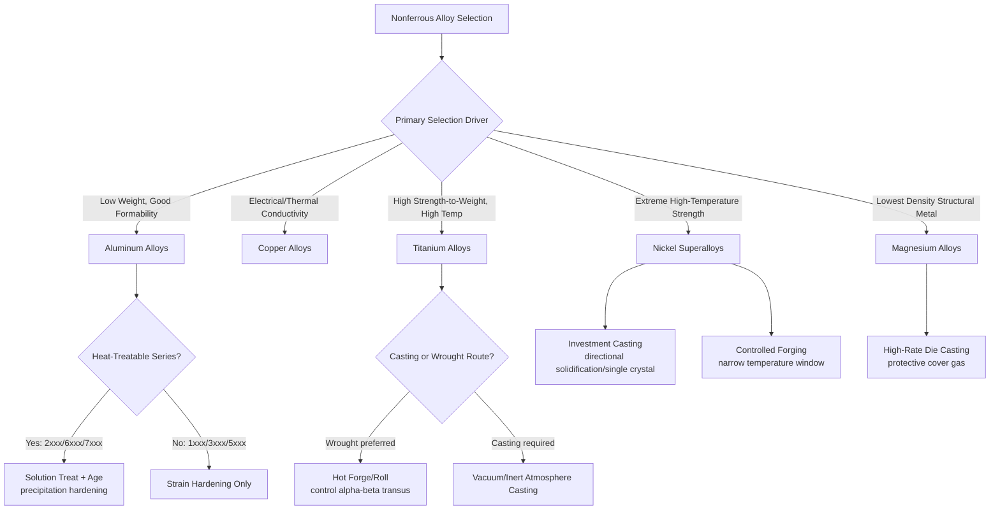

## Nonferrous Metal Process Classification

### Definition and Scope

Nonferrous metal process classification organizes manufacturing processes according to their applicability to metals and alloys in which iron is not the primary constituent element. This encompasses a highly diverse material family—including aluminum, copper, titanium, magnesium, nickel, zinc, lead, tin, and precious metals—each with distinct melting behavior, crystal structure, and processing characteristics that differ fundamentally from the iron-carbon allotropic system underlying ferrous metallurgy.

Unlike ferrous metals, which share a unifying metallurgical basis (the iron-carbon phase system and allotropic transformation enabling quench hardening), nonferrous metals do not share a single common transformation mechanism. Process classification within this category is therefore organized primarily around **alloy family** (each with its own characteristic melting point, crystal structure, and strengthening mechanism), with process family applicability assessed separately for each.

### Key Points

- **No unifying allotropic transformation across the category**: most nonferrous metals (aluminum, copper, magnesium, zinc) do not undergo the iron-like allotropic phase change that enables quench-and-temper hardening; instead, strengthening is typically achieved via strain hardening (cold work), solid-solution strengthening, or precipitation (age) hardening—fundamentally different mechanisms from ferrous martensitic hardening.
- **Melting points vary enormously across the category**: from low-melting alloys (tin, lead, zinc, roughly 200–420°C) through moderate-melting metals (aluminum, magnesium, roughly 550–660°C) to high-melting metals (copper, nickel, roughly 1000–1450°C) and refractory metals (titanium, tungsten, molybdenum, above 1650°C), meaning process temperature requirements and equipment vary far more within the nonferrous category than within ferrous metals.
- **Precipitation (age) hardening is a defining nonferrous strengthening mechanism**: many important nonferrous alloy systems (aluminum 2xxx/6xxx/7xxx series, certain copper alloys, nickel-based superalloys, titanium alloys) achieve significant strength increases through solution heat treatment followed by controlled precipitation of a second phase, a mechanism largely distinct from ferrous transformation hardening and requiring different heat treatment process design.
- **Density and specific-strength considerations drive selection**: several major nonferrous families (aluminum, magnesium, titanium) are selected specifically for favorable strength-to-weight ratios relative to ferrous alternatives, making these systems disproportionately important in aerospace, transportation, and weight-sensitive applications.
- **Corrosion resistance is often inherent** (aluminum's natural oxide layer, titanium's passive oxide film, copper's patina formation, certain nickel alloys' resistance to aggressive chemical environments), reducing or eliminating the need for supplementary protective processing common in ferrous applications.

### Major Nonferrous Alloy Families and Process Characteristics

#### 1. Aluminum Alloys

- **Casting characteristics**: excellent castability due to relatively low melting point (~660°C for pure aluminum, lower for many casting alloys) and good fluidity; die casting is extensively used (unlike ferrous die casting) because aluminum's lower melting temperature is compatible with steel die tooling and reasonable die life
- **Wrought processing**: extensively hot and cold worked via rolling, extrusion, and forging; aluminum extrusion is a dominant process for the material (far more prevalent than steel extrusion) due to comparatively low flow stress, enabling complex cross-sectional profiles
- **Heat treatment**: many wrought and cast aluminum alloys (2xxx, 6xxx, 7xxx wrought series; various casting alloys) respond to precipitation (age) hardening via solution treatment, quenching, and controlled aging; other series (1xxx, 3xxx, 5xxx) are non-heat-treatable and rely on strain hardening (work hardening) alone for strength increase
- **Machining**: generally excellent machinability due to low cutting forces and good chip formation, though built-up edge and gumminess can occur with certain alloys/tool combinations
- **Welding**: weldable via arc processes (GTAW/TIG, GMAW/MIG), though the tenacious native oxide layer requires specific shielding gas and cleaning practices; heat-treatable alloys may experience heat-affected zone softening

#### 2. Copper and Copper Alloys (Brass, Bronze)

- **Casting characteristics**: good castability, historically significant for sand and centrifugal casting (bearings, valve bodies, artistic castings); moderate melting point (~1085°C for pure copper) higher than aluminum but well below steel
- **Wrought processing**: excellent cold workability (high ductility) supports extensive cold rolling, wire drawing, and deep drawing; copper's face-centered cubic structure provides good formability similar in character to austenitic stainless steel and aluminum
- **Heat treatment**: most copper alloys strengthen primarily via cold work (strain hardening) and solid-solution strengthening (alloying with zinc in brass, tin in bronze); certain copper alloys (beryllium copper, some copper-nickel-silicon alloys) are precipitation-hardenable
- **Machining**: free-machining brass (leaded brass) is a classic example of an alloy specifically engineered for excellent machinability, widely used as a machinability benchmark
- **Applications driving process selection**: high electrical and thermal conductivity drive extensive wire drawing (electrical wire/cable) and rolling (electrical busbar, heat exchanger tubing) applications

#### 3. Titanium Alloys

- **Casting characteristics**: challenging to cast due to titanium's extreme reactivity with oxygen, nitrogen, and most refractory mold materials at melting temperature (~1668°C for pure titanium), requiring specialized vacuum or inert-atmosphere casting with graphite or specially coated ceramic molds; titanium casting is comparatively less prevalent than wrought titanium processing
- **Wrought processing**: hot forging and rolling are the dominant shape-generating processes for structural titanium components, typically performed with careful control of processing temperature relative to the alpha-beta transus temperature (varies by alloy, commonly around 980–1000°C for Ti-6Al-4V) to control resulting microstructure (alpha-beta vs. beta-processed structures) and mechanical properties
- **Heat treatment**: titanium alloys are classified by resulting phase structure (alpha, near-alpha, alpha-beta, beta), with alpha-beta alloys (notably Ti-6Al-4V, the most widely used titanium alloy) responding to solution treatment and aging to develop specific microstructures balancing strength and ductility
- **Machining**: notably difficult to machine due to low thermal conductivity (concentrating heat at the cutting edge), high chemical reactivity at elevated temperature (promoting tool wear), and a tendency to work-harden, requiring specialized tooling, lower cutting speeds, and abundant coolant relative to steel or aluminum machining
- **Welding**: titanium's high reactivity with atmospheric oxygen and nitrogen at elevated temperature necessitates rigorous inert gas shielding (including trailing shields and backing gas) during welding to prevent embrittling contamination

#### 4. Magnesium Alloys

- **Casting characteristics**: excellent die-castability due to low melting point (~650°C) and low latent heat, supporting very high casting production rates; however, molten magnesium's reactivity with atmospheric oxygen/moisture requires protective cover gas or flux during melting and casting to prevent ignition
- **Wrought processing**: magnesium's hexagonal close-packed (HCP) crystal structure provides limited slip systems at room temperature, resulting in comparatively poor cold formability relative to aluminum or copper (both face-centered cubic); wrought magnesium processing (rolling, extrusion, forging) is therefore typically performed at elevated temperature to activate additional slip and twinning mechanisms and improve formability
- **Machining**: excellent machinability, often cited as among the best of common structural metals, due to low cutting forces and favorable chip formation, though fine magnesium chips/dust present a fire hazard requiring specific safety precautions
- **Applications driving process selection**: the combination of low density (lightest common structural metal) and excellent castability makes magnesium die casting particularly prevalent in automotive and electronics housing applications where thin-walled, high-volume net-shape parts are required

#### 5. Nickel-Based Alloys (Including Superalloys)

- **Casting characteristics**: nickel-based superalloys are extensively investment cast (including advanced directionally solidified and single-crystal casting techniques) for high-temperature turbine components, where the alloy's high-temperature strength retention is combined with complex internal cooling passage geometry achievable only through precision casting
- **Wrought processing**: nickel alloys generally exhibit high flow stress and require substantial forging force; hot working is performed within carefully controlled temperature windows to avoid grain growth or incipient melting of low-melting-point phases
- **Heat treatment**: superalloys are strengthened primarily via precipitation of gamma-prime ($\gamma'$) or gamma-double-prime ($\gamma''$) phases through solution treatment and aging, a mechanism central to achieving the high-temperature creep resistance these alloys are selected for
- **Machining**: notoriously difficult to machine (classified among "difficult-to-machine" materials alongside titanium) due to high strength retention at elevated temperature, work hardening tendency, and low thermal conductivity, requiring specialized tooling (often ceramic or CBN) and conservative cutting parameters

#### 6. Zinc, Lead, Tin, and Other Low-Melting Nonferrous Metals

- **Casting characteristics**: zinc alloys are extensively die cast due to very low melting point (~420°C), enabling exceptionally long die life and high production rates, widely used for hardware, automotive trim, and small precision components
- **Applications**: lead and tin alloys are used in solder (joining process material rather than structural), babbitt bearing alloys, and specialty castings; low melting points make these alloys compatible with simple, low-cost casting/forming equipment

### Precipitation (Age) Hardening — A Defining Nonferrous Mechanism

Because precipitation hardening is central to strengthening in aluminum, some copper alloys, titanium alloys, and nickel superalloys—in contrast to the ferrous quench-and-temper mechanism—it merits specific technical treatment.

**Example (Precipitation Hardening Sequence — Aluminum 2xxx/6xxx/7xxx Series):**

1. **Solution treatment**: alloy heated to a temperature within the single-phase solid-solution field (below the solidus, above the solvus for the relevant precipitate phase), dissolving alloying elements into a homogeneous solid solution
2. **Quenching**: rapid cooling (typically water quench) to room temperature, trapping the alloying elements in a supersaturated solid solution (a non-equilibrium state)
3. **Aging**: controlled reheating to an intermediate temperature (natural aging occurs at room temperature over an extended period for some alloys; artificial aging uses elevated temperature, commonly 120–190°C for aluminum, for a shorter, controlled duration) allowing the supersaturated solute to precipitate as fine, coherent or semi-coherent particles that impede dislocation motion, increasing strength and hardness
4. Aging is typically controlled to a target condition (T6, T7, etc., per standard temper designations) balancing peak strength against toughness and stress-corrosion resistance, since overaging (excessive time/temperature) coarsens precipitates and reduces strength

[Inference: specific solution and aging temperatures/times are alloy-specific and should be confirmed against applicable standards (e.g., SAE/AMS specifications) or alloy datasheets for the exact grade in use.]

### Process Applicability Summary Table

| Alloy Family | Casting Suitability | Wrought Processing | Primary Strengthening Mechanism | Machinability |
| --- | --- | --- | --- | --- |
| Aluminum | Excellent (die casting common) | Excellent (extrusion dominant) | Precipitation hardening or strain hardening | Excellent |
| Copper/Brass/Bronze | Good | Excellent (cold working) | Strain hardening, solid-solution | Good to excellent (free-machining grades) |
| Titanium | Challenging (reactive) | Good (careful temperature control) | Alpha-beta phase control, aging | Difficult |
| Magnesium | Excellent (die casting) | Moderate (HCP limits cold work) | Precipitation hardening (select alloys) | Excellent |
| Nickel Superalloys | Good (investment casting dominant for turbines) | Difficult (high flow stress) | Precipitation ($\gamma'/\gamma''$) hardening | Difficult |
| Zinc | Excellent (die casting) | Limited | Solid-solution | Good |

### Process Selection Flow Diagram

### Advantages and Limitations of the Nonferrous Classification

**Advantages:**

- Favorable strength-to-weight ratios (aluminum, titanium, magnesium) enable weight-critical applications unattainable with ferrous alternatives at comparable strength
- Inherent corrosion resistance in several major families (aluminum, titanium, certain copper alloys) reduces or eliminates supplementary protective processing
- Precipitation hardening mechanisms enable substantial strength increases without the martensitic brittleness concerns associated with ferrous quench hardening
- High electrical/thermal conductivity (copper, aluminum) makes these systems essential for applications ferrous metals cannot adequately serve

**Limitations:**

- Generally higher raw material cost per unit mass than common ferrous alloys, particularly for titanium and nickel superalloys, restricting use to applications where the performance benefit justifies the cost premium
- Processing behavior varies dramatically across the nonferrous category (unlike the relatively unified ferrous heat-treatment logic), requiring alloy-family-specific process expertise rather than a single transferable framework
- Several nonferrous systems present specific processing hazards (magnesium fire/dust risk, titanium reactivity requiring inert atmosphere, beryllium copper toxicity concerns) requiring specialized safety protocols
- Difficult-to-machine alloys (titanium, nickel superalloys) impose significant cost and productivity penalties in machining-intensive manufacturing routes compared to most ferrous and aluminum alloys

### Related Topics

- Ferrous metal process classification
- Precipitation (age) hardening mechanisms and temper designation systems (T4, T6, T7)
- Aluminum alloy designation systems (wrought 4-digit, casting 3-digit + modifier)
- Titanium alpha-beta phase control and transus temperature effects on microstructure
- Nickel superalloy directional solidification and single-crystal casting for turbine blades
- Classification by liquid and molten starting-material processes (nonferrous die casting)
- Classification by solid bulk starting-material processes (extrusion, forging applied to nonferrous alloys)
- Difficult-to-machine material strategies (titanium, nickel superalloys)
- Magnesium alloy fire safety and dust handling protocols
- Corrosion resistance mechanisms in nonferrous metals (passive oxide films, patina formation)