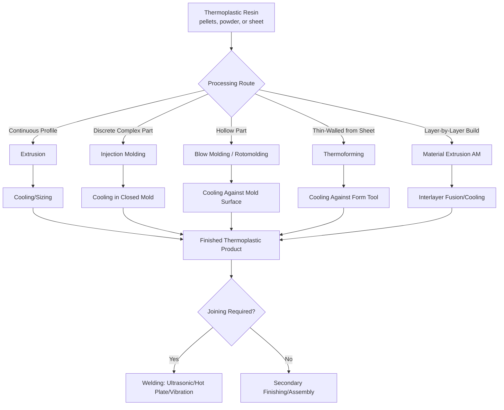

## Thermoplastic Polymer Process Classification

### Definition and Scope

Thermoplastic polymer process classification organizes manufacturing processes according to their applicability to thermoplastic materials—polymers composed of linear or branched molecular chains held together by intermolecular forces (van der Waals forces, hydrogen bonding) rather than covalent cross-links. This molecular architecture is the defining characteristic distinguishing thermoplastics from thermosetting polymers: thermoplastics soften and flow reversibly upon heating and solidify upon cooling, a cycle that can in principle be repeated many times, whereas thermosets undergo an irreversible chemical cross-linking reaction (curing) that permanently locks the molecular structure.

This reversible melt-solidify behavior is the fundamental property that governs which manufacturing processes are applicable: virtually all thermoplastic shaping processes exploit heating to a flowable (molten or softened) state, forming under pressure or vacuum, and cooling to solidify and retain the desired shape—placing most thermoplastic processing within the liquid/molten starting-material state category, while some secondary and solid-state processes operate on already-solidified thermoplastic stock.

### Key Points

- **Reversible thermal behavior enables both fabrication and recycling advantages**: because thermoplastics can be remelted, scrap and regrind material can often be reprocessed (subject to some property degradation with repeated thermal cycling), and forming defects can sometimes be corrected by remelting—a capability generally unavailable to thermosetting polymers.
- **Two broad thermoplastic sub-classes govern processing behavior**: amorphous thermoplastics (random, non-crystalline molecular arrangement; soften gradually over a glass transition temperature range, e.g., polystyrene, polycarbonate, ABS) and semi-crystalline thermoplastics (partially ordered molecular regions; exhibit a more distinct melting point alongside a glass transition, e.g., polyethylene, polypropylene, nylon, PET), with semi-crystalline polymers generally requiring more precise temperature control and exhibiting greater shrinkage due to crystallization-associated density change.
- **Melt viscosity and shear-thinning behavior govern process design**: thermoplastic melts are generally non-Newtonian, shear-thinning (pseudoplastic) fluids—viscosity decreases significantly under the high shear rates typical of injection molding and extrusion, a behavior that must be accounted for in mold/die design and process parameter selection.
- **Processing temperature windows are narrower and generally lower than metals**: most thermoplastics process in the range of roughly 150–350°C (far below typical metal processing temperatures), enabling the use of relatively low-cost tooling materials (aluminum molds for prototyping, hardened tool steel for production) compared to metal casting/forming tooling.
- **Additives and reinforcements significantly expand achievable properties**: fillers, fibers (glass, carbon), plasticizers, stabilizers, and colorants are commonly compounded into thermoplastic resins prior to or during processing, meaning "thermoplastic processing" frequently also encompasses compounding/blending as a preparatory step.

### Major Process Families

#### 1. Melt-Shaping Processes (Continuous and Semi-Continuous)

These processes continuously or semi-continuously melt and shape thermoplastic resin, typically via a screw extruder that melts, homogenizes, and pressurizes the polymer.

- **Extrusion**: molten polymer continuously forced through a shaped die to produce constant-cross-section profiles—pipe, sheet, film, wire coating, and structural profiles; the extruded product is typically cooled/sized (calibrated) immediately after exiting the die
- **Injection molding**: molten polymer injected under high pressure into a closed, cooled mold cavity, solidifying to the mold's shape; the dominant process for high-volume discrete thermoplastic parts due to excellent dimensional repeatability and design freedom for complex geometry
- **Blow molding**: a molten tube (parison, in extrusion blow molding) or a pre-formed molten preform (in injection blow molding/injection stretch blow molding) is inflated with air pressure against a mold cavity wall, producing hollow parts (bottles, containers, automotive fuel tanks and ducting)
- **Rotational molding (rotomolding)**: powdered or liquid thermoplastic resin is placed in a mold, which is then rotated on two axes while heated, causing the resin to melt and coat the interior mold surface via gravity and rotation, producing hollow, typically large or complex-shaped parts (tanks, playground equipment, kayaks) without internal seams or significant residual stress
- **Thermoforming**: a thermoplastic sheet is heated to a formable (softened, below full melt) temperature and then formed against a mold using vacuum, air pressure, or mechanical force, producing thin-walled parts (packaging, automotive interior panels, disposable food containers)

**Example (Injection Molding Cycle):**

1. Thermoplastic pellets fed into a heated barrel containing a rotating reciprocating screw
2. Screw rotation melts the polymer via combined conductive heating (barrel heater bands) and viscous shear heating, while conveying and homogenizing the melt toward the barrel front
3. Screw translates forward (acting as a plunger) to inject the molten polymer through a nozzle, sprue, and runner system into the closed mold cavity, typically at pressures in the range of roughly 35–140 MPa depending on material and part geometry
4. Packing/holding pressure is maintained briefly after cavity filling to compensate for volumetric shrinkage as the polymer cools
5. The polymer cools and solidifies against the cooled mold walls (mold temperature typically well below the polymer's melting or glass transition temperature)
6. The mold opens and the part is ejected via ejector pins; the screw begins recovering (melting the next shot) during or after ejection, enabling cycle time optimization

[Inference: exact injection pressures, mold temperatures, and cycle times vary substantially by polymer type, part geometry/wall thickness, and machine capability; process-specific setpoints should be established via mold-filling simulation and/or trial molding for a given application.]

**Example (Extrusion Blow Molding Sequence):**

1. Molten polymer extruded continuously (or intermittently, in accumulator-head machines) downward through an annular die, forming a hollow tube (parison)
2. Mold halves close around the parison, pinching off one end
3. Compressed air introduced into the parison interior, inflating it outward against the mold cavity walls
4. Polymer cools against the mold surface, solidifying in the container/part shape
5. Mold opens, part ejected, and excess material (flash, pinch-off waste) trimmed

#### 2. Sheet and Film Processes

- **Cast film extrusion**: molten polymer extruded through a slot die onto a chilled roll, rapidly quenching the film to control clarity, thickness uniformity, and crystallinity
- **Blown film extrusion**: molten polymer extruded through an annular die and inflated by internal air pressure into a continuously rising tubular "bubble," which is cooled, collapsed, and wound—the dominant process for polyethylene packaging film
- **Calendering**: molten or softened polymer (often with significant filler/plasticizer content, e.g., PVC) is passed through a series of heated counter-rotating rolls, progressively reducing thickness and producing continuous sheet or film with precise thickness control

#### 3. Joining and Welding Processes for Thermoplastics

Because thermoplastics can be remelted, a range of welding processes exploit local melting and fusion at the joint interface—distinct in mechanism from ferrous/nonferrous metal welding, which relies on metallurgical fusion or solid-state bonding.

- **Hot plate/hot tool welding**: joint surfaces heated by contact with a heated platen until softened/molten, then pressed together and held under pressure while cooling to fuse
- **Ultrasonic welding**: high-frequency mechanical vibration applied at the joint interface generates localized frictional heat, melting a small volume of material at the interface which then solidifies to form the joint upon vibration cessation and continued clamping pressure
- **Vibration welding and spin welding**: similar frictional-heating mechanisms, using linear reciprocating motion (vibration welding) or rotational motion (spin welding) to generate interfacial heat for parts with appropriate joint geometry
- **Solvent bonding and adhesive bonding**: chemical rather than thermal joining methods, applicable to thermoplastics that can be locally softened/dissolved by a compatible solvent, or bonded using adhesives formulated for the specific polymer

#### 4. Secondary and Solid-State Processes

Processes performed on already-solidified thermoplastic stock, analogous in principle to solid bulk metal processing.

- **Machining**: thermoplastics can be turned, milled, drilled, and sawed using conventional or polymer-specific tooling, though low thermal conductivity and a tendency to soften/melt under frictional heat require careful speed/feed selection and cooling
- **CNC routing and laser cutting**: common for thermoplastic sheet stock (acrylic, polycarbonate) in signage, display, and prototyping applications
- **Solid-state (cold) forming**: certain thermoplastics can be formed below their melting point via processes analogous to metal forming (e.g., solid-phase pressure forming), though this is less common than melt-based forming for most applications

#### 5. Additive Manufacturing of Thermoplastics

Thermoplastic feedstock is central to several major additive manufacturing process categories, extending the material-melting principle into a layer-by-layer building approach.

- **Material extrusion (fused deposition modeling/fused filament fabrication)**: thermoplastic filament is melted and extruded through a nozzle, depositing material layer by layer according to a programmed toolpath, with each layer fusing to the one below via localized remelting/diffusion at the interface
- **Powder bed fusion (selective laser sintering)**: thermoplastic powder (commonly nylon-based) is selectively fused layer by layer using a laser, as detailed under particulate/powder starting-material processes

### Process Comparison Table

| Process | Feedstock Form | Shape-Fixing Mechanism | Typical Products |
| --- | --- | --- | --- |
| Injection Molding | Pellets | Cooling in closed mold | Housings, connectors, consumer products |
| Extrusion | Pellets | Continuous cooling/sizing after die | Pipe, profiles, sheet, film, wire coating |
| Blow Molding | Pellets (via parison/preform) | Cooling against mold after inflation | Bottles, containers, fuel tanks |
| Rotational Molding | Powder or liquid resin | Melting/coating + cooling | Tanks, large hollow parts |
| Thermoforming | Extruded sheet | Cooling against mold after vacuum/pressure forming | Packaging, panels, disposable containers |
| Fused Filament Fabrication | Filament | Layer-by-layer remelting/fusion | Prototypes, low-volume functional parts |

### Process Flow Diagram

### Governing Physical Principles

**Shear-thinning (pseudoplastic) melt viscosity**, commonly modeled using a power-law relationship:

$$\eta = m\dot{\gamma}^{n-1}$$

where $\eta$ is apparent viscosity, $\dot{\gamma}$ is shear rate, $m$ is the consistency index, and $n$ is the power-law (flow behavior) index; for shear-thinning thermoplastic melts, $n < 1$, meaning apparent viscosity decreases as shear rate increases—a behavior exploited in injection molding and extrusion, where high shear rates near the nozzle/die wall reduce local viscosity and facilitate flow.

**Mold shrinkage**, a critical dimensional design parameter for injection molded and other melt-processed thermoplastic parts:

$$S = \frac{L_{mold} - L_{part}}{L_{mold}} \times 100\%$$

where $L_{mold}$ is the mold cavity dimension and $L_{part}$ is the final cooled part dimension; semi-crystalline polymers generally exhibit higher and more variable shrinkage (commonly in the range of roughly 1–3%, though highly material- and process-dependent) than amorphous polymers (commonly under 1%), due to the additional volumetric contraction associated with crystallization during cooling. [Unverified: precise shrinkage values are resin-grade-specific and should be confirmed against material supplier datasheets, as they are influenced by wall thickness, processing conditions, and fiber/filler reinforcement content.]

**Glass transition and melting temperature relationship**: amorphous thermoplastics are characterized primarily by the glass transition temperature ($T_g$), above which the material transitions from a rigid, glassy state to a soft, rubbery/viscous state; semi-crystalline thermoplastics exhibit both a $T_g$ (governing the amorphous fraction's behavior) and a distinct melting temperature ($T_m$, associated with the crystalline fraction), with $T_m$ generally used as the primary reference for melt-processing temperature selection in semi-crystalline resins.

### Advantages and Limitations

**Advantages:**

- Reversible melt behavior enables efficient high-volume production (short injection molding cycle times), design flexibility, and the ability to reprocess scrap/regrind material, improving material efficiency
- Wide-ranging achievable properties through resin selection, compounding (fillers, fiber reinforcement, additives), and blending, covering applications from flexible packaging film to structural engineering components
- Generally lower processing temperatures than metals reduce energy consumption and enable lower-cost tooling materials for prototype and low-volume production
- Excellent surface finish and color/aesthetic control achievable directly from the molding process, often eliminating secondary finishing operations

**Limitations:**

- Mechanical properties (strength, stiffness, temperature resistance) are generally lower than metals and many thermosetting composites, limiting structural application without reinforcement
- Melt processing exhibits significant shrinkage and potential for warpage, particularly in semi-crystalline resins and thick-walled or non-uniform sections, requiring careful mold and process design
- Reversible melting, while an advantage for recyclability, also limits maximum service temperature (parts will soften or deform if service conditions approach processing temperature) and can complicate joining (creep under sustained load, particularly near $T_g$)
- Tooling costs for injection molding and blow molding remain substantial, similar in character to metal die-based processes, favoring high-volume production to amortize tooling investment

### Related Topics

- Thermosetting polymer process classification
- Composite and reinforced polymer process classification
- Glass transition temperature and its role in polymer processing and service performance
- Amorphous versus semi-crystalline polymer morphology and its processing implications
- Injection mold design principles (gating, cooling channel layout, venting)
- Polymer melt rheology and mold-filling simulation
- Classification by liquid and molten starting-material processes
- Classification by fiber, filament, and continuous-strand starting-material processes (reinforced thermoplastics)
- Material extrusion and powder bed fusion additive manufacturing of polymers
- Plastics recycling classification (resin identification codes) and reprocessing considerations