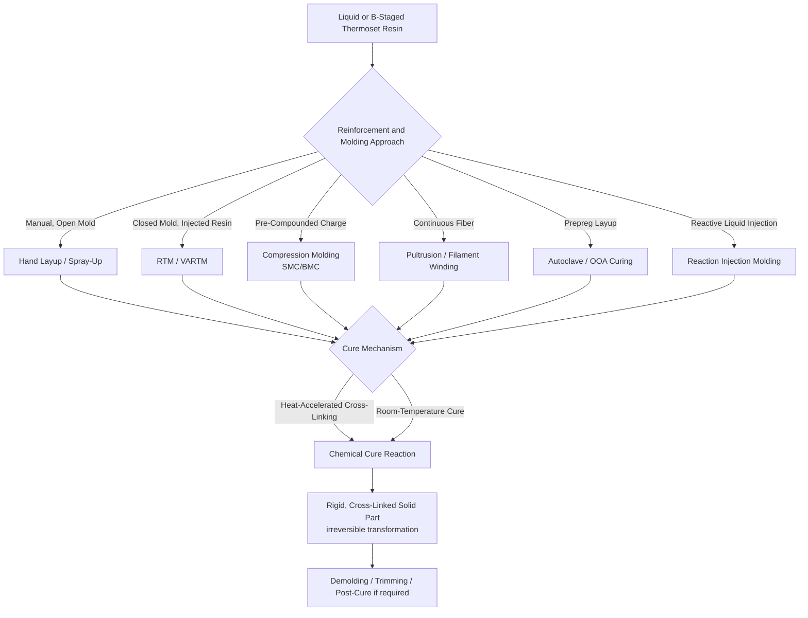

## Thermoset Polymer Process Classification

### Definition and Scope

Thermoset polymer process classification organizes manufacturing processes according to their applicability to thermosetting materials—polymers that undergo an irreversible chemical cross-linking (curing) reaction, transforming a liquid or malleable precursor into a rigid, three-dimensional covalently bonded molecular network. This stands in direct contrast to thermoplastic polymers, which soften and flow reversibly upon reheating; once cured, a thermoset cannot be remelted or reshaped by heating alone, since the cross-linked network resists chain mobility even at elevated temperature (though it will eventually degrade/decompose rather than melt if heated sufficiently).

Because curing is a chemical reaction rather than a simple physical phase change (melting/solidification), thermoset processing is fundamentally governed by **reaction kinetics** (cure rate as a function of temperature, time, and catalyst/hardener chemistry) in addition to the flow and shaping considerations relevant to thermoplastics. This places most thermoset processes within the liquid/molten (more precisely, liquid reactive resin) starting-material state category, but with the shape-fixing mechanism being chemical cross-linking rather than thermal solidification.

### Key Points

- **Curing is irreversible and exothermic**: the cross-linking reaction releases heat (exothermic reaction), which must be managed in process design—particularly in thick sections, where accumulated exothermic heat can cause excessive internal temperature rise, potential thermal degradation, or dimensional/residual stress issues if not controlled.
- **Two-stage material states are common in commercial thermoset processing**: many thermoset systems are supplied as a partially reacted (B-staged) precursor—compounded resin that has been advanced partway through the cure reaction and then arrested (often via cooling/refrigeration)—allowing convenient handling, storage, and shaping before full cure is completed in a separate, controlled final curing step (common in sheet molding compound and prepreg composite materials).
- **No true "melting point" exists for a fully cured thermoset**: once cross-linked, the material's thermal behavior is characterized by a glass transition temperature ($T_g$, above which the cured material softens somewhat but does not flow) and a decomposition temperature (above which the material chemically degrades), rather than a melt temperature.
- **Reinforcement is exceptionally common in thermoset processing**: because thermoset resins in their liquid/uncured state readily wet and impregnate fiber reinforcement, a very large proportion of industrial thermoset processing is fiber-reinforced composite fabrication (glass, carbon, aramid fiber in epoxy, polyester, vinyl ester, or phenolic matrices), more so than for thermoplastics.
- **Process selection is strongly influenced by cure chemistry and reinforcement architecture**: unlike thermoplastic processing, where melt viscosity and cooling rate dominate process parameter selection, thermoset process selection additionally depends on pot life (working time before viscosity rises unacceptably due to reaction progression), gel time, and the specific mechanism used to introduce and consolidate fiber reinforcement.

### Major Thermoset Resin Systems

- **Epoxy resins**: excellent mechanical properties, adhesion, and chemical resistance; widely used in aerospace composites, adhesives, and coatings; cured via reaction with amine, anhydride, or other hardeners
- **Unsaturated polyester resins**: lower cost than epoxy, widely used in general-purpose fiberglass composites (boat hulls, automotive body panels, bathroom fixtures); cured via free-radical polymerization initiated by a peroxide catalyst
- **Vinyl ester resins**: intermediate properties and cost between polyester and epoxy, offering improved chemical/corrosion resistance over polyester, common in chemical storage tanks and marine applications
- **Phenolic resins**: excellent thermal stability, flame resistance, and low smoke generation, widely used in aerospace interior panels, electrical insulation, and friction materials (brake pads); cured via condensation reaction (historically releasing water/formaldehyde byproduct, requiring pressure during cure to suppress void formation)
- **Polyurethane (thermoset formulations)**: versatile system ranging from rigid structural foams to flexible elastomers, cured via reaction between polyol and isocyanate components
- **Silicone resins**: excellent thermal stability and flexibility across a wide temperature range, used in high-temperature seals, gaskets, and specialty coatings

### Major Process Families

#### 1. Open-Mold and Contact Molding Processes

Lower-capital-investment processes typically used for lower-volume production, large structures, or prototype fabrication.

- **Hand layup (wet layup)**: fiber reinforcement (mat, woven fabric) manually placed into an open mold and saturated with liquid resin using rollers or brushes; resin cures at room temperature or with mild heat, typically without applied pressure beyond manual consolidation
- **Spray-up**: chopped fiber and catalyzed resin are simultaneously sprayed onto an open mold using a specialized spray gun, then manually consolidated with rollers
- **Vacuum bagging**: a flexible membrane (bag) is placed over the wet or pre-impregnated layup and sealed to the mold edge; a vacuum drawn beneath the bag applies atmospheric pressure (up to approximately 1 atmosphere/101 kPa) to consolidate the laminate, remove entrapped air, and improve fiber-to-resin ratio compared to unassisted hand layup

#### 2. Closed-Mold and Pressure-Assisted Processes

Processes using matched (closed) molds, offering improved surface finish on both sides of the part, better dimensional control, and generally higher production rates than open-mold methods.

- **Resin transfer molding (RTM)**: dry fiber reinforcement preform is placed into a closed, matched mold; liquid resin is then injected (typically under moderate pressure) to infuse the preform, followed by in-mold curing
- **Vacuum-assisted resin transfer molding (VARTM)**: similar to RTM, but resin infusion is driven by vacuum (drawing resin through the preform) rather than injection pressure, often using a flexible bag as one mold surface rather than two rigid mold halves, reducing tooling cost relative to matched-die RTM
- **Compression molding**: a measured charge of thermoset molding compound (often sheet molding compound, SMC, or bulk molding compound, BMC—fiber-reinforced, pre-catalyzed resin in a semi-solid/putty-like form) is placed in a heated, open mold; the mold closes under pressure, causing the compound to flow and fill the cavity while simultaneously curing under heat and pressure
- **Thermoset injection molding**: analogous in machine configuration to thermoplastic injection molding, but processes thermoset molding compounds (often phenolic or certain reinforced systems); rather than cooling to solidify, the mold is heated to accelerate cure, and the part is ejected once sufficiently cross-linked to retain shape (as opposed to thermoplastic injection molding, where the mold is cooled)

**Example (Compression Molding Sequence — Sheet Molding Compound):**

1. SMC charge (a B-staged, fiber-reinforced resin sheet) cut to the appropriate size/shape and placed into the open, heated mold cavity (mold temperature typically 130–170°C for common SMC formulations)
2. Mold closes under substantial pressure (commonly on the order of several MPa to tens of MPa depending on part complexity), causing the softened compound to flow and fill the cavity
3. Heat from the mold accelerates the cross-linking (cure) reaction, converting the material from a flowable, semi-solid state to a rigid, fully cross-linked solid
4. Mold held closed for the cure cycle duration (commonly on the order of one to several minutes, depending on part thickness and resin formulation)
5. Mold opens, part ejected—already in its final cured, rigid state (no post-mold cooling/solidification step required, unlike thermoplastic molding)

[Inference: specific mold temperatures, pressures, and cure cycle times are formulation- and part-geometry-specific and should be established via the resin/compound supplier's processing guidelines.]

#### 3. Continuous and Semi-Continuous Composite Processes

- **Pultrusion**: continuous fiber reinforcement is pulled through a liquid resin bath, then through a heated die where the resin cures as the profile is continuously drawn through, producing constant-cross-section structural shapes (covered in more detail under fiber/filament starting-material processes)
- **Filament winding**: continuous resin-impregnated fiber tow wound onto a rotating mandrel and subsequently cured, as detailed under fiber/filament starting-material processes
- **Continuous laminating**: flat, continuous fiber-reinforced sheet (e.g., fiberglass-reinforced polyester roofing/glazing panels) produced via continuous resin impregnation, forming, and curing on a moving production line

#### 4. Autoclave and Prepreg-Based Aerospace Composite Processes

- **Prepreg layup**: fiber fabric or tape pre-impregnated with a precisely metered, B-staged (partially cured) resin is manually or automatically (via automated fiber placement/automated tape laying) laid up on a tool according to a specified ply schedule and fiber orientation sequence
- **Autoclave curing**: the laid-up prepreg assembly, typically vacuum-bagged, is placed in an autoclave (a pressurized oven) and cured under simultaneously controlled elevated temperature and pressure (commonly several atmospheres, e.g., roughly 585–620 kPa/85–90 psi for many aerospace-grade epoxy systems), consolidating the laminate and minimizing void content to achieve high-performance structural composite properties
- **Out-of-autoclave (OOA) curing**: emerging processes using vacuum-bag-only consolidation with specially formulated resin systems designed to achieve low void content without the elevated pressure of autoclave processing, offering reduced capital equipment requirements and part size limitations relative to autoclave curing [Inference: OOA process capability and achievable quality relative to autoclave processing continue to develop, and specific performance claims should be verified against current qualified material system data for a given application.]

#### 5. Foam and Reaction Injection Molding Processes

- **Reaction injection molding (RIM)**: two or more low-viscosity liquid reactive components (e.g., polyol and isocyanate for polyurethane) are metered, mixed at high pressure immediately before injection, and injected into a closed mold where polymerization and cross-linking occur rapidly, producing the finished part directly; well suited to large, relatively low-density structural or semi-structural parts
- **Reinforced RIM (RRIM)**: incorporates chopped fiber or mineral reinforcement into the RIM process for improved stiffness and dimensional stability
- **Rigid and flexible polyurethane foam molding**: reactive liquid components are dispensed into a mold (or continuously onto a conveyor for slabstock foam), where the exothermic reaction simultaneously cross-links the polymer and generates gas (via chemical blowing agent or physical foaming agent) to create cellular foam structure

### Process Comparison Table

| Process | Reinforcement Approach | Pressure Applied | Typical Products |
| --- | --- | --- | --- |
| Hand Layup | Manual fiber placement | None to minimal (manual rolling) | Boat hulls, large low-volume parts |
| Vacuum Bagging | Manual/prepreg layup | Up to ~1 atm (vacuum) | Improved-quality open-mold composites |
| Resin Transfer Molding | Preformed dry fiber preform | Moderate (injection pressure) | Automotive/industrial structural parts |
| Compression Molding (SMC) | Pre-compounded chopped fiber | High (mold clamp pressure) | Automotive panels, electrical enclosures |
| Filament Winding/Pultrusion | Continuous fiber tow | Winding tension / die pressure | Pressure vessels, structural profiles |
| Autoclave Curing | Prepreg tape/fabric layup | High (autoclave pressure + vacuum) | Aerospace structural components |
| Reaction Injection Molding | Optional (RRIM) chopped fiber/filler | Injection pressure (relatively low vs. thermoplastic IM) | Automotive body panels, large enclosures |

### Process Flow Diagram

### Governing Physical Principles

**Cure kinetics** are commonly described using an Arrhenius-type temperature dependence for reaction rate, reflecting the chemical (rather than purely physical) nature of thermoset solidification:

$$k = A\exp\left(\frac{-E_a}{RT}\right)$$

where $k$ is the reaction rate constant, $A$ is the pre-exponential (frequency) factor, $E_a$ is activation energy for the cure reaction, $R$ is the gas constant, and $T$ is absolute temperature—explaining why elevated-temperature cure cycles significantly accelerate thermoset processing relative to room-temperature cure, and why cure cycle design must balance cure speed against exothermic heat management in thick sections.

**Degree of cure**, a key process/quality metric often tracked via differential scanning calorimetry (DSC), is commonly expressed as:

$$\alpha = \frac{H_{total} - H_{residual}}{H_{total}}$$

where $\alpha$ is degree of cure (ranging from 0, uncured, to 1, fully cured), $H_{total}$ is the total exothermic heat of reaction for a fully uncured sample, and $H_{residual}$ is the remaining (unreacted) exothermic heat measured in a partially cured sample.

**Gel time and pot life**: gel time refers to the time at a given temperature for the resin system to transition from a liquid to a gelled (no longer flowable, but not yet fully cured) state, while pot life refers to the working time available after mixing a multi-component resin system before viscosity rises to an unworkable level—both critical process parameters governing available processing window, particularly for hand layup, RTM injection, and RIM processes. [Inference: gel time and pot life are strongly temperature- and formulation-dependent and are typically specified by the resin supplier for a given hardener/catalyst ratio and ambient condition.]

### Advantages and Limitations

**Advantages:**

- Cured thermosets generally exhibit superior thermal stability, creep resistance, and dimensional stability at elevated temperature compared to most thermoplastics, since the cross-linked network resists softening/flow
- Excellent compatibility with fiber reinforcement (readily wets and impregnates fiber, and does not require melting to process) makes thermosets the dominant matrix system for high-performance structural composites
- Liquid-state processing (RTM, filament winding, hand layup) enables very large, complex, or low-volume structures without the extreme tooling/clamping forces required for equivalent thermoplastic melt processing
- Room-temperature curing options (many epoxy and polyester systems) enable processing without energy-intensive heating equipment, useful for large structures (boat hulls, wind turbine blades) where heated tooling/ovens would be impractical

**Limitations:**

- Irreversible curing eliminates the reprocessing/recycling flexibility available to thermoplastics; cured thermoset scrap and defective parts generally cannot be remelted and reformed, complicating waste management and end-of-life recycling
- Processing is inherently slower for many thermoset routes (hand layup, RTM, autoclave curing) compared to high-speed thermoplastic injection molding, due to both the manual/consolidation-intensive nature of many processes and the chemical reaction time required for cure
- Health and safety considerations (resin/hardener chemical handling, styrene emissions from polyester systems, isocyanate handling in polyurethane RIM) require specific ventilation, personal protective equipment, and handling protocols
- Exothermic cure reactions in thick sections can generate substantial internal heat, risking thermal degradation, excessive residual stress, or dimensional distortion if not properly managed through cure cycle design

### Related Topics

- Thermoplastic polymer process classification
- Fiber-reinforced composite process classification (matrix-reinforcement combinations)
- Classification by fiber, filament, and continuous-strand starting-material processes
- Cure kinetics and differential scanning calorimetry (DSC) characterization
- Autoclave process cycle design for aerospace composites
- Sheet molding compound (SMC) and bulk molding compound (BMC) formulation
- Resin transfer molding preform design and permeability
- Void content and its relationship to composite mechanical properties
- Thermoset composite recycling technologies (mechanical grinding, pyrolysis, solvolysis)
- Reaction injection molding equipment and mix-head design