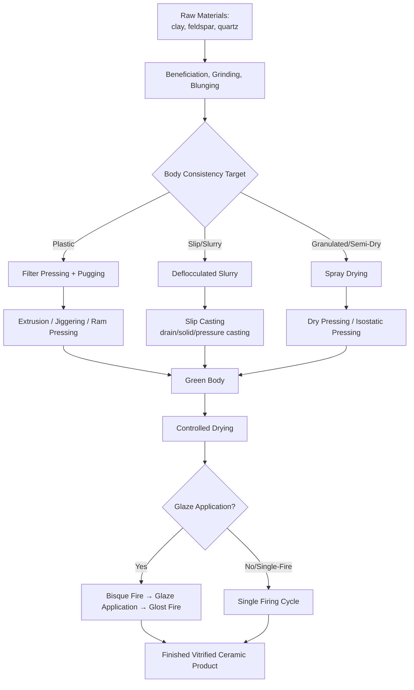

## Traditional Ceramic Process Classification

### Definition and Scope

Traditional ceramic process classification organizes manufacturing processes according to their applicability to traditional (also termed "silicate" or "whiteware") ceramics—inorganic, non-metallic materials derived primarily from naturally occurring raw materials such as clay minerals, feldspar, and silica (quartz). This distinguishes traditional ceramics from advanced (technical or engineering) ceramics, which are synthesized from highly purified or engineered powders (alumina, zirconia, silicon carbide, silicon nitride) and processed to achieve precisely controlled microstructures for structural, electronic, or high-performance applications.

Traditional ceramics encompass whitewares (porcelain, china, earthenware, stoneware), structural clay products (brick, tile, sewer pipe), and related products including some refractories and traditional glass, historically among the oldest manufactured material categories, with processing methods rooted in centuries of ceramic craft tradition subsequently industrialized and mechanized.

The defining processing characteristic of traditional ceramics is reliance on **clay's plastic forming behavior when mixed with water**—a property largely unique to clay minerals among common raw materials, arising from the platy crystal structure of clay particles and the lubricating water film between plates—which enables a distinct family of forming processes (throwing, jiggering, extrusion of plastic clay bodies) not available to non-plastic advanced ceramic powders.

### Key Points

- **Clay plasticity is the foundational processing property**: when combined with an appropriate water content, clay minerals (kaolinite, illite, montmorillonite, and others) form a cohesive, moldable plastic mass that retains an imposed shape after forming and before firing—a property assessed via plasticity indices and central to selecting appropriate forming processes.
- **The traditional ceramic process sequence follows a consistent general pattern**: raw material preparation and body formulation, forming (shaping the green/unfired body), drying (careful removal of water to avoid cracking), and firing (high-temperature heat treatment that vitrifies/sinters the body into its final, hardened state)—a sequence broadly analogous to, but distinct in mechanism from, the powder metallurgy compaction-and-sintering sequence.
- **Multiple starting-material consistencies are used across the category**: traditional ceramic processes draw on plastic (moist, moldable clay body), slip/slurry (clay-water suspension), and semi-dry/granulated (powder with limited moisture, used for dry pressing) material states, each suited to different forming processes and product geometries.
- **Firing (vitrification) is the defining consolidation mechanism**: unlike advanced ceramic sintering (which may target near-theoretical density with minimal glassy phase), traditional ceramic firing frequently relies substantially on the formation of a glassy (vitreous) bonding phase from fluxing components (feldspar) that melts and flows around less-fusible particles (clay, quartz) during firing, then solidifies upon cooling to bond the microstructure.
- **Product category strongly influences process selection**: structural clay products (brick, tile) generally use extrusion-based forming suited to high-volume, simple constant-cross-section geometry; whiteware/tableware products use a wider range of forming methods (throwing, jiggering, casting) suited to more complex, often axisymmetric geometry; sanitaryware (toilets, sinks) relies heavily on slip casting due to complex hollow geometry.

### Major Process Families

#### 1. Raw Material Preparation and Body Formulation

Before shaping, traditional ceramic raw materials (clay, feldspar, quartz, and other minor constituents) are processed and combined into a formulated "body" with consistent properties.

- **Beneficiation and grinding**: raw clay and mineral additives are crushed, ground, and screened to achieve appropriate particle size distribution
- **Blunging/slurry preparation**: raw materials mixed with water (often with a deflocculant/dispersant) in a blunger to create a homogeneous slurry (slip)
- **Filter pressing and pugging**: for plastic-forming routes, slurry is dewatered (filter pressed) to an appropriate plastic consistency, then de-aired and homogenized in a pug mill (an auger-type mixing/extrusion device) to produce a uniform plastic clay body free of air pockets

#### 2. Plastic Forming Processes

These processes shape clay in its moist, plastic (moldable but self-supporting) state, exploiting clay's characteristic plasticity.

- **Throwing (wheel throwing)**: a ball of plastic clay is centered on a rotating potter's wheel and shaped by hand or tool pressure as it spins—the traditional craft method, still used for artisanal and some specialty production, largely superseded by mechanized equivalents for industrial volumes
- **Jiggering and jolleying**: mechanized, mold-based equivalents of wheel throwing; a plastic clay bat is placed over (jiggering, for flatware like plates) or into (jolleying, for hollowware like cups) a rotating plaster mold, and a shaped profile tool forms the opposite surface as the assembly rotates, combining the efficiency of rotational forming with mold-based dimensional control
- **Plastic (stiff-mud) extrusion**: plastic clay body is forced through a die (typically using an auger extruder) to produce a continuous constant-cross-section profile, the dominant process for structural clay products (brick, hollow tile, sewer pipe); the continuous extruded column (column) is subsequently cut to length (e.g., wire-cut brick) before drying and firing
- **Ram pressing**: plastic clay is pressed between two porous mold halves (often using compressed air or vacuum assistance to extract water and consolidate the clay against the mold surface), suited to relatively flat or shallow-relief shapes (tiles, some tableware)

**Example (Stiff-Mud Brick Extrusion Sequence):**

1. Clay blended with water to an appropriate plastic (stiff-mud) consistency, typically with lower water content than slip-casting slurries
2. Pugged (de-aired, homogenized) clay column fed into an auger extruder
3. Auger forces the plastic clay continuously through a rectangular (or other shaped) die, forming a continuous column of the brick's cross-sectional profile
4. Continuous column cut to individual brick lengths using a wire cutter as it exits the extruder
5. Cut units transferred to drying (often in a tunnel or chamber dryer under controlled humidity/temperature) prior to firing

[Inference: specific water content targets and extrusion pressures are formulation- and equipment-specific; representative ranges vary by clay mineralogy and desired brick density/porosity.]

#### 3. Slip Casting and Slurry-Based Forming Processes

These processes shape ceramics from a fluid slurry (slip) state, as detailed more extensively under semi-solid and slurry starting-material states, but merit specific mention here given their centrality to traditional ceramic whiteware and sanitaryware production.

- **Drain casting**: liquid slip poured into a porous plaster mold; capillary suction draws water from the slip adjacent to the mold wall, building a solid ceramic layer; once the desired wall thickness is achieved, excess (still-liquid) slip is poured out, leaving a hollow cast part—the standard process for sanitaryware (toilets, sinks) and hollow tableware (teapots, figurines)
- **Solid casting**: similar to drain casting, but the mold remains filled with slip until the entire cavity is consolidated into solid ceramic (no excess slip drained), used for solid or thick-walled parts
- **Pressure casting**: slip is introduced into the mold under applied pressure (rather than relying solely on capillary suction), accelerating the casting cycle and enabling use of less-porous, more durable mold materials (e.g., polymer resin molds) in place of traditional plaster

#### 4. Semi-Dry (Dry) Pressing Processes

- **Dry pressing**: granulated ceramic powder (with relatively low, controlled moisture content, typically prepared via spray drying to produce free-flowing granules) is compacted under uniaxial pressure in a rigid die, similar in principle to metal powder compaction; widely used for floor and wall tile production due to high production rates, excellent dimensional control, and suitability for large flat or simple-relief shapes
- **Isostatic pressing**: granulated ceramic powder is compacted via isostatic (uniform, all-directional) pressure applied through a flexible mold immersed in a pressurized fluid, offering more uniform density distribution than uniaxial die pressing, used for select traditional ceramic products requiring improved dimensional uniformity (e.g., some electrical insulators, sanitaryware components)

**Example (Dry-Pressed Floor Tile Sequence):**

1. Ceramic body slurry spray-dried to produce fine, free-flowing granules with controlled, relatively low moisture content (commonly in the range of a few percent by weight)
2. Granulated powder gravity-fed into a rigid die cavity within a hydraulic or mechanical press
3. Upper punch descends, compacting the granules under substantial pressure (commonly tens of MPa) to form a dense, uniform green tile
4. Green tile ejected from the die and transferred (often directly, minimizing handling) to drying and subsequent firing

#### 5. Drying Processes

Drying is a distinct and critical process step in traditional ceramic manufacturing, bridging forming and firing, and is frequently significant enough to warrant dedicated process engineering attention.

- Controlled removal of water from the green (formed but unfired) body is necessary to prevent cracking or warping caused by differential/excessive shrinkage as water is removed from between clay platelets
- **Air drying, chamber drying, and tunnel drying**: methods ranging from simple ambient-condition drying (traditional, slow, used for large or crack-sensitive items) to controlled-humidity, controlled-temperature mechanized drying (tunnel dryers, common in high-volume brick and tile production) that balances drying speed against crack risk

#### 6. Firing (Vitrification) Processes

Firing is the culminating, defining thermal process that transforms the dried, mechanically fragile green body into a hardened, dimensionally stable, and (for many traditional ceramic products) substantially vitrified final product.

- **Bisque firing**: an initial firing (common in whiteware/tableware production) that hardens the body sufficiently for handling and subsequent glaze application, typically at a lower temperature than the final (glost) firing
- **Glost firing**: the final firing that matures both the ceramic body and an applied glaze layer simultaneously, fusing the glaze into a smooth, often glassy, impervious surface coating
- **Single-fire processes**: some traditional ceramic products (notably many structural clay products and some modern tile production) are fired only once, with glaze (if applied) applied to the green or dried body prior to the single firing cycle
- **Kiln types**: periodic (batch) kilns and continuous (tunnel) kilns are both used industrially, with tunnel kilns dominant in high-volume production (brick, tile) due to superior thermal efficiency and continuous throughput, while periodic kilns remain common for smaller-scale, specialty, or highly variable production

**Firing temperature ranges** vary substantially by product category: earthenware typically fires at roughly 1000–1150°C (remaining porous, non-vitrified); stoneware typically fires at roughly 1200–1300°C (largely vitrified, low porosity); porcelain typically fires at roughly 1200–1400°C (fully vitrified, translucent in thin sections); structural clay products (brick) typically fire at roughly 900–1200°C depending on clay composition and desired properties. [Inference: exact firing temperatures and schedules are highly composition- and product-specific and should be confirmed against specific body formulation firing curves.]

### Process Comparison Table

| Process | Starting Consistency | Typical Products | Key Process Consideration |
| --- | --- | --- | --- |
| Stiff-Mud Extrusion | Plastic clay | Brick, structural tile, sewer pipe | Continuous, high-volume, simple cross-section |
| Jiggering/Jolleying | Plastic clay on plaster mold | Plates, cups, axisymmetric tableware | Mold-based dimensional control with plastic forming |
| Drain Casting (Slip Casting) | Liquid slip | Sanitaryware, hollow figurines | Complex hollow geometry, plaster mold capillary action |
| Dry Pressing | Granulated (low-moisture) powder | Floor/wall tile | High production rate, flat/simple-relief geometry |
| Isostatic Pressing | Granulated powder | Electrical insulators, select sanitaryware components | Uniform density distribution |

### Process Flow Diagram

### Governing Physical Principles

**Drying shrinkage**, a critical dimensional and defect-risk parameter as water is removed from the plastic or cast clay body:

$$S_{dry} = \frac{L_{wet} - L_{dry}}{L_{wet}} \times 100\%$$

where $L_{wet}$ is the dimension of the formed (wet/plastic) body and $L_{dry}$ is the dimension after drying; typical linear drying shrinkage for plastic-formed clay bodies commonly falls in the range of roughly 5–10%, though this is highly clay-mineralogy- and formulation-dependent. [Unverified: exact shrinkage values should be confirmed against specific body formulation testing, as clay type, particle size distribution, and forming water content all influence the result.]

**Total shrinkage** (drying plus firing shrinkage combined) governs overall dimensional change from the formed green state to the final fired product, a critical consideration in mold/die sizing (analogous in principle to casting shrinkage allowances in metal casting):

$$S_{total} = 1 - \frac{L_{fired}}{L_{wet}}$$

**Vitrification and glassy phase formation** during firing is fundamentally driven by the melting of fluxing constituents (primarily feldspar) at elevated temperature, which then wets and partially dissolves less-fusible components (quartz, residual clay mineral structure), filling pore space and bonding the microstructure upon cooling—a liquid-phase sintering mechanism conceptually related to, but distinct in specific chemistry from, liquid-phase sintering in cemented carbide or certain advanced ceramic processing.

### Advantages and Limitations

**Advantages:**

- Relies on abundant, relatively low-cost natural raw materials (clay, feldspar, silica), supporting large-scale, economical production of structural and whiteware products
- Clay plasticity enables a versatile range of forming methods (extrusion, throwing/jiggering, casting, pressing) suited to product geometries ranging from simple structural shapes to complex hollow sanitaryware
- Vitrified (fully fired) traditional ceramics offer excellent chemical inertness, durability, and (for glazed products) hygienic, easily cleaned surfaces, supporting long service life in applications from building materials to food-contact tableware
- Mature, well-established process technology and equipment base supports reliable, high-volume industrial production

**Limitations:**

- Drying and firing shrinkage, combined with the sensitivity of clay bodies to cracking during drying, require careful process control (humidity, temperature ramp rates) to avoid defects, particularly in larger or thicker-walled products
- Traditional ceramics generally offer lower mechanical strength, toughness, and precise property control than advanced/technical ceramics, limiting their use in high-performance structural or engineering applications
- Firing represents a significant energy input (high-temperature, often lengthy firing cycles), an important cost and environmental consideration in traditional ceramic manufacturing
- Raw material variability (natural clay deposits vary in composition and properties) can introduce batch-to-batch variation requiring ongoing quality control, in contrast to the more tightly specified, often synthetically produced powders used in advanced ceramic processing

### Related Topics

- Advanced/technical ceramic process classification
- Classification by semi-solid and slurry starting-material states (slip casting)
- Classification by particulate and powder starting-material processes (dry pressing)
- Clay mineralogy and plasticity assessment (Atterberg limits adapted to ceramic bodies)
- Glaze chemistry and application methods
- Kiln design and firing schedule optimization (periodic vs. tunnel kilns)
- Refractory ceramic manufacturing and classification
- Structural clay product standards and testing (brick compressive strength, absorption)
- Sanitaryware manufacturing process specifics
- Defect analysis in ceramic drying and firing (cracking, warping, bloating)