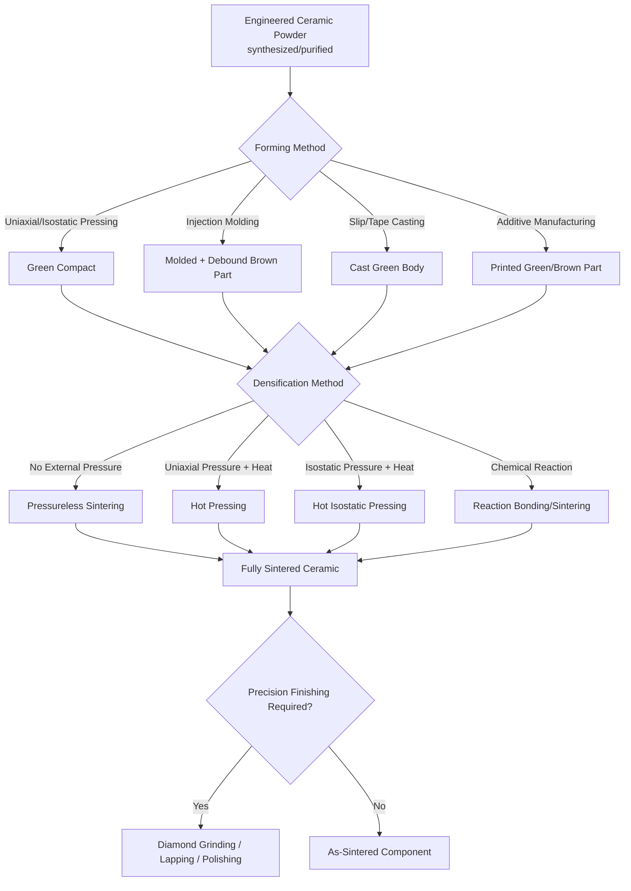

## Advanced and Engineering Ceramic Process Classification

### Definition and Scope

Advanced and engineering ceramic process classification organizes manufacturing processes according to their applicability to advanced (also termed technical, engineering, or fine) ceramics—inorganic, non-metallic materials synthesized from highly purified, engineered powders and processed to achieve precisely controlled composition, microstructure, and density for structural, electronic, thermal, or biomedical performance. This distinguishes advanced ceramics from traditional ceramics (covered separately), which rely on naturally occurring clay-based raw materials and clay's inherent plasticity for forming.

Common advanced ceramic material systems include oxide ceramics (alumina $Al_2O_3$, zirconia $ZrO_2$, titania $TiO_2$), non-oxide ceramics (silicon carbide $SiC$, silicon nitride $Si_3N_4$, boron carbide $B_4C$, boron nitride $BN$), and functional ceramics (piezoelectric materials such as lead zirconate titanate/PZT, ferrites, varistors). Unlike traditional ceramics, most advanced ceramic powders are **not inherently plastic** when mixed with water; they lack clay's platy crystal structure and characteristic plasticity, meaning the clay-forming processes (throwing, jiggering, plastic extrusion) central to traditional ceramics are generally inapplicable, and different forming strategies—largely borrowed from or parallel to powder metallurgy—dominate advanced ceramic processing.

### Key Points

- **Non-plastic powder behavior necessitates powder-metallurgy-like forming strategies**: because advanced ceramic powders generally lack clay's plasticity, shape is imparted primarily through die pressing, isostatic pressing, or the addition of temporary organic binders/plasticizers to impart formability, rather than through inherent material plasticity.
- **Sintering (densification) is the central consolidation mechanism**: green (as-formed) advanced ceramic bodies are consolidated to near-final density through high-temperature sintering, typically targeting much higher fractional density (often 95–99%+ of theoretical) than traditional ceramics, since residual porosity significantly degrades the mechanical and functional properties advanced ceramics are selected for.
- **Extremely high melting/decomposition temperatures characterize most advanced ceramics**: many advanced ceramic materials (alumina, zirconia, silicon carbide, silicon nitride) have melting or decomposition temperatures well above 2000°C, generally precluding conventional melt-casting as a practical forming route and reinforcing reliance on powder-based (solid-state or liquid-phase) sintering processes.
- **Covalent and ionic bonding drive processing difficulty**: many advanced ceramics (particularly non-oxide, covalently bonded systems like silicon carbide and silicon nitride) exhibit very low self-diffusion rates, making solid-state sintering to full density difficult without sintering aids, elevated pressure (hot pressing, HIP), or specialized techniques (spark plasma sintering, reaction bonding).
- **Post-sintering finishing is frequently required and can dominate part cost**: because advanced ceramics are extremely hard and often cannot be conventionally machined after firing, diamond grinding and other abrasive finishing processes are commonly needed to achieve final dimensional tolerances, often representing a very significant fraction of total part cost.

### Major Process Families

#### 1. Powder Synthesis and Preparation

Advanced ceramic processing begins with powder synthesis routes engineered to achieve high purity, controlled particle size, and controlled morphology—markedly different from the natural-mineral beneficiation approach used for traditional ceramic raw materials.

- **Solid-state reaction/calcination**: precursor powders reacted at elevated temperature to form the target ceramic compound
- **Sol-gel synthesis**: a chemical solution (sol) undergoes hydrolysis and condensation reactions to form a gel, which is subsequently dried and calcined to produce fine, high-purity ceramic powder (or, in some routes, processed directly into a monolithic or coating form without an intermediate powder step)
- **Co-precipitation**: mixed metal salt solutions are precipitated together (often via pH adjustment) to achieve intimate chemical mixing at the molecular/ionic scale prior to calcination, improving compositional homogeneity relative to solid-state mixing of coarser powders
- **Spray pyrolysis and plasma synthesis**: precursor solutions or vapors are rapidly reacted/decomposed in a hot gas stream or plasma to directly produce fine ceramic powder particles

#### 2. Forming Processes (Powder Consolidation to Green Shape)

- **Dry (uniaxial die) pressing**: ceramic powder, typically granulated via spray drying with a temporary organic binder to improve flow and packing, is compacted in a rigid die under uniaxial pressure—analogous to metal powder compaction and traditional ceramic dry pressing, widely used for relatively simple geometries (discs, plates, simple axisymmetric shapes)
- **Cold isostatic pressing (CIP)**: powder (often pre-formed or contained in a flexible mold/bag) is compacted under uniform, all-directional pressure applied via a pressurized fluid, achieving more uniform green density than uniaxial die pressing and enabling more complex or larger green shapes prior to sintering
- **Slip casting**: ceramic slurry cast into a porous mold, as detailed under semi-solid and slurry starting-material states, remains applicable to advanced ceramics (particularly for larger or more complex shapes) with appropriately formulated, deflocculated slurries
- **Tape casting**: ceramic slurry cast into thin, flexible green tape using a doctor blade, foundational to multilayer ceramic capacitor and substrate manufacturing, as detailed under fiber/filament and slurry-related processes
- **Gel casting**: ceramic slurry containing a monomer system is cast and gelled via in-situ polymerization, producing a strong, uniform green body with good machinability in the green state
- **Ceramic injection molding (CIM)**: fine ceramic powder mixed with a thermoplastic/wax binder system (closely analogous to metal injection molding) is injection molded to shape, then debound and sintered, enabling complex, precise geometries in moderate-to-high volumes
- **Extrusion**: ceramic powder mixed with plasticizers/binders to impart temporary formability is extruded through a die to produce constant-cross-section shapes (e.g., honeycomb catalytic converter substrates, ceramic tubes/rods)
- **Additive manufacturing of ceramics**: multiple AM routes exist, including vat photopolymerization of particle-loaded photopolymer resins, material extrusion (direct ink writing/robocasting) of ceramic pastes, and binder jetting onto ceramic powder beds, each followed by binder removal and sintering

**Example (Ceramic Injection Molding Sequence):**

1. Fine ceramic powder (e.g., alumina or zirconia, typically sub-micron to a few micrometers) mixed with a thermoplastic binder/wax system to form a homogeneous, moldable feedstock
2. Feedstock injection molded into the target shape using equipment similar to thermoplastic/metal injection molding
3. Debinding: binder removed via thermal, solvent, or catalytic methods, producing a fragile, porous "brown" part
4. Sintering: brown part heated to a high temperature appropriate for the specific ceramic system, driving densification and shrinkage (commonly 15–20% linear shrinkage, similar in magnitude to metal injection molding) as the powder particles bond and porosity is eliminated
5. Optional post-sintering finishing (grinding) for precision features

[Inference: exact shrinkage percentages and binder systems are proprietary/formulation-specific and vary by ceramic material system and target density.]

#### 3. Densification (Sintering) Processes

- **Pressureless (conventional) sintering**: the green body is heated in a furnace without applied external pressure, relying solely on thermally activated diffusion mechanisms (surface diffusion, grain boundary diffusion, volume diffusion) to drive densification; requires fine, reactive powders and often sintering aids to achieve high density for difficult-to-sinter systems
- **Hot pressing**: uniaxial pressure and elevated temperature are applied simultaneously (powder or pre-formed green body placed in a heated die under ram pressure), substantially accelerating densification and enabling near-full density for materials that sinter poorly under pressureless conditions, though limited generally to simple shapes achievable within a die
- **Hot isostatic pressing (HIP)**: simultaneous elevated temperature and isostatic (uniform, all-directional) gas pressure applied to a pre-sintered or encapsulated green body, achieving near-theoretical density and often used as a secondary densification step to eliminate residual porosity after initial pressureless sintering or as a primary consolidation route for complex-shaped, high-performance parts
- **Spark plasma sintering (SPS)/field-assisted sintering (FAST)**: pulsed electric current passed through powder under moderate pressure, enabling very rapid heating rates and short sintering times, which can suppress grain growth and enable fine-grained, high-density microstructures difficult to achieve via conventional sintering
- **Reaction bonding/reaction sintering**: densification occurs concurrently with a chemical reaction (e.g., reaction-bonded silicon nitride, formed by nitriding a silicon compact; reaction-bonded silicon carbide, formed by infiltrating a carbon-silicon carbide preform with molten silicon, which reacts to form additional silicon carbide bonding phase), often achieving near-net-shape processing with minimal firing shrinkage relative to conventional sintering
- **Liquid-phase sintering**: sintering aids are selected to form a liquid phase at the sintering temperature, which wets and enhances mass transport between solid grains, substantially accelerating densification—commonly used for silicon nitride (using oxide sintering aids such as yttria and alumina) and cemented carbides

**Example (Hot Isostatic Pressing Cycle):**

1. Pre-sintered (or green, encapsulated) ceramic component loaded into the HIP vessel
2. Vessel sealed and pressurized with an inert gas (commonly argon)
3. Temperature and pressure simultaneously ramped to target processing conditions (temperatures and pressures highly material-dependent; can range from roughly 1000°C to over 2000°C and from tens to over 200 MPa depending on the specific ceramic system and equipment)
4. Simultaneous heat and isostatic pressure close residual internal porosity via plastic/creep deformation and diffusion mechanisms, driving the component toward theoretical density
5. Controlled cooling and depressurization; component removed, typically exhibiting substantially improved density, strength, and reliability (reduced flaw population) compared to pressureless-sintered material

[Inference: specific HIP temperature and pressure schedules are highly material- and application-specific and should be established based on the ceramic system's known densification behavior.]

#### 4. Machining and Finishing Processes

Because fully sintered advanced ceramics are extremely hard (often approaching or exceeding hardened tool steel and many cutting tool materials), finishing is a distinct and often cost-dominant process category.

- **Green machining**: shaping or feature-adding operations performed on the green (unsintered, relatively soft and friable) or partially sintered (bisque) body, exploiting the much lower hardness/higher machinability before final densification, though shrinkage during subsequent sintering must be accurately predicted and compensated for in green-state dimensions
- **Diamond grinding**: the dominant finishing method for fully sintered advanced ceramics, using diamond-abrasive wheels to achieve final dimensional tolerances and surface finish, given diamond's hardness advantage over virtually all ceramic materials
- **Lapping and polishing**: fine abrasive finishing processes used to achieve very tight flatness, parallelism, or optical-quality surface finish requirements
- **Ultrasonic machining and laser machining**: non-traditional machining methods applicable to hard, brittle ceramic materials where conventional grinding is impractical or where complex feature geometry (holes, slots) is required

### Process Comparison Table

| Process | Densification Mechanism | Typical Achievable Density | Typical Applications |
| --- | --- | --- | --- |
| Pressureless Sintering | Thermally activated diffusion | Moderate-high (material-dependent) | General structural/technical ceramics |
| Hot Pressing | Heat + uniaxial pressure | High to near-full | Simple-shape high-performance ceramics (cutting tools, armor) |
| Hot Isostatic Pressing | Heat + isostatic pressure | Near-theoretical | High-reliability aerospace/biomedical ceramics |
| Spark Plasma Sintering | Pulsed current + pressure | High, fine-grained | Research/advanced functional ceramics |
| Reaction Bonding | Chemical reaction + densification | Moderate-high, near-net-shape | Reaction-bonded SiC, Si3N4 components |
| Ceramic Injection Molding | Debind + conventional sinter | High (material-dependent) | Complex-geometry precision components |

### Process Flow Diagram

### Governing Physical Principles

**Sintering densification driving force**, fundamentally the same surface-energy-reduction mechanism described for particulate/powder starting-material processes generally, but requiring more careful engineering in advanced ceramics due to typically lower self-diffusion rates in covalently/ionically bonded systems:

$$\Delta G = \gamma \Delta A$$

where $\Delta G$ is the Gibbs free energy driving force for densification, $\gamma$ is surface energy, and $\Delta A$ is the reduction in total particle/pore surface area.

**Grain growth kinetics** are a critical competing phenomenon during sintering, since excessive grain growth can degrade mechanical properties (strength generally follows a Hall-Petch-type relationship favoring finer grain size); grain growth is commonly described by:

$$D^n - D_0^n = Kt\exp\left(\frac{-Q}{RT}\right)$$

where $D$ is grain size at time $t$, $D_0$ is initial grain size, $n$ is a grain-growth exponent (material-dependent, commonly 2–4), $K$ is a rate constant, $Q$ is activation energy for grain boundary migration, $R$ is the gas constant, and $T$ is absolute temperature—illustrating why rapid sintering techniques (spark plasma sintering) that minimize time at high temperature can help retain finer, property-enhancing grain structures.

**Fracture strength relationship to flaw size (Griffith/fracture mechanics basis)**, central to understanding why porosity, inclusions, and processing-induced flaws critically govern advanced ceramic performance given ceramics' inherently brittle fracture behavior:

$$\sigma_f = \frac{K_{IC}}{Y\sqrt{\pi a}}$$

where $\sigma_f$ is fracture strength, $K_{IC}$ is fracture toughness, $Y$ is a geometric factor dependent on flaw and specimen geometry, and $a$ is critical flaw size—explaining why minimizing porosity and processing defects (a central goal of advanced ceramic densification processes such as HIP) is disproportionately important for reliable ceramic component performance compared to more flaw-tolerant metallic materials.

### Advantages and Limitations

**Advantages:**

- Enables materials with exceptional properties unattainable in metals or polymers: extreme hardness and wear resistance (silicon carbide, alumina), high-temperature strength retention (silicon nitride), and specialized functional properties (piezoelectric, dielectric, ionic conductivity)
- Near-net-shape processes (injection molding, isostatic pressing, reaction bonding) can minimize the extent of costly post-sintering diamond finishing required
- Sintering and hot isostatic pressing can achieve near-theoretical density, essential for the reliability and reproducible mechanical performance advanced structural ceramic applications demand
- Wide compositional and microstructural engineering flexibility supports tailoring for highly specific structural, electronic, thermal, or biomedical performance requirements

**Limitations:**

- Inherently brittle fracture behavior (low fracture toughness relative to metals) makes advanced ceramic components sensitive to processing-induced flaws (porosity, inclusions, machining damage), requiring stringent process control and often nondestructive inspection
- Extremely high hardness, while functionally valuable, makes post-sintering finishing (diamond grinding) slow and expensive, frequently representing a large fraction of total manufacturing cost
- Many advanced ceramic systems (particularly non-oxide, covalently bonded materials) are inherently difficult to sinter to full density without sintering aids, elevated pressure, or specialized equipment (hot presses, HIP vessels, SPS systems), increasing capital equipment requirements relative to many traditional ceramic or metal processes
- High raw material purity/engineering requirements and specialized processing equipment generally result in higher per-part cost than traditional ceramics or many metal alternatives, restricting use to applications where the performance benefit justifies the cost premium

### Related Topics

- Traditional ceramic process classification
- Classification by particulate and powder starting-material processes
- Classification by semi-solid and slurry starting-material states
- Ceramic matrix composite fabrication (chemical vapor infiltration, reaction bonding-based routes)
- Fracture mechanics and Weibull statistics applied to brittle ceramic reliability
- Sintering aid selection and liquid-phase sintering mechanisms
- Diamond grinding and abrasive machining of hard, brittle materials
- Piezoelectric and functional ceramic processing (PZT, ferrites)
- Nondestructive evaluation of ceramic components (X-ray CT, dye penetrant, acoustic methods)
- Ceramic additive manufacturing (vat photopolymerization, binder jetting, direct ink writing)