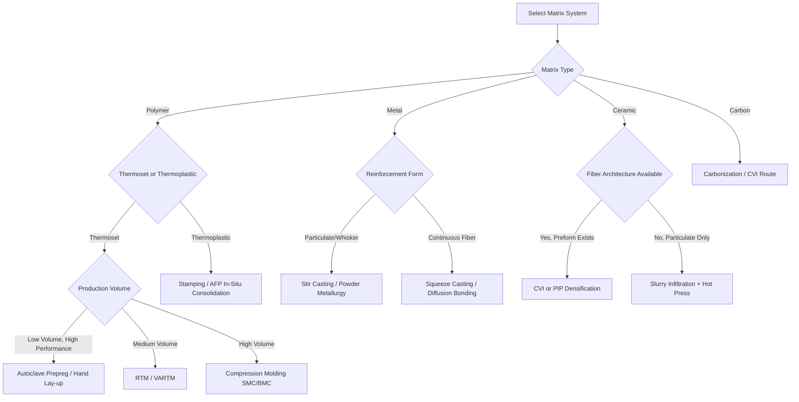

## Composite and Matrix-Reinforcement Process Classification

### Definition and Scope

Composite manufacturing processes are classified by how a reinforcement phase (fibers, particles, whiskers, or flakes) is combined with and embedded into a matrix phase (polymer, metal, ceramic, or carbon) to produce a material with properties superior to either constituent alone. Process classification in this domain is driven by three interdependent factors: matrix type, reinforcement form, and consolidation mechanism (heat, pressure, chemical reaction, or combination thereof).

Unlike monolithic material processes, composite classification is inherently two-dimensional: a process must be categorized both by the matrix system it serves and by the architecture of reinforcement it can accommodate.

### Primary Classification Axes

**Key Points**

- **By matrix material**: Polymer Matrix Composites (PMC), Metal Matrix Composites (MMC), Ceramic Matrix Composites (CMC), Carbon-Carbon Composites (C/C)
- **By reinforcement form**: continuous fiber, woven/braided fabric, chopped/short fiber, particulate, whisker
- **By consolidation driving force**: thermal (curing/sintering), pressure-assisted (autoclave, press), chemical (infiltration/reaction), or hybrid
- **By tooling philosophy**: open mold, closed mold, mandrel-based, tool-less (additive)

### Classification by Matrix System

#### Polymer Matrix Composites (PMC)

PMCs dominate industrial composite production due to low processing temperatures (typically below 400°C) and mature tooling infrastructure.

**Thermoset PMC Processes**

- **Hand lay-up / wet lay-up**: manual placement of dry or resin-impregnated fabric onto an open mold; low capital cost, low fiber-volume fraction ($V_f$ ≈ 0.3–0.4), operator-dependent quality
- **Spray-up**: chopped fiber and catalyzed resin sprayed simultaneously onto a mold; used for low-cost, non-structural parts (boat hulls, tub/shower units)
- **Vacuum bagging**: dry or pre-impregnated laminate consolidated under vacuum pressure (≈1 atm); improves $V_f$ and reduces voids relative to hand lay-up
- **Autoclave curing**: vacuum-bagged laminate cured under combined heat and elevated pressure (up to 700 kPa / 100 psi) in a pressurized oven; industry standard for aerospace-grade prepreg laminates, achieving $V_f$ ≈ 0.6 with minimal porosity
- **Resin Transfer Molding (RTM)**: dry fiber preform placed in a closed, matched-metal mold; liquid resin injected under moderate pressure; yields both-side finish and tight dimensional tolerance
- **Vacuum-Assisted Resin Transfer Molding (VARTM)**: dry preform infused with resin drawn by vacuum through a single-sided tool; lower capital cost than RTM, used for large structures (wind turbine blades, marine hulls)
- **Compression molding (SMC/BMC)**: Sheet Molding Compound or Bulk Molding Compound charge placed in a matched, heated metal die and compressed; high-volume automotive/appliance production with cycle times under 5 minutes
- **Filament winding**: continuous resin-impregnated fiber wound under tension onto a rotating mandrel following a programmed helical, hoop, or polar path; used for pressure vessels, pipes, and rocket motor cases
- **Pultrusion**: continuous fiber pulled through a resin bath and then a heated, shaping die to produce constant cross-section profiles (structural shapes, rebar); a continuous rather than batch process

**Thermoplastic PMC Processes**

- **Thermoplastic tape lay-up / Automated Fiber Placement (AFP) with in-situ consolidation**: heated thermoplastic tow/tape placed and consolidated in a single pass using a heat source (laser, hot gas torch) and compaction roller; eliminates a separate autoclave cure step
- **Thermoforming/stamping of organosheet**: pre-consolidated thermoplastic composite sheet heated above melt/softening temperature and stamped in a matched-die press; cycle times of seconds to minutes, suited to high-volume structural parts
- **Injection molding of short/long-fiber-reinforced thermoplastics**: chopped fiber (typically glass or carbon, 0.2–12 mm length) compounded into pellets and injection molded; fiber orientation is process-induced and anisotropic

#### Metal Matrix Composites (MMC)

- **Stir casting**: reinforcement particles (SiC, Al₂O₃) mechanically stirred into molten metal matrix before casting; low cost but risk of particle clustering and porosity
- **Squeeze casting / pressure infiltration**: molten metal forced under pressure into a preheated fiber or particulate preform within a die; produces near-net-shape parts with reduced porosity
- **Powder metallurgy MMC**: matrix and reinforcement powders blended, cold-compacted, and sintered or hot-pressed; suited to particulate and whisker reinforcement
- **Diffusion bonding**: alternating layers of matrix foil and continuous fiber mat stacked and bonded under heat and pressure below the matrix melting point; used for titanium-matrix aerospace composites
- **Spray forming (spray co-deposition)**: atomized molten metal droplets co-deposited with reinforcement particles onto a substrate, followed by consolidation

#### Ceramic Matrix Composites (CMC)

- **Chemical Vapor Infiltration (CVI)**: gaseous precursor infiltrates a porous fiber preform and deposits matrix material via chemical reaction at elevated temperature; produces high-purity matrices but requires long cycle times (days to weeks) due to diffusion-limited infiltration
- **Polymer Infiltration and Pyrolysis (PIP)**: preceramic polymer infiltrates the preform, is cured, then pyrolyzed to convert to ceramic; multiple infiltration/pyrolysis cycles are needed to reduce residual porosity
- **Melt infiltration (Reaction Bonding)**: molten silicon or metal infiltrates a porous carbon/ceramic preform and reacts to form the ceramic matrix (e.g., melt-infiltrated SiC/SiC); faster than CVI but can leave residual free metal/silicon
- **Slurry infiltration + hot pressing**: fiber preform infiltrated with a ceramic particulate slurry, then consolidated by hot pressing or sintering

#### Carbon-Carbon Composites (C/C)

- **Carbonization of resin/pitch-impregnated preform**: carbon fiber preform impregnated with a carbon-yielding precursor (phenolic resin, pitch), then pyrolyzed in an inert atmosphere; repeated re-impregnation/carbonization densification cycles are typically required
- **CVI densification**: analogous to CMC-CVI, but depositing pyrolytic carbon matrix instead of ceramic

### Classification by Reinforcement Architecture

| Reinforcement Form | Compatible Processes | Typical $V_f$ | Property Character |
| --- | --- | --- | --- |
| Continuous unidirectional fiber | Filament winding, pultrusion, AFP, autoclave prepreg | 0.5–0.65 | Highly anisotropic, maximum stiffness/strength along fiber axis |
| Woven/braided fabric | RTM, VARTM, hand lay-up, autoclave | 0.4–0.55 | Balanced biaxial properties, improved damage tolerance |
| Chopped/short fiber | Injection molding, compression molding (SMC), spray-up | 0.1–0.3 | Quasi-isotropic (random) or process-induced anisotropy |
| Particulate/whisker | Stir casting, powder metallurgy, slurry infiltration | 0.1–0.4 | Near-isotropic, moderate property enhancement, improved wear/thermal behavior |

### Process Selection Logic

**Example**

A manufacturer producing 50,000 automotive structural brackets per year with continuous carbon fiber reinforcement would select **compression molding of carbon-fiber SMC or stamped thermoplastic organosheet** over autoclave prepreg lay-up, because cycle time (minutes vs. hours) and labor cost dominate at high volume, even though autoclave processing yields marginally higher $V_f$ and lower void content.

Conversely, a single prototype aerospace fuselage panel would favor **hand lay-up or automated fiber placement with autoclave cure**, since tooling cost amortization is irrelevant at low volume and maximum mechanical performance is the priority.

### Process Selection Decision Flow (svg_diagram)

### Cross-Cutting Process Comparison

**Key Points**

- **Cycle time hierarchy** (fastest to slowest): injection/compression molding (seconds–minutes) < pultrusion (continuous) < RTM/VARTM (hours) < autoclave prepreg (hours) < CVI/PIP for CMC (days–weeks)
- **Fiber-volume fraction control**: closed-mold and pressure-assisted processes (RTM, autoclave, compression molding) consistently achieve higher and more uniform $V_f$ than open-mold processes (hand lay-up, spray-up)
- **Void content**: autoclave processing typically achieves void content below 1%; vacuum-only processes (VARTM, vacuum bagging) typically range 1–3%; hand lay-up can exceed 5% [Unverified: values are process- and material-batch dependent, and actual results vary with resin viscosity, cure schedule, and operator skill]
- **Tooling cost trajectory**: open mold (lowest) → closed mold/RTM → matched metal die (compression molding) → autoclave tooling (highest, due to thermal expansion matching and pressure vessel compatibility requirements)

### Matrix-Reinforcement Compatibility Considerations

Process selection is constrained by chemical and thermal compatibility between matrix and reinforcement:

$$T_{process} < T_{degradation,fiber}, \quad T_{process} < T_{melt,matrix} \text{ or } T_{cure,matrix}$$

For MMC and CMC systems, interfacial reaction kinetics between fiber and matrix (e.g., carbon fiber reacting with molten aluminum to form brittle Al₄C₃) constrain both achievable processing temperature and dwell time, often necessitating fiber coatings (boron nitride, pyrolytic carbon interphase layers) applied as a pre-process step before matrix infiltration.

### Common Defects by Process Class

**Key Points**

- **Liquid-molding processes (RTM/VARTM)**: dry spots from incomplete resin flow, race-tracking along preform edges
- **Autoclave/prepreg processes**: porosity from trapped volatiles or inadequate vacuum integrity, ply wrinkling
- **Filament winding/pultrusion**: fiber misalignment, resin-rich or resin-starved zones at direction changes
- **MMC casting routes**: particle segregation, interfacial porosity, unwanted reaction-layer formation
- **CMC/CVI routes**: residual open porosity due to pore-sealing at the preform surface before full densification (the "bottleneck" or "necking-in" effect)

### Conclusion

Composite and matrix-reinforcement process classification is fundamentally a mapping problem between matrix chemistry, reinforcement geometry, and achievable consolidation mechanism. No single process dominates across matrix families; instead, selection depends on the intersection of production volume, required fiber-volume fraction, part geometry complexity, and matrix-specific thermal/chemical constraints. Understanding this classification framework enables systematic process selection rather than default reliance on legacy or familiar methods.

**Related Topics**

- Prepreg chemistry and out-time/shelf-life management
- Autoclave cure cycle design and cure kinetics modeling
- Fiber preform architectures (2D woven, 3D woven, braided, stitched)
- Resin flow modeling in liquid composite molding (Darcy's law applications)
- Interfacial engineering and fiber coating/sizing technology
- Non-destructive inspection methods for composite defect detection (ultrasonic C-scan, thermography)
- Additive manufacturing of continuous fiber composites (3D printing with embedded fiber)
- Recycling and end-of-life processing of thermoset vs. thermoplastic composites