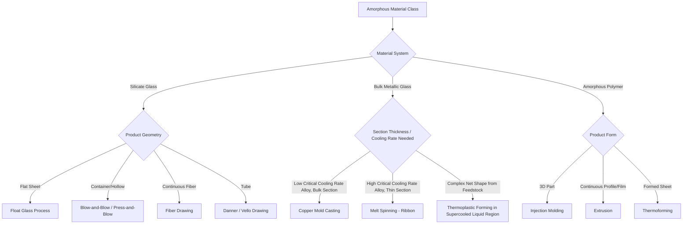

## Glass and Amorphous-Material Process Classification

### Definition and Scope

Glass and amorphous-material manufacturing processes are classified by how a material lacking long-range atomic order (a non-crystalline solid) is shaped while transitioning through its characteristic viscosity-temperature regimes. Unlike crystalline metals, which solidify at a discrete melting point, amorphous materials — inorganic glasses, amorphous (metallic) alloys, and amorphous polymers — pass through a continuous softening range governed by viscosity, making process classification fundamentally a classification by **viscosity-controlled forming stage** rather than by phase-transformation mechanism.

This category encompasses silicate glasses (soda-lime, borosilicate, fused silica), glass-ceramics, bulk metallic glasses (BMGs), and amorphous thermoplastics processed below their crystallization kinetics window.

### The Viscosity Framework

**Key Points**

- Glass forming processes are organized around defined viscosity points, expressed in Pa·s (or poise, where 1 Pa·s = 10 poise)
- **Melting point**: viscosity ≈ 10 Pa·s — material flows freely, used for melting/refining
- **Working point**: viscosity ≈ 10³ Pa·s — material is soft enough for shaping (pressing, blowing, drawing)
- **Softening point**: viscosity ≈ 10⁶·⁶ Pa·s — material deforms under its own weight
- **Annealing point**: viscosity ≈ 10¹²·⁴ Pa·s — internal stresses relax within minutes
- **Strain point**: viscosity ≈ 10¹³·⁵ Pa·s — material is effectively rigid; below this, no further stress relaxation occurs

Each forming process operates within a specific viscosity window, and process classification maps directly onto where in this curve the shaping step occurs.

### Classification by Forming Mechanism (Silicate Glass)

#### Melt-Forming Processes

- **Float glass process**: molten glass ribbon poured onto a bath of molten tin, producing flat glass with fire-polished, parallel surfaces without mechanical grinding; dominant process for flat/sheet glass since the 1960s, operating continuously
- **Blow molding (glass)**: gob of molten glass shaped by air pressure inside a mold; subdivided into:
  - **Blow-and-blow process**: used for narrow-neck containers (bottles); a parison is first blown, then reblown into final shape
  - **Press-and-blow process**: used for wide-mouth containers (jars); a plunger presses the parison before final blow
- **Pressing**: molten gob pressed between a mold and plunger; used for flat or shallow items (dishware, lenses, TV/CRT panels historically)
- **Drawing processes**:
  - **Fiber drawing**: molten glass drawn through bushings/orifices at high speed to produce continuous glass fiber (textile fiber, optical fiber preform draw)
  - **Sheet drawing (Fourcault, Pittsburgh processes)**: historical vertical sheet-drawing methods, largely superseded by float glass
  - **Tube drawing (Danner, Vello processes)**: molten glass drawn over a rotating mandrel to form continuous tubing
- **Centrifugal casting/spinning**: molten glass or mineral melt spun to form fiber (mineral wool insulation) via centrifugal force through orifices
- **Rolling**: molten glass passed between rollers to produce patterned or wired glass sheet

#### Post-Forming (Solid-State/Softened-State) Processes

- **Annealing**: controlled slow cooling through the annealing-to-strain-point range to relieve internal residual stress; mandatory after all melt-forming operations
- **Tempering (thermal toughening)**: reheated glass rapidly quenched with air jets, creating surface compressive stress and core tensile stress; increases mechanical and thermal shock resistance 4–5× over annealed glass
- **Chemical strengthening (ion exchange)**: glass immersed in molten potassium salt bath below the strain point; smaller Na⁺ ions in the glass surface are replaced by larger K⁺ ions, creating a compressive surface layer without geometric distortion; used for cover glass on mobile devices
- **Laminating**: glass plies bonded with polymer interlayer (PVB, EVA) under heat and pressure/autoclave; produces safety glass that retains fragments upon fracture
- **Grinding and polishing**: mechanical removal of surface material to achieve optical flatness/finish, used for precision optics and mirror blanks
- **Etching**: chemical (hydrofluoric acid) or mechanical (sandblasting) surface removal for texturing or pattern generation

### Classification by Forming Mechanism (Bulk Metallic Glass, BMG)

BMG processing requires suppressing crystallization by cooling through the supercooled liquid region fast enough to avoid nucleation, classified by **critical cooling rate management**:

- **Copper mold casting**: molten alloy injected or suction-cast into a water-cooled copper mold; achieves cooling rates sufficient for bulk (mm-scale) amorphous sections in alloys with low critical cooling rates (Zr-, Pd-, Pt-based systems)
- **Melt spinning**: molten alloy ejected onto a rapidly rotating copper wheel, producing thin ribbon (tens of micrometers) at cooling rates on the order of $10^5$–$10^6$ K/s; used for alloys requiring very high cooling rates (Fe-, Co-based)
- **Thermoplastic forming (TPF) of BMG**: pre-cast amorphous feedstock reheated into the supercooled liquid region (above $T_g$, below crystallization onset) where viscosity drops enough for net-shape forming (injection molding, blow molding, micro-imprinting) without crystallizing; exploits the same viscosity-window logic as silicate glass forming
- **Spark plasma sintering (SPS) of BMG powder**: amorphous powder consolidated under pulsed current and pressure within the supercooled liquid window, producing bulk parts from powder feedstock while retaining amorphous structure

### Classification by Forming Mechanism (Amorphous/Glassy Polymers)

Amorphous thermoplastics (PMMA, polystyrene, polycarbonate) are processed above $T_g$ using standard polymer forming routes, but classification is distinguished from semi-crystalline polymer processing by the absence of a latent heat of fusion and a broader, more gradual softening transition:

- **Injection molding**: melt processed above $T_g$ and mold-cooled below it; amorphous polymers exhibit lower and more predictable shrinkage than semi-crystalline polymers due to the absence of crystallization-driven volumetric contraction
- **Extrusion**: continuous profile/sheet/film production; melt viscosity is Newtonian over a wider shear-rate range than semi-crystalline melts
- **Thermoforming**: sheet reheated into the rubbery plateau above $T_g$ and formed against a mold using vacuum/pressure; wide, well-defined forming window is a practical advantage of amorphous polymers over semi-crystalline ones
- **Blow molding**: parison/preform reheated into a formable state and expanded by internal air pressure (PET bottle stretch-blow molding, though PET is technically semi-crystalline, uses amorphous-state processing logic during the stretch step)

### Process Selection Diagram (svg_diagram)

### Comparative Process Summary

| Material System | Primary Forming Window | Characteristic Process | Key Control Parameter |
| --- | --- | --- | --- |
| Silicate glass | Working point (10³ Pa·s) | Blow molding, pressing | Viscosity vs. temperature curve |
| BMG (bulk casting) | Below $T_g$, rapid quench | Copper mold casting | Critical cooling rate |
| BMG (TPF) | Supercooled liquid region ($T_g$ to $T_x$) | Injection/blow molding of BMG | Time-temperature-transformation (TTT) window |
| Amorphous polymer | Above $T_g$, rubbery/melt state | Injection molding, thermoforming | Melt viscosity, shear rate dependence |

### Practical Example

**Example**

A manufacturer producing precision optical lens blanks from silicate glass would select **pressing** (gob pressed between mold and plunger at working-point viscosity), followed by **annealing** to remove residual stress, then **grinding and polishing** to achieve final optical figure — because pressing alone cannot achieve the surface finish and dimensional tolerance optics require, and residual stress from rapid forming would otherwise cause birefringence.

A manufacturer producing a complex 3D micro-gear from a Zr-based BMG would instead select **thermoplastic forming within the supercooled liquid region**, exploiting the low viscosity (comparable to polymer melts, ≈10²–10⁴ Pa·s) available in that narrow temperature window, since conventional casting cannot achieve the required micro-feature replication fidelity.

### Common Defects by Process Class

**Key Points**

- **Melt-formed silicate glass**: cord (compositional striae from incomplete mixing), seed/bubble inclusion, residual stress from non-uniform cooling
- **Tempered glass**: nickel sulfide inclusion-induced spontaneous fracture (a delayed failure mode) [Unverified: incidence rates are alloy/batch and supplier dependent]
- **BMG casting**: partial crystallization from insufficient cooling rate, porosity from gas entrapment during injection
- **BMG thermoplastic forming**: crystallization onset if processing time exceeds the TTT window at the selected forming temperature
- **Amorphous polymer molding**: sink marks and residual stress from non-uniform cooling (though absent the crystallization shrinkage seen in semi-crystalline polymers), stress-cracking sensitivity in solvent/chemical environments

### Conclusion

Classification of glass and amorphous-material processes centers on managing a continuous viscosity-temperature relationship rather than a discrete melting event. Whether the material is a silicate glass, a bulk metallic glass, or an amorphous polymer, process selection reduces to identifying the correct viscosity window for shaping, then controlling the cooling or quenching path to lock in the desired amorphous structure and residual stress state. This shared framework across otherwise chemically distinct material families is the defining characteristic of this classification category.

**Related Topics**

- Glass composition design and its effect on the viscosity-temperature curve
- Fictive temperature and its role in structural relaxation
- Critical cooling rate prediction models for metallic glass formers (Turnbull criterion)
- Time-Temperature-Transformation (TTT) diagrams for BMG processing windows
- Residual stress measurement techniques (photoelastic stress analysis for glass)
- Additive manufacturing of amorphous alloys (laser powder bed fusion of BMG)
- Devitrification and controlled crystallization (glass-ceramic processing)
- Optical fiber preform fabrication (MCVD, OVD, VAD processes)