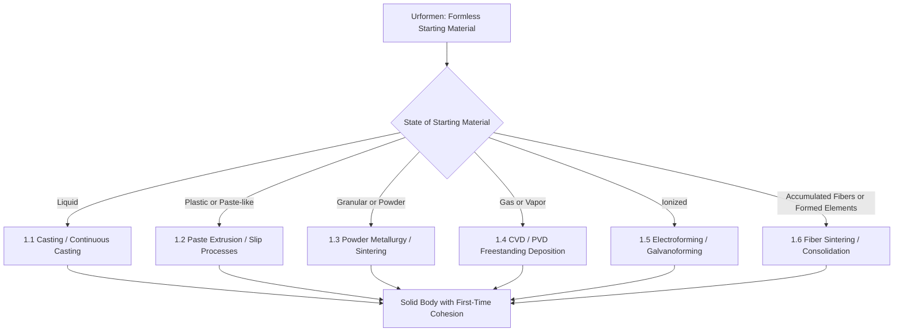

## Urformen: Primary Shaping from Formless Material

### Definition and Scope

*Urformen* is the first of six main groups in the DIN 8580 manufacturing process classification standard (Fertigungsverfahren), defined as the creation of a solid body from a **formless** (amorphous, shapeless) material by establishing material cohesion for the first time. "Formless" in this context means the starting material has no defined geometric shape — it exists as a liquid, gas, powder, granulate, ions, fibers, or another non-cohesive state — and the process gives it its initial, permanent form. This distinguishes *Urformen* fundamentally from the other five DIN 8580 main groups (Umformen/forming, Trennen/separating, Fügen/joining, Beschichten/coating, Stoffeigenschaftändern/changing material properties), all of which act on material that is already a solid body.

The German term literally translates as "primal forming" or "original shaping," reflecting its role as the origin point of solid geometry in a manufacturing process chain.

### Position Within DIN 8580

**Key Points**

- DIN 8580 (Fertigungsverfahren – Einteilung) organizes all manufacturing processes into six main groups (Hauptgruppen), numbered 1 through 6
- **Hauptgruppe 1**: Urformen (primary shaping)
- **Hauptgruppe 2**: Umformen (forming/deformation of an existing solid)
- **Hauptgruppe 3**: Trennen (separating, e.g., cutting, machining)
- **Hauptgruppe 4**: Fügen (joining)
- **Hauptgruppe 5**: Beschichten (coating)
- **Hauptgruppe 6**: Stoffeigenschaftändern (changing material properties, e.g., heat treatment)
- The defining criterion distinguishing group 1 from group 2 is **cohesion (Zusammenhalt)**: Urformen establishes cohesion where none previously existed; Umformen changes the shape of material that already possesses cohesion

### The Six Subgroups of Urformen (DIN 8580)

DIN 8580 subdivides Urformen according to the **state of the starting material**:

- **1.1 Urformen aus dem flüssigen Zustand (from the liquid state)**: casting, continuous casting — material solidifies from a melt into a mold cavity
- **1.2 Urformen aus dem plastischen/pastenförmigen Zustand (from the plastic/paste-like state)**: extrusion of pastes, ceramic slip casting variants, some polymer processes
- **1.3 Urformen aus dem körnigen oder pulverförmigen Zustand (from the granular or powder state)**: powder metallurgy (pressing and sintering), ceramic powder pressing, sintering of loose powder beds
- **1.4 Urformen aus dem gas- oder dampfförmigen Zustand (from the gaseous or vapor state)**: chemical vapor deposition (CVD) when used to build up a freestanding solid body, physical vapor deposition (PVD) for freestanding forms
- **1.5 Urformen aus dem ionisierten Zustand (from the ionized state)**: electroforming (electrolytic deposition building a solid body from ions in solution), galvanoforming
- **1.6 Urformen durch Ansammeln von Formteilen/Fasern (by accumulation of formed elements or fibers)**: sintering of fiber compacts, certain composite lay-up processes where formless fiber/matrix material is consolidated into a cohesive body

[Unverified: exact subgroup numbering and terminology may vary slightly across DIN 8580 edition years (1985, 2003, 2020 revisions); the conceptual six-way division by starting-material state is consistent across editions]

### Classification Logic Diagram (svg_diagram)

### Representative Processes by Subgroup

#### 1.1 From the Liquid State

- **Sand casting**: molten metal poured into an expendable sand mold; cohesion established upon solidification
- **Die casting**: molten metal injected under high pressure into a reusable steel die; rapid solidification against a chilled mold surface
- **Investment casting (lost-wax)**: molten metal poured into a ceramic shell mold formed around a sacrificial wax pattern
- **Continuous casting**: molten metal solidified continuously as it is drawn through a water-cooled mold, producing billets, blooms, or slabs
- **Injection molding of thermoplastics**: molten polymer injected into a closed mold cavity and solidified upon cooling — classified under Urformen because the polymer transitions from a formless melt to a cohesive solid body

#### 1.2 From the Plastic/Paste State

- **Slip casting (ceramics)**: a suspension (slip) of ceramic particles in liquid is poured into a porous plaster mold; capillary action removes liquid, leaving a cohesive ceramic body
- **Extrusion of ceramic pastes**: plastic clay-like body forced through a die to form continuous cross-sections (bricks, tubes, honeycomb substrates)

#### 1.3 From the Granular/Powder State

- **Powder metallurgy (press and sinter)**: metal powder compacted in a die under pressure to form a "green" compact, then sintered at elevated temperature (below melting point) to establish interparticle bonding and final cohesion
- **Metal Injection Molding (MIM)**: fine metal powder mixed with a polymer binder, injection molded, then debinded and sintered
- **Ceramic powder pressing and sintering**: analogous process for technical ceramics (alumina, zirconia components)
- **Hot isostatic pressing (HIP) of powder**: powder consolidated under simultaneous heat and isostatic gas pressure directly to near-full density

#### 1.4 From the Gas/Vapor State

- **Chemical Vapor Deposition (CVD) for freestanding bodies**: gaseous precursors react and deposit solid material layer by layer to build up a freestanding structure (e.g., CVD-grown tungsten or diamond forms), distinguished from CVD *coating* (Beschichten) by the resulting body being separable and self-supporting rather than adherent to a substrate

#### 1.5 From the Ionized State

- **Electroforming**: metal ions in an electrolytic bath are reduced and deposited onto a conductive or conductized mandrel; once sufficient thickness accumulates, the deposited shell is separated from the mandrel as a freestanding part (used for thin-walled precision shells, waveguides, mesh screens)

#### 1.6 From Accumulated Formed Elements/Fibers

- **Sintering of fiber felts/mats**: loose fiber material consolidated via sintering or bonding into a cohesive porous or solid body
- **Powder bed fusion additive manufacturing (Laser/Electron Beam)**: loose powder selectively fused layer by layer; commonly classified within Urformen's granular-state logic since the process builds cohesion from a formless powder bed [Inference: modern additive manufacturing processes postdate the original 1985 DIN 8580 framework and are typically mapped into the powder/granular subgroup by extension, though some references classify AM as a distinct emerging category]

### Distinguishing Urformen from Related DIN 8580 Groups

**Key Points**

- **Urformen vs. Umformen**: Urformen creates a solid body where none existed (melt → casting); Umformen reshapes an already-cohesive solid without changing its mass or material composition (forging, rolling, deep drawing of a pre-existing blank)
- **Urformen vs. Beschichten**: Urformen produces a freestanding, self-supporting body; Beschichten (coating) deposits material that remains permanently bonded to and dependent on a substrate — the same deposition physics (e.g., CVD, electrodeposition) can fall into either group depending on whether the deposited material is later separated as an independent part
- **Urformen vs. Fügen**: Urformen involves a single formless material achieving cohesion; Fügen (joining) combines two or more already-solid bodies into one assembly

### Practical Example

**Example**

A manufacturer producing a turbine blade via investment casting is performing Urformen: molten superalloy (formless, liquid state) is poured into a ceramic shell mold and solidifies, establishing cohesion for the first time and producing the blade's near-net shape. If that same blade later undergoes **forging** to refine grain structure, this second step is classified as Umformen, since the material already possesses cohesion before the forging operation begins — the classification boundary is defined by the state transition, not by the industry or part family involved.

### Conclusion

Urformen occupies a unique position in DIN 8580 as the sole main group defined by the *creation* of material cohesion rather than the *modification* of an already-cohesive body. Its six subgroups — organized strictly by the physical state of the starting material (liquid, plastic/paste, granular/powder, gas/vapor, ionized, and accumulated fiber/formed elements) — provide a state-based rather than technology-based taxonomy, which is why processes as different as sand casting, powder sintering, and electroforming are grouped under the same conceptual umbrella despite requiring entirely different equipment and physics.

**Related Topics**

- Umformen (DIN 8580 Hauptgruppe 2): forming of existing solid bodies
- Solidification theory and casting defect formation (porosity, shrinkage, segregation)
- Sintering mechanisms and driving forces (surface energy reduction, diffusion pathways)
- Green density and sintering shrinkage prediction in powder metallurgy
- Additive manufacturing classification within and beyond DIN 8580
- Mold and die design principles for liquid-state Urformen processes
- Electroforming process parameters and mandrel design
- Comparative international standards (ISO, ASTM) for manufacturing process taxonomy