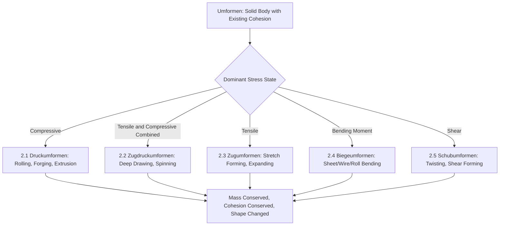

## Umformen: Forming While Conserving Mass and Cohesion

### Definition and Scope

*Umformen* is the second main group (Hauptgruppe 2) in the DIN 8580 manufacturing process classification standard, defined as the deliberate change of shape of a solid body that already possesses material cohesion, while conserving both mass and material cohesion throughout the process. The German term translates as "reforming" or "transforming," and the defining physical mechanism is **plastic deformation**: material is redistributed through yielding beyond its elastic limit, not removed (as in Trennen/separating) or added (as in Urformen/primary shaping or Beschichten/coating).

The DIN 8580 definition specifies three invariants that must hold across an Umformen operation: mass remains constant, cohesion (the bonded, solid state of the material) remains constant, and only the geometric form changes. This distinguishes Umformen sharply from the other five main groups, each of which violates at least one of these invariants by design.

### Position Within DIN 8580

**Key Points**

- **Hauptgruppe 1 (Urformen)**: creates cohesion from a formless material — cohesion goes from absent to present
- **Hauptgruppe 2 (Umformen)**: reshapes a body that already has cohesion — cohesion and mass both remain constant
- **Hauptgruppe 3 (Trennen)**: removes material/cohesion locally — mass decreases
- **Hauptgruppe 4 (Fügen)**: combines multiple bodies — mass and cohesion increase via new bonds between parts
- **Hauptgruppe 5 (Beschichten)**: adds a bonded layer — mass increases at a surface
- **Hauptgruppe 6 (Stoffeigenschaftändern)**: changes internal material properties without necessarily changing shape or mass
- The distinguishing test for Umformen: if you weighed the workpiece before and after, the mass is unchanged; if you examined it metallurgically, it was a continuous solid before and remains one after

### The Five Subgroups of Umformen (DIN 8580)

DIN 8580 subdivides Umformen according to the **predominant stress state** imposed on the material during deformation:

- **2.1 Druckumformen (compressive forming)**: deformation driven predominantly by compressive stresses — rolling, forging, extrusion, indenting
- **2.2 Zugdruckumformen (tensile-compressive forming)**: combined tensile and compressive stress states — deep drawing, spinning, necking/flanging
- **2.3 Zugumformen (tensile forming)**: deformation driven predominantly by tensile stress — stretch forming, expanding
- **2.4 Biegeumformen (bending forming)**: deformation via bending moments — sheet bending, roll bending, wire bending
- **2.5 Schubumformen (shear forming)**: deformation driven by shear stress — twisting, shear forming/flow forming at an angle

[Unverified: subgroup labeling conventions vary slightly by DIN 8580 edition and by translated secondary sources; the five-way division by dominant stress state is the consistent conceptual structure]

### Classification Logic Diagram (svg_diagram)

### Representative Processes by Subgroup

#### 2.1 Druckumformen (Compressive Forming)

- **Rolling**: workpiece passed between rotating rolls that reduce cross-section via compressive force; subdivided into flat rolling (plate/sheet), profile rolling (structural shapes), and ring rolling (seamless rings)
- **Open-die forging**: workpiece compressed between flat or simple-shaped dies with material free to flow laterally; used for large, low-volume parts
- **Closed-die (impression) forging**: workpiece compressed within a shaped die cavity, constraining material flow to fill the die impression; higher dimensional precision, higher tooling cost
- **Extrusion (forward and backward)**: billet forced through or around a die under compressive ram force to produce a constant cross-section (forward extrusion) or a cup-like cavity (backward extrusion); distinguished from Urformen-category extrusion of pastes/melts by the billet being a pre-existing solid
- **Indenting/coining**: localized compressive deformation to imprint fine surface detail (coin faces, embossed features)

#### 2.2 Zugdruckumformen (Tensile-Compressive Forming)

- **Deep drawing**: flat sheet blank drawn into a die cavity by a punch, with the flange region under compressive hoop stress and the wall region under tensile stress; used for cups, cans, automotive body panels
- **Spinning (metal spinning)**: rotating sheet blank formed over a mandrel using a roller tool, combining tensile stretching and compressive thinning
- **Ironing**: wall thickness of a drawn cup reduced by forcing it through a die clearance smaller than the wall thickness, combining tension in the wall with compression at the die interface
- **Necking and flanging**: localized diameter reduction (necking) or edge-forming (flanging) of tubular/sheet parts through combined stress states

#### 2.3 Zugumformen (Tensile Forming)

- **Stretch forming**: sheet clamped at its edges and stretched over a die/form block by tensile force alone, producing smooth, large-radius contours (aircraft skin panels)
- **Expanding**: tube or hollow section expanded radially outward under internal tensile-inducing force (mechanical or hydraulic expansion of tube ends)

#### 2.4 Biegeumformen (Bending Forming)

- **Press brake bending (V-bending, air bending)**: sheet metal bent along a straight line using a punch and die
- **Roll bending**: plate or sheet passed through a set of rolls to produce a continuous curvature (cylinders, cones)
- **Wire and tube bending**: rotary draw bending, mandrel bending for tubular sections to prevent wall collapse or ovalization
- **Folding**: sheet bent along a line using a hinged tool (folding machine), common in sheet metal fabrication for enclosures

#### 2.5 Schubumformen (Shear Forming)

- **Twisting**: torque applied to a shaft or bar to produce a helical deformation (twist drills, some spring forms)
- **Shear forming/flow forming at oblique angles**: localized shear-dominated deformation used in specialized flow-forming operations where the roller path imposes shear alongside axial flow

### Governing Mechanics: Flow Stress and Formability

**Key Points**

- Umformen processes are governed by the material's **flow stress**, the stress required to sustain plastic deformation at a given strain, strain rate, and temperature: $\sigma_f = \sigma_f(\varepsilon, \dot{\varepsilon}, T)$
- **Cold forming** (below recrystallization temperature): higher flow stress, strain hardening accumulates, better surface finish and dimensional tolerance, limited formability before cracking
- **Warm forming**: intermediate temperature range, reduces flow stress and increases formability relative to cold forming while retaining more precision than hot forming
- **Hot forming** (above recrystallization temperature): lower flow stress, continuous dynamic recrystallization prevents strain hardening buildup, higher achievable strains, but coarser surface finish and dimensional tolerance due to scaling and thermal contraction
- **Formability limits** are commonly characterized using a Forming Limit Diagram (FLD) for sheet metal, plotting major vs. minor principal strain to define the onset of localized necking/failure

### Volume Constancy Relationship

Because mass and density are conserved (for practical purposes, incompressible plastic flow is assumed), volume is invariant throughout an Umformen operation:

$$V_{initial} = V_{final} \quad \Rightarrow \quad A_0 L_0 = A_f L_f$$

This relationship underlies process design calculations such as blank size determination in deep drawing and reduction-in-area calculations in wire drawing and extrusion.

### Distinguishing Umformen from Related DIN 8580 Groups

**Key Points**

- **Umformen vs. Urformen**: Umformen requires a pre-existing cohesive solid as input (a billet, blank, or forging stock); Urformen requires a formless input (melt, powder, ions) — the same final geometry can sometimes be reached via either route (e.g., a gear blank could be cast via Urformen or forged via Umformen), but the classification depends on the state of the material immediately before the operation, not the final part
- **Umformen vs. Trennen**: Umformen conserves mass (no material is removed); Trennen (machining, cutting, shearing-to-separate) removes material as chips, sheared scrap, or waste, reducing mass
- **Umformen vs. Fügen**: Umformen acts on a single workpiece; Fügen combines multiple workpieces, though some joining processes (e.g., clinching) use localized Umformen-type deformation as the joining mechanism itself, illustrating that DIN 8580 groups classify the *dominant intent and effect* of an operation rather than excluding overlapping physics

### Practical Example

**Example**

A manufacturer producing an automotive crankshaft may choose between **closed-die forging** (Umformen, Druckumformen subgroup) and **sand casting** (Urformen, liquid-state subgroup) for the same part geometry. The forged crankshaft retains continuous, favorably-oriented grain flow around stress-concentration features (fillets, journals) because the material's cohesion and mass are conserved and merely redirected by plastic flow — this typically yields superior fatigue performance compared to the cast equivalent, which relies on as-solidified grain structure. This illustrates why the DIN 8580 classification boundary (conserved cohesion vs. newly created cohesion) has direct mechanical performance consequences, not just procedural ones.

### Conclusion

Umformen is defined by three conserved quantities — mass, cohesion, and material continuity — with only geometric form permitted to change. Its five subgroups are organized not by equipment type or industry but by the **dominant stress state** imposed on the material (compressive, tensile-compressive, tensile, bending, shear), a classification axis that directly determines achievable strain limits, tooling design, and resulting microstructure. This stress-state-based taxonomy allows engineers to reason about formability, tooling loads, and process selection using consistent mechanical principles across superficially different processes like rolling, deep drawing, and wire bending.

**Related Topics**

- Flow stress curves and strain-hardening behavior across cold/warm/hot forming regimes
- Forming Limit Diagrams (FLD) and sheet metal formability prediction
- Grain flow and its effect on fatigue life in forged components
- Friction and lubrication regimes in bulk forming (Coulomb vs. shear friction models)
- Finite Element Analysis (FEA) simulation of forming operations
- Springback prediction and compensation in sheet bending
- Trennen (DIN 8580 Hauptgruppe 3): separating processes as a contrast case
- Incremental sheet forming as an emerging Umformen variant