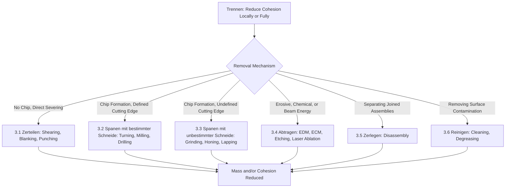

## Trennen: Separating and Material-Removal Operations

### Definition and Scope

*Trennen* is the third main group (Hauptgruppe 3) in the DIN 8580 manufacturing process classification standard, defined as the change of shape of a workpiece by **reducing cohesion**, either locally or completely, between adjacent regions of material. Unlike Umformen (which conserves both mass and cohesion) or Urformen (which creates cohesion), Trennen operations decrease mass, decrease cohesion, or both — the material removed or separated no longer forms part of the finished workpiece. The German term translates directly as "separating."

Trennen encompasses far more than conventional chip-forming machining: it is the DIN 8580 umbrella for any process whose defining mechanism is the deliberate loss of material continuity, whether that occurs through mechanical chip removal, cutting without chip formation, disassembly of a joined structure, or reduction of surface material.

### Position Within DIN 8580

**Key Points**

- **Hauptgruppe 1 (Urformen)**: cohesion created from nothing
- **Hauptgruppe 2 (Umformen)**: cohesion and mass both conserved
- **Hauptgruppe 3 (Trennen)**: cohesion and/or mass reduced
- **Hauptgruppe 4 (Fügen)**: cohesion and mass increased by combining parts
- **Hauptgruppe 5 (Beschichten)**: mass added at a surface
- **Hauptgruppe 6 (Stoffeigenschaftändern)**: internal properties changed, shape/mass largely unaffected
- The defining test for Trennen: material present in the workpiece before the operation is either removed entirely (as chips, dross, vapor, or scrap) or has its internal cohesion locally severed (as in a cut or crack) such that the workpiece is no longer a single continuous body in that region

### The Six Subgroups of Trennen (DIN 8580)

DIN 8580 subdivides Trennen according to the **mechanism by which cohesion is reduced**:

- **3.1 Zerteilen (dividing/severing)**: separation without chip formation — shearing, blanking, punching, sawing without material loss as chips (in the pure sense), splitting
- **3.2 Spanen mit geometrisch bestimmter Schneide (machining with geometrically defined cutting edge)**: chip-forming processes using tools of known, defined cutting-edge geometry — turning, milling, drilling, planing, broaching
- **3.3 Spanen mit geometrisch unbestimmter Schneide (machining with geometrically undefined cutting edge)**: chip-forming processes using tools/media whose individual cutting geometry is not precisely defined — grinding, honing, lapping, abrasive blasting
- **3.4 Abtragen (erosive/ablative removal)**: material removed through erosive, chemical, or energy-beam mechanisms without conventional mechanical cutting — EDM (electrical discharge machining), electrochemical machining (ECM), chemical etching, laser/beam ablation
- **3.5 Zerlegen (disassembling)**: separation of previously joined components back into individual parts — disassembly operations
- **3.6 Reinigen (cleaning)**: removal of unwanted adhering material (contamination, oxide layers, residues) from a surface — degreasing, deburring by removal, surface cleaning

[Unverified: subgroup boundaries and inclusion of Reinigen as a full Trennen subgroup vary somewhat across DIN 8580 edition years; the conceptual mechanism-based division into severing, defined-edge cutting, undefined-edge cutting, erosive removal, disassembly, and cleaning is the standard structure referenced in German manufacturing engineering curricula]

### Classification Logic Diagram (svg_diagram)

### Representative Processes by Subgroup

#### 3.1 Zerteilen (Dividing)

- **Shearing**: sheet or bar severed between two blades under shear stress, without producing chips
- **Blanking**: shearing operation that produces a usable part (the blanked-out piece is the product, the surrounding skeleton is scrap)
- **Punching/piercing**: shearing operation that produces a hole (the removed slug is scrap, the surrounding material is the product) — blanking and punching are mechanically identical, distinguished only by which portion is retained
- **Sawing (as a dividing operation)**: separation of stock into pieces, though conventional sawing also removes material as chips and is sometimes cross-classified with 3.2

#### 3.2 Spanen mit geometrisch bestimmter Schneide (Defined-Edge Machining)

- **Turning**: single-point cutting tool removes material from a rotating workpiece to generate rotationally symmetric geometry
- **Milling**: rotating multi-tooth cutter removes material from a stationary or moving workpiece; subdivided into peripheral (slab) milling and face milling
- **Drilling**: rotating tool with defined cutting edges produces or enlarges a round hole along its axis
- **Planing and shaping**: single-point tool removes material via linear relative motion between tool and workpiece
- **Broaching**: multi-tooth tool with progressively larger teeth removes material in a single linear or rotary pass
- **Sawing (defined-edge variant)**: reciprocating, circular, or band saw blade with defined tooth geometry

#### 3.3 Spanen mit geometrisch unbestimmter Schneide (Undefined-Edge Machining)

- **Grinding**: bonded abrasive wheel with randomly oriented, geometrically undefined abrasive grains removes material at high cutting speed
- **Honing**: abrasive stones under controlled pressure produce precision bore geometry and surface finish, typically at low relative velocity
- **Lapping**: loose or fixed fine abrasive between a lap tool and workpiece produces extremely fine surface finish and flatness/form accuracy
- **Superfinishing**: fine abrasive stone with oscillating motion removes the amorphous/damaged surface layer left by prior machining, improving surface integrity
- **Abrasive blasting**: propelled abrasive particles remove material or surface contamination on impact

#### 3.4 Abtragen (Erosive/Ablative Removal)

- **Electrical Discharge Machining (EDM)**: controlled electrical sparks between electrode and workpiece erode material via localized melting/vaporization; subdivided into sinker EDM (shaped electrode) and wire EDM (continuously fed wire electrode)
- **Electrochemical Machining (ECM)**: controlled electrolytic dissolution removes material from the anodic workpiece, the reverse process of electroplating
- **Chemical milling/etching**: selective chemical dissolution of unmasked material, used for pocket-forming in aerospace panels and semiconductor pattern etching
- **Laser beam machining/ablation**: focused laser energy vaporizes or melts-and-ejects material; used for cutting, drilling, and marking
- **Electron beam machining**: focused electron beam energy ablates material, typically under vacuum
- **Water jet cutting (abrasive and pure)**: high-pressure water (with or without entrained abrasive) erodes a cutting path through the workpiece

#### 3.5 Zerlegen (Disassembling)

- Includes mechanical disassembly of bolted, riveted, or press-fit assemblies, and destructive or non-destructive separation of previously joined (Fügen) components for maintenance, recycling, or rework

#### 3.6 Reinigen (Cleaning)

- Includes degreasing, ultrasonic cleaning, chemical descaling, and mechanical deburring/deflashing where the objective is removal of unwanted adhering material rather than shaping the primary geometry

### Governing Mechanics: Chip Formation and Cutting Mechanics

**Key Points**

- Subgroups 3.2 and 3.3 (chip-forming machining) share a common mechanical basis: a wedge-shaped cutting edge (defined in 3.2, statistically distributed in 3.3) shears material ahead of it, forming a chip via localized plastic shear along a shear plane
- The **specific cutting energy** (energy required to remove a unit volume of material) generally increases as chip thickness decreases and as the cutting edge becomes less geometrically defined, which is why grinding (undefined edge, very small chip thickness per grain) requires substantially higher specific energy than turning (defined edge, larger chip thickness) for the same material [Unverified: exact specific energy values are highly material- and parameter-dependent]
- Subgroup 3.4 (Abtragen) processes are fundamentally distinct from 3.2/3.3 in that no mechanical shear or chip formation occurs — material removal proceeds via localized melting, vaporization, or dissolution, making these processes largely insensitive to material hardness, a key advantage for hardened tool steels, carbides, and superalloys

### Material Removal Rate Relationship

For conventional chip-forming machining (3.2/3.3), material removal rate (MRR) is a function of cutting parameters:

$$MRR = v_c \cdot f \cdot a_p$$

where $v_c$ is cutting speed, $f$ is feed rate, and $a_p$ is depth of cut. This relationship underlies process planning, cycle time estimation, and tool life optimization (commonly via the Taylor tool life equation, $v_c T^n = C$).

### Distinguishing Trennen from Related DIN 8580 Groups

**Key Points**

- **Trennen vs. Umformen**: Trennen removes or severs material (mass decreases or cohesion is locally broken); Umformen redistributes material without removing any of it — the same visual outcome (e.g., a hole) can arise from punching (Trennen, 3.1) or from piercing/extrusion of a hole via plastic flow (Umformen), and classification depends strictly on whether mass was removed
- **Trennen vs. Beschichten**: these are near-opposite operations in a mass-balance sense; Trennen removes material from a surface, Beschichten adds it — some processes (e.g., certain etch-then-deposit semiconductor sequences) use both in immediate succession as complementary steps
- **Trennen vs. Fügen**: Zerlegen (3.5, disassembling) is the direct inverse operation of Fügen (joining); classifying disassembly under Trennen rather than as "reverse Fügen" reflects DIN 8580's mass/cohesion-based logic rather than a process-lineage-based logic

### Practical Example

**Example**

A manufacturer producing a precision aerospace turbine disk slot might use **wire EDM** (Trennen, subgroup 3.4, Abtragen) rather than **milling** (Trennen, subgroup 3.2) specifically because the disk material is a nickel-based superalloy with high hardness and poor machinability by conventional cutting tools. Both processes fall under the same DIN 8580 main group (Trennen, since both remove material and reduce workpiece mass), but the subgroup distinction reflects a fundamentally different removal mechanism — mechanical shear versus electrical erosion — with direct consequences for achievable tolerance, surface integrity (recast layer in EDM vs. residual stress in milling), and cycle time.

### Conclusion

Trennen unifies an unusually broad set of processes — from sawing to laser ablation to component disassembly — under a single classification logic: the deliberate reduction of material cohesion, whether through mechanical severing, chip formation with defined or undefined cutting edges, energy-beam or chemical erosion, structural disassembly, or surface cleaning. Its six subgroups are organized by removal *mechanism* rather than by industry application, which is why processes as different as punching sheet metal and etching a semiconductor wafer share a common DIN 8580 parent group, while superficially similar processes (drilling vs. EDM hole-making) are separated into distinct subgroups based on whether material is removed mechanically or through erosive/chemical action.

**Related Topics**

- Cutting tool geometry and the mechanics of orthogonal cutting
- Tool wear mechanisms and Taylor's tool life equation
- Abrasive grain characteristics and grinding wheel specification (grit, bond, structure)
- Recast layer and heat-affected zone formation in EDM and laser cutting
- Surface integrity comparison across defined-edge, undefined-edge, and erosive processes
- Umformen (DIN 8580 Hauptgruppe 2) as the mass-conserving contrast case
- Design for disassembly (DfD) and its relationship to Zerlegen
- Non-traditional machining process selection criteria (hardness, conductivity, geometry constraints)