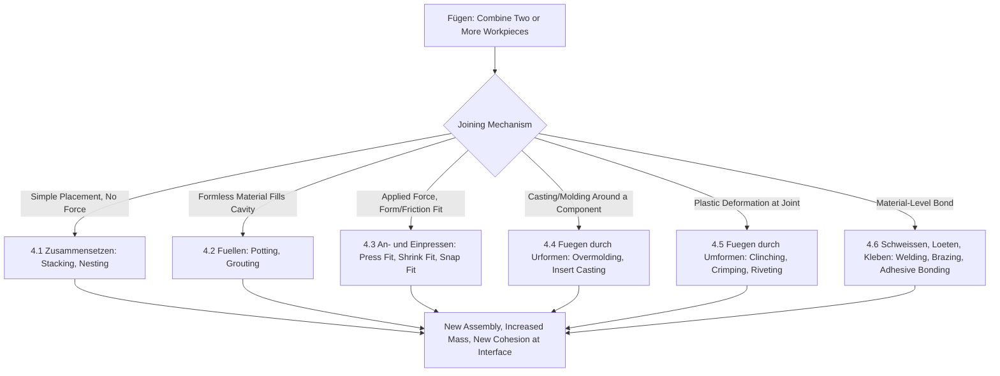

## Fügen: Joining of Two or More Workpieces

### Definition and Scope

*Fügen* is the fourth main group (Hauptgruppe 4) in the DIN 8580 manufacturing process classification standard, defined as the lasting combination of two or more workpieces of geometrically defined shape, or of such workpieces with formless material, to create a joint with a specified geometric form. The German term translates as "joining." Unlike Urformen (creating cohesion within a single formless material) or Umformen (reshaping one existing body), Fügen operates on **multiple discrete elements**, establishing new cohesion at their interface(s) while the mass of the overall assembly increases relative to any single input part.

DIN 8580 defines Fügen broadly enough to include not only permanent metallurgical or chemical bonds (welding, adhesive bonding) but also mechanical and form-based connections (bolting, press-fitting, folding seams), as long as the operation's defining purpose is to combine separate elements into a lasting assembly.

### Position Within DIN 8580

**Key Points**

- **Hauptgruppe 1 (Urformen)**: cohesion created within a single formless material
- **Hauptgruppe 2 (Umformen)**: cohesion and mass of a single body conserved, shape changed
- **Hauptgruppe 3 (Trennen)**: cohesion and/or mass reduced
- **Hauptgruppe 4 (Fügen)**: multiple bodies combined, cohesion newly established between them, total mass increased relative to any individual input
- **Hauptgruppe 5 (Beschichten)**: a special case conceptually adjacent to Fügen, where a formless or thin-layer material is bonded to a substrate rather than two comparable solid bodies being joined
- **Hauptgruppe 6 (Stoffeigenschaftändern)**: internal properties changed, no combination of separate bodies involved
- The distinguishing feature of Fügen relative to Beschichten (Hauptgruppe 5) is the DIN 8580 convention that Fügen typically joins two workpieces of comparable, geometrically defined form, while Beschichten applies a layer (often much thinner, or from a formless/liquid/vapor source) onto a substrate surface

### The Six Subgroups of Fügen (DIN 8580)

DIN 8580 subdivides Fügen according to the **nature of the joining mechanism**:

- **4.1 Zusammensetzen (assembling/composing)**: joining by simple spatial placement together without significant force or deformation — stacking, nesting, placing in a housing
- **4.2 Füllen (filling)**: joining by introducing a formless material into a cavity to connect or fix components — potting, filling gaps with grout or resin
- **4.3 An- und Einpressen (press-joining)**: joining via applied force that produces a form-fit and/or friction-fit connection without a separate fastening element — press fitting, shrink fitting, snap-fit assembly
- **4.4 Fügen durch Urformen (joining by primary shaping)**: joining accomplished by casting or molding one component around or onto another — insert molding, overmolding, casting-in of inserts
- **4.5 Fügen durch Umformen (joining by forming)**: joining accomplished via plastic deformation of one or both components at the joint — clinching, crimping, folded seaming, riveting via upsetting
- **4.6 Fügen durch Schweißen, Löten, Kleben (joining by welding, brazing/soldering, and adhesive bonding)**: joining via material-level bonding, forming a continuous or adhesive interface

[Unverified: DIN 8580 subgroup numbering for Fügen (4.1–4.6, sometimes extended with additional subdivisions for specific fastener types) varies slightly across cited secondary sources and edition years; the conceptual mechanism-based structure — assembling, filling, press-joining, joining-by-primary-shaping, joining-by-forming, and material-bonding — is the standard framework]

### Classification Logic Diagram (svg_diagram)

### Representative Processes by Subgroup

#### 4.1 Zusammensetzen (Assembling)

- **Stacking and nesting**: components placed together relying on gravity or geometric fit alone, typically as a precursor step to further fixing operations
- **Placing into a housing/frame**: components positioned within an enclosure without additional bonding force at this stage

#### 4.2 Füllen (Filling)

- **Potting and encapsulation**: liquid resin poured around electronic assemblies and cured, mechanically fixing and environmentally sealing components
- **Grouting**: cementitious or resin filler introduced to fix a machine base or structural element in place

#### 4.3 An- und Einpressen (Press-Joining)

- **Press fitting**: a shaft or pin forced into a slightly undersized bore, creating a friction-fit joint through elastic (and sometimes local plastic) interference
- **Shrink fitting**: an outer component is thermally expanded, the inner component inserted, and the assembly develops interference as the outer component cools and contracts
- **Snap-fit assembly**: a deflecting feature (typically on a polymer part) elastically deforms during insertion and returns to retain a mating feature

#### 4.4 Fügen durch Urformen (Joining by Primary Shaping)

- **Overmolding/insert molding**: a polymer is injection molded directly around a pre-placed metal or plastic insert, forming a bonded or mechanically interlocked joint as the melt solidifies
- **Casting-in of inserts**: metal inserts (threaded bushings, wear plates) are placed in a mold and molten metal is cast around them

#### 4.5 Fügen durch Umformen (Joining by Forming)

- **Clinching**: sheet layers are locally deformed by a punch and die to interlock mechanically without a separate fastener or heat
- **Crimping**: a ductile sleeve or terminal is plastically deformed around a wire or tube to create a mechanical and often electrically conductive joint
- **Folded/lock seaming**: sheet metal edges are folded over one another and pressed to form a mechanically interlocked seam (common in HVAC ducting, can-body seams)
- **Riveting (solid rivet upsetting)**: a rivet shank is plastically upset to form a second head, clamping the joined layers

#### 4.6 Schweißen, Löten, Kleben (Welding, Brazing/Soldering, Adhesive Bonding)

- **Fusion welding**: base materials are locally melted (with or without filler) and solidify together as a continuous joint — arc welding (MIG/MAG, TIG, stick), gas welding, resistance welding (spot, seam), laser beam welding, electron beam welding
- **Solid-state welding**: joint formed without melting, through pressure and/or friction — friction welding, friction stir welding, ultrasonic welding, explosion welding, diffusion bonding
- **Brazing**: filler metal with a melting point below that of the base metals is drawn into the joint gap by capillary action and solidifies, without melting the base materials
- **Soldering**: analogous to brazing but at lower temperatures (typically below 450°C), commonly used in electronics assembly
- **Adhesive bonding**: a polymeric adhesive forms a chemical and/or mechanical bond between substrates, curing via chemical reaction, solvent evaporation, or UV exposure

### Governing Considerations: Joint Design and Load Transfer

**Key Points**

- Joint selection within Fügen is driven by required **load transfer mechanism**: form-fit (press fitting, clinching, folded seams — load transferred through geometric interlock), force-fit (press fitting, shrink fitting — load transferred through friction from interference pressure), and material-bond (welding, brazing, adhesive bonding — load transferred through interatomic or interfacial chemical bonding)
- **Dissimilar material joining** often dictates subgroup selection: adhesive bonding, mechanical fastening (4.3/4.5), and brazing are frequently favored over fusion welding when joining metals with incompatible melting points or forming brittle intermetallic phases
- **Disassembly requirements** distinguish reversible joints (bolting via a separate fastener, typically classified under 4.3-adjacent mechanical fastening) from permanent joints (welding, structural adhesive bonding, riveting) — reversibility is a key process-selection criterion tying back to the Zerlegen (disassembling) subgroup of Trennen

### Weld Joint Strength Relationship

For fusion-welded joints, a simplified static strength check relates joint efficiency to base material strength:

$$\sigma_{joint} = \eta \cdot \sigma_{base}$$

where $\eta$ is the joint efficiency factor (accounting for weld metal properties, heat-affected zone softening, and geometric stress concentration), typically determined experimentally or from code-specified values for a given welding process and material combination [Unverified: efficiency factors are process, material, and qualification-standard dependent and should be verified against applicable design codes rather than assumed].

### Distinguishing Fügen from Related DIN 8580 Groups

**Key Points**

- **Fügen vs. Umformen**: subgroup 4.5 (Fügen durch Umformen) uses the same plastic deformation physics as Umformen (Hauptgruppe 2), but the classification differs by intent and outcome — Umformen reshapes a single body, while Fügen durch Umformen uses that deformation specifically to create a mechanical interlock between two or more separate bodies
- **Fügen vs. Urformen**: subgroup 4.4 (Fügen durch Urformen) likewise borrows Urformen's physics (casting, molding) but applies it to bond a formless material to a pre-existing solid insert, making the outcome an assembly of two initially separate elements rather than a single new body
- **Fügen vs. Beschichten**: the boundary is set by relative scale and role — joining two comparable structural components is Fügen, while depositing a thin functional or protective layer onto a substrate is Beschichten, even though some deposition physics (e.g., certain braze-like coating processes) can sit near this boundary
- **Fügen vs. Trennen**: Zerlegen (Trennen subgroup 3.5) is the direct inverse of Fügen; process planning for maintainability often requires designers to select a Fügen subgroup based explicitly on whether the corresponding Zerlegen operation must later be performed non-destructively

### Practical Example

**Example**

A manufacturer assembling an automotive battery enclosure might combine **friction stir welding** (Fügen, subgroup 4.6) for the primary aluminum housing seams, **self-piercing riveting** (Fügen, subgroup 4.5, Fügen durch Umformen) for joining the housing to a dissimilar-material cover, and **structural adhesive bonding** (Fügen, subgroup 4.6) along the flange for sealing and stiffness. The selection across three different subgroups within the same main group reflects differing priorities — friction stir welding avoids melting-related defects in aluminum, riveting accommodates the dissimilar steel-aluminum interface without forming brittle intermetallics, and adhesive bonding distributes load over a larger area while sealing against moisture ingress.

### Conclusion

Fügen is the DIN 8580 main group defined by the combination of multiple discrete elements into a lasting assembly, distinguished from the other main groups by its multi-body scope and by mass/cohesion increasing relative to any individual input component. Its six subgroups span an unusually wide mechanistic range — from simple placement (Zusammensetzen) through force-based interference joints, deformation-based interlocks, casting-based encapsulation, to true material bonding via welding, brazing, and adhesives — organized consistently by the **mechanism establishing the new interfacial cohesion** rather than by application or industry, which is why the same physical process (plastic deformation, or casting) can appear both under Umformen/Urformen when acting on a single body and under Fügen when its purpose is to join separate bodies.

**Related Topics**

- Weldability and metallurgical compatibility in dissimilar-metal joining
- Adhesive selection criteria (structural, sealing, thermal, and cure mechanism considerations)
- Joint design for fatigue performance in welded and mechanically fastened structures
- Design for disassembly and its relationship to reversible Fügen subgroups
- Trennen (DIN 8580 Hauptgruppe 3), particularly Zerlegen, as the inverse operation
- Beschichten (DIN 8580 Hauptgruppe 5) and the boundary between joining and coating
- Friction stir welding process parameters and tool design
- Quality assurance and non-destructive testing of welded and adhesive joints