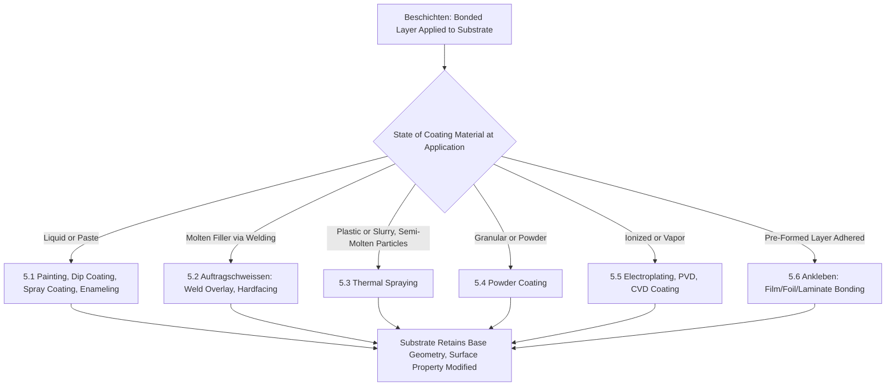

## Beschichten: Coating and Surface-Layer Application

### Definition and Scope

*Beschichten* is the fifth main group (Hauptgruppe 5) in the DIN 8580 manufacturing process classification standard, defined as the application of a firmly adhering layer of formless material onto the surface of a workpiece. The German term translates as "coating." The defining criterion is that a substrate — a pre-existing, geometrically defined solid body — receives a layer of new material bonded to its surface, where that layer originates from a formless state (liquid, vapor, ions, powder, or molten material) at the moment of application, echoing the same starting-material-state logic used in Urformen, but applied to surface deposition rather than freestanding-body formation.

DIN 8580 positions Beschichten as mass-increasing at a surface, analogous in that respect to Fügen, but distinguished from Fügen by scale and role: Beschichten typically applies a comparatively thin layer whose primary function (protection, appearance, electrical/thermal/tribological modification) is distinct from combining two structurally comparable components.

### Position Within DIN 8580

**Key Points**

- **Hauptgruppe 1 (Urformen)**: creates a freestanding solid body from formless material
- **Hauptgruppe 2 (Umformen)**: reshapes an existing body, mass and cohesion conserved
- **Hauptgruppe 3 (Trennen)**: reduces mass and/or cohesion
- **Hauptgruppe 4 (Fügen)**: combines multiple comparable solid bodies into an assembly
- **Hauptgruppe 5 (Beschichten)**: applies a bonded layer of formless material onto a substrate surface — mass increases at the surface, but the layer is not itself a freestanding body
- **Hauptgruppe 6 (Stoffeigenschaftändern)**: changes internal material properties without adding new material
- The key distinguishing test versus Urformen: the same physical deposition mechanism (e.g., CVD, electrodeposition) is classified as Urformen if the deposited material is later separated from its mandrel/substrate as a freestanding body, and as Beschichten if the deposited layer remains permanently bonded to and dependent on the substrate

### The Six Subgroups of Beschichten (DIN 8580)

DIN 8580 subdivides Beschichten according to the **state of the coating material at the point of application**, mirroring the Urformen subgroup logic:

- **5.1 Beschichten aus dem flüssigen oder pastenförmigen Zustand (from the liquid or paste-like state)**: painting, dip coating, spray coating, enameling
- **5.2 Beschichten durch Auftragschweißen (coating by weld overlay)**: cladding via fusion welding of a filler material onto a substrate — hardfacing, corrosion-resistant overlay welding
- **5.3 Beschichten aus dem plastischen oder breiigen Zustand (from the plastic or slurry state)**: thermal spraying of semi-molten particles, some slurry-based ceramic coatings
- **5.4 Beschichten aus dem körnigen oder pulverförmigen Zustand (from the granular or powder state)**: powder coating (electrostatic application and fusion), sintered powder coatings
- **5.5 Beschichten aus dem ionisierten oder dampfförmigen Zustand (from the ionized or vapor state)**: electroplating, physical vapor deposition (PVD), chemical vapor deposition (CVD) as a coating (not freestanding-body) process, thermal/vacuum evaporation
- **5.6 Beschichten durch Ankleben (coating by adhering a pre-formed layer)**: application of pre-manufactured films, foils, or laminates bonded to a substrate — laminating a protective film, applying a veneer

[Unverified: subgroup numbering and exact terminology for Beschichten vary somewhat across DIN 8580 edition years and secondary sources; the state-of-coating-material organizing principle, directly parallel to the Urformen subgroup logic, is the consistent conceptual structure]

### Classification Logic Diagram (svg_diagram)

### Representative Processes by Subgroup

#### 5.1 From the Liquid/Paste State

- **Spray painting/coating**: liquid coating atomized and propelled onto a substrate, solidifying via solvent evaporation or curing
- **Dip coating**: substrate immersed in a liquid coating bath and withdrawn, leaving a controlled-thickness film
- **Electrophoretic deposition (e-coat)**: charged paint particles in a liquid bath are deposited onto an electrically biased substrate, common for automotive corrosion-protection primers
- **Enameling**: a glass-based frit suspension is applied and fused at high temperature onto a metal substrate

#### 5.2 Coating by Weld Overlay (Auftragschweißen)

- **Hardfacing**: a wear-resistant alloy is deposited via arc or laser welding onto a substrate surface subject to abrasive or erosive wear
- **Corrosion-resistant overlay welding**: a corrosion-resistant alloy (e.g., stainless or nickel-based) is weld-deposited onto a lower-cost structural substrate, common in pressure vessel and piping applications

#### 5.3 From the Plastic/Slurry State

- **Thermal spraying**: feedstock (wire, powder, or rod) is melted or semi-melted by a flame, plasma, arc, or high-velocity gas stream and propelled onto the substrate, solidifying rapidly on impact; subdivided by heat/velocity source into flame spraying, plasma spraying, High-Velocity Oxy-Fuel (HVOF) spraying, arc spraying, and cold spraying (cold spraying is a notable exception, depositing particles via kinetic energy alone without melting)
- **Slurry coating**: a ceramic or metallic particle slurry is applied and subsequently dried/sintered

#### 5.4 From the Granular/Powder State

- **Electrostatic powder coating**: dry polymer powder is electrostatically charged and attracted to a grounded substrate, then fused in an oven to form a continuous film
- **Sintered powder coatings**: powder applied and consolidated via sintering rather than melting

#### 5.5 From the Ionized/Vapor State

- **Electroplating**: metal ions in an electrolytic bath are reduced and deposited onto a conductive substrate under applied current, forming a bonded metallic layer (chromium, nickel, zinc, gold plating)
- **Electroless plating**: metal deposition via autocatalytic chemical reduction without applied external current, useful for coating non-conductive substrates after activation
- **Physical Vapor Deposition (PVD)**: source material is vaporized (via sputtering, thermal evaporation, or cathodic arc) in a vacuum and condenses onto the substrate; used for hard, wear-resistant coatings (TiN, TiAlN) and decorative/optical thin films
- **Chemical Vapor Deposition (CVD)**: gaseous precursors react at or near the substrate surface, depositing a solid film via chemical reaction; used for hard coatings on cutting tools, semiconductor thin-film deposition, and diamond-like carbon coatings
- **Vacuum/thermal evaporation**: source material is heated under vacuum until it vaporizes and condenses on a cooler substrate, forming a thin film

#### 5.6 Coating by Adhering a Pre-Formed Layer

- **Laminating**: a pre-manufactured film or sheet is bonded to a substrate using adhesive, heat, or pressure, without the coating material passing through a liquid/vapor/powder application step at the point of bonding
- **Foil/veneer application**: decorative or protective foils and wood veneers bonded to a substrate surface

### Governing Considerations: Adhesion Mechanism and Layer Function

**Key Points**

- Coating adhesion mechanisms fall into three general categories: **mechanical interlocking** (thermal spray coatings bonding into substrate surface roughness), **metallurgical/chemical bonding** (weld overlay, electroplating, CVD forming true interatomic bonds), and **adhesive bonding** (laminated films relying on a separate adhesive layer)
- Coating function drives subgroup selection: **wear resistance** (hardfacing, PVD hard coatings), **corrosion protection** (galvanizing/zinc electroplating, paint systems, corrosion-resistant overlay welding), **thermal barrier** (thermal spray ceramic coatings on turbine components), **electrical function** (conductive plating, insulating dielectric films), and **decorative/appearance** (paint, decorative PVD, enameling)
- **Coating thickness ranges** vary by orders of magnitude across subgroups: PVD/CVD thin films are typically 1–10 micrometers, electroplating ranges from sub-micrometer to tens of micrometers, thermal spray coatings typically 0.1–several millimeters, and weld overlay cladding can range from millimeters to over a centimeter [Unverified: specific thickness ranges are process- and application-dependent]

### Coating Residual Stress Relationship

Coating processes involving thermal cycling (thermal spray, weld overlay, some PVD/CVD processes) generate residual stress due to the mismatch in coefficient of thermal expansion (CTE) between coating and substrate:

$$\sigma_{residual} \approx \frac{E_{coating}}{1-\nu} (\alpha_{substrate} - \alpha_{coating}) \Delta T$$

where $E$ is elastic modulus, $\nu$ is Poisson's ratio, $\alpha$ is CTE, and $\Delta T$ is the temperature change from deposition to service condition. This relationship informs coating/substrate material pairing to minimize delamination risk [Unverified: this is a simplified representative relationship; actual residual stress states in real coatings involve additional factors such as deposition-sequence stress, intrinsic growth stress, and multi-layer effects].

### Distinguishing Beschichten from Related DIN 8580 Groups

**Key Points**

- **Beschichten vs. Urformen**: identical deposition physics (electroforming/electroplating, CVD) is classified into either group solely based on whether the deposited material is later separated from its substrate as a freestanding body (Urformen) or remains permanently bonded to it (Beschichten)
- **Beschichten vs. Fügen**: Beschichten subgroup 5.6 (Ankleben, adhering a pre-formed layer) uses mechanisms similar to adhesive bonding within Fügen; the distinguishing convention is that Beschichten applies a thin, function-oriented layer to a substrate, while Fügen joins two structurally comparable, load-bearing components
- **Beschichten vs. Trennen**: some Abtragen (Trennen 3.4) processes, such as electrochemical machining, are the direct reverse of electroplating (Beschichten 5.5) — one removes ions from a workpiece anodically, the other deposits ions onto a workpiece cathodically, illustrating that DIN 8580's main-group boundary tracks the direction of mass change rather than the underlying physics
- **Beschichten vs. Stoffeigenschaftändern**: some surface treatments (nitriding, carburizing) modify near-surface composition without adding a distinct new layer of bulk material, and are classified under Stoffeigenschaftändern (Hauptgruppe 6) rather than Beschichten, since no new external layer with independent geometry is created

### Practical Example

**Example**

A manufacturer producing cutting tool inserts might apply a **PVD TiAlN coating** (Beschichten, subgroup 5.5) rather than **weld overlay** (subgroup 5.2) specifically because the required coating thickness (a few micrometers) and hardness (exceeding 3000 HV) demand a vapor-phase deposition process capable of fine thickness control and extreme hardness, which weld overlay — suited to millimeter-scale, comparatively softer wear-resistant claddings — cannot achieve. The subgroup selection is therefore driven directly by the required layer thickness, hardness, and substrate thermal sensitivity (PVD processes typically operate at substantially lower substrate temperatures than fusion-based overlay welding).

### Conclusion

Beschichten is the DIN 8580 main group defined by the application of a bonded surface layer originating from a formless coating material, organized — like its conceptual counterpart Urformen — by the physical state of that material at the point of deposition: liquid/paste, molten weld-filler, plastic/slurry, granular/powder, ionized/vapor, or a pre-formed adhered layer. Its boundary with Urformen (same physics, different outcome: bonded vs. freestanding) and with Fügen (thin functional layer vs. structurally comparable joined component) illustrates a recurring theme across DIN 8580: classification tracks the *role and fate* of the material relative to the finished part, not merely the equipment or energy source used to apply it.

**Related Topics**

- Coating adhesion testing methods (scratch test, pull-off test, bend test)
- Thermal spray process comparison (flame, plasma, HVOF, cold spray) and porosity control
- PVD vs. CVD coating selection for cutting tool applications
- Corrosion protection system design (galvanic coatings, barrier coatings, sacrificial anodes)
- Urformen (DIN 8580 Hauptgruppe 1) and the freestanding-vs-bonded classification boundary
- Stoffeigenschaftändern (DIN 8580 Hauptgruppe 6) as the contrast case for surface treatments without added layers
- Coating thickness measurement techniques (eddy current, magnetic induction, cross-sectional microscopy)
- Residual stress management in multilayer coating systems