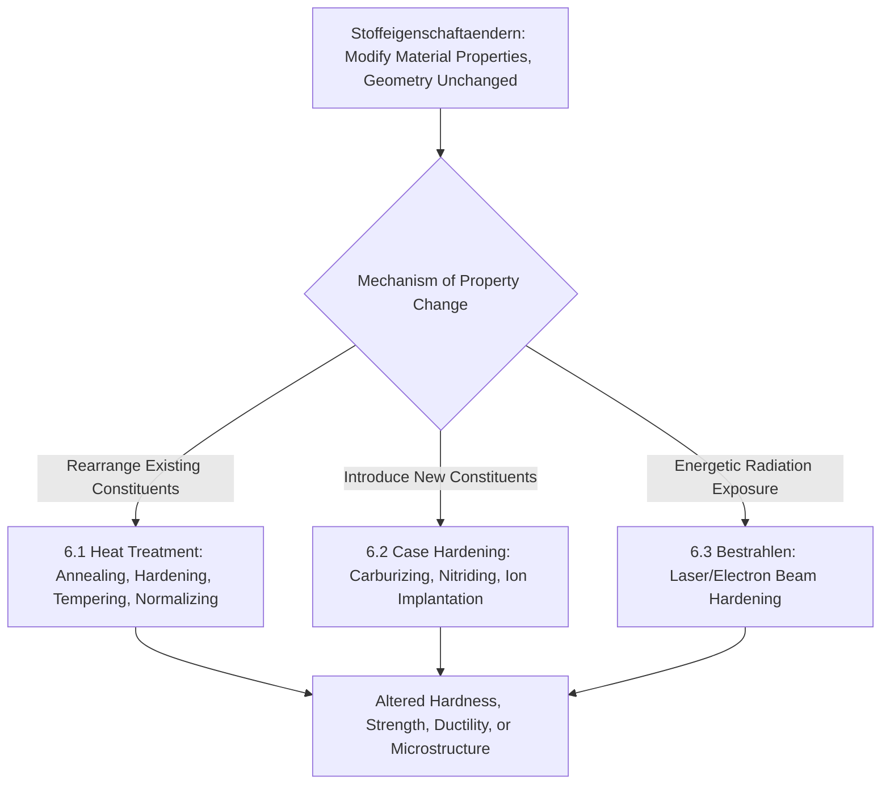

## Stoffeigenschaft Ändern: Changing Material Properties

### Definition and Scope

*Stoffeigenschaftändern* is the sixth and final main group (Hauptgruppe 6) in the DIN 8580 manufacturing process classification standard, defined as the deliberate change of a workpiece's material properties without a primary intent to change its macroscopic geometric shape. The German term translates as "changing material properties" (literally "changing substance properties"). Unlike the preceding five main groups, which are all organized around geometric form and mass/cohesion balance, Stoffeigenschaftändern is organized around the **microstructural, chemical, or physical state** of the material itself — hardness, strength, ductility, electrical conductivity, magnetic behavior, and surface chemistry are the target variables, not shape.

DIN 8580 positions this group as the necessary complement to the other five: a workpiece may pass through Urformen, Umformen, Trennen, Fügen, and Beschichten operations to achieve its final geometry, but Stoffeigenschaftändern operations (heat treatment, surface hardening, property-modifying irradiation) are frequently interleaved within that sequence to achieve the required internal material state independent of, or in coordination with, geometric processing steps.

### Position Within DIN 8580

**Key Points**

- **Hauptgruppe 1 (Urformen)**: geometry created from formless material
- **Hauptgruppe 2 (Umformen)**: geometry changed, mass and cohesion conserved
- **Hauptgruppe 3 (Trennen)**: geometry changed via mass/cohesion reduction
- **Hauptgruppe 4 (Fügen)**: geometry changed by combining bodies
- **Hauptgruppe 5 (Beschichten)**: geometry marginally changed by adding a bonded surface layer
- **Hauptgruppe 6 (Stoffeigenschaftändern)**: geometry essentially unchanged; **internal or surface material state** is deliberately altered
- The distinguishing test: if the operation's primary success criterion is measured in hardness (HV, HRC), grain size, yield strength, electrical resistivity, or magnetic permeability rather than in dimensional tolerance, it belongs to Stoffeigenschaftändern, even if minor, unavoidable dimensional changes (e.g., quench distortion) occur as a side effect

### The Three Subgroups of Stoffeigenschaftändern (DIN 8580)

DIN 8580 subdivides this group according to the **mechanism used to alter properties**:

- **6.1 Verfestigen durch Umlagern von Stoffteilchen (strengthening by rearranging material constituents)**: property change achieved by reconfiguring existing microstructural constituents without adding or removing material — heat treatment (annealing, hardening, tempering, normalizing), strain hardening effects considered from a metallurgical (rather than shape-change) perspective, precipitation hardening
- **6.2 Verfestigen durch Einbringen von Stoffteilchen (strengthening by introducing material constituents)**: property change achieved by introducing additional atoms/particles into the existing material, typically at or near the surface — case hardening processes (carburizing, nitriding, carbonitriding), ion implantation
- **6.3 Verändern der Stoffeigenschaften durch Bestrahlen (changing material properties by irradiation)**: property change achieved via energetic radiation exposure without necessarily adding or removing material constituents — electron beam surface hardening, laser transformation hardening, certain irradiation-induced property modifications

[Unverified: exact DIN 8580 subgroup numbering (6.1–6.3, sometimes cited with additional subdivisions) and precise German terminology vary across cited secondary sources and edition years; the three-way mechanism-based division — rearranging existing constituents, introducing new constituents, and radiation-based modification — is the standard conceptual structure referenced in German manufacturing engineering education]

### Classification Logic Diagram (svg_diagram)

### Representative Processes by Subgroup

#### 6.1 Verfestigen durch Umlagern von Stoffteilchen (Rearranging Constituents)

- **Annealing**: workpiece heated and slow-cooled to reduce hardness, relieve internal stress, refine grain structure, or restore ductility after cold working; subdivided into full annealing, stress-relief annealing, process annealing, and spheroidizing annealing
- **Quench hardening**: steel heated into the austenitic range and rapidly cooled (quenched), transforming austenite to martensite and substantially increasing hardness and strength at the cost of ductility
- **Tempering**: previously quench-hardened steel reheated to a temperature below the transformation range, reducing brittleness and relieving internal stress while retaining most of the hardness gain
- **Normalizing**: steel heated above the transformation range and air-cooled, producing a more uniform, refined grain structure than as-cast or as-forged conditions
- **Precipitation hardening (age hardening)**: a supersaturated solid solution is aged (naturally or artificially at elevated temperature) to precipitate fine second-phase particles that impede dislocation motion, increasing strength — the primary strengthening mechanism for many aluminum, nickel, and titanium alloys
- **Solution annealing**: alloy heated to dissolve precipitates into a homogeneous solid solution, typically followed by rapid quenching to retain that solution state, often as the first step preceding precipitation hardening

#### 6.2 Verfestigen durch Einbringen von Stoffteilchen (Introducing Constituents)

- **Carburizing**: carbon atoms diffused into the surface of a low-carbon steel at elevated temperature, followed by quenching, producing a hard, wear-resistant case over a tough, ductile core
- **Nitriding**: nitrogen atoms diffused into a steel surface at relatively low temperature (typically without subsequent quenching), forming hard nitride compounds; produces less distortion than carburizing due to the lower processing temperature and absence of a quench step
- **Carbonitriding**: combined diffusion of carbon and nitrogen, applied at intermediate temperatures between carburizing and nitriding
- **Boriding (boronizing)**: boron atoms diffused into a metal surface, forming extremely hard boride compounds, used for severe wear applications
- **Ion implantation**: ions accelerated to high energy and embedded directly into a substrate surface, modifying near-surface composition and properties without significant thermal diffusion

#### 6.3 Verändern der Stoffeigenschaften durch Bestrahlen (Irradiation-Based Modification)

- **Laser transformation hardening**: a focused laser beam rapidly heats a localized surface region into the austenitic range, followed by rapid self-quenching via conduction into the surrounding cool bulk material, producing a hardened surface layer without a separate quenchant
- **Electron beam hardening**: analogous to laser hardening, using a focused electron beam as the heat source, typically under vacuum
- **Induction hardening** (commonly grouped conceptually alongside 6.3-type localized surface hardening, though technically electromagnetic induction rather than beam irradiation): an alternating magnetic field induces eddy currents that rapidly heat a surface layer, followed by immediate quenching

### Governing Mechanics: Diffusion and Transformation Kinetics

**Key Points**

- Subgroup 6.2 (case hardening) processes are governed by **diffusion kinetics**, where case depth grows approximately with the square root of time at a given temperature: $x \propto \sqrt{Dt}$, where $D$ is the temperature-dependent diffusion coefficient and $t$ is time — this relationship underlies process time estimation for achieving a target case depth
- Subgroup 6.1 heat treatment processes involving phase transformation (quench hardening) are governed by **Time-Temperature-Transformation (TTT) diagrams** and **Continuous-Cooling-Transformation (CCT) diagrams**, which define the cooling rate required to achieve a target microstructure (martensite, bainite, pearlite) for a given alloy composition
- Subgroup 6.3 processes are distinguished from conventional 6.1 heat treatment primarily by **localization and self-quenching**: the energy input is confined to a thin surface layer, and the surrounding cool bulk material acts as an internal heat sink, eliminating the need for external quenchant media and typically producing lower overall part distortion

### Hardenability Relationship

The depth to which a steel can be hardened by quenching (hardenability, distinct from maximum achievable surface hardness) is commonly characterized using the Jominy end-quench test, and correlates with alloy content through empirical relationships. A simplified representation of case depth growth in diffusion-based surface hardening (subgroup 6.2) is:

$$x = k\sqrt{Dt}$$

where $x$ is case depth, $D$ is the diffusion coefficient (itself following an Arrhenius temperature dependence, $D = D_0 e^{-Q/RT}$), $t$ is treatment time, and $k$ is a geometry/concentration-dependent constant [Unverified: this is a simplified representative relationship; real case-hardening kinetics involve concentration-dependent diffusivity and are typically characterized empirically for a given steel grade and process].

### Distinguishing Stoffeigenschaftändern from Related DIN 8580 Groups

**Key Points**

- **Stoffeigenschaftändern vs. Beschichten**: both subgroup 6.2 (introducing constituents) and Beschichten can modify a surface, but the distinguishing test is whether a new, distinct external layer with its own geometry is created (Beschichten) versus whether existing surface material is chemically modified in place through diffusion without adding a geometrically separate layer (Stoffeigenschaftändern) — nitriding changes the composition of the existing steel surface, while PVD coating adds a new TiN layer on top of it
- **Stoffeigenschaftändern vs. Umformen**: cold working (a Umformen operation) does increase hardness and strength via strain hardening as a side effect, but this is classified under Umformen because the *primary intent* is geometric shape change; if the same strain-hardening mechanism were deliberately induced without geometric intent (e.g., shot peening primarily for residual-stress/fatigue benefit rather than shape change), classification can shift toward Stoffeigenschaftändern-adjacent treatment, illustrating that DIN 8580 classification depends on primary process intent, not merely on which physical mechanisms are activated
- **Stoffeigenschaftändern vs. Urformen**: solidification during casting (Urformen) does establish an as-cast microstructure, but subsequent heat treatment of that same casting to modify its properties (solution annealing, aging) is a separate, distinct Stoffeigenschaftändern operation performed after the Urformen step is complete

### Practical Example

**Example**

A manufacturer producing an automotive gear might process a low-carbon steel blank through **hobbing** (Trennen, gear tooth cutting), then **carburizing followed by quench hardening** (Stoffeigenschaftändern, subgroups 6.2 and 6.1 in sequence), then **grinding** (Trennen) to achieve final tooth geometry and surface finish after the distortion introduced by heat treatment. The carburizing/hardening step changes no significant macroscopic geometry (the gear teeth retain their cut profile, aside from minor distortion) but transforms a soft, easily-cut low-carbon steel into a component with a hard, wear-resistant case and a tough core capable of withstanding cyclic gear-mesh loading — a property transformation that chip-forming machining alone cannot achieve, illustrating why Stoffeigenschaftändern exists as an independent main group rather than being absorbed into the geometry-defining groups.

### Conclusion

Stoffeigenschaftändern stands apart from the other five DIN 8580 main groups by shifting the classification axis from geometry and mass/cohesion balance to internal material state. Its three subgroups — rearranging existing microstructural constituents (heat treatment), introducing new constituents (case hardening), and radiation-based localized modification (laser/electron beam hardening) — provide a mechanism-based taxonomy for property-change operations that are typically interleaved with, rather than substituted for, the geometry-defining operations of Urformen, Umformen, Trennen, Fügen, and Beschichten within a complete manufacturing process chain.

**Related Topics**

- Iron-carbon phase diagram and its role in heat treatment process design
- Time-Temperature-Transformation (TTT) and Continuous-Cooling-Transformation (CCT) diagrams
- Jominy end-quench test and hardenability characterization
- Quench distortion prediction and minimization strategies
- Case depth measurement and specification (effective case depth conventions)
- Residual stress generation in surface hardening processes and its fatigue-life benefit
- Beschichten (DIN 8580 Hauptgruppe 5) and the boundary between surface modification and layer addition
- Full DIN 8580 process chain design: sequencing Stoffeigenschaftändern operations relative to geometry-defining steps