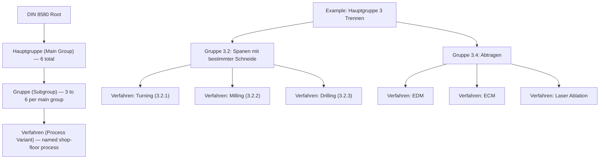

## Subgroup and Process-Variant Structure Within Each Main Group

### Definition and Scope

DIN 8580 does not stop at the six main groups (Hauptgruppen) covered individually in the preceding sections. Beneath each main group, the standard applies a **consistent hierarchical decomposition** — main group → subgroup (Gruppe) → process variant (Verfahren) — that allows every named manufacturing process in German industrial practice to be traced to a unique position in the taxonomy. This section addresses that hierarchical architecture itself: how subgroups are numbered, how individual process variants nest beneath them, and how the decomposition logic remains structurally consistent even though the *criterion* used to define subgroups differs from one main group to the next.

Understanding this structure is essential because it explains why, for example, "turning" and "milling" are both DIN 8580 process variants nested under the same subgroup (Spanen mit geometrisch bestimmter Schneide) within Trennen, while superficially similar processes like drilling (defined-edge) and EDM hole-making (erosive) are separated at the subgroup level despite producing visually identical features.

### The Three-Level Hierarchy

**Key Points**

- **Level 1 — Hauptgruppe (main group)**: one of six groups (1 Urformen, 2 Umformen, 3 Trennen, 4 Fügen, 5 Beschichten, 6 Stoffeigenschaftändern), each defined by its effect on mass and cohesion
- **Level 2 — Gruppe (subgroup)**: typically 3–6 subgroups per main group, each defined by a *mechanism* or *material-state* criterion specific to that main group (e.g., stress state for Umformen, cutting-edge definition for Trennen, coating-material state for Beschichten)
- **Level 3 — Verfahren (process variant)**: the individually named, practically applied process (turning, MIG welding, electroplating, quench hardening) — this is the level at which shop-floor terminology actually lives
- A numbering convention (e.g., 3.2.1, 3.2.2 for individual turning/milling variants under Trennen subgroup 3.2) is used in the full DIN 8580 document to give each process variant a unique locator, though the specific numeric codes are less commonly memorized than the conceptual hierarchy itself

### Why the Subgroup Criterion Changes Between Main Groups

**Key Points**

- **Urformen subgroups** are organized by the **physical state of the starting formless material** (liquid, plastic/paste, granular/powder, gas/vapor, ionized, accumulated fiber)
- **Umformen subgroups** are organized by the **dominant stress state** imposed during deformation (compressive, tensile-compressive, tensile, bending, shear)
- **Trennen subgroups** are organized by the **removal mechanism** (severing without chips, defined-edge chip formation, undefined-edge chip formation, erosive/chemical removal, disassembly, cleaning)
- **Fügen subgroups** are organized by the **joining mechanism** (simple placement, filling, press-joining, joining-by-primary-shaping, joining-by-forming, material-level bonding)
- **Beschichten subgroups** are organized by the **state of the coating material at deposition** (liquid/paste, weld-overlay, plastic/slurry, powder, ionized/vapor, pre-formed adhered layer) — directly mirroring the Urformen logic, but applied to a substrate-bonded layer rather than a freestanding body
- **Stoffeigenschaftändern subgroups** are organized by the **mechanism of property change** (rearranging existing constituents, introducing new constituents, radiation-based modification)
- This variation is intentional: DIN 8580's authors selected whichever physical variable most usefully discriminates between practically distinct processes *within* that main group, rather than forcing every main group onto an identical secondary axis

### Hierarchical Structure Diagram (svg_diagram)

### Illustrative Cross-Section: Subgroup-to-Variant Mapping Across All Six Main Groups

| Main Group | Example Subgroup | Organizing Criterion | Example Process Variants |
| --- | --- | --- | --- |
| 1 Urformen | 1.1 (liquid state) | State of formless material | Sand casting, die casting, injection molding |
| 2 Umformen | 2.1 (Druckumformen) | Dominant stress state | Rolling, forging, extrusion |
| 3 Trennen | 3.2 (defined cutting edge) | Cutting-edge definition | Turning, milling, drilling |
| 4 Fügen | 4.6 (Schweißen/Löten/Kleben) | Joining mechanism | Arc welding, brazing, adhesive bonding |
| 5 Beschichten | 5.5 (ionized/vapor state) | State of coating material | Electroplating, PVD, CVD |
| 6 Stoffeigenschaftändern | 6.1 (rearranging constituents) | Property-change mechanism | Annealing, quench hardening, tempering |

### The Role of Process Variants (Verfahren) as the Practical Terminology Layer

**Key Points**

- Shop-floor and engineering terminology ("I need this part turned," "we're going to nitride this gear") almost always refers to the **Verfahren** level — the third and most granular tier — not the main group or subgroup
- A single subgroup can contain process variants with substantially different equipment, cost structures, and achievable tolerances despite sharing the same classification mechanism — for example, subgroup 3.2 (defined-edge machining) spans everything from a manual lathe (turning) to a five-axis CNC machining center (complex milling), unified only by the shared cutting-edge-definition criterion
- Process planning documents (route sheets, process plans) typically specify the Verfahren level directly, while the Hauptgruppe/Gruppe levels serve primarily as an organizing and communication framework for engineers reasoning across process families, for standards documentation, and for process-selection decision trees

### Practical Example: Tracing One Process Through the Hierarchy

**Example**

"Wire EDM" traces through the hierarchy as: **Hauptgruppe 3 (Trennen)** → because it removes material and reduces cohesion; **Gruppe 3.4 (Abtragen)** → because removal occurs via electrical erosion rather than mechanical cutting or shearing; **Verfahren: Wire EDM** → the specific named process using a continuously fed wire electrode, as distinct from its sibling variant **Verfahren: Sinker EDM**, which sits in the same subgroup but uses a shaped electrode instead. Both variants share the subgroup-level classification criterion (erosive removal via controlled electrical discharge) but differ substantially in tooling, achievable geometry, and typical application (wire EDM for 2D profile cutting and extrusion dies, sinker EDM for 3D cavity forming such as injection mold tooling).

### Cross-Main-Group Consistency Check

**Key Points**

- Despite differing subgroup criteria, every main group's subgroup structure answers the same underlying question at a conceptual level: **"by what mechanism does this operation achieve its main-group-level effect on mass/cohesion?"** — for Urformen and Beschichten, the mechanism is tied to material state; for Umformen, to stress state; for Trennen, to removal mechanism; for Fügen, to joining mechanism; for Stoffeigenschaftändern, to property-change mechanism
- This consistency is what allows an engineer trained in the DIN 8580 framework to correctly place an unfamiliar or emerging process (e.g., a novel additive manufacturing variant, an emerging composite consolidation technique) into the taxonomy by first asking the main-group-level question (does this create, conserve, reduce, or combine cohesion? does it add a bonded surface layer? does it change internal properties without geometric intent?) before descending to the subgroup-level mechanism question

### Conclusion

The DIN 8580 hierarchy's power lies not in memorizing every numbered subgroup, but in recognizing the two-step classification logic it embodies: first, identify the main group by asking how the operation affects mass and cohesion (or, for Beschichten and Stoffeigenschaftändern, its relationship to surface layers and internal properties); second, identify the subgroup by asking which specific mechanism, stress state, or material state governs the operation within that main group. Every named process variant in industrial practice — from sand casting to wire EDM to nitriding — occupies a unique, traceable position within this three-level structure, which is why DIN 8580 functions as a genuinely comprehensive classification framework rather than a simple enumerated list of common processes.

**Related Topics**

- Full DIN 8580 numbering conventions and official subgroup code tables
- Comparative mapping between DIN 8580 and ISO/ASTM manufacturing process taxonomies
- Using DIN 8580 as a process-selection decision-support framework
- Classifying emerging/hybrid processes (additive-subtractive hybrid manufacturing) within the DIN 8580 structure
- Process chain design: sequencing operations across multiple main groups for a complete part
- DIN 8580 as taught in German-language manufacturing engineering (Fertigungstechnik) curricula
- Relationship between DIN 8580 and downstream standards (DIN 8593 for Fügen detail, DIN 8590 for Beschichten detail)