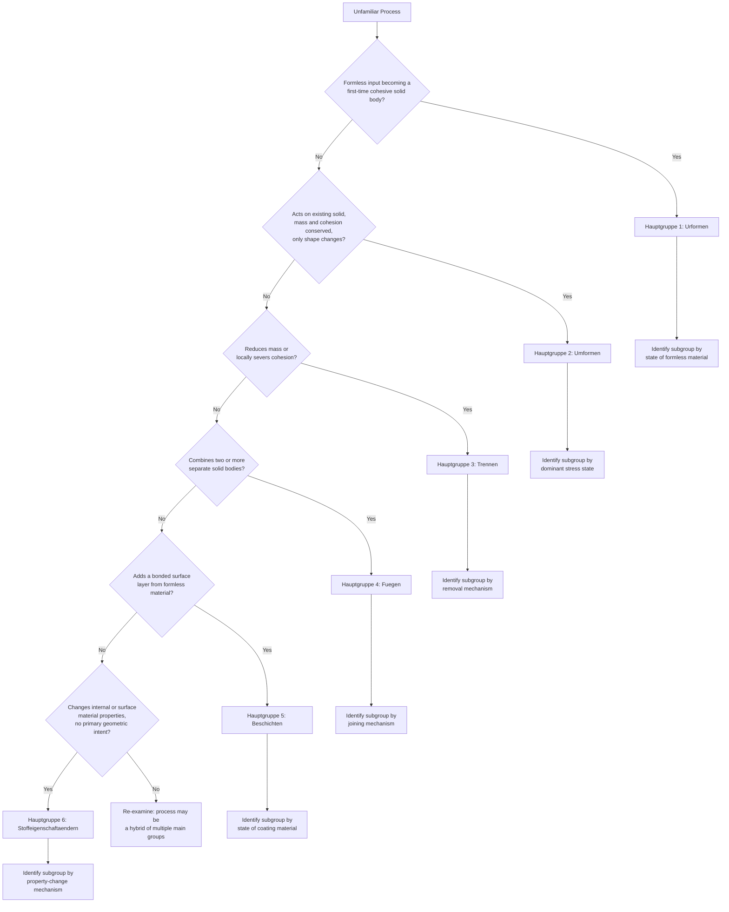

## Applying DIN 8580 to Classify an Unfamiliar Process

### Definition and Scope

This topic addresses the **methodology** for placing a previously unencountered, novel, or hybrid manufacturing process correctly within the DIN 8580 taxonomy, as distinct from memorizing the classification of already-named processes. Because DIN 8580 was formalized well before many contemporary process innovations (additive manufacturing, hybrid additive-subtractive machines, advanced surface-engineering techniques) existed, engineers regularly encounter processes with no pre-assigned classification and must derive one from first principles using the standard's own logical structure.

The methodology is a structured diagnostic procedure: a sequence of questions, asked in a fixed order, that narrows an unfamiliar process from "manufacturing operation of unknown type" down to a specific Hauptgruppe, Gruppe, and — where a clean fit exists — an analogous Verfahren.

### The Diagnostic Question Sequence

**Key Points**

- **Question 1 (mass and cohesion test)**: Does the operation start from a formless material and end with a cohesive solid body for the first time? → **Urformen**. Does it act on an already-cohesive solid, changing only its shape while conserving mass? → **Umformen**. Does it reduce mass and/or locally sever cohesion? → **Trennen**. Does it combine two or more separate, geometrically defined bodies into a new assembly, increasing mass relative to any one input? → **Fügen**. Does it add a bonded layer of formless material to an existing substrate's surface? → **Beschichten**. Does it change internal/surface material properties (hardness, composition, microstructure) without geometric shape change as the primary intent? → **Stoffeigenschaftändern**
- **Question 2 (mechanism test, main-group-specific)**: Once the main group is fixed, ask which subgroup-defining variable applies — state of starting/coating material (Urformen, Beschichten), dominant stress state (Umformen), removal mechanism (Trennen), joining mechanism (Fügen), or property-change mechanism (Stoffeigenschaftändern)
- **Question 3 (variant analogy test)**: Does the specific mechanism closely resemble an already-named Verfahren, differing mainly in scale, automation, or feedstock detail? If so, classify as a variant of that Verfahren. If the mechanism is genuinely novel at the subgroup level, document it as a new Verfahren entry within the identified Gruppe rather than forcing a false match

### Diagnostic Flowchart (svg_diagram)

### Worked Example 1: Classifying Laser Powder Bed Fusion (Metal 3D Printing)

**Example**

**Question 1**: Does laser powder bed fusion (LPBF) start from a formless material (loose metal powder) and end with a cohesive solid body, establishing cohesion for the first time? Yes — the powder bed has no cohesion before the laser scans it. → **Hauptgruppe 1: Urformen**.

**Question 2**: Within Urformen, which subgroup criterion applies? The starting material state is granular/powder. → **Gruppe 1.3 (Urformen aus dem körnigen oder pulverförmigen Zustand)**, the same subgroup that historically covers powder metallurgy pressing and sintering.

**Question 3**: Is LPBF a variant of an existing Verfahren, or a new one? While it shares the powder-state subgroup with conventional press-and-sinter powder metallurgy, its consolidation mechanism (localized laser melting and rapid resolidification, layer by layer, with no die compaction step) is mechanistically distinct enough that it is typically documented as a **new Verfahren** within Gruppe 1.3 rather than a variant of press-and-sinter. [Inference: this placement reflects a reasonable, commonly applied extension of the 1985-era DIN 8580 framework to a technology that postdates it; some contemporary references instead discuss additive manufacturing as warranting its own supplementary classification framework alongside DIN 8580 rather than being folded entirely into it]

### Worked Example 2: Classifying Friction Stir Additive Manufacturing (Hybrid Process)

**Example**

Friction stir additive manufacturing deposits material by plastically consolidating feedstock (rod or powder) onto a substrate using frictional heat and severe plastic deformation, building up a solid part layer by layer without melting.

**Question 1**: Is the feedstock formless before deposition? If using powder or unconsolidated rod stock fed into a rotating tool, the input lacks cohesion in its pre-deposition form, and cohesion is established for the first time as material is consolidated onto the growing part. This points toward **Urformen**. However, the deformation-dominated consolidation mechanism (severe plastic strain, analogous to friction stir welding) also has clear **Fügen** (joining, specifically joining-by-forming, subgroup 4.5) characteristics, since each new layer is being mechanically bonded to the previous one.

**Resolution**: This process illustrates a genuine classification ambiguity rather than a simple lookup. A defensible approach is to classify it primarily under **Fügen, subgroup 4.5 (Fügen durch Umformen)**, treating each deposition pass as joining new formless-but-immediately-consolidated material to the existing body via plastic deformation — reasoning that the *joining mechanism* (friction stir consolidation) is the operative classification criterion, analogous to how weld overlay cladding is classified under Beschichten (5.2) rather than Urformen, despite also "building up" material. [Speculation: reasonable engineers may classify hybrid deposition-consolidation processes like this differently depending on which aspect (material creation vs. layer-to-layer joining) they weight as primary; DIN 8580 itself does not explicitly resolve every hybrid case, since many such processes postdate the standard's core structure]

### Handling Genuine Ambiguity and Hybrid Processes

**Key Points**

- Some contemporary processes legitimately straddle two main groups because they combine mechanisms that DIN 8580's authors did not anticipate occurring simultaneously — additive-subtractive hybrid machine tools (integrating LPBF or directed energy deposition with in-process milling) combine Urformen and Trennen operations within a single machine cycle, and are best documented as a **process chain** spanning two main groups rather than forced into a single classification
- When ambiguity exists, the recommended practice is to classify **each distinct physical step** separately (deposition step → Urformen or Fügen; subsequent machining step → Trennen) rather than assigning one label to the combined cycle, preserving the standard's mechanism-based clarity at the cost of requiring a multi-entry description for genuinely hybrid equipment
- Directed Energy Deposition (DED) processes, which feed wire or powder feedstock into a melt pool created by a laser, electron beam, or arc, are commonly classified under **Beschichten subgroup 5.2 (Auftragschweißen/weld overlay)** when building onto an existing substrate for repair or cladding purposes, but shift toward an **Urformen** classification logic when used to build a complete freestanding part from a minimal base plate, again illustrating that classification depends on the *role* of the deposited material (bonded functional layer vs. body-defining bulk) rather than the deposition physics alone

### General Principles for Unfamiliar-Process Classification

**Key Points**

- **Prioritize physical effect over industry label**: marketing or industry terminology for a novel process (e.g., "3D printing," "cold spray additive manufacturing") should not drive classification; the underlying mass/cohesion effect should
- **Distinguish primary intent from side effects**: a process that incidentally changes hardness (like cold working during Umformen) is not thereby reclassified into Stoffeigenschaftändern if shape change remains the primary intent — apply the same primary-intent test used in Section 6 when separating strain hardening (Umformen side effect) from deliberate property-change operations
- **Resist forcing a single-group answer onto genuinely multi-step equipment**: modern hybrid machines are often better described as executing a *process chain* across main groups within one physical machine, rather than requiring an artificial single classification
- **Document reasoning, not just conclusion**: because DIN 8580 predates many modern processes, recording the diagnostic reasoning (which question resolved the classification, and why) is more valuable for future reference than the bare classification label alone, particularly for genuinely ambiguous or hybrid cases

### Conclusion

Classifying an unfamiliar manufacturing process under DIN 8580 is a structured diagnostic exercise rather than a lookup task: first apply the mass/cohesion test to fix the main group, then apply that main group's specific subgroup-defining criterion (material state, stress state, removal mechanism, joining mechanism, coating-material state, or property-change mechanism) to fix the subgroup, and finally determine whether the process is a genuine variant of an existing Verfahren or warrants documentation as a new one. Genuinely hybrid or ambiguous processes — increasingly common as additive, hybrid, and advanced surface-engineering technologies mature — are often best served by classifying each constituent physical step separately rather than forcing a single label onto the combined operation.

**Related Topics**

- Additive manufacturing process classification frameworks beyond DIN 8580 (ISO/ASTM 52900 terminology)
- Directed Energy Deposition (DED) process variants and their dual Beschichten/Urformen classification logic
- Hybrid additive-subtractive machine tool architecture and process chain documentation
- Historical evolution of DIN 8580 editions and incorporation of emerging processes
- Process chain design methodology across multiple DIN 8580 main groups
- Case studies in classifying nanotechnology and micro-manufacturing processes within legacy taxonomies
- Comparative analysis: DIN 8580 vs. CIRP (International Academy for Production Engineering) process classification approaches