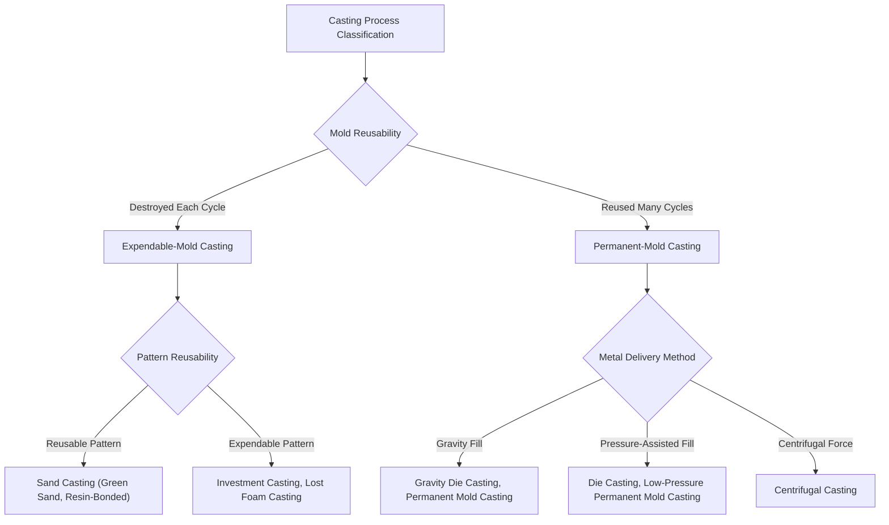

## Expendable-Mold Versus Permanent-Mold Classification

### Definition and Scope

Casting processes are most fundamentally divided by **mold reusability**: whether the mold is destroyed to extract the casting (expendable-mold casting) or survives intact for repeated use (permanent-mold casting). This single binary distinction is the primary organizing axis for casting process classification because it drives nearly every downstream engineering decision — achievable dimensional tolerance, minimum practical wall thickness, production volume economics, achievable geometric complexity, and tooling investment.

Both mold-reusability categories can process similar metals and produce broadly similar part families, meaning process selection within this classification is rarely dictated by material compatibility alone, but rather by the volume, precision, and geometric requirements of the specific application.

### The Two Primary Categories

**Key Points**

- **Expendable-mold casting**: the mold (and often the pattern) is destroyed or consumed during each casting cycle, requiring a new mold to be produced for every part; generally lower tooling cost, longer cycle times, greater geometric freedom (including internal passages via cores), and typically coarser achievable tolerances
- **Permanent-mold casting**: the mold (die) is a durable, reusable tool machined from tool steel or another high-temperature-resistant material, amortized over many production cycles; generally higher tooling cost, shorter cycle times, tighter achievable tolerances, and typically greater constraints on geometric complexity (particularly regarding undercuts and internal passages, which require collapsible or removable core mechanisms)

### Classification Diagram (svg_diagram)

### Expendable-Mold Processes in Detail

#### Expendable Mold, Reusable Pattern

- **Sand casting**: a reusable pattern is used to form a cavity in sand (green sand, chemically bonded sand, or shell sand); the mold is broken apart to remove the solidified casting, but the pattern is retained for the next cycle; subdivided by binder system into green sand (clay-bonded), resin/chemically-bonded sand, and shell molding (resin-coated sand shell)
- **Plaster mold casting**: gypsum-based plaster mold formed around a reusable pattern, used for non-ferrous alloys requiring fine surface detail and thin sections, limited by plaster's low thermal conductivity and inability to withstand ferrous casting temperatures
- **Ceramic mold casting**: a ceramic slurry mold formed around a reusable pattern (or in a flask lined with ceramic), offering better dimensional accuracy and surface finish than sand casting, suited to precision tooling and aerospace components

#### Expendable Mold, Expendable Pattern

- **Investment casting (lost-wax process)**: a wax (or sometimes polymer) pattern is coated with ceramic slurry to build a shell, then the pattern is melted/burned out, leaving a ceramic mold that is subsequently destroyed to extract the casting; both the pattern and the mold are consumed each cycle, enabling very high geometric complexity and excellent surface finish/tolerance relative to other expendable-mold processes
- **Lost foam casting (evaporative pattern casting)**: a polystyrene foam pattern, coated with a refractory wash, is embedded in unbonded sand; molten metal is poured directly onto the foam pattern, vaporizing it as the metal fills the cavity it previously occupied; eliminates the need for a separate mold-forming and pattern-removal step, and eliminates parting-line and core-related limitations since the sand requires no binder
- **Full-mold casting**: closely related to lost foam, using a foam pattern with bonded (rather than unbonded) sand

### Permanent-Mold Processes in Detail

#### Gravity-Fed Permanent Mold

- **Permanent mold casting (gravity die casting)**: molten metal is poured into a reusable metal mold under gravity alone, without external pressure; produces better mechanical properties and surface finish than sand casting due to the faster cooling rate against the metal mold, at the cost of higher tooling investment and generally simpler achievable geometry
- **Slush casting**: a variant of permanent mold casting where the mold is inverted and drained after a thin solidified shell forms against the mold wall, producing a hollow casting without a core — used for decorative or low-stress hollow parts

#### Pressure-Assisted Permanent Mold

- **Die casting**: molten metal is injected into a reusable steel die under high pressure (tens to hundreds of MPa); subdivided into hot-chamber die casting (injection mechanism submerged in the molten metal reservoir, suited to low-melting-point alloys like zinc, magnesium, and some aluminum alloys) and cold-chamber die casting (molten metal ladled into a separate shot chamber for each cycle, suited to higher-melting-point aluminum and copper-based alloys); characterized by very high production rates, excellent dimensional tolerance and surface finish, and thin achievable wall sections, but limited by die life, trapped-gas porosity, and difficulty producing large internal cavities without soluble or mechanically actuated cores
- **Low-pressure permanent mold casting**: molten metal is forced upward into an inverted die cavity using low air/gas pressure (typically under 1 bar) applied to a sealed holding furnace beneath the die, producing more controlled, laminar mold filling than high-pressure die casting, commonly used for aluminum automotive wheels
- **Squeeze casting**: molten metal solidifies under applied mechanical pressure within a die, combining aspects of casting and forging to achieve low porosity and enhanced mechanical properties compared to conventional die casting

#### Centrifugal Force-Assisted Permanent Mold

- **Centrifugal casting**: molten metal is poured into a rotating permanent mold, with centrifugal force distributing the metal against the mold wall; used for cylindrical, rotationally symmetric parts such as pipes, cylinder liners, and rings, and can eliminate the need for a core in hollow cylindrical geometries

### Comparative Analysis

| Characteristic | Expendable-Mold Casting | Permanent-Mold Casting |
| --- | --- | --- |
| Tooling cost | Low to moderate (pattern only, or pattern + shell tooling for investment) | High (machined die/mold) |
| Production volume suitability | Low to moderate (prototype through mid-volume) | Moderate to very high (amortizes tooling cost) |
| Achievable geometric complexity | High (cores enable complex internal passages; no ejection constraint) | Moderate (constrained by die-opening direction, undercuts require mechanical actuation) |
| Typical dimensional tolerance | Coarser (sand casting) to fine (investment casting) | Fine to very fine, especially die casting |
| Typical surface finish | Coarser (sand) to excellent (investment) | Good to excellent |
| Cycle time | Minutes to hours per casting | Seconds to minutes per casting |
| Achievable minimum wall thickness | Moderate to thin (investment casting can achieve thin sections) | Very thin (die casting) |
| Metal solidification rate | Slower (insulating mold materials) | Faster (thermally conductive metal mold), yielding finer grain structure |

### Governing Considerations: Why Mold Reusability Drives Everything Else

**Key Points**

- **Thermal conductivity mismatch** between expendable mold materials (sand, ceramic, typically low thermal conductivity) and permanent mold materials (tool steel, typically high thermal conductivity) directly governs solidification rate, which in turn governs grain size, as-cast mechanical properties, and achievable minimum section thickness before premature freezing prevents complete mold filling
- **Tooling amortization economics** dictate the volume threshold at which permanent-mold processes become cost-competitive with expendable-mold processes: at low volumes, the high fixed die cost of die casting or permanent mold casting cannot be recovered, favoring sand or investment casting; at high volumes, the much lower per-part cycle time and labor content of die casting overcomes its higher fixed cost [Unverified: the specific break-even volume is highly application-, alloy-, and geometry-dependent and should be calculated per project rather than assumed from general rules of thumb]
- **Geometric ejection constraints** are largely absent in expendable-mold casting (since the mold is destroyed, arbitrarily complex undercuts and internal passages via sand or ceramic cores are achievable) but are a first-order design constraint in permanent-mold casting (the casting must be ejectable from a rigid, reusable die, requiring draft angles and limiting undercuts unless mechanically actuated or soluble core mechanisms are employed)

### Practical Example

**Example**

A manufacturer producing 200 prototype turbine housing castings with complex internal cooling passages would select **investment casting** (expendable mold, expendable pattern) because the low production volume cannot justify die tooling costs, and the ceramic shell mold — destroyed each cycle — imposes no ejection constraint on the intricate internal geometry. The same manufacturer, upon receiving a production order for 500,000 units per year of a simplified version of that housing, would transition to **high-pressure die casting** (permanent mold, pressure-assisted), accepting a substantial upfront die investment in exchange for cycle times measured in seconds rather than hours, and would likely redesign the part to eliminate internal passages incompatible with die ejection, replacing them with drilled or cored features added in a subsequent machining operation.

### Conclusion

The expendable-mold versus permanent-mold distinction is the foundational classification axis in casting process selection because mold reusability directly determines the economic volume threshold, achievable geometric complexity, and solidification-driven material properties of a casting process. Expendable-mold processes (sand, investment, lost foam) trade higher per-unit tooling/pattern cost and longer cycle times for greater geometric freedom and lower fixed capital investment, while permanent-mold processes (die casting, permanent mold casting, centrifugal casting) trade a substantial upfront die investment and constrained ejection geometry for dramatically faster cycle times, finer achievable tolerances, and superior as-cast mechanical properties from faster solidification.

**Related Topics**

- Solidification rate and its effect on as-cast grain structure (Chvorinov's rule and mold constant estimation)
- Core-making processes and core-box design for expendable-mold casting
- Die design principles for die casting (parting line, ejector placement, cooling channel layout)
- Porosity formation mechanisms in die casting (gas entrapment, shrinkage porosity) and mitigation strategies
- Investment casting shell-building process sequence and refractory selection
- Economic break-even analysis between expendable and permanent mold tooling investment
- Hybrid approaches: semi-permanent mold casting using expendable sand cores within a permanent die