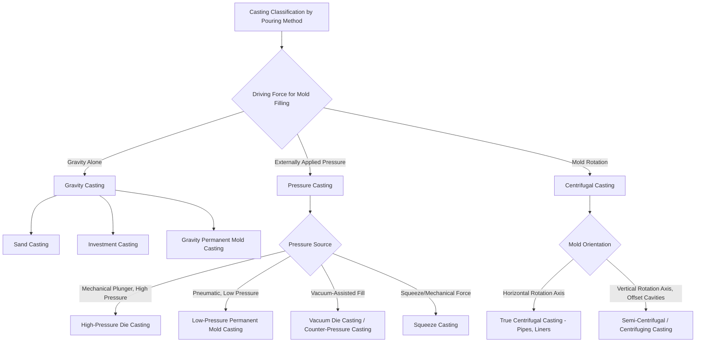

## Classification by Pouring Method: Gravity, Pressure, Centrifugal

### Definition and Scope

A second major axis for classifying casting processes — orthogonal to the expendable-mold-versus-permanent-mold distinction — is the **force mechanism driving molten metal into the mold cavity**. This classification asks not what the mold is made of, but how the metal gets from its molten source into the cavity: under the influence of gravity alone, under externally applied pressure, or under centrifugal force generated by mold rotation. This force mechanism directly governs mold-filling velocity, turbulence, achievable thin-section fillability, and the resulting porosity and inclusion characteristics of the casting.

Because pouring method and mold type are independent classification axes, most pouring methods can, in principle, be applied to either expendable or permanent molds, though certain combinations (high-pressure die casting with a permanent die; gravity pouring with sand molds) are far more common in industrial practice than others.

### The Three Primary Pouring Method Categories

**Key Points**

- **Gravity casting**: molten metal flows into the mold cavity solely under the influence of gravitational force, with no externally applied pressure assisting the fill
- **Pressure casting**: molten metal is forced into the mold cavity under externally applied pressure, generated mechanically (die casting plunger), pneumatically (low-pressure casting), or via vacuum assistance (vacuum-assisted casting)
- **Centrifugal casting**: molten metal is distributed against the mold wall by centrifugal force generated by rotating the mold itself during and/or after pouring, rather than by any independent driving pressure pushing the metal

### Classification Diagram (svg_diagram)

### Gravity Casting Processes in Detail

- **Sand casting (gravity-poured)**: the overwhelmingly dominant pouring method for sand casting; metal flows through a gating system (sprue, runner, gate) driven entirely by the height of metal in the pouring basin, with gating design calculated to control fill velocity and minimize turbulence-induced defects (mold erosion, air entrapment, oxide inclusion)
- **Investment casting (gravity-poured)**: molten metal poured into the preheated ceramic shell under gravity, sometimes assisted by vacuum to improve fill of thin sections (a hybrid case bridging gravity and vacuum-assisted pressure casting)
- **Gravity die/permanent mold casting**: molten metal poured into a reusable metal die under gravity alone; the absence of externally applied pressure limits achievable thin-wall fillability compared to die casting, but produces lower porosity due to the slower, less turbulent fill

### Pressure Casting Processes in Detail

- **High-pressure die casting**: molten metal is injected into a steel die at high velocity and pressure (commonly tens to over a hundred MPa) using a hydraulically driven plunger; subdivided into hot-chamber (injection unit immersed in the molten metal reservoir, used for low-melting alloys) and cold-chamber (metal ladled into a shot sleeve for each cycle, used for higher-melting aluminum and copper alloys) configurations; the rapid, high-pressure fill enables very thin wall sections and fine surface detail but tends to entrain air, producing internal porosity that generally precludes subsequent heat treatment or welding of the casting without specialized (e.g., vacuum die casting) process variants
- **Low-pressure permanent mold casting**: a sealed furnace beneath an inverted die is pressurized with air or inert gas (typically well under 1 bar) to force molten metal upward through a riser tube into the die cavity; the controlled, laminar fill produces lower porosity and better mechanical properties than high-pressure die casting, at the cost of longer cycle times, commonly used for aluminum wheels and other automotive structural components
- **Vacuum-assisted die casting**: a vacuum is drawn on the die cavity immediately before or during metal injection, reducing trapped air and gas porosity relative to conventional high-pressure die casting, enabling limited heat treatment or improved mechanical properties in the resulting casting
- **Counter-pressure casting**: metal is drawn upward into an inverted mold under a pressure differential, with gas pressure applied above the molten metal reservoir and a lower (but still elevated) pressure maintained in the mold chamber, used for high-integrity castings such as aerospace and automotive components requiring low porosity
- **Squeeze casting**: molten metal is introduced into an open die and then solidified under high mechanical pressure applied by a closing punch/die, combining casting and forging-like consolidation to minimize porosity and refine grain structure

### Centrifugal Casting Processes in Detail

- **True centrifugal casting**: a cylindrical or tubular mold rotates about its own longitudinal axis (typically horizontal or slightly inclined) while molten metal is poured in; centrifugal force distributes the metal uniformly against the mold's inner wall, forming a hollow cylindrical casting (pipe, cylinder liner, ring) without requiring a core; higher-density inclusions and impurities, being lighter than the base metal in relative centrifugal effect terms, tend to migrate toward the bore (inner) surface, which is often subsequently machined away
- **Semi-centrifugal casting**: the mold rotates about a central vertical axis, with cavities arranged around the rotation axis rather than concentric with it; centrifugal force assists mold filling and feeding of the cavities, but the resulting parts are not inherently hollow cylinders and may require a central core for details near the rotation axis
- **Centrifuging (true centrifuging)**: multiple small mold cavities are arranged around a central sprue on a rotating table, with centrifugal force driving metal outward through radial runners into each cavity, effectively multiplying the number of parts produced per pour and improving fill of thin or intricate cavities that gravity pouring alone would not adequately fill

### Comparative Analysis

| Characteristic | Gravity Casting | Pressure Casting | Centrifugal Casting |
| --- | --- | --- | --- |
| Fill velocity | Low to moderate | High (die casting) to low (low-pressure) | Moderate, radially directed |
| Typical porosity level | Low to moderate | Higher (high-pressure die casting) unless vacuum-assisted | Low, with impurity segregation toward bore |
| Achievable thin sections | Moderate | Excellent (die casting) | Good for cylindrical geometry |
| Geometric applicability | General purpose, any shape | General purpose (die casting), general (low-pressure) | Primarily rotationally symmetric/hollow geometry |
| Typical equipment cost | Low to moderate | High (die casting machine and die) | Moderate to high (rotating machine and mold) |
| Typical cycle time | Minutes to hours | Seconds to minutes | Minutes |

### Governing Considerations: Fill Velocity, Turbulence, and Porosity

**Key Points**

- **Reynolds number and critical fill velocity**: mold-filling turbulence, and the resulting oxide entrainment and air entrapment, is governed by the fill velocity relative to a critical threshold; gravity-driven sand casting gating systems are specifically designed (often using Bernoulli-equation-based sprue/runner/gate area ratios) to keep fill velocity below this critical threshold, while high-pressure die casting deliberately exceeds it to achieve rapid fill of thin sections before premature solidification, accepting increased porosity as a tradeoff [Unverified: specific critical velocity values are alloy-dependent and are typically determined empirically or via casting simulation software rather than a single universal threshold]
- **Centrifugal force and segregation**: in true centrifugal casting, the centrifugal force field causes density-based segregation during solidification, which can be leveraged intentionally (concentrating desirable microstructure toward the outer wall) or must be accounted for as a source of compositional non-uniformity, particularly in alloys with a wide freezing range
- **Pressure-assisted feeding and shrinkage porosity**: pressure casting methods (squeeze casting, low-pressure, counter-pressure) that maintain applied pressure throughout solidification (not just during initial fill) can continue feeding liquid metal into the mold cavity as the casting shrinks during solidification, substantially reducing shrinkage porosity compared to gravity casting, where feeding relies solely on riser design and gravitational head

### Practical Example

**Example**

A manufacturer producing cast iron pipe for water distribution would select **true centrifugal casting** over gravity sand casting because the process is inherently suited to the pipe's hollow cylindrical geometry (eliminating the need for a sand core to form the bore), produces a denser, more uniform microstructure due to the pressure exerted by centrifugal force during solidification, and achieves higher production rates through continuous or semi-continuous rotating-mold operation. The same manufacturer producing an intricately shaped cast iron valve body, lacking rotational symmetry, would instead use **gravity sand casting**, since centrifugal casting offers no geometric advantage for a non-cylindrical shape and would introduce unnecessary process complexity and cost.

### Conclusion

Classification by pouring method — gravity, pressure, or centrifugal — captures a distinct and complementary dimension of casting process selection from the mold-reusability axis, centering on how the driving force for mold filling shapes achievable fill velocity, porosity characteristics, and geometric suitability. Gravity casting remains the default choice for general-purpose, non-cylindrical geometries where moderate porosity is acceptable; pressure casting methods trade increased equipment complexity for either very rapid thin-section fill (high-pressure die casting) or superior feeding and reduced porosity (low-pressure, squeeze, counter-pressure casting); and centrifugal casting exploits mold rotation specifically for rotationally symmetric, typically hollow geometries where it offers both a manufacturing and a metallurgical advantage.

**Related Topics**

- Gating system design and Bernoulli-equation-based sprue/runner/gate sizing
- Porosity formation mechanisms: gas porosity versus shrinkage porosity versus turbulence-entrained oxide
- Riser design and feeding distance calculations (Chvorinov's rule applications)
- Vacuum die casting and its role in enabling heat-treatable die-cast aluminum components
- Segregation phenomena in centrifugal casting and their metallurgical implications
- Casting simulation software and mold-filling velocity prediction
- Combining pouring method and mold-type classification axes for complete process selection