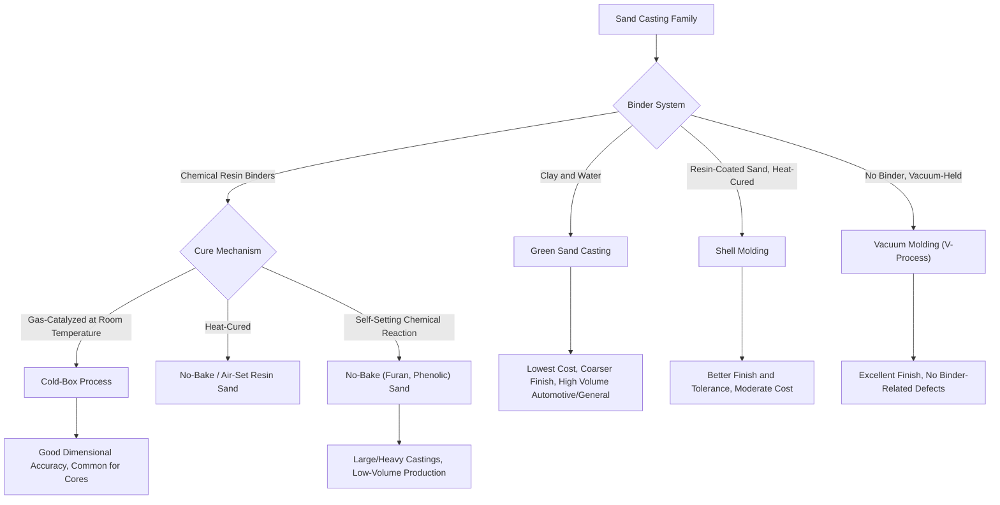

## Sand-Casting Family and Variants

### Definition and Scope

Sand casting is a family of expendable-mold, gravity- (or occasionally vacuum-) poured casting processes in which the mold cavity is formed within a mass of granular sand held together by a binder system. It is the single most widely used casting process family globally, owing to its low tooling cost, broad alloy compatibility, and scalability from single prototype castings to high-volume automated production. This topic classifies the sand-casting family by its **binder system and mold-forming method**, the variable that most directly distinguishes one sand-casting variant from another in achievable tolerance, surface finish, production rate, and cost.

All sand-casting variants share the same fundamental process architecture — pattern, mold, cores, gating system, pouring, shakeout — but differ substantially in how the sand is bonded and consolidated around the pattern.

### The Core Sand-Casting Process Architecture

**Key Points**

- **Pattern**: a reusable, oversized (to account for solidification shrinkage) replica of the desired casting, used to form the mold cavity; may be made of wood, metal, or polymer depending on production volume and required durability
- **Mold**: typically formed in two halves (cope, the upper half, and drag, the lower half) contained within a flask; the pattern is withdrawn after the sand is packed and bonded around it, leaving the cavity
- **Core**: a separately formed sand body, typically bonded with a different (often stronger) binder system than the main mold, inserted into the mold cavity to form internal passages or undercuts that the pattern alone cannot produce
- **Gating system**: the network of channels (pouring basin, sprue, runner, gate) through which molten metal flows from the pour point into the mold cavity, designed to control fill velocity and minimize turbulence
- **Riser**: a reservoir of additional molten metal connected to the casting, designed to solidify last and feed liquid metal into the casting as it shrinks during solidification, preventing shrinkage porosity in critical sections

### Classification Diagram (svg_diagram)

### Green Sand Casting

**Key Points**

- **Composition**: sand (typically silica) mixed with clay (bentonite) as a binder and water to activate the clay's bonding properties; "green" refers to the moist, uncured state of the mold, not color
- **Advantages**: lowest material cost among sand-casting variants, sand is reclaimable and reusable after shakeout with minimal reconditioning, extremely well suited to high-volume automated molding lines (automotive engine blocks, brake components)
- **Limitations**: coarser surface finish and dimensional tolerance than resin-bonded systems, moisture content must be carefully controlled to avoid gas-related casting defects (pinholing from steam generation), lower mold strength limits achievable mold complexity and casting size compared to some resin-bonded systems

### Resin-Bonded (Chemically Bonded) Sand Casting

#### No-Bake (Air-Set) Processes

- **Furan no-bake**: sand mixed with furan resin and an acid catalyst, which cures at room temperature without external heat over a period of minutes to hours; commonly used for large, heavy castings and low-to-moderate production volumes where green sand's automated-line advantages are less relevant
- **Phenolic no-bake**: sand mixed with phenolic resin and a catalyst, curing similarly at room temperature; offers good dimensional stability and is used across a range of casting sizes

#### Cold-Box Processes

- **Cold-box (gas-cured) process**: sand mixed with a resin system is blown into a core box, then cured almost instantly by passing a catalyst gas (commonly a gaseous amine catalyst for phenolic-urethane systems) through the packed sand at room temperature; widely used specifically for **core production** due to its rapid cycle time and high dimensional accuracy, frequently paired with a green sand main mold

#### Heat-Cured Processes

- **Shell molding (Croning process)**: sand pre-coated with a thermosetting phenolic resin is dumped or blown onto a heated metal pattern (typically 200–250°C), curing a thin (several millimeters) shell of bonded sand against the pattern surface; the shell is stripped from the pattern, and two shell halves are joined (often with adhesive or clamping) to form the complete mold; produces significantly better surface finish and dimensional tolerance than green sand casting, with lower sand consumption per casting, but at higher per-mold material and equipment cost, well suited to moderate-to-high volume production of small-to-medium precision castings (camshafts, small engine components)

### Vacuum Molding (V-Process)

- Unbonded, dry sand is held in place around a pattern using a vacuum drawn through a thin plastic film lining the mold cavity, rather than any chemical or clay binder; the vacuum is maintained throughout mold filling and solidification, then released to allow easy sand removal at shakeout
- Eliminates binder-related defects entirely (no gas evolution from binder decomposition, no binder-related sand expansion defects), yields excellent surface finish and dimensional accuracy, and allows essentially unbonded sand to be reclaimed with minimal processing
- Requires careful process control of vacuum integrity and film handling, and is generally slower-cycling than automated green sand lines, making it best suited to moderate-volume, precision-critical applications

### Comparative Analysis

| Variant | Binder/Mechanism | Relative Cost | Surface Finish | Dimensional Tolerance | Typical Production Volume |
| --- | --- | --- | --- | --- | --- |
| Green sand | Clay + water | Lowest | Coarse to moderate | Coarser | High volume, automated lines |
| No-bake (furan/phenolic) | Chemical, room-temp cure | Moderate | Moderate to good | Moderate | Low to moderate, large castings |
| Cold-box | Chemical, gas-cured | Moderate | Good | Good | Core production, moderate-high volume |
| Shell molding | Heat-cured resin-coated sand | Higher | Very good | Fine | Moderate to high volume, smaller castings |
| Vacuum molding (V-process) | Vacuum only, no binder | Moderate to higher | Excellent | Fine | Moderate volume, precision applications |

### Governing Considerations: Binder Selection and Casting Quality

**Key Points**

- **Gas defect susceptibility**: binder systems that decompose or release gas during pouring (green sand moisture, some organic resin systems) create a risk of gas-related porosity (pinholing) if venting is inadequate; vacuum molding's absence of any binder eliminates this failure mode entirely, which is a primary reason for its selection in gas-porosity-sensitive applications
- **Mold rigidity and dimensional accuracy**: higher-strength bonded systems (shell molding, cold-box, no-bake) resist mold wall movement and erosion from molten metal flow better than green sand, directly translating to tighter achievable dimensional tolerance and better repeatability across a production run
- **Sand reclamation economics**: green sand and vacuum-molding (unbonded) systems are the most readily reclaimable and reusable, while chemically bonded systems (no-bake, cold-box, shell) generally require more involved thermal or mechanical reclamation processes to break down cured resin before the sand can be reused, an important lifecycle cost and environmental consideration at scale [Unverified: reclamation cost and environmental impact figures vary substantially by specific resin chemistry, regional regulation, and reclamation technology employed]

### Practical Example

**Example**

A manufacturer producing 100,000 automotive brake caliper castings annually on an automated molding line would select **green sand casting**, since the process's low per-mold material cost and compatibility with high-speed automated molding, core-setting, pouring, and shakeout equipment outweigh its comparatively coarser tolerance — any critical dimensions (bore diameters, mating surfaces) are typically finished by subsequent machining regardless of the as-cast tolerance. A manufacturer producing 500 small precision camshaft castings for a specialty engine program would instead select **shell molding**, since the superior as-cast surface finish and dimensional accuracy reduce downstream machining allowance and cost at a volume too low to justify green sand's automated-line capital investment but high enough to amortize shell-molding's heated pattern tooling.

### Conclusion

The sand-casting family spans a range of binder systems and mold-forming methods — green sand, chemically bonded no-bake and cold-box resin systems, heat-cured shell molding, and binderless vacuum molding — each representing a different tradeoff among tooling/material cost, achievable surface finish and tolerance, cycle time, and suitability for automated high-volume production versus lower-volume precision work. Selecting among sand-casting variants is fundamentally a question of matching binder-system characteristics (cost, cure mechanism, achievable mold strength and accuracy, gas-defect susceptibility) to the specific volume, precision, and casting-size requirements of the application, rather than a choice between fundamentally different casting physics.

**Related Topics**

- Gating and riser design principles for sand casting
- Core-making processes and core-box design across binder systems
- Sand reclamation and reconditioning technology
- Casting defect diagnosis specific to sand casting (gas porosity, sand inclusion, penetration, veining)
- Pattern design allowances (shrinkage, draft, machining stock)
- Automated green sand molding line architecture (DISA-type high-pressure molding)
- Comparative process selection between sand casting and investment/die casting alternatives