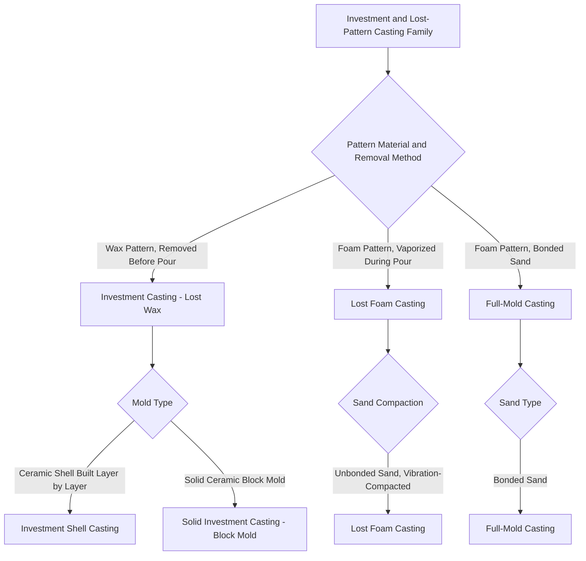

## Investment and Lost-Pattern Casting Family

### Definition and Scope

The investment and lost-pattern casting family comprises expendable-mold casting processes in which **both the pattern and the mold are consumed** during each production cycle, distinguishing this family from reusable-pattern expendable-mold processes like sand casting. The pattern — typically wax, polystyrene foam, or another sacrificial material — is either melted/burned out of a surrounding ceramic shell (investment casting) or vaporized directly by the incoming molten metal (lost foam casting). This dual consumption of pattern and mold is what enables the family's defining advantage: essentially unconstrained internal geometry, since there is no rigid pattern requiring withdrawal and no parting line requiring mold-half separation.

This topic classifies the family by **pattern material and mold-formation method**, the variable that most directly governs achievable surface finish, dimensional tolerance, and production economics across the family's variants.

### The Core Shared Process Logic

**Key Points**

- **Sacrificial pattern**: a pattern representing the final casting geometry (plus shrinkage allowance) is produced from a material that can later be removed without mechanical withdrawal — melted, burned, dissolved, or vaporized
- **Mold formation around the pattern**: a mold material is formed directly against the sacrificial pattern surface, either as a built-up ceramic shell (investment casting) or as packed sand surrounding an intact foam pattern (lost foam casting)
- **Pattern removal**: the pattern is eliminated from the mold either before pouring (investment casting, via a dewaxing/burnout step) or during pouring (lost foam casting, via vaporization by the incoming molten metal itself)
- **Consequence for geometric freedom**: because no rigid pattern must be mechanically withdrawn, this family can produce internal passages, thin fins, and complex undercuts that reusable-pattern processes (sand casting with cores, permanent mold casting) cannot achieve as readily or as cheaply

### Classification Diagram (svg_diagram)

### Investment Casting (Lost-Wax Process) in Detail

**Key Points**

- **Pattern production**: wax (or occasionally a sacrificial polymer) is injected into a reusable metal die to produce individual patterns; multiple patterns are then assembled onto a central wax sprue/runner system to form a "tree," maximizing the number of castings produced per shell-building and pouring cycle
- **Shell building**: the wax tree is repeatedly dipped into a ceramic slurry and coated with refractory stucco (sand), with each layer air-dried before the next is applied, building up a ceramic shell of sufficient thickness (typically several layers) to withstand the thermal and mechanical demands of pouring
- **Dewaxing**: the shell-coated tree is heated (commonly in an autoclave under steam pressure, or in a flash-fire furnace) to rapidly melt and remove the wax, leaving a hollow ceramic shell mold; rapid dewaxing methods are preferred to minimize thermal expansion stress on the fragile shell
- **Burnout/firing**: the dewaxed shell is fired at high temperature to remove residual wax and moisture and to develop the shell's final strength before pouring
- **Pouring**: molten metal is poured into the preheated ceramic shell, often under gravity, sometimes assisted by vacuum to improve fill of thin sections
- **Shell removal and finishing**: after solidification, the ceramic shell is broken away (via mechanical impact, vibration, or high-pressure water blasting), individual castings are cut from the tree, and gates/risers are ground off

### Lost Foam Casting in Detail

**Key Points**

- **Pattern production**: expanded polystyrene (EPS) foam patterns are molded, typically from pre-expanded foam beads fused within a reusable aluminum pattern die under heat and pressure; complex parts may be assembled from multiple foam sections bonded together
- **Refractory coating**: the assembled foam pattern (including gating system, also made of foam) is dipped or coated with a refractory wash to control surface finish and gas permeability during pouring
- **Sand embedding**: the coated foam pattern is placed in a flask and surrounded by unbonded (loose, no binder) dry sand, which is compacted around the pattern using vibration to ensure the sand fully supports the pattern's shape, including internal cavities
- **Pouring and simultaneous vaporization**: molten metal is poured directly onto the foam pattern; the heat of the metal vaporizes (technically decomposes/pyrolyzes) the polystyrene ahead of the advancing metal front, with the metal occupying the volume the foam previously filled, while gaseous decomposition products escape through the permeable refractory coating and sand
- **Key process distinction**: because the sand is unbonded, there is no parting line, no core-setting operation, and no separate pattern-withdrawal step — the entire mold complexity is defined by the foam pattern's geometry, which can include undercuts and internal passages impossible in conventional sand casting without cores

### Full-Mold Casting

- Closely related to lost foam casting, using a foam pattern with **bonded** (rather than unbonded, vibration-compacted) sand; generally used for larger, heavier castings where bonded sand's greater mold rigidity is advantageous, at some cost to the geometric freedom advantage that unbonded sand provides in classic lost foam casting

### Comparative Analysis

| Characteristic | Investment Casting | Lost Foam Casting |
| --- | --- | --- |
| Pattern material | Wax (reusable die-injected) | Expanded polystyrene foam |
| Pattern removal | Melted/burned out before pouring | Vaporized during pouring |
| Mold material | Built-up ceramic shell | Unbonded sand |
| Typical surface finish | Excellent | Good to very good |
| Typical dimensional tolerance | Very fine | Fine |
| Achievable wall thickness | Thin, excellent detail replication | Thin to moderate |
| Typical part size range | Small to medium (though large parts are possible) | Small to large, well suited to bigger castings |
| Tooling cost | Wax injection die (moderate to high) | Foam pattern die (moderate) |
| Typical production volume | Low to high, scalable via tree assembly | Moderate to high |
| Common applications | Aerospace turbine blades, jewelry, dental, firearms components | Automotive engine blocks/heads, complex industrial castings |

### Governing Considerations: Why This Family Achieves Superior Geometric Freedom

**Key Points**

- **Absence of a rigid, withdrawn pattern**: unlike sand casting (reusable pattern must be pulled from the mold, limiting undercuts without cores) or die casting (die halves must separate along a parting line), this family's patterns are eliminated in place, meaning the final mold cavity geometry is not constrained by any mechanical withdrawal direction
- **Elimination of the parting line**: investment casting shells and lost-foam sand molds are formed as effectively monolithic cavities around the pattern, avoiding parting-line-related flash, mismatch, and the associated finishing operations common to permanent-mold and multi-part sand mold processes
- **Thermal decomposition management (lost foam specific)**: lost foam casting's unique dependence on in-situ foam vaporization introduces process-specific defect risks — incomplete foam decomposition products can become entrapped as carbon-related defects (folds, misruns, or gas porosity) if pouring temperature, pouring rate, or foam density/coating permeability are not properly controlled, a consideration with no direct analog in investment casting's pre-pour wax removal approach [Unverified: specific defect rates and optimal process parameter windows are alloy- and pattern-density-dependent and are typically established through process-specific trials]

### Practical Example

**Example**

A manufacturer producing aerospace turbine blades with intricate internal cooling channels would select **investment casting**, since the ceramic shell process achieves the fine surface finish, tight dimensional tolerance, and thin-wall fidelity required for airfoil aerodynamic surfaces, while soluble or ceramic cores incorporated into the wax pattern assembly allow the complex internal cooling geometry to be cast directly rather than machined. A manufacturer producing a V8 automotive engine block would instead select **lost foam casting**, since the large part size, moderate (rather than extreme) precision requirements, and need for complex internal water-jacket and oil-passage geometry are well matched to lost foam's ability to eliminate cores entirely for such passages while remaining economical at automotive production volumes.

### Conclusion

The investment and lost-pattern casting family is unified by a single defining characteristic — both pattern and mold are consumed each cycle — which is precisely what unlocks its shared advantage of near-unconstrained internal and external geometric complexity, free from the parting-line and pattern-withdrawal limitations that govern sand casting and permanent-mold processes. Within the family, investment casting (wax pattern, ceramic shell, pattern removed before pouring) and lost foam/full-mold casting (foam pattern, sand mold, pattern vaporized during pouring) diverge primarily in achievable surface finish and part-size economics, making investment casting the preferred choice for small, high-precision components and lost foam casting the preferred choice for larger, moderately precise components with complex internal passages.

**Related Topics**

- Wax pattern injection die design and shrinkage compensation
- Ceramic shell slurry formulation and stucco/refractory selection
- Dewaxing methods and their effect on shell integrity (steam autoclave vs. flash-fire)
- Foam pattern density and coating permeability effects on lost foam casting quality
- Core design for internal cooling passages in investment-cast turbine components
- Gating and riser design differences between investment and lost foam casting
- Casting defect diagnosis specific to lost-pattern processes (carbon defects, misrun, shell cracking)