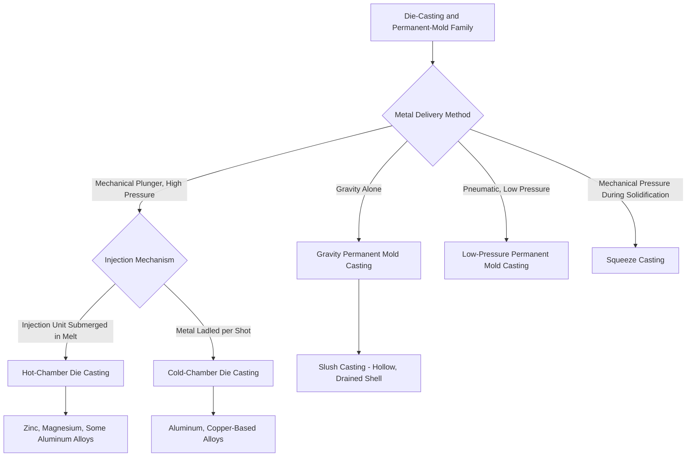

## Die-Casting and Permanent-Mold Family

### Definition and Scope

The die-casting and permanent-mold family comprises casting processes that share a **durable, reusable metal mold** (die), machined from tool steel or another high-temperature-resistant alloy, that survives many production cycles rather than being destroyed to extract each casting. This topic classifies the family by **metal delivery method and applied pressure regime**, the variable that most directly governs achievable wall thickness, porosity characteristics, cycle time, and equipment cost across the family's variants — ranging from simple gravity-fed permanent mold casting through high-pressure die casting to pressure-assisted feeding methods like squeeze casting.

The family is unified by the economic logic of tooling amortization: die/mold cost is substantially higher than expendable-mold tooling, making this family generally favored at moderate-to-high production volumes where per-part tooling cost is driven down by cycle count.

### The Core Shared Process Logic

**Key Points**

- **Reusable die/mold**: machined from hardened tool steel (or, for lower-temperature alloys, sometimes cast iron or other die materials), designed to withstand thousands to hundreds of thousands of thermal cycles
- **Parting line and ejection**: because the die must open to release the solidified casting, the design must account for a parting line and draft angles, and undercuts require mechanically actuated slides, retractable cores, or (for zinc/aluminum) sometimes soluble/collapsible core inserts
- **Faster solidification**: the die's high thermal conductivity (relative to sand or ceramic shell molds) produces much faster cooling rates, yielding finer as-cast grain structure and generally superior baseline mechanical properties compared to expendable-mold processes, at the cost of a narrower window for mold filling before premature freezing
- **Cycle time economics**: the reusable die enables cycle times of seconds to a few minutes, dramatically higher throughput than expendable-mold processes, which is the primary economic driver for selecting this family once production volume justifies the die investment

### Classification Diagram (svg_diagram)

### Gravity Permanent Mold Casting

**Key Points**

- Molten metal is poured into a reusable metal die under gravity alone, with no external pressure assisting mold fill
- Produces better surface finish and mechanical properties than sand casting (due to faster solidification against the metal die) at lower tooling cost and slower cycle time than die casting
- **Slush casting** is a specialized gravity permanent mold variant: the mold is inverted and drained after a thin solidified shell forms against the mold wall, producing a hollow casting without any core, used for decorative or low-structural-demand hollow parts (statuettes, lamp bases)
- Limited to simpler geometries and thicker minimum wall sections than pressure-assisted methods, since gravity alone provides comparatively low driving force for filling thin or intricate sections before the metal begins to solidify against the die

### Die Casting

**Key Points**

- Molten metal is injected into a reusable steel die at high velocity under substantial applied pressure (commonly tens to over a hundred MPa), enabling very thin achievable wall sections and excellent surface detail replication
- **Hot-chamber die casting**: the injection mechanism (gooseneck and plunger) is submerged directly in the molten metal reservoir, allowing very fast cycle times since metal does not need to be separately transferred for each shot; restricted to alloys with relatively low melting points and low reactivity with the injection system's steel components — zinc, magnesium, and some low-melting aluminum alloys are commonly hot-chamber processed
- **Cold-chamber die casting**: molten metal is ladled (or automatically dosed) into a separate shot sleeve for each individual cycle, and a plunger then drives it into the die; the injection mechanism is not continuously immersed in the melt, making this configuration suitable for higher-melting-point, more reactive alloys such as aluminum and copper-based alloys that would rapidly degrade a submerged hot-chamber injection system
- **Porosity characteristic**: the rapid, high-velocity, turbulent fill inherent to conventional die casting tends to entrain air within the die cavity, producing internal gas porosity that generally precludes subsequent heat treatment (due to blistering risk from trapped gas expansion) or fusion welding of standard die castings without specialized process variants

### Pressure-Assisted Feeding Variants

- **Low-pressure permanent mold casting**: a sealed holding furnace beneath an inverted die is pressurized with air or inert gas at low pressure (well under 1 bar) to force molten metal upward through a riser tube into the die cavity; the controlled, laminar, low-turbulence fill produces substantially lower porosity than conventional high-pressure die casting, at the cost of longer cycle times; widely used for aluminum automotive road wheels and other structural components where mechanical property consistency matters more than the fastest possible cycle time
- **Squeeze casting**: molten metal is introduced into an open die (often at relatively low velocity, minimizing turbulence) and then solidified under high mechanical pressure applied by a closing punch or die half, continuing to feed the casting throughout solidification and substantially suppressing both gas and shrinkage porosity; produces mechanical properties approaching those of wrought or forged material in some applications, at higher equipment complexity and cost than conventional die casting
- **Vacuum die casting**: a vacuum is drawn on the die cavity immediately before and/or during metal injection to reduce trapped air, enabling limited heat treatment and improved mechanical properties relative to conventional (non-vacuum) die casting, while retaining most of die casting's rapid cycle time advantage

### Comparative Analysis

| Variant | Pressure Regime | Typical Alloys | Porosity Level | Relative Cycle Time | Achievable Thin Sections |
| --- | --- | --- | --- | --- | --- |
| Gravity permanent mold | None (gravity only) | Aluminum, copper alloys, some cast iron | Low to moderate | Slower | Moderate |
| Hot-chamber die casting | High, mechanical | Zinc, magnesium, low-melt aluminum | Higher (unless vacuum-assisted) | Very fast | Excellent |
| Cold-chamber die casting | High, mechanical | Aluminum, copper-based alloys | Higher (unless vacuum-assisted) | Fast | Excellent |
| Low-pressure permanent mold | Low, pneumatic | Aluminum (commonly wheels) | Low | Moderate | Good |
| Squeeze casting | High, sustained mechanical | Aluminum, some magnesium | Very low | Moderate | Good |
| Vacuum die casting | High, mechanical + vacuum assist | Aluminum, zinc, magnesium | Low to moderate | Fast | Excellent |

### Governing Considerations: Die Life, Thermal Fatigue, and Process Economics

**Key Points**

- **Die thermal fatigue (heat checking)**: repeated thermal cycling from molten metal contact followed by cooling causes surface cracking (heat checking) on die cavity surfaces over the die's service life, ultimately limiting the number of shots a die can produce before requiring repair or replacement; die material selection, cavity coatings, and thermal management (internal cooling channel design) directly affect achievable die life and are a major factor in the family's overall tooling economics [Unverified: specific die life figures in number of shots vary substantially by die material, alloy cast, cavity geometry, and cooling system design]
- **Break-even volume threshold**: die casting's substantially higher fixed tooling cost relative to gravity permanent mold or expendable-mold processes requires a correspondingly higher production volume to amortize; process selection within this family, and between this family and expendable-mold alternatives, is frequently driven by an explicit tooling-cost-versus-volume break-even calculation rather than technical capability alone
- **Alloy-process compatibility constraints**: the hot-chamber versus cold-chamber distinction within die casting is fundamentally a materials-compatibility constraint (avoiding degradation of injection system components by reactive, high-melting-point molten alloys), not an arbitrary equipment choice, and directly determines which alloy families are practically accessible via each die casting configuration

### Practical Example

**Example**

A manufacturer producing 2,000,000 zinc door handle assemblies annually would select **hot-chamber die casting**, since zinc's low melting point and low reactivity with the submerged injection system enable extremely fast cycle times, and the required mechanical properties are well within what conventional (non-vacuum) die casting porosity levels can support. A manufacturer producing 150,000 aluminum automotive road wheels annually, where fatigue performance under cyclic structural loading is safety-critical, would instead select **low-pressure permanent mold casting**, accepting a slower cycle time in exchange for the low-turbulence, low-porosity fill needed to achieve the required fatigue life — a requirement that conventional high-pressure die casting's inherent porosity would jeopardize.

### Conclusion

The die-casting and permanent-mold family spans a spectrum of applied-pressure regimes — from gravity alone, through low-pressure pneumatic feeding, to high-pressure mechanical injection, to sustained mechanical pressure throughout solidification (squeeze casting) — each representing a different balance between cycle time, achievable thin-section fillability, and resulting porosity/mechanical property level. Selecting among the family's variants is fundamentally a question of matching the required combination of production rate and mechanical property/porosity performance to the appropriate pressure regime, with hot-chamber versus cold-chamber die casting further constrained by direct alloy-compatibility requirements with the injection system.

**Related Topics**

- Die design principles: parting line, ejector system, and cooling channel layout
- Die material selection and heat-checking (thermal fatigue) mechanisms
- Porosity formation and mitigation in high-pressure die casting (vacuum assist, pore-free processes)
- Break-even economic analysis for die tooling investment versus expendable-mold alternatives
- Squeeze casting process parameters and achievable mechanical property comparison to wrought material
- Alloy selection constraints specific to hot-chamber versus cold-chamber die casting
- Post-casting heat treatment limitations imposed by as-cast porosity levels