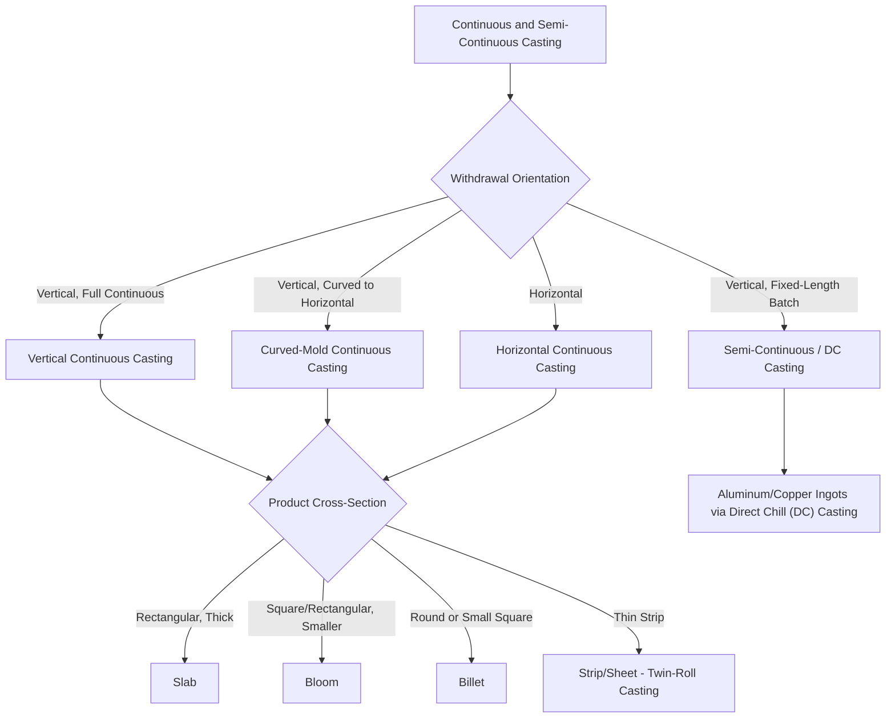

## Continuous and Semi-Continuous Casting Classification

### Definition and Scope

Continuous and semi-continuous casting processes are distinguished from the batch/discrete casting families (sand casting, investment casting, die casting) by producing a solidifying metal product **continuously or quasi-continuously drawn through a stationary mold**, rather than filling a discrete mold cavity that is then opened to release a single finished casting. This topic classifies the family by **withdrawal mode and product geometry**, the variables that most directly determine achievable production rate, cross-sectional shape flexibility, and suitability for downstream integration with rolling, forging, or extrusion operations.

Continuous casting occupies a distinctive position within casting classification: it produces **semi-finished mill products** (billets, blooms, slabs, rods, strip) rather than near-net-shape final parts, making it functionally a bridge process between primary metal production (melting/refining) and subsequent Umformen (forming) operations.

### The Core Shared Process Logic

**Key Points**

- **Water-cooled, open-ended mold**: unlike batch casting molds, which form a closed cavity, continuous casting molds are open at both ends, with molten metal entering at the top and a partially or fully solidified strand withdrawn continuously from the bottom
- **Shell formation and progressive solidification**: metal begins solidifying as a thin shell against the water-cooled mold walls almost immediately upon entry; the shell thickens as the strand travels downward (or, in horizontal configurations, along the withdrawal axis), with the liquid core continuing to solidify well below/beyond the mold itself, supported by secondary cooling sprays
- **Continuous withdrawal**: the solidifying strand is continuously withdrawn from the mold at a controlled rate (synchronized with the casting/pouring rate) using pinch rolls or a similar mechanism, distinguishing this family from any batch process where the casting remains stationary within a closed mold until fully solidified
- **Cut-to-length or coiling**: the continuously produced strand is subsequently cut into discrete lengths (billets, blooms, slabs) using a traveling torch or shear, or coiled (for rod/wire product), for downstream handling and processing

### Classification Diagram (svg_diagram)

### Vertical and Curved-Mold Continuous Casting

**Key Points**

- **Vertical continuous casting**: the strand travels straight down through the mold and secondary cooling zone; historically the original configuration for continuous casting, still used for certain billet and bloom production, but requiring substantial vertical plant height
- **Curved-mold (bow-type) continuous casting**: the strand exits the mold vertically but is progressively bent along a curved path to horizontal, reducing the required plant height substantially compared to purely vertical configurations; this configuration became dominant for steel slab, bloom, and billet casting due to the significant reduction in capital facility height and cost
- **Horizontal continuous casting**: the mold itself is oriented horizontally, with the strand withdrawn horizontally throughout; used for certain non-ferrous product forms (copper rod, some aluminum products) and specialized applications where the horizontal configuration simplifies plant layout or specific alloy handling requirements

### Product Cross-Section Classification

- **Slab**: wide, relatively thin rectangular cross-section, the semi-finished input for subsequent hot rolling into plate, sheet, or strip products
- **Bloom**: square or rectangular cross-section, larger than billet but smaller in aspect ratio than slab, the semi-finished input for subsequent rolling into structural shapes, rail, or large bar products
- **Billet**: round or smaller square cross-section, the semi-finished input for subsequent rolling into bar, rod, wire rod, or seamless tube products
- **Strip/thin-gauge product (twin-roll casting)**: a specialized continuous casting variant in which molten metal solidifies directly between two water-cooled, counter-rotating rolls, producing thin strip (millimeters thick) directly from the melt without the extensive subsequent hot-rolling reduction required from conventional slab casting — used prominently for aluminum and some steel strip production, substantially shortening the process chain from melt to finished-gauge strip

### Semi-Continuous (Direct Chill, DC) Casting

**Key Points**

- **Direct Chill (DC) casting**: predominantly used for aluminum and copper alloy ingot production; molten metal is poured into a short, water-cooled mold with a movable, hydraulically lowered base (the "false bottom" or starting block); as the base is lowered at a controlled rate, direct water spray cooling (applied directly onto the emerging solidified ingot surface, hence "direct chill") completes solidification, producing a large ingot of fixed maximum length limited by pit depth (rather than a truly infinite continuous strand)
- **Distinction from fully continuous casting**: DC casting is termed "semi-continuous" because the process, while continuous in its solidification mechanism, produces a discrete, finite-length ingot constrained by the physical depth of the casting pit, rather than an indefinitely long strand that is cut to length after the fact as in fully continuous slab/bloom/billet casting
- **Primary application**: DC-cast ingots serve as the feedstock for subsequent hot rolling (aluminum sheet/plate production) or extrusion (aluminum profile production), making DC casting the dominant primary-ingot production method for the aluminum industry

### Comparative Analysis

| Characteristic | Vertical/Curved Continuous Casting | Horizontal Continuous Casting | Twin-Roll Strip Casting | Semi-Continuous (DC) Casting |
| --- | --- | --- | --- | --- |
| Primary industry | Steel (slab, bloom, billet) | Copper rod, some aluminum | Aluminum/steel thin strip | Aluminum, copper ingot |
| Product form | Long semi-finished sections, cut to length | Continuous rod/bar | Thin strip, coiled | Fixed-length large ingot |
| Plant height requirement | High (vertical) to moderate (curved) | Low | Low | Moderate (pit depth) |
| Downstream processing | Hot rolling, forging | Wire drawing, further forming | Cold rolling (reduced reduction needed) | Hot rolling, extrusion |
| Withdrawal continuity | Fully continuous, cut to length | Fully continuous | Fully continuous | Finite length per cycle (pit-depth limited) |

### Governing Considerations: Solidification Control and Product Quality

**Key Points**

- **Shell thickness and breakout risk**: the solidifying shell within the mold must achieve sufficient thickness before exiting mold support to safely contain the still-liquid core under ferrostatic (or equivalent metallostatic) pressure; insufficient shell thickness relative to withdrawal speed risks a "breakout" — a rupture of the shell releasing liquid metal — making the relationship between casting speed, mold length, and cooling rate a critical process control parameter
- **Secondary cooling zone design**: after exiting the primary mold, the strand's continued solidification is controlled by secondary water-spray cooling zones, whose intensity and distribution directly affect internal soundness, centerline segregation, and surface quality of the final semi-finished product
- **Segregation and centerline quality**: because solidification proceeds progressively from the outer shell inward, the last-to-solidify centerline region is prone to segregation of alloying elements and impurities, along with potential centerline porosity/shrinkage — a persistent quality concern across the continuous casting family that drives ongoing process refinements (electromagnetic stirring, soft reduction near the point of final solidification) [Unverified: specific segregation severity and mitigation effectiveness are alloy- and process-parameter-dependent]

### Practical Example

**Example**

A steel producer supplying coil for automotive sheet metal would use **curved-mold continuous slab casting** to produce wide, thin slabs directly from the steelmaking furnace/ladle, which are then reheated and hot-rolled into coil — the curved-mold configuration is selected specifically to minimize the vertical plant footprint compared to a straight vertical caster, an important capital-cost consideration at the scale of a modern steel mill. An aluminum producer supplying billet stock for extruded architectural profiles would instead use **Direct Chill (DC) semi-continuous casting**, producing cylindrical ingots that are subsequently sawn to length and preheated for hot extrusion — DC casting's finite-length, pit-depth-limited ingot format is well matched to the batch nature of downstream extrusion press operation, unlike the fully continuous strand format better suited to inline rolling mill integration.

### Conclusion

Continuous and semi-continuous casting classification centers on withdrawal mode (vertical, curved, or horizontal) and resulting product cross-sectional geometry (slab, bloom, billet, strip, or ingot), reflecting this family's distinctive role as a bridge between primary melting/refining operations and downstream Umformen (rolling, extrusion, forging) processing rather than as a near-net-shape final-part production method. The semi-continuous (Direct Chill) variant's finite, pit-depth-limited product length distinguishes it from fully continuous slab/bloom/billet/strip casting, but both share the family's defining characteristic: progressive solidification of a strand continuously withdrawn from an open-ended, water-cooled mold rather than solidification within a closed, discrete mold cavity.

**Related Topics**

- Steel continuous casting machine configuration and mold design (curved vs. straight)
- Direct Chill (DC) casting process parameters and ingot quality control for aluminum
- Twin-roll strip casting process architecture and metallurgical implications
- Centerline segregation mechanisms and mitigation (electromagnetic stirring, soft reduction)
- Breakout prevention and shell-thickness process control in continuous casting
- Integration of continuous casting with downstream hot rolling (compact strip production lines)
- Comparative economics of continuous casting versus ingot casting plus primary breakdown rolling