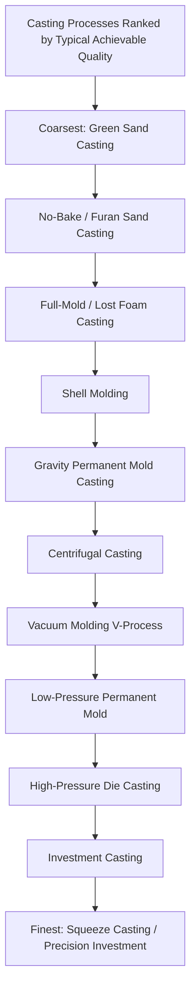

## Classification by Achievable Accuracy and Surface Finish

### Definition and Scope

This topic classifies casting processes along a **quality-outcome axis** — achievable dimensional tolerance and as-cast surface finish — rather than by mold type, pouring method, or product geometry as in preceding sections. This classification is a practical, cross-cutting lens: it takes processes already categorized by mold reusability, pouring method, and geometry, and re-ranks them by the metric that most directly determines how much downstream machining allowance, finishing labor, and secondary processing a given process demands before the casting meets final part requirements.

Because achievable accuracy and surface finish correlate strongly (though imperfectly) with mold material, mold rigidity, and metal-mold thermal contact, this classification largely (but not perfectly) tracks the expendable-versus-permanent-mold and pressure-versus-gravity distinctions covered earlier, while adding process-specific nuance that those binary classifications alone do not capture.

### The Governing Physical Relationship

**Key Points**

- **Mold rigidity and dimensional accuracy**: a mold that does not deform, erode, or expand under the thermal and mechanical load of molten metal reproduces the intended cavity dimensions more faithfully; rigid, dimensionally stable molds (ceramic shell, machined steel dies) inherently outperform lower-rigidity molds (green sand) on repeatability and tolerance
- **Mold surface texture replication**: as-cast surface finish is fundamentally a **negative replica** of the mold cavity surface texture; finer-grained, smoother mold surfaces (ceramic shell, polished steel dies) replicate as finer, smoother casting surfaces, while coarser mold media (sand grains) replicate as correspondingly coarser casting surfaces
- **Thermal contact and solidification rate**: faster, more uniform solidification against a thermally conductive, dimensionally stable mold (metal dies) tends to produce finer, more consistent grain structure at the surface, indirectly supporting better finish and more predictable shrinkage-driven dimensional behavior compared to slower, less uniform solidification against insulating mold materials (sand, ceramic)

### Comparative Ranking Diagram (svg_diagram)

### Comparative Table: Typical Tolerance and Surface Finish by Process

**Key Points**

- The table below orders processes qualitatively from coarser to finer typical as-cast outcomes; actual figures vary substantially with casting size, alloy, geometry, and specific foundry practice, so values should be treated as general engineering guidance rather than guaranteed specifications for any particular project

| Process | Typical Relative Dimensional Tolerance | Typical Relative Surface Finish | Primary Governing Factor |
| --- | --- | --- | --- |
| Green sand casting | Coarsest | Coarse | Low mold rigidity, coarse sand grain |
| No-bake/furan sand casting | Coarse to moderate | Coarse to moderate | Moderate mold rigidity |
| Lost foam / full-mold casting | Moderate | Moderate to good | Foam pattern fidelity, refractory coating quality |
| Shell molding | Moderate to fine | Good | Fine resin-coated sand, rigid cured shell |
| Gravity permanent mold casting | Fine | Good | Rigid, dimensionally stable steel die |
| Centrifugal casting | Fine (bore surface often machined regardless) | Good on outer wall | Rigid rotating die, controlled fill |
| Vacuum molding (V-process) | Fine | Very good | No binder-related mold surface irregularity |
| Low-pressure permanent mold | Fine | Very good | Rigid die, controlled laminar fill |
| High-pressure die casting | Very fine | Excellent | Rigid steel die, rapid high-pressure fill |
| Investment casting | Very fine | Excellent | Ceramic shell replicates fine wax pattern detail |
| Squeeze casting | Finest (combined with low porosity) | Excellent | Rigid die plus sustained mechanical consolidation pressure |

[Unverified: this ranking reflects generally accepted qualitative process comparisons in foundry engineering references; precise numerical tolerance grades (e.g., per ISO 8062 casting tolerance grades) depend on casting size, alloy, and specific process control, and should be obtained from the relevant standard or foundry capability data for any specific application]

### Why Some Processes Resist Simple Ranking

**Key Points**

- **Investment casting's dual achievement**: investment casting achieves both fine tolerance and excellent surface finish simultaneously despite being an expendable-mold process, because the ceramic shell — while destroyed each cycle — is built directly against a precision wax pattern and does not suffer from the coarse-grain replication problem inherent to sand-based expendable molds; this illustrates that mold *reusability* and mold *surface fidelity* are related but distinct variables, and investment casting decouples them
- **Centrifugal casting's asymmetric quality**: true centrifugal casting produces a good surface finish and fine grain structure at the outer wall (against the rigid rotating die), but the inner (bore) surface — formed freely against no die at all, simply by the metal's own centrifugally-flattened free surface — is typically rougher and less dimensionally controlled, and is frequently machined regardless of the outer-wall quality achieved; this illustrates that a single process can have direction-dependent (anisotropic) achievable quality rather than a single uniform tolerance/finish rating
- **Lost foam casting's finish-limiting factors**: lost foam casting's surface finish, while generally good, is influenced by foam bead fusion quality and refractory coating characteristics in ways that can introduce a texture distinct from, and not strictly better or worse than, resin-bonded sand processes — making direct ranking against shell molding somewhat application- and process-control-dependent rather than absolute

### Governing Considerations: Cost-Quality Tradeoff and Machining Allowance

**Key Points**

- **Machining allowance as the practical consequence**: the primary downstream engineering impact of a casting process's position on this quality spectrum is the **machining stock allowance** that must be added to critical dimensions during pattern/die design — coarser processes require more stock removed to guarantee sound, dimensionally correct final geometry after machining, directly increasing material waste and machining cycle time
- **Near-net-shape economics**: processes at the finer end of this classification (investment casting, high-pressure die casting, squeeze casting) are frequently selected specifically to minimize or eliminate machining allowance, trading higher per-part or tooling cost for substantially reduced downstream Trennen (machining) operations — a tradeoff that becomes more favorable as the cost of machining time (particularly for hard-to-machine alloys or complex geometry) increases relative to the casting process's own cost premium
- **Quality-cost non-linearity**: achievable quality does not scale linearly with cost; the incremental cost to move from green sand to shell molding is typically much smaller than the incremental cost to move from shell molding to investment casting or die casting, meaning process selection along this axis should weigh the specific tolerance/finish requirement against the full cost curve rather than assuming "finer is proportionally more expensive" [Unverified: exact cost-quality curve shapes are highly application-, alloy-, and volume-dependent]

### Practical Example

**Example**

A manufacturer producing a cast iron pump housing with generous wall thickness and non-critical external tolerances would select **green sand casting**, accepting coarser as-cast tolerance because all functionally critical surfaces (bearing bores, mating flanges) will be machined regardless, and the coarse-finish, low-cost process minimizes total cost for the non-critical majority of the part's surface area. A manufacturer producing a small titanium aerospace bracket with thin walls and tight positional tolerances on as-cast features would instead select **investment casting**, since the part's thin sections and precision requirements would demand extensive, costly, and potentially distortion-inducing machining if produced via a coarser process, making investment casting's higher per-part cost more than offset by the machining time and material eliminated.

### Conclusion

Classification by achievable accuracy and surface finish provides a practical, outcome-oriented complement to the mold-type, pouring-method, and product-geometry classifications covered elsewhere in this chapter, directly informing the machining allowance and downstream processing cost that a given casting process choice will impose. While this quality ranking correlates strongly with mold rigidity and surface fidelity — generally favoring rigid, dimensionally stable molds (steel dies, ceramic shells) over lower-rigidity expendable molds (green sand) — exceptions like investment casting's decoupling of mold reusability from surface fidelity, and centrifugal casting's direction-dependent quality, demonstrate that this axis must be applied with attention to process-specific nuance rather than as a strict, universal hierarchy.

**Related Topics**

- ISO 8062 and other standardized casting tolerance grade systems
- Machining allowance calculation methodology for cast components
- Near-net-shape casting process selection economics
- Surface roughness measurement and specification for as-cast surfaces
- Process capability studies and statistical tolerance analysis in foundry operations
- Post-casting finishing operations (shot blasting, grinding) and their interaction with as-cast quality
- Design for casting guidelines balancing part function against achievable process tolerance