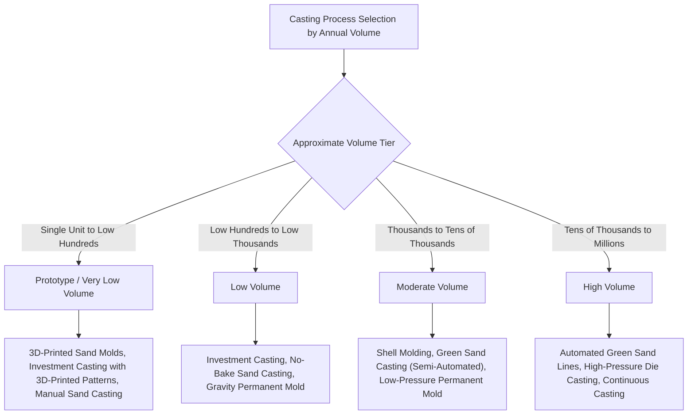

## Casting Classification by Production-Volume Suitability

### Definition and Scope

This topic classifies casting processes along a **production-volume axis**: the annual or lifetime unit quantity at which a given process becomes the economically rational choice, driven primarily by the relationship between fixed tooling investment and variable per-unit cost. Unlike the mold-type, pouring-method, or quality classifications covered elsewhere in this chapter, this classification is fundamentally an economic rather than a physical/technical lens — the same part geometry can often be produced by multiple casting processes, and production volume is frequently the deciding factor in process selection once technical feasibility has been established for several candidates.

This classification is essential precisely because it cuts across the other classification axes: a low-volume application may favor a technically "lower-quality" but low-tooling-cost process (sand casting) over a technically superior but high-fixed-cost process (die casting), even when the higher-quality process would be preferred on pure technical merit.

### The Governing Economic Relationship

**Key Points**

- **Total cost decomposition**: for any casting process, total cost per part can be approximated as $C_{part} = C_{fixed}/N + C_{variable}$, where $C_{fixed}$ is the tooling/die investment, $N$ is production quantity, and $C_{variable}$ is the per-unit material, labor, and cycle-time-dependent cost
- **Break-even volume**: comparing two processes (A, lower fixed cost/higher variable cost; B, higher fixed cost/lower variable cost) yields a break-even quantity $N_{break-even} = (C_{fixed,B} - C_{fixed,A}) / (C_{variable,A} - C_{variable,B})$, below which process A is more economical and above which process B is more economical
- **Volume-driven process migration**: as a product's production volume grows over its lifecycle (or as a company scales from prototyping to full production), the economically optimal casting process frequently shifts from expendable-mold, low-tooling-cost processes toward permanent-mold, high-tooling-cost, low-cycle-time processes — a pattern common enough to be treated as a general (though not universal) rule of thumb in process planning

### Production-Volume Classification Diagram (svg_diagram)

### Prototype and Very Low Volume (Single Units to Low Hundreds)

**Key Points**

- **3D-printed sand molds (binder jetting of sand)**: an additive manufacturing technique that directly produces sand mold and core geometry from a digital model without requiring a pattern at all, enabling single-unit or very-low-quantity sand castings with complex geometry and rapid turnaround — this process eliminates pattern tooling cost entirely, making it well suited to prototyping and low-volume production where conventional sand casting's pattern cost would be disproportionate [Note: this is a comparatively recent (post-2000s, increasingly mainstream in the 2010s-2020s) technology extending the traditional sand-casting family; specific machine vendors and material systems continue to evolve]
- **Investment casting with 3D-printed (rather than injection-molded) wax or sacrificial patterns**: additive manufacturing of the sacrificial pattern itself (via stereolithography, material jetting of castable wax-like resins, or similar) eliminates the wax injection die cost, making investment casting economically accessible at prototype quantities where conventional die-injected wax pattern tooling would not be justified
- **Manual/hand-formed sand casting**: for true one-off or extremely low-quantity castings, hand-rammed sand molds around a simple wood or 3D-printed pattern remain viable, trading labor time for near-zero tooling investment

### Low Volume (Low Hundreds to Low Thousands)

**Key Points**

- **Investment casting (conventional die-injected wax)**: at this volume tier, the wax injection die cost becomes justifiable, and investment casting's combination of fine tolerance/finish and geometric freedom makes it attractive for moderately complex, precision components not yet at a volume justifying die-casting tooling
- **No-bake/furan sand casting**: chemically bonded sand systems, requiring only a durable pattern (wood, plastic, or metal) rather than automated molding-line tooling, suit low-volume production of larger or heavier castings
- **Gravity permanent mold casting**: for non-ferrous alloys, a gravity die represents a moderate tooling investment relative to die casting, becoming justifiable at this tier when the application benefits from permanent-mold's superior finish/properties over sand casting but does not yet justify die casting's substantially higher tooling and equipment cost

### Moderate Volume (Thousands to Tens of Thousands)

**Key Points**

- **Shell molding**: the heated metal pattern required for shell molding represents a meaningful tooling investment relative to a simple sand-casting pattern, becoming economically justified at this tier, particularly for smaller precision components where the improved finish and tolerance reduce machining cost across a large enough part count to offset the tooling premium
- **Semi-automated green sand casting**: green sand molding equipment with moderate automation (rather than fully automated high-speed lines) suits this volume tier, balancing labor cost reduction against the capital investment of full automation
- **Low-pressure permanent mold casting**: the die investment for low-pressure permanent mold casting is justified at this tier for applications (such as aluminum wheels) where the volume is sufficient to amortize the die but where cycle time, while faster than gravity permanent mold, need not match die casting's speed

### High Volume (Tens of Thousands to Millions)

**Key Points**

- **Fully automated green sand molding lines**: high-speed, high-pressure automated molding lines (capable of producing molds at rates of dozens to over a hundred per hour) justify substantial capital investment in automation and tooling only at high annual volumes, but then achieve very low per-part cost through minimized labor content and rapid cycle time
- **High-pressure die casting**: die casting's substantial die and machine investment is decisively justified at high volumes, where its very short cycle time (seconds) and minimal labor content per part drive per-unit cost dramatically below expendable-mold alternatives, despite the high fixed cost
- **Continuous casting**: for semi-finished mill products (billet, bloom, slab, strip), continuous casting's substantial capital plant investment is justified only at the very high throughput volumes characteristic of primary metal production, where it replaces the historically used batch ingot-casting-plus-primary-rolling process chain

### Comparative Volume-Tier Summary

| Volume Tier | Representative Annual Quantity | Dominant Tooling Strategy | Representative Processes |
| --- | --- | --- | --- |
| Prototype/very low | 1 to ~100s | Minimal to no dedicated tooling | 3D-printed sand molds, 3D-printed investment patterns |
| Low | ~100s to ~1,000s | Reusable pattern, no die | No-bake sand, conventional investment casting, gravity permanent mold |
| Moderate | ~1,000s to ~10,000s | Moderate die/pattern tooling | Shell molding, low-pressure permanent mold |
| High | ~10,000s to millions | Full die/automated tooling | High-pressure die casting, automated green sand lines |
| Continuous/mill-scale | Effectively continuous, very high throughput | Major capital plant investment | Continuous casting of billet/bloom/slab/strip |

[Unverified: the specific quantity thresholds shown are general engineering guidance reflecting commonly cited industry rules of thumb; actual break-even volumes for any specific part depend heavily on part size, geometry complexity, alloy, required quality, and current tooling/labor cost conditions, and should be calculated explicitly for the application rather than assumed from this table]

### Governing Considerations: Beyond the Simple Break-Even Model

**Key Points**

- **Geometry complexity interacts with volume threshold**: a highly complex geometry (requiring extensive coring or intricate die features) shifts the break-even volume, since the fixed tooling cost for a complex die or pattern is itself higher than for a simple one, meaning break-even calculations must account for geometry-driven tooling cost, not just process-family generalizations
- **Alloy-specific process availability constraints**: some processes are simply unavailable or impractical for certain alloys regardless of volume (e.g., hot-chamber die casting is unsuitable for high-melting-point alloys), meaning volume-based process selection must first be filtered by alloy compatibility before economic optimization is applied
- **Lifecycle volume uncertainty**: products with uncertain or ramping production volume (new product introductions, low-rate initial production in aerospace/defense) may deliberately select a process suited to a lower volume tier than the eventual mature-production volume would justify, to avoid premature high fixed-cost tooling investment before demand is confirmed — a risk-management consideration layered on top of the pure break-even economic calculation

### Practical Example

**Example**

A startup developing a new pump impeller would likely begin with **investment casting using 3D-printed sacrificial patterns** during initial prototyping and low-rate production (tens to low hundreds of units), avoiding wax-injection die investment while validating the design. As the product matures and reaches a projected several-thousand-unit annual volume, the company would likely transition to **conventional investment casting with a die-injected wax pattern**, since the injection die investment is now justified by volume and produces patterns faster and more consistently than 3D printing at that scale. If the product later scales to hundreds of thousands of units annually, the company might redesign the impeller for **high-pressure die casting** (if the alloy and design permit) to achieve the dramatically lower per-unit cost that only justified die tooling can provide at that volume — illustrating a realistic volume-driven process migration across a single product's lifecycle.

### Conclusion

Casting classification by production-volume suitability reframes process selection as fundamentally an economic optimization problem: matching a process's fixed tooling investment and variable per-unit cost structure to the specific quantity a given application requires, rather than selecting solely on technical capability. This classification explains why casting process selection frequently changes across a product's lifecycle as production volume ramps, and why technically excellent processes (die casting, continuous casting) are routinely passed over in favor of technically simpler alternatives (sand casting, investment casting) whenever production volume does not justify their substantially higher fixed tooling cost.

**Related Topics**

- Break-even economic analysis methodology for manufacturing process selection
- Additive manufacturing of sand molds and cores (binder jetting) as a prototyping enabler
- 3D-printed sacrificial pattern technologies for low-volume investment casting
- Tooling cost estimation methods for dies, patterns, and molds
- Production volume forecasting and its role in manufacturing process planning
- Design for manufacturability considerations that shift break-even volume thresholds
- Case studies in process migration across product lifecycle volume ramps