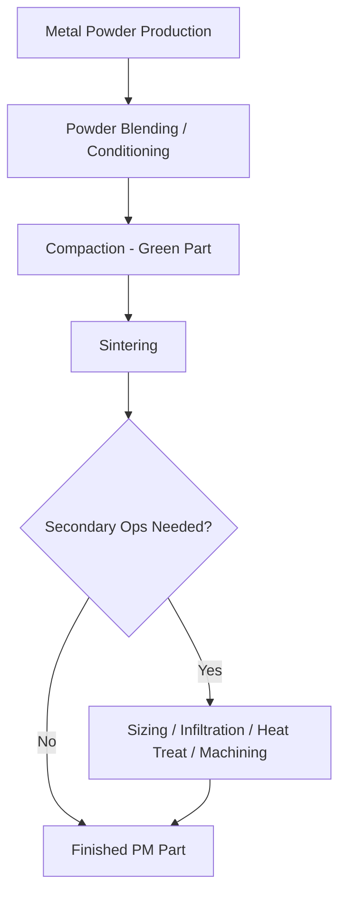

## Powder Metallurgy Process Family Overview

### Definition and Scope

Powder metallurgy (PM) is a manufacturing process family in which metal parts are produced from powdered metals or alloys through a sequence of powder production, forming (compaction), and thermal consolidation (sintering), typically without ever fully melting the base material. It belongs to the broader class of particulate/powder-based processes, distinguished from casting (which uses fully molten metal) and from machining (which is subtractive from wrought or cast stock).

The defining characteristic of PM is that the final part geometry is established while the material is in discrete particle form, and mechanical integrity is developed afterward through diffusion bonding between particles at elevated temperature, below the melting point of the primary constituent.

### Position Within Process Classification

**Key Points**

- PM sits within the "particulate processing" family alongside ceramic powder processing, metal injection molding (MIM), and additive manufacturing powder-bed processes (e.g., selective laser sintering/melting).
- PM shares the compaction-then-sinter logic with technical ceramics processing but differs in typical pressures, atmospheres, and shrinkage behavior due to metal ductility and oxidation sensitivity.
- Within metals processing broadly, PM is often positioned as a near-net-shape alternative to casting and forging, particularly advantageous for complex geometries, controlled porosity, and materials difficult to melt/cast (e.g., high-melting-point refractory metals, hardmetals like tungsten carbide-cobalt).

### General Process Sequence

The PM family follows a common backbone with variation at each stage:

1. **Powder production** — Atomization (water, gas, or centrifugal), reduction of oxides, electrolytic deposition, or mechanical comminution.
2. **Powder conditioning** — Blending with alloying elements, lubricants, and binders; controlling particle size distribution (PSD) and morphology.
3. **Compaction (forming)** — Consolidating loose powder into a "green" part with sufficient handling strength.
4. **Sintering** — Thermal treatment below the primary melting point to bond particles via solid-state (or sometimes liquid-phase) diffusion, driving densification and grain growth.
5. **Secondary operations** — Sizing, coining, infiltration, heat treatment, machining, or surface treatment to reach final tolerances and properties.

### Sub-Process Families

**Conventional Press-and-Sinter PM**

The dominant volume process. Powder is die-compacted uniaxially at room temperature, then sintered in a controlled-atmosphere furnace. Achieves typical densities of 85–95% of theoretical, suited to moderate-complexity parts at high volume (e.g., automotive gears, bushings, structural brackets).

**Metal Injection Molding (MIM)**

Fine metal powder (typically <20 µm) is mixed with a polymer/wax binder system to form a feedstock that is injection molded like a plastic. The binder is then removed (debinding) and the part sintered to near-full density. Enables complex, small, high-volume geometries not achievable by die compaction (e.g., surgical instrument components, firearm parts, electronic connector housings).

**Hot Isostatic Pressing (HIP) and Hot Pressing**

Powder (often pre-encapsulated) is subjected to simultaneous heat and isostatic (HIP) or uniaxial (hot pressing) pressure, combining forming and densification into a single step. Produces near-fully-dense parts with isotropic properties; used for superalloys, titanium aerospace components, and tool steels.

**Powder Forging**

A PM preform (pressed and lightly sintered) is subsequently hot-forged to closed final density, combining PM's near-net-shape economy with forging's mechanical property advantages. Common in high-stress automotive connecting rods.

**Cold and Warm Compaction Variants**

Includes cold isostatic pressing (CIP), used for shapes not amenable to uniaxial die pressing (e.g., long or asymmetric parts), and warm compaction, which improves green density and lubricant behavior by warming the powder-die system moderately (roughly 100–150°C).

**Loose Powder Sintering and Powder-Bed Additive Processes**

Related conceptually: loose-powder sintering (no compaction step, gravity-fed) and modern additive processes such as selective laser sintering/melting, which use layer-wise powder-bed fusion instead of bulk die compaction. These extend PM logic into free-form geometry generation.

### Comparison Across the Family

| Sub-process | Density achieved | Complexity capability | Typical volume | Distinguishing mechanism |
| --- | --- | --- | --- | --- |
| Press-and-sinter | 85–95% theoretical | Moderate | Very high | Uniaxial die compaction |
| MIM | ~95–99% theoretical | High (fine features) | High | Injection molding + debind |
| HIP/hot pressing | ~99–100% theoretical | Low-moderate | Low-moderate | Simultaneous heat + isostatic pressure |
| Powder forging | Near 100% | Moderate | High (automotive) | Forge-to-density after presinter |
| Powder-bed AM | 95–99.9% theoretical | Very high (freeform) | Low-moderate | Layer-wise energy fusion |

### Materials Commonly Processed

Iron and low-alloy steels dominate conventional PM by tonnage. Stainless steels, bronze/copper alloys, and aluminum alloys are common in press-and-sinter and MIM. Refractory metals (tungsten, molybdenum), cemented carbides (WC-Co), and superalloys (nickel-based) rely heavily on PM/HIP because their melting points or segregation behavior make casting impractical.

### Advantages and Limitations

**Key Points**

- **Advantages:** near-net-shape production reduces machining waste; enables controlled/engineered porosity (self-lubricating bearings, filters); allows processing of materials difficult to cast or machine; good for complex geometries at high volume (press-and-sinter, MIM); efficient material utilization.
- **Limitations:** residual porosity (in conventional press-and-sinter) reduces fatigue strength and ductility relative to wrought material [Inference: general PM literature consensus, though degree is alloy- and process-specific]; size limitations from press tonnage and die design; tooling costs can be high for low-volume runs; achieving uniform density in complex shapes is challenging due to powder flow and friction effects.

### Illustrative Example

A structural steel gear for a light-duty gearbox: iron powder pre-alloyed with 0.5–2% nickel/copper/molybdenum is blended with ~0.5–1% lubricant (e.g., zinc stearate), uniaxially compacted in a rigid die at 400–700 MPa to form a green gear at roughly 6.8–7.0 g/cm³ density, then sintered at approximately 1120°C in an endothermic or nitrogen-hydrogen atmosphere for 20–40 minutes. The result is a net-shape gear needing minimal finish machining, at a fraction of the material waste of machining from bar stock.

### Simplified Process Relationship Diagram (svg_diagram)

<svg xmlns="http://www.w3.org/2000/svg" viewBox="0 0 760 260">
\<style\>
.box { fill: none; stroke: #333; stroke-width: 1.5; }
.txt { font-family: sans-serif; font-size: 13px; fill: #222; }
.lbl { font-family: sans-serif; font-size: 11px; fill: #555; }
.arrow { stroke: #333; stroke-width: 1.5; marker-end: url(#arrowhead); fill: none; }
\</style\>
<text x="280" y="20" class="txt" font-weight="bold">Powder Metallurgy Process Family (svg_diagram)</text>
<rect x="20" y="50" width="150" height="50" class="box" />
<text x="35" y="80" class="txt">Powder Production</text>
<rect x="220" y="50" width="150" height="50" class="box" />
<text x="240" y="80" class="txt">Press-and-Sinter</text>
<rect x="420" y="50" width="150" height="50" class="box" />
<text x="455" y="80" class="txt">MIM</text>
<rect x="620" y="50" width="120" height="50" class="box" />
<text x="635" y="80" class="txt">Powder-Bed AM</text>
<rect x="220" y="150" width="150" height="50" class="box" />
<text x="245" y="180" class="txt">Powder Forging</text>
<rect x="420" y="150" width="150" height="50" class="box" />
<text x="440" y="180" class="txt">HIP / Hot Press</text>
<path d="M170,75 L220,75" class="arrow" />
<path d="M170,75 L420,75" class="arrow" />
<path d="M170,75 L620,75" class="arrow" />
<path d="M295,100 L295,150" class="arrow" />
<path d="M370,75 L420,150" class="arrow" />
<text x="380" y="130" class="lbl">shared sintering step</text>
</svg>

### Related Topics

- Powder production methods (atomization, reduction, electrolytic)
- Compaction mechanics and die design
- Sintering thermodynamics and atmosphere control
- Metal Injection Molding (MIM) process detail
- Hot Isostatic Pressing (HIP) parameters and applications
- Powder forging metallurgy
- Porosity control and secondary densification (infiltration, resin impregnation)
- Powder-bed additive manufacturing (SLS/SLM) as an extension of PM principles