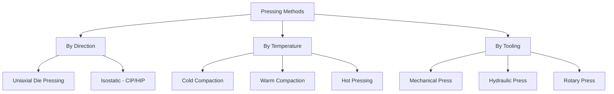

## Pressing and Sintering Classification

### Definition and Scope

Pressing and sintering is the classification scheme covering the two core operations of conventional powder metallurgy: mechanical consolidation of loose powder into a coherent "green" shape (pressing) and subsequent thermal bonding of that shape into a structural part (sintering). This classification organizes the many pressing variants and sintering regimes by the mechanism of consolidation (pressure direction, temperature, tooling) and the mechanism of bonding (solid-state vs. liquid-phase, atmosphere, activation method).

### Classification of Pressing Methods

**By Pressure Application Direction**

- **Uniaxial (die) pressing** — Powder is compacted in a rigid die by one or two moving punches along a single axis. Fastest and most economical; limited to parts with a consistent cross-section along the pressing axis (no undercuts).
- **Isostatic pressing** — Powder in a flexible mold is pressurized equally from all directions via a fluid medium.
  - *Cold Isostatic Pressing (CIP)* — Room-temperature, used for green-forming complex or elongated shapes before sintering.
  - *Hot Isostatic Pressing (HIP)* — Simultaneous heat and isostatic pressure, combining forming and full densification in one step (often used post-sinter to close residual porosity).

**By Temperature Regime**

- **Cold compaction** — Standard room-temperature die pressing; most common industrial route.
- **Warm compaction** — Powder and/or die heated to roughly 100–150°C to reduce inter-particle friction and improve lubricant flow, raising green density.
- **Hot pressing** — Simultaneous heating and uniaxial pressure application, used for hard-to-densify materials (ceramics, cemented carbides, some superalloys).

**By Tooling/Mechanism**

- **Mechanical pressing** — Punch motion driven by a mechanical crank/cam press; high speed, limited force control precision.
- **Hydraulic pressing** — Punch motion driven hydraulically; better force control and dwell capability, common for larger or more complex parts.
- **Rotary/tablet-style pressing** — High-speed continuous production, common in small parts and powder-metal "tablet" analogues.

### Classification of Sintering Methods

**By Phase State During Bonding**

- **Solid-state sintering** — All constituents remain below their melting point throughout; densification occurs via atomic diffusion at particle contact necks (surface diffusion, grain-boundary diffusion, volume diffusion). Dominant mechanism in single-element or well-alloyed PM steels.
- **Liquid-phase sintering (LPS)** — A minor constituent melts at sintering temperature, forming a liquid that wets solid particles, enhances rearrangement, and accelerates densification via solution-reprecipitation. Used for cemented carbides (WC-Co) and some bronze/steel systems.

**By Heating Method**

- **Conventional furnace sintering** — Continuous-belt or batch furnaces with controlled atmosphere (endothermic gas, dissociated ammonia, nitrogen-hydrogen, vacuum); heating via radiant/convective elements over tens of minutes.
- **Microwave sintering** — Volumetric heating via microwave energy coupling with the powder compact; can reduce cycle time and sometimes refine microstructure. [Inference: benefits are material- and geometry-dependent, per PM research literature]
- **Spark Plasma Sintering (SPS) / Field-Assisted Sintering** — Pulsed DC current passed through the powder (often in a graphite die) combined with uniaxial pressure, producing rapid Joule heating and enabling very short cycle times and fine-grained microstructures.
- **Induction sintering** — Localized/rapid heating via induction coils, used for select high-throughput or localized-consolidation applications.

**By Atmosphere Control**

- **Vacuum sintering** — Minimizes oxidation, essential for reactive metals (titanium) and high-performance alloys.
- **Reducing-atmosphere sintering** — Hydrogen-bearing or dissociated-ammonia atmospheres actively reduce surface oxides during heating.
- **Inert-atmosphere sintering** — Nitrogen or argon environments to prevent oxidation without active reduction chemistry.

### Comparative Summary

| Classification axis | Variants | Primary distinguishing factor |
| --- | --- | --- |
| Pressing direction | Uniaxial / Isostatic | Number/direction of applied force vectors |
| Pressing temperature | Cold / Warm / Hot | Powder/die temperature during compaction |
| Sintering phase | Solid-state / Liquid-phase | Whether any constituent melts during sintering |
| Sintering heat source | Furnace / Microwave / SPS / Induction | Energy delivery mechanism |
| Sintering atmosphere | Vacuum / Reducing / Inert | Oxidation control strategy |

### Worked Example

Classifying a typical automotive PM structural part: an iron-copper-carbon gear blank is produced via **uniaxial cold die pressing** (mechanical press, ~600 MPa) to form the green compact, then processed through **conventional continuous-belt furnace sintering** in a **nitrogen-hydrogen reducing atmosphere** at approximately 1120°C. Because copper (melting point ~1085°C) partially melts and infiltrates at this temperature, this specific case sits at the classification boundary between solid-state and liquid-phase sintering — commonly termed **activated/liquid-phase-assisted sintering** due to the copper's transient liquid contribution to densification.

### Sintering Mechanism Diagram (svg_diagram)

<svg xmlns="http://www.w3.org/2000/svg" viewBox="0 0 700 240">
\<style\>
.c { fill: #cfcfcf; stroke: #333; stroke-width: 1.2; }
.neck { fill: #888; stroke: #333; stroke-width: 1; }
.txt { font-family: sans-serif; font-size: 12px; fill: #222; }
\</style\>
<text x="180" y="20" class="txt" font-weight="bold">Solid-State Sintering Neck Growth (svg_diagram)</text>
<circle cx="150" cy="100" r="45" class="c" />
<circle cx="240" cy="100" r="45" class="c" />
<path d="M195,70 Q195,100 195,130" class="neck" stroke-width="14" fill="none" />
<text x="120" y="170" class="txt">Stage 1: Initial Contact</text>
<circle cx="420" cy="100" r="45" class="c" />
<circle cx="500" cy="100" r="45" class="c" />
<path d="M460,60 Q460,100 460,140" class="neck" stroke-width="28" fill="none" />
<text x="390" y="170" class="txt">Stage 2: Neck Growth (diffusion)</text>

<text x="80" y="210" class="txt">Arrows indicate atomic diffusion pathways: surface, grain-boundary, and volume diffusion converge at the neck region.</text>

</svg>

### Related Topics

- Green density and compressibility curves in die pressing
- Sintering shrinkage, dimensional control, and distortion
- Liquid-phase sintering thermodynamics (wetting, solubility)
- Spark Plasma Sintering process parameters and equipment
- Sintering atmosphere chemistry (endothermic gas generation, dew point control)
- Post-sinter secondary operations (sizing, infiltration, resin impregnation)