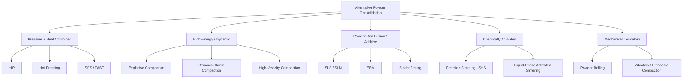

## Alternative Powder-Consolidation Technique Classification

### Definition and Scope

This classification covers powder-consolidation routes that fall outside conventional uniaxial press-and-sinter processing. These "alternative" techniques address limitations of standard die pressing and furnace sintering — geometric constraints, achievable density, microstructure control, or throughput — by changing how mechanical energy, thermal energy, or chemical bonding is applied to the powder mass. They are grouped here by consolidation mechanism rather than by the pressing/sintering axis used for conventional PM.

### Classification by Consolidation Mechanism

**Pressure-and-Heat Combined (Single-Step) Techniques**

- **Hot Isostatic Pressing (HIP)** — Powder (often canned/encapsulated) or a pre-sintered compact is subjected to simultaneous high temperature and isostatic gas pressure (typically argon), achieving near-100% theoretical density with isotropic properties. Used heavily for titanium aerospace components, nickel superalloys, and tool steels.
- **Hot Pressing (uniaxial)** — Simultaneous heat and uniaxial pressure in a die, typically graphite; common for ceramics and cemented carbides where solid-state sintering alone is too slow.
- **Spark Plasma Sintering (SPS) / Field-Assisted Sintering Technique (FAST)** — Pulsed DC current passed directly through a graphite die and (often) the powder itself, producing rapid Joule heating combined with uniaxial pressure; enables very short cycle times (minutes vs. hours) and suppresses grain growth, useful for nanostructured or metastable materials.

**High-Energy/Dynamic Consolidation Techniques**

- **Explosive Compaction** — Detonation-generated shockwaves consolidate powder in milliseconds, achieving very high local pressures without significant bulk heating; used for difficult-to-sinter or oxide-dispersion materials and cladding applications.
- **Dynamic/Shock Compaction (gas gun or similar)** — Related shock-based approach in controlled laboratory or specialized industrial settings, primarily for research-grade or highly reactive/refractory powders.
- **High-Velocity Compaction (HVC)** — A hydraulically or pneumatically driven high-speed ram (impact velocities on the order of several m/s) delivers powder consolidation in a fraction of the time of conventional pressing, improving green density uniformity in tall or complex parts. [Inference: specific density gains are alloy- and geometry-dependent per PM literature]

**Powder-Bed Fusion / Additive Techniques**

- **Selective Laser Sintering/Melting (SLS/SLM)** and **Electron Beam Melting (EBM)** — Layer-wise powder-bed fusion using a focused energy beam (laser or electron beam) to selectively consolidate powder cross-sections, building parts additively without bulk dies. Extends the classification into freeform/near-arbitrary geometry space.
- **Binder Jetting** — A liquid binder is selectively deposited onto a powder bed layer-by-layer to form a green part, which is then sintered (and often infiltrated) conventionally afterward — effectively decoupling the "forming" step from mechanical pressing entirely.

**Chemically/Thermally Activated Consolidation**

- **Reaction Sintering / Self-Propagating High-Temperature Synthesis (SHS)** — Exothermic chemical reaction between constituent powders (e.g., Ni + Al) drives rapid, self-sustaining consolidation and often simultaneous compound formation.
- **Liquid-Phase Activated Sintering** — Addition of a small-volume liquid-forming constituent (distinct from full HIP/hot pressing) to enhance densification kinetics at otherwise-conventional furnace conditions; sits at the boundary of "alternative" and conventional classification depending on process design.

**Mechanical/Vibratory Consolidation**

- **Powder Rolling** — Powder is fed continuously between rolls to produce green strip or sheet, subsequently sintered — used for producing PM sheet/strip stock (e.g., porous filter media, some electrical contact materials).
- **Vibratory/Ultrasonic-Assisted Compaction** — Superimposed vibration during die filling or pressing improves powder packing density and reduces density gradients, particularly in tall or asymmetric compacts.

### Comparative Summary

| Technique | Densification driver | Typical density outcome | Best-fit use case |
| --- | --- | --- | --- |
| HIP | Isostatic gas pressure + heat | ~99–100% theoretical | Aerospace superalloys, titanium |
| SPS/FAST | Pulsed current + uniaxial pressure | Near-full, fine grain retained | Nanostructured/advanced ceramics-metals |
| Explosive compaction | Shockwave pressure | High local density, non-uniform | Refractory/oxide-dispersion materials |
| SLS/SLM/EBM | Beam energy, layer-wise | 95–99.9% theoretical | Complex freeform geometry, low-mid volume |
| Binder jetting | Chemical binder + post-sinter | 90–98% (post-infiltration higher) | Complex geometry, decoupled forming/sintering |
| Reaction sintering/SHS | Exothermic chemical reaction | Variable, reaction-dependent | Intermetallics, in-situ compound formation |
| Powder rolling | Continuous roll pressure | Moderate (strip/sheet form) | Filter media, electrical contact strip |

### Illustrative Example

A turbine disk requiring fully dense, isotropic nickel-superalloy microstructure free of casting segregation would typically use **gas-atomized powder canned in a mild-steel container, evacuated, sealed, and consolidated via HIP** at approximately 1150–1200°C and 100–200 MPa argon pressure for several hours, yielding near-theoretical density directly from powder — bypassing conventional press-and-sinter entirely because the achievable green density and sintered density from uniaxial pressing would be insufficient for the required fatigue performance.

### Selection Logic Diagram (svg_diagram)

<svg xmlns="http://www.w3.org/2000/svg" viewBox="0 0 720 260">
\<style\>
.box { fill: none; stroke: #333; stroke-width: 1.4; }
.txt { font-family: sans-serif; font-size: 12px; fill: #222; }
.d { fill: #eee; stroke: #333; stroke-width: 1.4; }
.arrow { stroke: #333; stroke-width: 1.3; marker-end: url(#ah); fill: none; }
\</style\>
<text x="150" y="20" class="txt" font-weight="bold">Alternative Consolidation Selection Logic (svg_diagram)</text>
<polygon points="330,40 420,80 330,120 240,80" class="d" />
<text x="270" y="84" class="txt">Near-full density?</text>
<rect x="20" y="150" width="160" height="45" class="box" />
<text x="35" y="177" class="txt">HIP / Hot Press / SPS</text>
<polygon points="560,40 650,80 560,120 470,80" class="d" />
<text x="500" y="84" class="txt">Freeform geometry?</text>
<rect x="470" y="150" width="180" height="45" class="box" />
<text x="480" y="177" class="txt">SLS/SLM/EBM/Binder Jet</text>
<rect x="700" y="150" width="0" height="0" />
<rect x="230" y="150" width="180" height="45" class="box" />
<text x="245" y="177" class="txt">Conventional Press+Sinter</text>
<path d="M280,100 L100,150" class="arrow" />
<text x="130" y="130" class="txt">Yes</text>
<path d="M380,100 L320,150" class="arrow" />
<text x="330" y="130" class="txt">No, but complex geometry</text>
<path d="M600,100 L560,150" class="arrow" />
<text x="565" y="130" class="txt">Yes</text>
<path d="M520,100 L320,150" class="arrow" />
<text x="360" y="115" class="txt">No</text>
</svg>

### Related Topics

- Hot Isostatic Pressing (HIP) equipment and canning procedures
- Spark Plasma Sintering process windows and die material selection
- Explosive/shock consolidation safety and material response
- Powder-bed additive manufacturing process parameters (laser/beam power, scan strategy)
- Binder jetting green part handling and infiltration alloys
- Self-propagating high-temperature synthesis (SHS) reaction systems