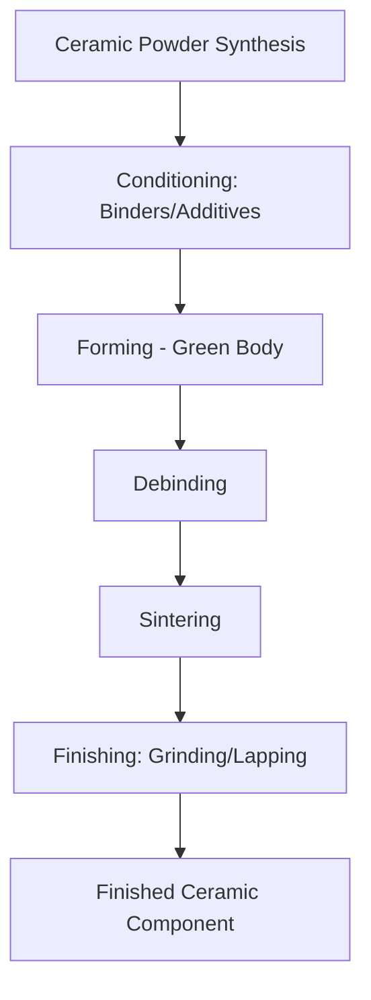
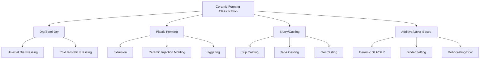

## Powder-Based Ceramic Process Classification

### Definition and Scope

Powder-based ceramic processing is the classification family covering the manufacture of ceramic components from particulate raw materials through forming, densification, and finishing steps. It parallels powder metallurgy's press-sinter logic but differs substantially in raw material chemistry (oxides, carbides, nitrides, and other covalent/ionic-bonded compounds rather than metals), the near-total reliance on sintering (since ceramics are rarely forged or machined plastically), and the central role of additives (binders, plasticizers, sintering aids) needed to compensate for the poor plastic deformability of ceramic powders.

### General Process Sequence

1. **Powder synthesis/preparation** — Calcination, precipitation, sol-gel synthesis, or mechanical milling to produce ceramic powder with controlled particle size, purity, and phase composition.
2. **Powder conditioning** — Addition of binders, plasticizers, dispersants, and sintering aids; spray drying to produce free-flowing granules for press feeding.
3. **Forming (green shaping)** — Consolidation into a green body via one of several classified forming routes (see below).
4. **Binder removal (debinding)** — Thermal or solvent removal of organic additives prior to full-temperature sintering.
5. **Sintering/densification** — High-temperature consolidation, often well above PM metal sintering temperatures relative to melting point, due to ceramics' lower self-diffusion rates.
6. **Finishing** — Grinding, lapping, or other hard-machining operations, since ceramics are generally unmachinable by conventional cutting once fully dense.

### Classification by Forming Method

**Dry/Semi-Dry Forming**

- **Uniaxial Die Pressing** — Granulated (typically spray-dried) powder pressed in a rigid die; used for simple shapes at high volume (tiles, electronic substrates, cutting inserts).
- **Cold Isostatic Pressing (CIP)** — Powder in a flexible mold pressurized isostatically; used for more complex or elongated ceramic shapes (insulators, crucibles) before machining in the green or bisque state.

**Plastic Forming**

- **Extrusion** — Plasticized ceramic paste forced through a die to produce continuous cross-sections (tubes, honeycomb substrates, rods).
- **Injection Molding (Ceramic Injection Molding, CIM)** — Analogous to MIM; fine ceramic powder mixed with a thermoplastic binder system, injection molded, then debound and sintered — used for complex small parts (technical ceramic components, some biomedical implants).
- **Jiggering/Roller Forming** — Traditional plastic-forming technique for axisymmetric ware (tableware, some technical ceramics), where a rotating plaster mold and profile tool shape the piece.

**Casting/Slurry-Based Forming**

- **Slip Casting** — Ceramic slurry (slip) poured into a porous plaster mold that draws out liquid via capillary action, building a green wall thickness against the mold surface; used for complex hollow shapes (sanitaryware, artistic and some technical ceramics).
- **Tape Casting** — A thin ceramic slurry is spread via a doctor blade onto a moving carrier film to produce thin, flexible green sheets; central to multilayer ceramic capacitors (MLCCs) and ceramic substrates.
- **Gel Casting** — Slurry containing a monomer system is cast into a mold and polymerized in situ, producing a rigid green body with good uniformity and complex-shape capability; used for high-performance and net-shape technical ceramics.

**Additive/Layer-Based Forming**

- **Ceramic Stereolithography (SLA/DLP)** — Photopolymerizable ceramic-loaded resin selectively cured layer-by-layer, followed by debinding and sintering.
- **Binder Jetting (ceramic)** — Liquid binder selectively deposited onto ceramic powder bed layers, forming a green part for subsequent sintering — analogous to metal binder jetting.
- **Robocasting/Direct Ink Writing (DIW)** — Extrusion of a shear-thinning ceramic paste through a fine nozzle, building parts layer-by-layer without a mold.

### Classification by Sintering/Densification Route

- **Conventional Solid-State Sintering** — Furnace sintering below melting point, relying on grain-boundary and volume diffusion; slower than metals due to lower diffusivity in ionic/covalent lattices, often requiring sintering aids (e.g., MgO in alumina) to control grain growth.
- **Liquid-Phase Sintering** — A glassy or liquid secondary phase (often from sintering aid additions) forms at temperature, accelerating densification via solution-reprecipitation; common in silicon nitride and some alumina/zirconia systems.
- **Hot Pressing** — Simultaneous uniaxial pressure and heat, used for hard-to-densify ceramics (silicon carbide, boron carbide) requiring near-theoretical density with minimal grain growth.
- **Hot Isostatic Pressing (HIP)** — Post-sinter (or "sinter-HIP" combined) isostatic gas pressure closes residual porosity, pushing density toward theoretical maximum; used for structural and optical ceramics requiring maximum reliability.
- **Spark Plasma Sintering (SPS)** — Pulsed current-assisted rapid sintering, increasingly used for advanced structural and functional ceramics requiring fine, controlled microstructure.
- **Microwave/Field-Assisted Sintering** — Volumetric heating approaches explored to reduce cycle time and, in some systems, enhance densification kinetics. [Inference: effectiveness is composition-dependent per ceramics processing literature]

### Comparison Across the Family

| Forming route | Green shape complexity | Typical application | Distinguishing mechanism |
| --- | --- | --- | --- |
| Die pressing | Low-moderate | Tiles, substrates, inserts | Rigid-die uniaxial compaction |
| CIP | Moderate | Insulators, crucibles | Isostatic fluid pressure |
| Extrusion | Continuous cross-section | Tubes, honeycombs | Plasticized paste through die |
| CIM | High (fine detail) | Small technical/biomedical parts | Injection molding + debind |
| Slip casting | High (hollow/complex) | Sanitaryware, technical shapes | Capillary drainage into plaster mold |
| Tape casting | Thin sheet/laminate | MLCCs, substrates | Doctor-blade slurry spreading |
| Robocasting/DIW | Very high (freeform) | Prototypes, lattice structures | Layer-wise paste extrusion |

### Illustrative Example

An alumina ceramic insulator: high-purity alumina powder is spray-dried with a polymeric binder into free-flowing granules, uniaxially die-pressed at approximately 50–100 MPa to form a green compact, then sintered in air at approximately 1600–1700°C for several hours, relying on a small MgO sintering aid addition to inhibit abnormal grain growth and achieve near-theoretical density (>99%) with the required electrical and mechanical properties.

### Related Topics

- Ceramic powder synthesis routes (calcination, sol-gel, precipitation)
- Binder systems and debinding kinetics in ceramic injection molding
- Slip casting rheology and mold design
- Tape casting for multilayer ceramic capacitors (MLCCs)
- Sintering aids and grain growth control in structural ceramics
- Spark plasma sintering for advanced/functional ceramics