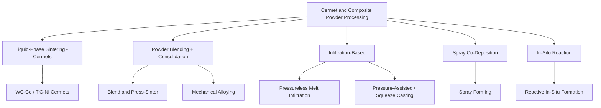

## Cermet and Composite Powder-Process Classification

### Definition and Scope

Cermets (ceramic-metal composites) and powder-processed metal/ceramic composites form a classification bridging powder metallurgy and powder-based ceramic processing. These materials combine a hard, often brittle ceramic or carbide phase with a ductile metallic binder phase, or embed reinforcing particulates/fibers within a metal or ceramic matrix, to achieve property combinations unattainable by either constituent alone (e.g., high hardness with fracture toughness, or high stiffness with reduced weight). Processing classification here centers on how the two dissimilar phases are combined, densified, and bonded at the interface.

### Core Material Categories

- **Cermets** — Ceramic hard phase (typically a carbide, nitride, or oxide) bonded by a metallic binder. The archetypal example is tungsten carbide-cobalt (WC-Co), though titanium carbide/titanium carbonitride-nickel systems are also common in cutting-tool cermets.
- **Metal Matrix Composites (MMCs)** — A continuous metal matrix (aluminum, titanium, magnesium, copper) reinforced with ceramic particulates, whiskers, or fibers (SiC, Al₂O₃, graphite) to improve stiffness, wear resistance, or thermal management.
- **Ceramic Matrix Composites (CMCs)** — A continuous ceramic matrix reinforced with ceramic fibers (typically SiC or carbon fibers) to overcome the brittleness of monolithic ceramics, primarily processed via distinct infiltration routes rather than simple powder pressing.

### Process Classification by Combination Method

**Liquid-Phase Sintering Route (Cermets)**

The dominant route for cemented carbides. Carbide powder (e.g., WC) is blended with metallic binder powder (e.g., Co) via ball milling, compacted (uniaxial or CIP), then sintered above the binder's melting/eutectic point. The molten binder phase wets the carbide grains, driving densification via solution-reprecipitation while the carbide skeleton remains solid — a specific application of the liquid-phase sintering mechanism to a two-phase, chemically dissimilar system.

**Powder Blending + Conventional Consolidation (Particulate MMCs)**

- **Powder Blending and Pressing** — Metal matrix powder mechanically blended with ceramic reinforcement particulate, then consolidated via conventional PM press-and-sinter or hot pressing/HIP routes.
- **Mechanical Alloying** — High-energy ball milling repeatedly fractures and cold-welds matrix and reinforcement powders, achieving fine, uniform dispersion of reinforcement (and sometimes in-situ dispersoid formation) prior to consolidation.

**Infiltration-Based Routes**

- **Pressureless/Melt Infiltration** — A porous preform (ceramic particulate or fiber skeleton, or a pressed powder compact) is infiltrated by molten metal drawn in via capillary action or applied pressure, forming the composite in a single consolidation step. Common for SiC-particulate/Al MMCs and some WC-Co variants (infiltration-based cemented carbide production).
- **Pressure-Assisted (Squeeze Casting) Infiltration** — External pressure forces molten metal into a fiber or particulate preform, improving infiltration completeness and reducing porosity relative to pressureless routes.

**Spray-Based Co-Deposition**

- **Spray Forming/Co-Deposition** — Atomized molten matrix metal is co-sprayed with ceramic reinforcement particles onto a substrate, building up a composite deposit directly from the liquid-plus-particulate state, bypassing a separate powder-blend-and-consolidate sequence.

**In-Situ Reaction Processing**

- **Reactive/In-Situ Composite Formation** — Reinforcement phase is generated by chemical reaction during processing (e.g., reaction of matrix melt with a reinforcement precursor), producing thermodynamically stable, well-bonded interfaces distinct from mechanically mixed composites.

### Comparative Summary

| Route | Phase combination mechanism | Typical system | Interface characteristic |
| --- | --- | --- | --- |
| Liquid-phase sintering | Molten binder wets solid carbide | WC-Co, TiC-Ni | Strong, well-established (mature process) |
| Blend + press/sinter | Mechanical mixing, solid-state bonding | Al-SiC particulate MMC | Moderate; interface quality process-dependent |
| Mechanical alloying | Repeated fracture/cold-weld | Oxide-dispersion-strengthened alloys | Fine, uniform dispersoid distribution |
| Melt infiltration | Capillary/pressure-driven liquid ingress | Al/SiC preform, WC-Co variants | Depends on wetting behavior, can require surface treatment |
| Spray co-deposition | Simultaneous atomization + particulate injection | Al-SiC spray-formed composites | Rapid solidification limits interfacial reaction |
| In-situ reaction | Chemical reaction generates reinforcement | Al-TiC, Al-TiB₂ in-situ composites | Thermodynamically stable, strong bonding |

### Key Processing Considerations

**Key Points**

- **Wettability** between the ceramic/reinforcement phase and the metallic binder or matrix governs whether liquid-phase sintering or infiltration will proceed successfully without excessive porosity; poor wetting often requires surface coating of the reinforcement or alloying additions to the matrix.
- **Interfacial reaction control** is critical — excessive reaction can form brittle intermetallic layers that degrade toughness, while insufficient reaction produces weak, debonding-prone interfaces. [Inference: general MMC/cermet processing principle, degree varies by specific system]
- **Reinforcement distribution uniformity** (avoiding clustering) strongly affects mechanical property consistency, driving the use of mechanical alloying or careful blending protocols over simple mixing for demanding applications.
- **Thermal expansion mismatch** between matrix and reinforcement generates residual stresses on cooling from processing temperature, influencing both processing route selection and post-process heat treatment design.

### Illustrative Example

A cutting-tool insert grade of cemented carbide: WC powder (typically 1–5 µm) is ball-milled with 6–15 wt% cobalt powder and a small amount of grain-growth inhibitor (e.g., VC or Cr₃C₂), spray-dried into granules, uniaxially pressed into an insert blank, then sintered at approximately 1400–1450°C — above the WC-Co eutectic temperature — under vacuum or controlled atmosphere. The cobalt melts, wets the WC grains, and via solution-reprecipitation densifies the compact to near-theoretical density, often followed by a sinter-HIP step to eliminate any residual porosity for maximum fracture toughness.

### Related Topics

- Cemented carbide (WC-Co) grain growth inhibitors and grade design
- Wettability and interfacial chemistry in metal-ceramic systems
- Mechanical alloying parameters (ball-to-powder ratio, milling time)
- Pressureless vs. pressure-assisted metal matrix composite infiltration
- Spray forming process parameters and microstructure control
- In-situ metal matrix composite synthesis (reactive processing)