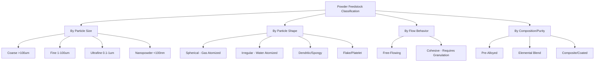

## Classification by Powder Feedstock Characteristics

<syllabot_broad_topic/>

### Definition and Scope

This classification organizes powder-based processes not by the forming or densification method used, but by the intrinsic physical and chemical characteristics of the powder feedstock itself — particle size, shape, distribution, flowability, composition, and surface condition. These characteristics determine which downstream process routes (die pressing, injection molding, powder-bed fusion, slip casting, etc.) are viable, making feedstock classification a prerequisite framework that governs process selection across the entire particulate manufacturing family.

### Classification by Particle Size

- **Coarse powders (>100 µm)** — Free-flowing, low surface-area-to-volume ratio, low green strength contribution from surface forces; suited to simple die pressing and loose powder sintering where high packing density from flow is prioritized.
- **Fine powders (1–100 µm)** — The most common range for conventional PM and technical ceramics; balances flowability (often aided by granulation) with sinterability, since smaller particles have higher surface energy driving diffusion.
- **Ultrafine/submicron powders (0.1–1 µm)** — Higher surface energy accelerates sintering kinetics and enables lower sintering temperatures, but flowability is poor without granulation; common in advanced ceramics and cemented carbide grades requiring fine microstructure.
- **Nanopowders (<100 nm)** — Extremely high surface-area-to-volume ratio drives very rapid sintering onset and enables unique property combinations (e.g., enhanced hardness, novel optical/electronic behavior), but present significant handling, agglomeration, and safety challenges (dust explosion risk, reactivity). [Inference: handling hazard severity is composition-dependent per powder-processing safety literature]

### Classification by Particle Shape/Morphology

- **Spherical powders** — Produced primarily by gas atomization; excellent flowability and packing behavior, essential for powder-bed additive manufacturing processes (SLS/SLM/EBM) and metal injection molding feedstocks where uniform layer spreading or mold filling is critical.
- **Irregular/angular powders** — Typically from water atomization or mechanical/chemical reduction methods; poorer flowability but higher green strength in die pressing due to mechanical interlocking between particles — often preferred for conventional press-and-sinter PM.
- **Dendritic/spongy powders** — Produced by processes like electrolytic deposition or reduction of oxides (e.g., sponge iron); high surface area and compressibility, historically significant in early PM iron powder production.
- **Flake/platelet powders** — Produced by ball milling or specific mechanical processes; used in specialized applications such as some friction materials or particular composite reinforcements.

### Classification by Flow Behavior

- **Free-flowing powders** — Flow readily under gravity without external aid; required for automated die-fill systems, powder-bed spreading in additive manufacturing, and consistent tap density.
- **Cohesive powders** — Fine or irregular powders with significant inter-particle friction and van der Waals forces that impede flow; typically require **granulation** (spray drying with binder) to form free-flowing agglomerates before die pressing or injection molding, especially common in ceramic processing.
- **Flow behavior is typically characterized** via Hall flowmeter funnel tests, angle of repose measurement, and Hausner ratio/Carr index (bulk vs. tap density comparison), which quantitatively inform process parameter selection.

### Classification by Composition/Alloying Strategy

- **Elemental powder blends** — Individual pure metal powders mechanically mixed prior to consolidation; lower cost, but relies on inter-diffusion during sintering to homogenize composition, which can leave residual porosity (Kirkendall-type effects) or compositional gradients.
- **Pre-alloyed powders** — Produced by atomizing a pre-melted alloy, ensuring homogeneous composition within each particle; commonly used for stainless steels, superalloys, and titanium alloys where compositional uniformity is critical to properties.
- **Composite/coated powders** — Individual particles consist of a core material coated with a secondary phase (e.g., diffusion-alloyed steel powders with a partial nickel/copper/molybdenum surface layer), engineered to combine handling/compaction advantages of one phase with alloying benefits of another.
- **Master alloy/hybrid blends** — A concentrated alloying-element powder ("master alloy") blended with base powder in controlled proportion, balancing cost and homogeneity considerations.

### Classification by Surface Condition/Purity

- **Oxide-free (reduced) powders** — Processed to minimize surface oxide layers, critical for reactive metals and applications demanding maximum sinterability and mechanical properties.
- **Oxide-coated/passivated powders** — Intentional or incidental surface oxide layer, which must be accounted for (and typically reduced) during sintering atmosphere design; excessive oxide content degrades sintered density and mechanical properties.
- **Contamination-controlled powders** — Classified by interstitial content (oxygen, nitrogen, carbon) especially critical in titanium and refractory metal powders, where trace interstitials significantly affect ductility and fatigue performance.

### Comparative Summary

| Feedstock characteristic | Key parameter | Primary process impact |
| --- | --- | --- |
| Particle size | D50, size distribution (PSD) | Sintering kinetics, packing density, green strength |
| Particle shape | Sphericity, aspect ratio | Flowability, powder-bed spreadability, die-fill uniformity |
| Flow behavior | Hausner ratio, angle of repose | Die-fill consistency, need for granulation |
| Composition strategy | Homogeneity, alloying method | Property uniformity, sintering shrinkage behavior |
| Surface condition | Oxide/interstitial content | Sinterability, final mechanical/ductility properties |

### Illustrative Example

Selecting feedstock for a laser powder-bed fusion (SLM) titanium aerospace bracket versus a conventional press-and-sinter iron gear illustrates the classification's practical impact: the SLM process requires **gas-atomized, spherical, free-flowing Ti-6Al-4V powder** in a narrow size band (typically ~15–45 µm) to ensure uniform, thin powder-bed layers and consistent melt-pool behavior, with strict interstitial (oxygen) control to preserve ductility. In contrast, the iron gear uses **irregular, water-atomized iron powder** blended with graphite and lubricant, where the irregular shape's mechanical interlocking is advantageous for green strength during die pressing — a directly opposite feedstock shape preference driven entirely by the differing consolidation mechanism.

### Related Topics

- Atomization methods (gas, water, centrifugal) and resulting powder morphology
- Powder characterization techniques (laser diffraction PSD, SEM morphology, flowmeter testing)
- Granulation and spray drying for ceramic and PM feedstock
- Diffusion-alloyed and coated powder production
- Interstitial control in titanium and refractory metal powder production
- Powder-bed additive manufacturing feedstock specifications