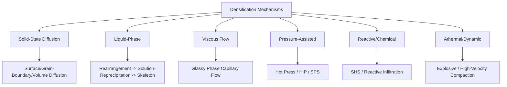

## Classification by Densification Mechanism

### Definition and Scope

This classification organizes powder-based processes by the underlying physical or physicochemical mechanism responsible for eliminating porosity and bonding particles into a coherent solid — rather than by the equipment used or the material processed. Densification mechanism is the most fundamental classification axis in particulate processing because it determines achievable final density, microstructural outcome (grain size, porosity distribution), and the thermodynamic/kinetic conditions (temperature, pressure, time) required, independent of whether the material is a metal, ceramic, or composite.

### Primary Densification Mechanisms

**Solid-State Diffusion Sintering**

Densification occurs entirely below the melting point of all constituents via atomic transport mechanisms: surface diffusion, lattice (volume) diffusion, grain-boundary diffusion, and viscous/plastic flow, each active to different degrees depending on temperature stage. Neck growth between particles progresses through distinct stages (initial contact, neck growth, pore rounding, and final-stage pore elimination), driven by the reduction of total surface energy. This is the mechanism underlying conventional PM steel sintering and most structural ceramic sintering.

**Liquid-Phase Sintering**

A minor constituent melts at processing temperature, forming a liquid that wets the remaining solid phase. Densification proceeds through three overlapping stages: (1) particle rearrangement under capillary forces from the liquid, (2) solution-reprecipitation, where solid dissolves into the liquid at high-curvature contact points and reprecipitates at lower-curvature surfaces, and (3) solid-state skeleton formation as the solid phase begins to bond directly. This mechanism is faster and achieves higher density than pure solid-state sintering, at the cost of requiring a compatible, wetting liquid-forming constituent.

**Viscous Flow Sintering**

Densification driven by bulk viscous flow of a glassy or amorphous phase under surface-tension-driven capillary stress, rather than diffusion or liquid-phase reprecipitation. Characteristic of glass-ceramic systems and some silicate-based ceramics where a substantial glassy phase forms at sintering temperature.

**Pressure-Assisted (Mechanical) Densification**

External mechanical pressure is applied concurrently with elevated temperature, supplementing or substituting for diffusion-driven densification with plastic deformation and creep mechanisms at particle contacts. Achieves near-full density at lower temperatures or shorter times than pressureless sintering alone. Encompasses hot pressing, HIP, and spark plasma sintering.

**Reactive/Chemical Densification**

Densification coupled with (or driven by) a chemical reaction between constituents — exothermic reaction synthesis (SHS), reactive infiltration, or in-situ compound formation — where the reaction's heat release and/or volume change contribute directly to pore closure, distinct from purely thermally activated diffusion.

**Athermal/Dynamic Densification**

Densification achieved through mechanical energy input at high strain rates without primary reliance on thermal diffusion — explosive compaction, high-velocity compaction, and ultrasonic-assisted consolidation, where particle rearrangement, localized plastic deformation, and (in explosive compaction) localized melting at contact points drive bonding within milliseconds.

### Comparative Summary

| Mechanism | Driving force | Typical temperature regime | Achievable density | Representative process |
| --- | --- | --- | --- | --- |
| Solid-state diffusion | Surface energy reduction | 0.7–0.9 × melting point (homologous temp.) | 85–98% theoretical | Conventional PM sintering |
| Liquid-phase | Capillarity + solution-reprecipitation | Above eutectic/melting of minor phase | 95–100% theoretical | WC-Co cermet sintering |
| Viscous flow | Surface tension in glassy phase | Glass transition/softening range | Variable, composition-dependent | Glass-ceramic sintering |
| Pressure-assisted | Applied stress + thermal creep | Often lower than pressureless equivalent | 99–100% theoretical | HIP, hot pressing, SPS |
| Reactive/chemical | Exothermic reaction energy | Self-sustaining or externally initiated | Variable, reaction-dependent | SHS, reactive infiltration |
| Athermal/dynamic | Mechanical/shock energy | Near-ambient bulk, localized heating at contacts | High but often non-uniform | Explosive compaction |

### Stage-Wise Behavior Within Diffusion-Based Mechanisms

**Key Points**

- **Initial stage** — Rapid neck growth between adjacent particles dominated by surface diffusion and evaporation-condensation; minimal shrinkage.
- **Intermediate stage** — Pore channels become isolated and begin rounding; most of the overall densification (shrinkage) occurs here via grain-boundary and volume diffusion.
- **Final stage** — Isolated, closed pores shrink slowly; grain growth becomes increasingly significant and can trap pores at grain boundaries or within grains, limiting further densification without pressure assistance. [Inference: pore-grain boundary interaction dynamics are well-documented in sintering theory but degree of pore trapping is material- and processing-condition-specific]

### Mechanism Selection Logic

The choice of governing densification mechanism for a given application depends on: required final density (near-theoretical demands pressure-assisted or liquid-phase routes), acceptable processing temperature/time/cost, material compatibility (availability of a suitable liquid-forming or reactive constituent), and microstructural requirements (fine grain size favors rapid, pressure-assisted routes like SPS over long pressureless solid-state cycles, which permit more grain growth).

### Illustrative Example

Comparing two approaches to densifying the same alumina ceramic composition: **conventional pressureless solid-state sintering** at 1600–1700°C for several hours yields approximately 95–97% theoretical density with moderate grain growth, sufficient for general structural insulator applications. For an application demanding higher reliability (e.g., optical-grade or high-stress structural alumina), **hot isostatic pressing** applied either as a standalone route or as a post-sinter "sinter-HIP" step closes residual closed porosity via pressure-assisted creep/diffusion, pushing density above 99.5% theoretical — the same base material, but a different densification mechanism selected specifically because the final-stage pore-trapping limitation of pure diffusion sintering could not deliver the required density.

### Densification Curve Diagram (svg_diagram)

<svg xmlns="http://www.w3.org/2000/svg" viewBox="0 0 700 260">
\<style\>
.ax { stroke: #333; stroke-width: 1.5; }
.curve1 { stroke: #2266cc; stroke-width: 2; fill: none; }
.curve2 { stroke: #cc4422; stroke-width: 2; fill: none; }
.txt { font-family: sans-serif; font-size: 12px; fill: #222; }
\</style\>
<text x="150" y="20" class="txt" font-weight="bold">Density vs. Time by Mechanism (svg_diagram)</text>
<line x1="60" y1="220" x2="650" y2="220" class="ax" />
<line x1="60" y1="220" x2="60" y2="40" class="ax" />
<text x="330" y="245" class="txt">Time / Temperature</text>
<text x="20" y="130" class="txt" transform="rotate(-90 20 130)">Density</text>
<path d="M60,210 C150,205 200,190 260,150 C350,90 450,55 640,50" class="curve1" />
<text x="450" y="45" class="txt" fill="#2266cc">Pressure-assisted (HIP/SPS)</text>
<path d="M60,210 C150,208 220,200 300,180 C420,145 550,100 640,90" class="curve2" />
<text x="420" y="130" class="txt" fill="#cc4422">Solid-state pressureless</text>
</svg>

### Related Topics

- Sintering stage theory (initial, intermediate, final stage kinetics)
- Solution-reprecipitation mechanics in liquid-phase sintering
- Pressure-assisted densification equipment (HIP vessels, hot press dies, SPS systems)
- Grain growth control and pore-boundary interaction in final-stage sintering
- Self-propagating high-temperature synthesis (SHS) thermodynamics
- Explosive and dynamic compaction shock physics