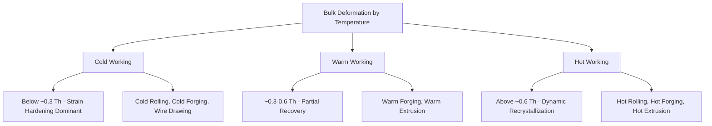

## Hot, Warm, and Cold Working Classification

### Definition and Scope

This classification organizes bulk metal deformation processes by the working temperature relative to the material's recrystallization temperature, rather than by the specific forming operation (rolling, forging, extrusion, drawing) applied. The temperature regime fundamentally governs the microstructural mechanism of deformation — whether strain hardening accumulates or is continuously relieved — and therefore determines resulting mechanical properties, dimensional precision, surface finish, and required forming forces, independent of which specific bulk deformation process is used.

### The Homologous Temperature Framework

The classification boundary is defined relative to the **homologous temperature**, $T_h = T / T_m$, where $T$ is the working temperature and $T_m$ is the material's absolute melting temperature. This ratio, rather than absolute temperature, determines whether recrystallization and recovery mechanisms are thermally activated during deformation, since different metals recrystallize at very different absolute temperatures (e.g., lead recrystallizes near room temperature, while tungsten requires temperatures the working room would consider "red hot" to reach the same homologous state).

### Cold Working

**Definition**: Deformation performed below the recrystallization temperature, typically at or near room temperature ($T_h$ roughly below 0.3).

**Mechanism**: Plastic deformation proceeds via dislocation generation and multiplication without concurrent recrystallization. Dislocations accumulate and tangle, producing **strain hardening (work hardening)** — increasing yield strength and hardness while decreasing ductility as deformation progresses.

**Key Points**

- **Advantages**: excellent surface finish, tight dimensional tolerances (often eliminating subsequent machining), significantly improved mechanical properties (strength, hardness) via strain hardening, favorable directional grain flow for certain applications.
- **Limitations**: requires substantially higher forming forces/energy than hot working for equivalent deformation; limited total deformation before cracking or requiring intermediate annealing ("process annealing") to restore ductility; residual stresses are commonly introduced.
- **Representative processes**: cold rolling, cold forging (cold heading, coining), wire drawing, cold extrusion, deep drawing (sheet-adjacent but conceptually related).

### Hot Working

**Definition**: Deformation performed above the recrystallization temperature (commonly $T_h$ above approximately 0.6, though thresholds vary by alloy system), such that recrystallization occurs concurrently with or immediately following deformation.

**Mechanism**: Dynamic recrystallization and/or dynamic recovery continuously eliminate accumulated dislocations during deformation, preventing significant net strain hardening. This permits very large shape changes without cracking and at substantially lower forming forces than cold working.

**Key Points**

- **Advantages**: large deformations achievable in a single operation; low forming forces relative to material volume processed; refines and homogenizes as-cast grain structure, closing internal porosity/voids from casting (particularly relevant for ingots being converted to wrought stock); no strain hardening retained in the final part.
- **Limitations**: poorer dimensional tolerance and surface finish than cold working (due to scaling/oxidation and thermal contraction variability); requires subsequent machining or finishing for precision applications; elevated-temperature furnace and tooling costs; oxide scale formation on most metals in air atmospheres.
- **Representative processes**: hot rolling (of ingots/blooms into plate, sheet, structural shapes), hot forging (open-die and closed-die), hot extrusion, piercing/rotary tube-making processes.

### Warm Working

**Definition**: Deformation performed at an intermediate temperature regime, generally between roughly 0.3 and 0.6 $T_h$ — above cold-working range but below full hot-working recrystallization conditions.

**Mechanism**: Some recovery (reduction of dislocation density without full recrystallization) occurs during or immediately after deformation, partially relieving strain hardening without achieving the complete softening of hot working. This provides a deliberate compromise point in the property/force/precision trade-off space.

**Key Points**

- **Advantages**: reduced forming forces relative to cold working (since partial softening lowers flow stress); improved ductility relative to cold working, permitting greater deformation per step; better dimensional control and surface finish than hot working (less scaling, more thermally stable dimensions); reduced lubrication and tooling wear demands relative to cold working in some systems.
- **Limitations**: narrower process window requiring tighter temperature control than either cold or hot working; not universally applicable across all alloys, since the useful warm-working window's benefits are material-specific. [Inference: general warm-forming literature; specific temperature windows and benefit magnitude vary substantially by alloy system]
- **Representative processes**: warm forging (particularly for steel components where full hot-forging scale/decarburization is undesirable but cold-forging forces are excessive), warm extrusion, warm compaction in adjacent powder processing.

### Comparative Summary

| Regime | Homologous temp. range | Governing mechanism | Forming force | Dimensional precision | Surface finish |
| --- | --- | --- | --- | --- | --- |
| Cold working | < ~0.3 $T_h$ | Strain hardening (dislocation accumulation) | High | Excellent | Excellent |
| Warm working | ~0.3–0.6 $T_h$ | Partial recovery | Moderate | Good | Good |
| Hot working | > ~0.6 $T_h$ | Dynamic recrystallization/recovery | Low | Poor-moderate | Poor (scaling) |

### Property and Microstructural Consequences

**Grain structure**: Hot working produces refined, equiaxed, recrystallized grains and eliminates as-cast dendritic structure and porosity. Cold working produces elongated, deformed ("pancaked") grains aligned with the primary strain direction, contributing to anisotropic mechanical properties. Warm working produces an intermediate structure, with partial grain elongation and some recovery-driven substructure formation.

**Mechanical properties**: Cold-worked material exhibits increased yield strength and hardness with reduced ductility and toughness relative to the same material hot-worked, due to retained dislocation density. This relationship is frequently exploited deliberately — cold drawing wire or cold rolling sheet specifically to achieve a target strength level via controlled strain hardening, sometimes followed by a partial "stress-relief" anneal to restore some ductility while retaining most strength gain.

### Illustrative Example

Producing a steel bolt illustrates the classification in a single component's process chain: the starting wire rod is **hot rolled** from a cast billet (large deformation, low force, grain refinement from as-cast structure), then the bolt head is **cold formed (cold heading)** from the rolled and drawn wire at room temperature, exploiting strain hardening to achieve the required head strength and the excellent dimensional precision needed for thread engagement — with no intermediate warm-working step, since standard fastener steels do not typically require the specific force/ductility compromise that warm working addresses for this geometry. In contrast, some large steel forgings (e.g., certain automotive steering components) deliberately use **warm forging** specifically to reduce the tooling wear and decarburization/scale losses associated with fully hot forging, while avoiding the very high press tonnage cold forging would require for that part's size.

### Related Topics

- Recrystallization temperature and its dependence on prior cold work and alloy composition
- Strain hardening (work hardening) exponent and its role in cold-forming force prediction
- Dynamic recrystallization vs. dynamic recovery mechanisms in hot working
- Flow stress modeling across temperature regimes (Hollomon, Johnson-Cook models)
- Scale formation and descaling in hot rolling/forging
- Process annealing between cold-working steps