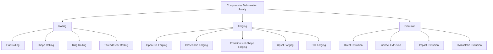

## Compressive Deformation Process Family

### Definition and Scope

Compressive deformation processes are the family of bulk metal forming operations in which the workpiece is shaped primarily through the application of compressive stress, causing material to flow plastically and increase in cross-sectional area (or fill a die cavity) while the deformation is dominated by compression rather than tension, shear, or bending. This is one of the principal classification branches of bulk deformation processing, distinguished from tensile-dominated processes (drawing) and combined stress-state processes (some extrusion variants involve both compression and shear).

### Position Within Bulk Deformation Classification

**Key Points**

- Bulk deformation processes are commonly classified by the dominant stress state imposed on the workpiece: compressive (forging, rolling, extrusion), tensile (wire/bar drawing), and combined/indirect states (some extrusion and drawing variants involve significant shear and friction-driven stress components alongside the primary state).
- Compressive processes generally permit the largest total deformation per pass without fracture, since compressive stress states suppress void nucleation and growth relative to tensile states — a key reason rolling and extrusion can achieve very large area reductions where drawing is limited by the tensile stress required to pull material through a die.
- All compressive processes can be performed hot, warm, or cold (per the temperature classification), with the same recrystallization/strain-hardening trade-offs applying within this family.

### Classification by Process Type

**Rolling**

Workpiece is passed between rotating rolls that reduce thickness while increasing length, via continuous, localized compressive contact.

- **Flat rolling** — Produces sheet, strip, and plate from slabs; the dominant hot-working process for converting cast steel/aluminum into standard mill products.
- **Shape rolling** — Rolls with contoured (grooved) surfaces progressively form structural shapes (I-beams, rails, angles) from billets through a sequence of roll passes.
- **Ring rolling** — A seamless ring is progressively thinned and enlarged in diameter between an idler roll and a driven roll, used for bearing races, flanges, and turbine rings.
- **Thread rolling and gear rolling** — Cold-forming variants where dies impress thread or gear tooth profiles into a cylindrical blank via compressive rolling contact, producing net-shape features with favorable grain flow (uninterrupted, following the tooth/thread profile) compared to cut threads/teeth.

**Forging**

Workpiece is compressively deformed, typically between shaped dies (or flat platens for open-die work), to achieve a target shape, often in a discrete, impact or press-driven stroke.

- **Open-die forging** — Simple flat or contoured dies with no cavity constraining lateral flow; used for large, simple shapes (shafts, discs) and preliminary billet conditioning (cogging).
- **Closed-die (impression-die) forging** — Dies contain a cavity matching the desired part shape; excess material flows into a flash gap, which is trimmed afterward. Produces higher shape complexity and better dimensional control than open-die forging.
- **Precision/net-shape forging** — Refined closed-die forging with minimal or no flash, tighter tolerances, and often no subsequent machining required, at higher tooling and process control cost.
- **Upset forging (heading)** — Compressive deformation increases a workpiece's cross-sectional diameter/area at the expense of length, typically to form a bolt head or similar enlarged feature at one end of a bar/wire.
- **Roll forging** — A hybrid process using contoured rolls to progressively reduce cross-section and shape elongated parts (e.g., tapered shafts, leaf springs) via successive compressive roll passes rather than press strokes.

**Extrusion**

A billet is forced through a die orifice under compressive load, causing the material to flow and take on the die's cross-sectional profile.

- **Direct (forward) extrusion** — Ram pushes the billet through a stationary die in the same direction as ram travel; friction between billet and container wall opposes ram motion, increasing required force.
- **Indirect (backward) extrusion** — The die moves relative to a stationary billet (or the billet container moves), eliminating billet-container relative sliding friction and reducing force requirements, at the cost of more complex tooling.
- **Impact extrusion** — A high-speed punch strikes a slug (often at room temperature — cold impact extrusion), causing rapid compressive flow to form thin-walled parts (e.g., aluminum cans, collapsible tubes) in a single stroke.
- **Hydrostatic extrusion** — Billet is surrounded by a pressurized fluid that transmits compressive force uniformly, reducing friction and enabling extrusion of brittle materials that would fracture under direct ram contact.

### Comparative Summary

| Process | Primary motion | Typical stock form | Distinguishing feature |
| --- | --- | --- | --- |
| Flat rolling | Continuous rotational rolls | Slab/billet → sheet/plate | Continuous, high-throughput area reduction |
| Ring rolling | Rotational, radial expansion | Pierced/donut preform → ring | Seamless annular geometry |
| Open-die forging | Discrete press/hammer stroke | Billet/ingot | Minimal lateral flow constraint |
| Closed-die forging | Discrete press/hammer stroke | Billet | Die cavity dictates final shape, flash formed |
| Upset forging | Axial compression | Bar/wire end | Localized diameter increase at bar end |
| Direct extrusion | Linear ram push | Billet | Friction opposes ram over full stroke |
| Indirect extrusion | Linear, die/container moves | Billet | No billet-container sliding friction |
| Impact extrusion | High-speed punch strike | Slug | Very rapid, often cold, thin-wall forming |

### Stress-State and Flow Considerations

**Key Points**

- **Frictional effects** at the die-workpiece interface significantly influence force requirements and material flow pattern in all three sub-families; in rolling and forging, friction can create non-uniform (barreling) deformation, while in direct extrusion, friction directly adds to required ram force.
- **Grain flow** follows the compressive deformation path, producing favorable, continuous grain orientation aligned with part geometry — a key mechanical-property advantage of forging (and rolling/extrusion to a lesser degree) over machining from bar stock, where grain flow is interrupted by material removal.
- **Redundant work** (deformation that does not contribute to net shape change but still consumes energy, often from shear near die/tool surfaces) varies by process geometry and die design, affecting overall forming efficiency. [Inference: general metal-forming mechanics principle; magnitude is process- and die-geometry-specific]

### Illustrative Example

Manufacturing a forged automotive crankshaft: a cylindrical steel billet is first **roll-formed or upset-forged** to redistribute mass to approximate the final throw/journal layout, then **closed-die hot forged** in a sequence of impression dies (blocker, then finisher) that progressively compress the billet into the crankshaft's complex, non-axisymmetric geometry, with excess material extruded laterally into a flash that is subsequently trimmed. The continuous, compression-driven grain flow following the crankshaft's contours provides fatigue strength substantially superior to an equivalent part machined from round bar stock, where grain flow would be cut across at each journal and web transition.

### Related Topics

- Rolling mill configurations (two-high, four-high, cluster mills) and pass scheduling
- Forging die design (flash land, draft angles, parting line selection)
- Extrusion ratio, die angle, and dead-metal zone formation
- Friction and lubrication effects in compressive forming (sticking vs. sliding friction)
- Grain flow analysis and its relationship to fatigue performance
- Force and energy prediction models for rolling, forging, and extrusion (slab method, upper-bound analysis)