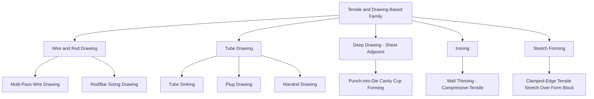

## Tensile and Drawing-Based Deformation Process Family

### Definition and Scope

Tensile and drawing-based deformation processes are the family of bulk metal forming operations in which the workpiece is shaped primarily by pulling it through or over a die or tool, imposing a dominant tensile stress state along the direction of material travel, even though the material within the die zone itself experiences a combined compressive-tensile stress state. This family sits opposite the compressive deformation family in the bulk-deformation classification: where compressive processes push material into or through a die, drawing processes pull it, fundamentally limiting achievable deformation per pass by the tensile strength of the material exiting the die.

### The Governing Stress-State Constraint

**Key Points**

- Unlike rolling, forging, or extrusion, where the applied force is compressive and can in principle be increased without an inherent material-strength ceiling on the *undeformed* section, drawing processes apply the pulling force through the already-reduced (exit) cross-section, meaning the maximum achievable area reduction per pass is fundamentally limited by the ratio of the material's flow stress in the die to its tensile strength after deformation.
- This constraint is the reason drawing processes are almost universally performed in multiple passes with intermediate annealing (for cold drawing) rather than attempting large single-pass reductions, in contrast to extrusion or rolling, which can achieve substantial single-pass area reduction.
- Because the exit section must survive the pulling tension, drawing is inherently limited to producing sections that are progressively *smaller* than the starting stock — it cannot increase cross-sectional area, unlike upset forging.

### Classification by Process Type

**Wire and Rod Drawing**

- **Wire drawing** — Round wire is pulled through a series of progressively smaller conical dies, reducing diameter while increasing length; almost universally performed cold to exploit strain hardening for final wire strength, with intermediate process annealing between drawing passes as ductility is consumed.
- **Rod/bar drawing** — Same principle at larger cross-sections, typically for precision-diameter or improved-surface-finish bar stock following hot rolling, often as a light "sizing" pass rather than major area reduction.
- **Tube drawing** — Tubular stock is drawn through a die, with or without an internal mandrel or plug to control inner diameter and wall thickness simultaneously:
  - *Sinking (tube sinking)* — No internal tool; only outer diameter is controlled by the die, inner diameter and wall thickness respond passively.
  - *Plug drawing* — A fixed or floating internal plug controls inner diameter and wall thickness concurrently with the die controlling outer diameter.
  - *Mandrel drawing* — A long mandrel (fixed or moving with the tube) provides more precise internal dimensional control than a floating plug, typically for longer tube lengths.

**Deep Drawing (Sheet-Adjacent)**

Though conventionally classified within sheet metal forming rather than bulk deformation, deep drawing shares the tensile-dominant classification logic: a flat sheet blank is pulled by a punch into a die cavity to form a cup or box shape, with the sheet in the die-radius region experiencing bending-tension while the flange region experiences compressive-tensile radial/circumferential stresses. It is noted here because its governing failure mode — tearing at the punch corner due to excessive tensile thinning — is directly analogous to the tensile-limit constraint governing wire and tube drawing.

**Ironing**

A drawn cup or shell is passed between a punch and a die with a clearance smaller than the wall thickness, thinning and elongating the wall via a combined compressive (through-thickness) and tensile (axial) stress state; commonly used following deep drawing to achieve uniform, thin wall sections (e.g., beverage can bodies). Classified adjacent to drawing due to the shared tensile-elongation objective, though the dominant local stress state at the wall is compressive-through-thickness.

**Stretch Forming**

A sheet or plate is clamped at its edges and stretched over a die/form block by tensile force alone (no punch penetration through a die cavity as in deep drawing), used for large, shallow-curvature aircraft skin panels and similar parts where uniform tensile strain rather than complex flow is the shaping mechanism.

### Comparative Summary

| Process | Cross-section change | Dominant local stress state | Typical stock form |
| --- | --- | --- | --- |
| Wire drawing | Diameter reduction | Tensile (exit) + compressive (die zone) | Rod → fine wire |
| Rod/bar drawing | Modest diameter reduction | Tensile (exit) + compressive (die zone) | Hot-rolled bar → precision bar |
| Tube sinking | OD reduction, ID/wall passive | Tensile + compressive | Tube stock |
| Plug/mandrel drawing | Controlled OD and ID/wall | Tensile + compressive, tool-constrained | Tube stock |
| Deep drawing | Sheet → cup/box (thickness ~constant) | Tensile (wall) + compressive (flange) | Flat sheet blank |
| Ironing | Wall thinning, length increase | Compressive (through-thickness) + tensile (axial) | Drawn cup/shell |
| Stretch forming | Sheet curvature, thinning | Tensile (biaxial/uniaxial) | Flat sheet/plate |

### Failure Modes Distinctive to This Family

**Key Points**

- **Necking/breakage at the die exit** — The characteristic failure mode of drawing processes; occurs when the tensile stress required to pull the material through the die exceeds the flow stress of the reduced section, directly reflecting the governing stress-state constraint described above.
- **Central burst (chevron cracking)** — Internal, cone-shaped tensile cracks that can form along the centerline of drawn rod/wire under certain die angle and reduction combinations, arising from secondary tensile stresses generated by non-uniform deformation through the die even though the overall process is compression-tension dominated.
- **Orange peel and earing** — Surface/edge defects more specific to deep drawing, arising from grain size effects and planar anisotropy respectively, distinct from the wire/tube drawing failure modes above.

### Illustrative Example

Producing fine copper wire for electrical applications illustrates the family's core constraint directly: starting hot-rolled copper rod (typically 8 mm diameter) is cold drawn through a sequence of progressively smaller dies — perhaps 15–20 passes to reach a final gauge of 0.5 mm or less — with the area reduction per pass limited to roughly 15–35% to keep the exit tensile stress safely below the material's current (strain-hardened) tensile strength. Because strain hardening reduces ductility with each pass, intermediate **process annealing** is required periodically (e.g., every several passes) to restore ductility before drawing can continue toward the final gauge — directly illustrating why this family cannot achieve compressive processes' large single-pass reductions.

### Related Topics

- Die angle and reduction-per-pass optimization in wire drawing
- Central burst (chevron crack) prediction and prevention
- Tube drawing tooling selection (sinking vs. plug vs. mandrel)
- Deep drawing limiting draw ratio (LDR) and punch/die radius design
- Process annealing scheduling in multi-pass cold drawing
- Stretch forming for large-radius aerospace skin panels