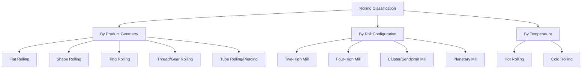

## Rolling Process Classification

### Definition and Scope

Rolling process classification organizes the rolling family — a subset of the compressive bulk deformation processes — by roll configuration, product geometry, and working temperature. Rolling is distinguished from other compressive processes (forging, extrusion) by its continuous, localized line-contact deformation mechanism: the workpiece passes between rotating rolls that progressively reduce thickness (or reshape cross-section) via a moving compressive contact zone (the "roll bite" or "arc of contact"), rather than a single discrete stroke or a forced flow through a fixed die orifice.

### Classification by Product Geometry

**Flat Rolling**

Produces sheet, strip, plate, and foil from slab or billet stock via rolls with plain cylindrical (flat) surfaces. The workpiece thickness is reduced and its length increases correspondingly, with width change being comparatively minor (though not negligible — "spread" — especially in early passes on wide slabs).

**Shape Rolling**

Rolls with contoured, grooved surfaces ("roll passes" or "calibers") progressively transform a billet's cross-section into structural profiles — I-beams, channels, angles, rails — through a sequence of shaped roll stands, each pass bringing the cross-section closer to final profile.

**Ring Rolling**

A pierced, donut-shaped preform is placed between a driven main roll (external) and an idler mandrel roll (internal); as the rolls compress the ring wall, the ring's diameter progressively increases while wall thickness decreases, producing seamless annular components (bearing races, flanges, jet engine casings) with continuous, favorable circumferential grain flow.

**Thread and Gear Rolling**

Dies (flat or cylindrical, with the thread/tooth profile) compressively displace material on a cylindrical blank to form threads or gear teeth without cutting; performed cold in most cases, producing net-shape features with uninterrupted, favorable grain flow following the tooth/thread profile — a key fatigue-strength advantage over cut threads/teeth.

**Tube Rolling (Piercing/Elongation)**

Specialized rolling configurations (e.g., the Mannesmann piercing process, using angled rolls to create a rotating, axially advancing billet that develops an internal cavity via induced tensile stresses at the centerline) produce seamless tube and pipe from round billet stock, followed by additional rolling stands (plug mill, mandrel mill) to control final wall thickness and diameter.

### Classification by Roll Stand Configuration

- **Two-high mill** — Two opposing rolls of equal diameter, the simplest configuration; can be reversing (workpiece passes back and forth through the same stand) or non-reversing (single direction, requiring a separate stand for each pass).
- **Three-high mill** — Three rolls stacked vertically; workpiece passes forward between the bottom and middle rolls, then backward between the middle and top rolls, avoiding the need to reverse roll rotation direction between passes.
- **Four-high mill** — Two smaller-diameter working rolls (in contact with the workpiece) are backed by larger-diameter backup rolls that resist roll bending, enabling thinner, more dimensionally uniform sheet/strip via reduced roll deflection.
- **Cluster mill (Sendzimir mill)** — Very small-diameter working rolls (enabling very thin gauge and high-strength material rolling) are supported by multiple tiers of backing rolls to control the working rolls' otherwise-excessive deflection.
- **Planetary mill** — A set of small planetary rolls orbits around large backing rolls, each planetary roll imparting a small incremental reduction, together achieving a large total reduction in a single mill pass — historically notable for enabling large single-pass reductions of hot slab.
- **Tandem mill configuration** — Multiple rolling stands arranged in sequence, with the workpiece passing continuously through each in turn, each stand applying a portion of the total required reduction; standard for high-throughput continuous sheet/strip production.

### Classification by Working Temperature

- **Hot rolling** — Performed above the recrystallization temperature; used for primary conversion of cast ingot/slab/bloom into intermediate mill products (plate, hot-rolled coil, structural shapes, rail), since large reductions are needed and dimensional/surface-finish requirements are comparatively loose at this stage.
- **Cold rolling** — Performed at or near room temperature, typically on material already hot-rolled to an intermediate gauge; used to achieve final dimensional precision, surface finish, and strain-hardened mechanical properties (e.g., cold-rolled sheet steel, foil), generally requiring intermediate annealing between passes for larger total reductions.

### Comparative Summary

| Configuration/Type | Primary purpose | Typical product | Key mechanical feature |
| --- | --- | --- | --- |
| Two-high (reversing) | General-purpose, lower-volume | Plate, initial breakdown passes | Simple, workpiece reverses direction |
| Four-high | Thin, dimensionally precise sheet/strip | Cold-rolled sheet, foil | Backup rolls control working-roll deflection |
| Cluster (Sendzimir) | Very thin/hard-to-roll material | Stainless steel foil, precision strip | Multi-tier backing controls small working-roll deflection |
| Tandem | High-throughput continuous production | Hot/cold-rolled coil | Sequential stands, continuous strip travel |
| Ring rolling | Seamless annular parts | Bearing races, flanges | Radial wall thinning increases diameter |
| Piercing/tube rolling | Seamless tube/pipe | Seamless pipe | Induced centerline tensile cavity formation |

### Key Process Parameters and Considerations

**Key Points**

- **Draft** (thickness reduction per pass) and **roll separating force** are fundamental rolling parameters; roll force increases with draft, workpiece width, and material flow stress, and decreases with reduced friction and smaller roll radius (up to the point where insufficient "bite angle" prevents the rolls from gripping the workpiece).
- **Roll flattening** (elastic deformation of the roll surface under load) becomes significant at high forces or with small-diameter rolls, effectively increasing the contact arc length and complicating force prediction — a primary motivator for four-high and cluster mill designs in demanding applications.
- **Spread** (lateral width increase during flat rolling, particularly with wide, low-width-to-thickness workpieces) must be accounted for in pass scheduling to hit final width targets without excessive edge trimming.
- **Neutral point** location within the roll bite (where workpiece and roll surface velocities match) governs the friction direction split (forward-slip vs. backward-slip zones) and is central to accurate roll torque/power prediction. [Inference: standard rolling mechanics theory, though exact neutral point location is sensitive to friction coefficient and reduction ratio in practice]

### Illustrative Example

Producing automotive cold-rolled sheet steel illustrates the full classification chain: a continuously cast steel slab is first **hot rolled** through a tandem mill sequence of roughing and finishing stands (two-high and four-high configurations) to reduce thickness from roughly 200+ mm to approximately 2–6 mm hot-rolled coil, with recrystallization between passes preventing strain hardening. The coil is then pickled to remove scale and **cold rolled** through a further tandem sequence of four-high stands to final gauge (often below 1 mm), where roll force management via backup rolls is essential to achieving the tight thickness tolerance and surface finish automotive body panels require — followed by a final annealing and temper-rolling (skin-pass) step to restore formability while imparting a controlled surface texture.

### Related Topics

- Roll force and torque prediction (slab method, Sims' equations)
- Roll flattening and its correction (Hitchcock's formula)
- Tandem mill pass scheduling and inter-stand tension control
- Ring rolling process design and mandrel/main roll sizing
- Mannesmann piercing mechanics and seamless tube mill trains
- Cold-rolled sheet annealing and temper rolling (skin-pass)