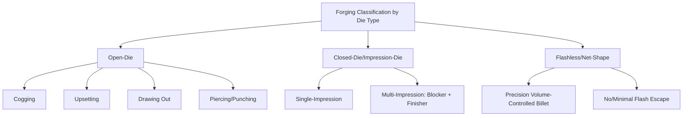

## Forging Process Classification by Die Type

### Definition and Scope

This classification organizes forging processes specifically by the geometric constraint the die imposes on material flow — from complete freedom of lateral flow (open-die) to full geometric confinement (closed-die/impression-die) to zero lateral flow (flashless/net-shape) — rather than by temperature regime, equipment type, or product application. Die type is a primary determinant of achievable shape complexity, dimensional tolerance, material utilization, and required forming force, making it a foundational classification axis within the forging sub-family of compressive bulk deformation.

### Open-Die Forging

**Definition**: The workpiece is compressed between flat or simply-contoured dies (platens, V-dies, or swage dies) that do not fully enclose the material; excess material is free to flow laterally, unconstrained by any cavity.

**Key Points**

- **Advantages**: minimal tooling cost and lead time (no dedicated cavity die required); suitable for very large workpieces (ship shafts, large industrial rolls) exceeding the capacity of any closed-die press; flexible for low-volume or one-off production; permits significant grain refinement and porosity closure from cast ingot structure.
- **Limitations**: relatively low dimensional precision and poor control of final shape complexity; requires substantial operator/machine skill and multiple reorientation steps ("manipulation") to achieve target geometry; larger machining allowance needed on the final part.
- **Representative operations**: cogging (progressive reduction and elongation of an ingot/billet along its length), upsetting (increasing diameter/area at the expense of length), drawing out (elongating and reducing cross-section, distinct from wire/tube drawing), and piercing/punching to create central holes for ring preforms.

### Closed-Die (Impression-Die) Forging

**Definition**: Dies contain a cavity (impression) machined to approximate the negative of the desired part shape; the workpiece is compressed to fill the cavity, with excess material displaced into a thin flash gap surrounding the cavity, which is trimmed in a subsequent operation.

**Key Points**

- **Advantages**: substantially higher shape complexity and dimensional control than open-die forging; better material utilization and mechanical property uniformity than machining from bar stock; favorable, continuous grain flow following the part's contours.
- **Limitations**: significant tooling cost (machined cavity dies) and lead time, generally justifying use only at moderate-to-high production volumes; flash formation represents material loss (recycled as scrap) and requires a separate trimming operation; multiple sequential die impressions (blocker, then finisher) are often required for complex shapes, adding process steps.
- **Sub-classification by die impression count**: single-impression dies for simpler shapes, and multi-impression (progressive) dies where the workpiece moves through a sequence of increasingly refined cavities (edging/fullering roughing impressions, blocker impression, finisher impression) within the same press, common for complex parts like crankshafts and connecting rods.

### Flashless (Precision/Net-Shape) Forging

**Definition**: The die cavity is fully closed with no flash gap, or with only a negligible flash allowance; the exact billet volume must be controlled closely, since there is no flash escape path to accommodate volume excess.

**Key Points**

- **Advantages**: near-net or fully net-shape parts requiring minimal or no subsequent machining; eliminates flash material loss and trimming operations, improving material utilization; tighter dimensional tolerances achievable than conventional closed-die forging.
- **Limitations**: requires very precise billet volume control (typically via precision sawing/shearing or precision-rolled preforms) since excess material has no escape path and can cause die damage or incomplete fill from insufficient volume; higher die design and process control sophistication and cost.
- **Representative applications**: precision-forged gears, some turbine blades, and net-shape aerospace structural components where machining cost/material waste reduction justifies the higher process control investment.

### Comparative Summary

| Die type | Lateral flow constraint | Dimensional precision | Tooling cost | Material utilization | Typical volume |
| --- | --- | --- | --- | --- | --- |
| Open-die | Unconstrained | Low-moderate | Low | Low (large machining allowance) | Low, large/custom parts |
| Closed-die (with flash) | Cavity-constrained, flash escape | Moderate-high | Moderate-high | Moderate (flash loss) | Moderate-high |
| Flashless/net-shape | Fully constrained, no escape | High | High | High (minimal waste) | Moderate-high, high-value parts |

### Flash Design Considerations in Closed-Die Forging

**Key Points**

- The **flash land** (narrow, high-friction land immediately surrounding the cavity) intentionally restricts material outflow late in the forging stroke, building back-pressure within the cavity to ensure complete die fill in fine details before material is permitted to escape as flash.
- **Flash thickness and land width** represent a design trade-off: thinner/longer flash lands improve fill completeness and dimensional accuracy but increase required forging force and flash trimming complexity.
- Flash is normally **removed in a separate trimming die** (a shearing operation) immediately or shortly after forging, sometimes while the part is still at elevated temperature to reduce trimming force. [Inference: hot-trim practice is common for hot-forged carbon and low-alloy steels; not universal across all forged materials]

### Illustrative Example

Forging an automotive connecting rod demonstrates progression through die types within a single production sequence: a cylindrical billet is first **open-die upset** (or roll-forged) to redistribute mass into an approximate elongated preform shape, minimizing the volume of material that must flow within the more expensive impression dies. The preform then proceeds through a **multi-impression closed-die** sequence — typically a blocker impression that establishes the rough connecting-rod silhouette, followed by a finisher impression that produces final geometry with a controlled flash — after which the flash is trimmed in a separate die. Some high-performance or fracture-split connecting rod designs pursue further precision-forging refinement to minimize machining stock on critical bearing bore surfaces, approaching flashless/net-shape practice for those specific features while retaining conventional flash elsewhere on the part.

### Related Topics

- Cogging and open-die reduction scheduling for large ingots
- Blocker and finisher impression design in multi-step closed-die forging
- Flash land geometry optimization and trimming die design
- Precision billet volume control methods (sawing, precision shearing, precision rolling)
- Forging force prediction (slab method, upper-bound analysis) by die type
- Grain flow analysis in impression-die forged components