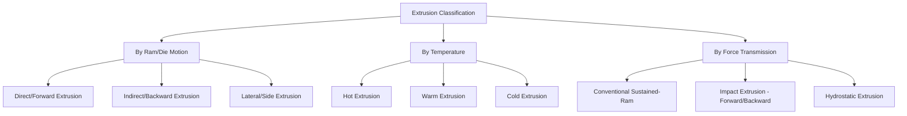

## Extrusion Process Classification

### Definition and Scope

Extrusion process classification organizes the extrusion family — a compressive bulk deformation process in which a billet is forced through a die orifice to take on the die's cross-sectional profile — by ram/die relative motion, working temperature, and applied force transmission method. Extrusion is distinguished from rolling (continuous line contact) and forging (discrete open compression) by its defining mechanism: material flow is driven through a fixed-geometry orifice under sustained compressive ram force, enabling production of long, constant-cross-section profiles (including complex, hollow, and asymmetric shapes) not achievable by other compressive processes in a single operation.

### Classification by Ram/Die Relative Motion

**Direct (Forward) Extrusion**

The ram pushes the billet through a stationary die positioned at the far end of the container, with material flow direction matching ram travel direction. Friction between the billet's outer surface and the container wall opposes ram motion along the entire stroke length, meaning required force is highest at the start (full billet-container contact area) and decreases as the billet shortens — though a increase near stroke end from the increasingly disturbed/heterogeneous butt-end flow is also observed in practice. This friction penalty is the dominant limitation of direct extrusion, and the residual, non-extrudable billet fraction left in the container ("butt") represents unavoidable material loss.

**Indirect (Backward/Reverse) Extrusion**

The die is mounted on a hollow ram that moves toward a stationary billet (or, equivalently, the container and billet move while the die/ram assembly remains fixed relative to the extruded product), eliminating relative sliding between the billet and container wall. This removes the container-friction force component entirely, resulting in significantly lower and more uniform force throughout the stroke compared to direct extrusion — at the cost of a more complex, hollow ram/die tooling arrangement and reduced ram stiffness (since the ram must be hollow to allow the extruded product to pass through it).

**Lateral (Side) Extrusion**

The extruded product exits perpendicular to the ram's axis of travel, used in specialized applications (e.g., certain cable-sheathing operations) where the product geometry or downstream handling favors a perpendicular exit path.

### Classification by Working Temperature

- **Hot extrusion** — Performed above the material's recrystallization temperature, exploiting reduced flow stress to extrude high-strength alloys (steels, titanium, high-strength aluminum alloys) and achieve large area reductions; requires die and container heating/lubrication systems (e.g., glass lubricants for steel hot extrusion) to manage extreme thermal and frictional conditions.
- **Cold extrusion** — Performed at or near room temperature, typically on more readily deformable metals (aluminum, copper, lead, some steels via specific processes); yields improved surface finish, tighter tolerances, and strain-hardening-derived strength gains, but requires substantially higher force per unit cross-sectional area than hot extrusion for equivalent reduction.
- **Warm extrusion** — Intermediate temperature regime balancing force reduction against dimensional/surface-finish benefits, commonly applied to steel components (e.g., some automotive driveline parts) where full hot-extrusion scale and cold-extrusion force are both undesirable.

### Classification by Force Transmission Method

- **Impact extrusion** — A high-speed punch strikes a slug (commonly at room temperature) held in an open or shallow die cavity, driving very rapid compressive flow to form thin-walled, often cup-shaped parts (collapsible tubes, aluminum beverage/aerosol cans, some battery casings) in a single, brief stroke rather than a sustained, continuous ram push.
  - *Forward impact extrusion* — Extruded material flows in the same direction as punch travel.
  - *Backward (reverse) impact extrusion* — Extruded material flows back around the punch, opposite to punch travel direction — the more common configuration for thin-walled cup production.
- **Hydrostatic extrusion** — The billet is fully surrounded by a pressurized fluid medium (rather than direct mechanical ram contact against the billet's rear face) that transmits force uniformly and eliminates billet-container friction entirely (similar benefit to indirect extrusion, achieved by different means); particularly valuable for extruding brittle materials at room or moderate temperature, since the uniform hydrostatic pressure component suppresses fracture that direct mechanical contact stress concentrations might otherwise trigger.

### Comparative Summary

| Type | Friction characteristic | Force profile | Typical product | Distinguishing feature |
| --- | --- | --- | --- | --- |
| Direct extrusion | High (billet-container sliding) | High at start, variable through stroke | Bar, rod, structural profiles | Simplest, most common tooling |
| Indirect extrusion | Minimal (no billet-container sliding) | Lower, more uniform | Similar profiles, improved efficiency | Hollow ram/die assembly |
| Hydrostatic extrusion | Effectively eliminated (fluid transmission) | Low, very uniform | Brittle/hard-to-extrude materials, fine wire | Fluid pressure medium, no direct ram-billet contact |
| Impact extrusion | Not applicable (single rapid stroke) | Very high, brief peak | Thin-walled cups, cans, tubes | High-speed punch impact, not sustained push |
| Hot extrusion | Reduced flow stress lowers force | Lower overall force for given reduction | High-strength alloy profiles | Requires thermal/lubrication management |
| Cold extrusion | Higher flow stress raises force | Higher force per unit area | Precision small parts, fasteners | Strain hardening improves final strength |

### Key Process Parameters

**Key Points**

- **Extrusion ratio** (initial billet cross-sectional area divided by final extruded cross-sectional area) is the primary determinant of required force and achievable single-pass reduction; higher ratios demand higher force and place greater thermal/frictional stress on tooling.
- **Die angle** influences both required force and metal flow pattern: shallow angles reduce redundant (non-productive) shear work but increase the die-billet contact area and associated friction; steep angles reduce contact friction but increase redundant work — an optimum exists for a given material and reduction. [Inference: standard extrusion mechanics principle; the specific optimal angle is material- and reduction-ratio-dependent]
- **Dead metal zone** formation — a region of billet material near the die face that remains essentially stationary (acting as a natural, self-forming die extension) — occurs particularly with square-shouldered dies and influences both surface finish of the extrudate and force requirements.
- **Extrusion defects** distinctive to this process family include piping (a funnel-shaped void drawn from the billet's rear face into the extrudate center, from non-uniform flow late in the stroke) and surface cracking (from excessive extrusion speed/temperature causing hot-shortness at the surface).

### Illustrative Example

Producing an aluminum window-frame extrusion profile illustrates the classification's typical industrial application: a cylindrical aluminum billet (commonly 6xxx-series alloy) is preheated to approximately 450–500°C and **direct hot extruded** through a shaped die to produce the complex, thin-walled hollow profile required for the window frame cross-section, with the extrusion ratio and die design carefully balanced against available press tonnage. In contrast, an aluminum aerosol can body is produced by **cold backward impact extrusion**, where a punch strikes a slug in a single rapid stroke at room temperature, causing the aluminum to flow backward around the punch to form the thin-walled cup — a fundamentally different force-transmission and temperature classification serving a fundamentally different product geometry and production-rate requirement.

### Related Topics

- Extrusion ratio and die angle optimization for force minimization
- Dead metal zone formation and its effect on surface finish
- Piping defect formation and prevention (dummy block/pad design)
- Hydrostatic extrusion tooling and pressure containment design
- Impact extrusion slug lubrication and punch/die clearance control
- Hot extrusion lubrication systems (glass lubricant for steel, graphite-based for other alloys)