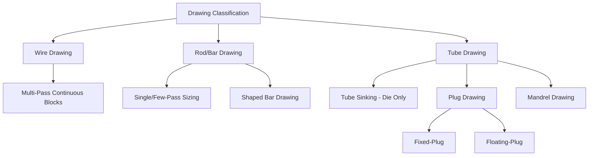

## Wire, Rod, and Tube Drawing Classification

### Definition and Scope

This classification organizes the drawing family — the tensile-dominant branch of bulk deformation processing — by workpiece geometry (solid round, solid shaped, or hollow/tubular) and by the internal tooling used to control dimensions, since these two factors together determine the specific die/tool arrangement required. All drawing processes share the governing constraint discussed under the broader tensile-and-drawing family: the pulling force is transmitted through the already-reduced exit cross-section, fundamentally limiting per-pass area reduction relative to compressive processes like extrusion.

### Classification by Workpiece Geometry

**Wire Drawing**

Applies to fine round (or occasionally shaped) cross-sections, typically starting from hot-rolled rod (commonly around 5–12 mm diameter) and reducing progressively to final gauges that can range from a few millimeters down to fractions of a millimeter for fine wire applications. Distinguished from rod drawing primarily by the number of passes required and the resulting emphasis on continuous, high-speed multi-die drawing machines ("wire drawing blocks") that accumulate large total reduction through many sequential dies.

**Rod and Bar Drawing**

Applies to larger cross-sections (commonly above approximately 5 mm up to tens of millimeters), typically performed as a single-pass or few-pass "sizing" operation on already hot-rolled bar stock, primarily to achieve improved dimensional tolerance, surface finish, and straightness rather than large area reduction. Shaped (non-round) bar profiles can also be cold drawn through a shaped die to achieve precision cross-sections not economically produced by rolling alone.

**Tube Drawing**

Applies to hollow, tubular stock, and is further sub-classified by the internal tooling used to control inside diameter and wall thickness simultaneously with the die's control of outside diameter:

- **Tube sinking (die-only drawing)** — No internal tool is used; only the outer diameter is directly controlled by the die, while inner diameter and wall thickness change passively according to the material's natural flow behavior (wall thickness typically increases somewhat as OD is reduced without internal support).
- **Plug drawing** — A shaped plug, either fixed to a rod extending back through the tube (fixed-plug drawing) or free-floating within the die throat (floating-plug drawing), provides internal support and directly controls inner diameter and wall thickness concurrently with the die's outer-diameter control.
  - *Fixed-plug drawing* limits practical tube length (the support rod must extend the full tube length) but offers precise plug positioning.
  - *Floating-plug drawing* removes the length limitation of a fixed rod, since the plug self-positions via the drawing force balance within the die, making it more suitable for long-length continuous tube production.
- **Mandrel drawing** — A long mandrel (moving with the tube through the die, "moving-mandrel drawing," or occasionally a longer fixed mandrel) provides extended internal support along a greater length than a floating plug, enabling more precise and consistent internal dimensional control, particularly valuable for longer tubes or where very tight wall-thickness tolerance is required.

### Comparative Summary

| Type | Cross-section | Internal tool | Primary control | Typical pass structure |
| --- | --- | --- | --- | --- |
| Wire drawing | Solid round (fine) | None | OD only, via die | Many sequential passes |
| Rod/bar drawing | Solid round/shaped (larger) | None | OD/profile only, via die | Single or few passes |
| Tube sinking | Hollow | None | OD only; ID/wall passive | Single or multiple passes |
| Fixed-plug drawing | Hollow | Fixed plug on rod | OD (die) + ID/wall (plug) | Limited by rod length |
| Floating-plug drawing | Hollow | Self-positioning plug | OD (die) + ID/wall (plug) | Suited to long/continuous lengths |
| Mandrel drawing | Hollow | Long moving/fixed mandrel | OD (die) + extended ID/wall control | Long tubes, tight tolerance |

### Process Parameters and Equipment Considerations

**Key Points**

- **Die angle and reduction per pass** govern the balance between redundant (non-productive) shear work and frictional contact area, analogous to extrusion die design, but with the added constraint that the exit tensile stress must remain below the material's current flow stress — exceeding this causes necking or fracture at (or just past) the die exit.
- **Multi-die continuous wire drawing machines** ("drawing blocks") pass wire through a sequence of dies mounted at progressively increasing line speed (since wire elongates and speeds up as it thins), with each capstan/block accumulating the wire before feeding it to the next die; requires careful speed synchronization to avoid excessive back-tension or slack between stages.
- **Bearing (land) length** of the die — the parallel-walled section immediately following the tapered reduction zone — influences die wear life and dimensional consistency; a longer bearing improves sizing accuracy but increases friction and die wear.
- **Lubrication regime** differs meaningfully by process: wire drawing commonly uses dry lubricant (soap-based) drawn into the die with the wire via surface coating, while tube drawing (especially mandrel drawing) often requires more sophisticated lubricant delivery to maintain a consistent film between the moving mandrel/plug and the tube's inner surface. [Inference: general drawing-lubrication practice; specific lubricant selection is material- and speed-dependent]

### Failure Modes Distinctive to Each Sub-Type

- **Wire and rod drawing**: die-exit necking/breakage (exceeding the exit tensile capacity) and central burst/chevron cracking (internal, cone-shaped tensile fracture along the centerline from non-uniform through-thickness deformation at certain die angle/reduction combinations).
- **Tube drawing**: wall thickness non-uniformity (particularly in sinking, where no internal control exists), plug/mandrel scoring or seizure from inadequate lubrication, and similar die-exit tensile failure modes as solid drawing, compounded by the thinner, more failure-prone tube wall geometry.

### Illustrative Example

Producing precision hydraulic tubing illustrates the classification's practical selection logic: a welded or seamless tube blank requiring very tight, consistent wall thickness and inner-surface finish for hydraulic sealing performance would typically use **moving-mandrel drawing**, since the extended internal support along the mandrel length provides the most consistent wall-thickness control of the tube-drawing sub-types — whereas a lower-precision structural tube application, where only outer diameter and general roundness matter, could economically use simpler **tube sinking** without any internal tooling, avoiding the added cost and complexity of plug or mandrel handling.

### Related Topics

- Die angle and bearing length optimization in wire drawing
- Central burst (chevron crack) prediction models
- Floating-plug self-positioning mechanics and stability
- Moving-mandrel drawing line design and mandrel retraction/handling
- Multi-die continuous wire drawing machine speed synchronization
- Lubrication systems for high-speed wire vs. mandrel tube drawing