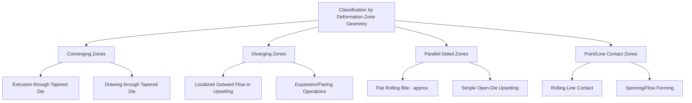

## Classification by Strain Path and Deformation-Zone Geometry

### Definition and Scope

This classification organizes bulk deformation processes by the geometric and kinematic character of the deformation zone — the region of the workpiece actually undergoing plastic strain — and by the strain path (the sequence and directionality of strain increments) a material element experiences as it passes through that zone. Unlike classification by stress state (compressive vs. tensile) or by named operation (rolling, forging, extrusion), this framework is analytically oriented: it underlies the mechanics-based models (slab method, upper-bound analysis, slip-line field theory) used to predict force, redundant work, and strain homogeneity across otherwise dissimilar-looking processes.

### Classification by Deformation-Zone Shape

**Converging (Convergent) Deformation Zones**

The deformation zone narrows in the direction of material flow, characteristic of extrusion and drawing through a tapered die. Material elements experience compressive strain in the flow direction accompanied by lateral flow toward the centerline, with the zone's included angle (die semi-angle) directly governing the strain path's severity and the proportion of redundant (shape-change-neutral) shear strain versus useful (homogeneous) strain.

**Diverging (Divergent) Deformation Zones**

The deformation zone widens in the flow direction, less common as a primary process mechanism but present in specific operations such as certain expansion or flaring operations and localized in upsetting (where material flows outward from the compression axis, a locally divergent flow pattern even though the overall process is classified as compressive).

**Parallel-Sided (Non-Converging) Deformation Zones**

The deformation zone geometry does not converge or diverge, characteristic of flat rolling's roll bite (approximated as a converging wedge in most models, but with a much shallower, near-parallel character than extrusion dies) and of simple upsetting between flat platens, where the primary deformation zone is essentially the full workpiece height with lateral flow determined by friction at the platen interfaces rather than a constraining die geometry.

**Point/Line Contact (Localized) Deformation Zones**

The deformation zone is confined to a small, moving contact region relative to overall workpiece size, characteristic of rolling (line contact along the roll bite) and of some incremental forming processes (spinning, flow forming), where only a small portion of the workpiece deforms at any instant even though the cumulative process affects the entire part.

### Classification by Strain Path Character

**Monotonic (Proportional) Strain Paths**

Strain increments accumulate in a consistent direction and ratio throughout the deformation, characteristic of simple, single-pass operations like a single extrusion or drawing pass, where a material element's principal strain directions remain fixed relative to the workpiece geometry throughout its transit through the deformation zone.

**Non-Monotonic (Reversing/Cyclic) Strain Paths**

Strain direction reverses or changes character partway through processing, characteristic of multi-stand rolling with roll reversal (three-high mills), multi-pass forging with reorientation between strokes, and specifically of Equal-Channel Angular Pressing (ECAP) and similar severe plastic deformation (SPD) techniques, where a billet is repeatedly pressed through a die maintaining constant cross-section while imposing intense shear strain, often with reorientation ("route") between passes specifically to control the cumulative strain path's effect on resulting texture and grain structure.

**Redundant Strain Paths**

A portion of the total strain imposed does not contribute to the net shape change (net strain), instead representing shear that is imposed and then effectively reversed as the material element traverses the deformation zone — most pronounced in processes with steep die angles (drawing, extrusion) or high friction (rolling with high friction coefficient), where material near the surface experiences a shear-reversal strain path distinct from the more homogeneous, lower-redundant-work path of material near the centerline.

### Classification by Strain Homogeneity Across the Workpiece Section

- **Homogeneous deformation** — All material elements across the workpiece cross-section experience approximately the same strain path and magnitude; idealized and rarely fully achieved in practice, but approached in processes with low friction, shallow die angles, and simple geometry.
- **Inhomogeneous (heterogeneous) deformation** — Strain varies significantly across the cross-section, commonly with surface material experiencing more redundant shear than centerline material (in extrusion/drawing) or with "barreling" in upsetting (bulging at the mid-height due to frictional constraint at the platen contact surfaces, versus more freely deforming material at mid-height away from friction). Severity of inhomogeneity is a key factor in predicting internal defects (central burst, piping) and residual stress patterns.

### Comparative Summary

| Classification factor | Key variants | Primary analytical consequence |
| --- | --- | --- |
| Deformation-zone shape | Converging / Diverging / Parallel / Point-contact | Governs applicable mechanics model (slab, upper-bound, slip-line) |
| Strain path direction | Monotonic / Non-monotonic (reversing) | Governs texture development, cumulative strain effects |
| Redundant strain contribution | Low-redundant / High-redundant | Governs process efficiency (useful vs. wasted deformation energy) |
| Cross-sectional homogeneity | Homogeneous / Inhomogeneous | Governs residual stress, internal defect susceptibility (central burst, barreling) |

### Analytical Relevance

**Key Points**

- **Slab method analysis**, widely used for rolling, forging, and extrusion force prediction, assumes homogeneous deformation across the section at each incremental slice and neglects redundant work — adequate for many engineering estimates but systematically under-predicting force where deformation-zone geometry (steep die angle, high friction) produces significant redundant shear.
- **Upper-bound analysis** explicitly incorporates assumed velocity fields that can capture redundant shear work, generally providing more accurate force predictions for converging-zone processes (extrusion, drawing) with pronounced redundant deformation, at the cost of greater analytical complexity.
- **Slip-line field theory**, applicable to plane-strain problems, directly visualizes the deformation-zone geometry's effect on strain path and is particularly suited to analyzing localized, non-uniform flow patterns such as those in forging die corner fill or extrusion dead-metal-zone formation. [Inference: standard metal-forming mechanics; applicability is most direct for plane-strain, rigid-perfectly-plastic idealizations]
- **Severe plastic deformation (SPD) techniques** such as ECAP deliberately exploit non-monotonic, high-shear strain paths within a constant-cross-section deformation zone specifically to achieve ultrafine-grained microstructures unattainable through conventional monotonic-strain-path processes, illustrating how strain-path classification connects directly to achievable material property outcomes rather than being purely an analytical convenience.

### Illustrative Example

Comparing wire drawing and Equal-Channel Angular Pressing (ECAP) on ostensibly similar starting stock illustrates the classification's practical significance: conventional wire drawing imposes a **converging-zone, monotonic strain path** with some redundant shear near the surface, producing progressive cross-sectional area reduction and directionally aligned, elongated grain structure with each pass. ECAP, by contrast, imposes a **constant-cross-section (non-converging), non-monotonic strain path** dominated by intense simple shear as the billet passes through the angled channel intersection, with no net shape change but very high cumulative equivalent strain achievable through repeated passes (often with 90° billet rotation between passes, "route B_C," specifically to average out the shear strain path's directionality) — producing the equiaxed, ultrafine grain structure characteristic of SPD processing rather than wire drawing's elongated, textured structure, despite both processes being broadly "bulk deformation."

### Related Topics

- Slab method vs. upper-bound analysis for force prediction
- Slip-line field theory application to forging and extrusion
- Equal-Channel Angular Pressing (ECAP) route selection and grain refinement
- Redundant work quantification in drawing and extrusion die angle optimization
- Barreling and frictional inhomogeneity in open-die upsetting
- Severe plastic deformation (SPD) techniques and ultrafine-grained material production