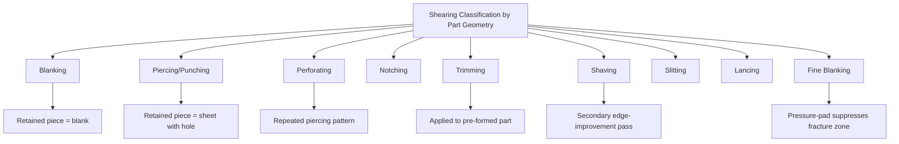

## Shearing Operation Classification

### Definition and Scope

Shearing operation classification organizes sheet metal cutting processes — those that separate material through localized shear stress rather than melting, burning, or abrasive removal — by the geometric relationship between the cutting tools (punch and die) and the resulting part geometry. Shearing is the foundational sheet metal process family because nearly all sheet forming sequences begin with a shearing operation to produce a blank or to separate a formed part from surrounding stock, making this classification a prerequisite for understanding sheet metal process chains generally.

### The Shearing Mechanism

**Key Points**

- Shearing proceeds through four characteristic stages as the punch descends into the sheet: **elastic deformation** (stresses remain below yield, no permanent change), **plastic deformation** (material yields and begins to flow, producing a rounded "rollover" at the top edge), **penetration/burnishing** (the punch cuts partially through the thickness, creating a smooth vertical "burnish" band as it shears cleanly), and **fracture** (cracks initiate at the punch and die edges and propagate through the remaining thickness, completing separation and leaving a characteristic rougher "fracture zone" and small "burr").
- **Clearance** (the gap between punch and die, typically expressed as a percentage of sheet thickness) is the dominant parameter governing edge quality: insufficient clearance causes secondary shearing and excessive burr; excessive clearance causes larger rollover, greater burr, and reduced dimensional accuracy, since the fracture cracks from punch and die edges fail to meet cleanly.
- The relative proportions of rollover, burnish, fracture zone, and burr on a sheared edge are collectively diagnostic of clearance appropriateness and are a standard visual/metrological check in production quality control.

### Classification by Resulting Part Geometry

**Blanking**

The punched-out piece (the "blank," falling through the die) is the desired product; the surrounding sheet (skeleton/scrap web) is discarded. This is the standard first operation for producing a flat starting shape for subsequent forming (drawing, bending) or for parts requiring no further shaping (flat washers, gaskets, laminations).

**Piercing (Punching)**

The punched-out piece is scrap (a slug), and the remaining sheet with the resulting hole is the desired product. Mechanically identical to blanking in tooling and mechanics, but distinguished purely by which piece — the removed slug or the remaining sheet — is retained as the finished part.

**Perforating**

A specific, high-density application of piercing in which a regular pattern of many holes is punched across a sheet in a single or repeated stroke, typically for filtration, ventilation, or acoustic/aesthetic screen applications.

**Notching**

Removes a portion of material from the edge of a sheet or strip (rather than a fully enclosed interior region as in piercing), commonly used in progressive die sequences to incrementally shape a strip's outline across multiple stations before final blanking or forming.

**Trimming**

Removes excess material (commonly flash or an irregular formed edge) from a part that has already been formed (drawn, forged with flash, or otherwise shaped) to bring it to final outline dimensions — mechanically a blanking-family operation but applied to a non-flat, pre-formed workpiece rather than raw flat stock.

**Shaving**

A secondary, light shearing pass around an already-blanked or pierced edge, removing a thin layer of material to improve edge straightness, squareness, and dimensional accuracy beyond what the initial blanking/piercing clearance can achieve — used where edge quality requirements exceed standard shearing capability without requiring a fundamentally different process (e.g., fine blanking).

**Slitting**

Continuous, straight-line shearing of a coil or sheet into narrower strips using rotary circular blade pairs (rather than a reciprocating punch-and-die), typically performed as a coil-processing operation upstream of subsequent stamping.

**Lancing**

A combined cutting-and-forming operation in which a partial cut is made and the material is simultaneously bent or displaced out of the sheet plane, without full separation, commonly used to create louvers, tabs, or ventilation features.

**Fine Blanking**

A specialized, higher-precision variant employing a pressure pad (impingement ring) that clamps material immediately surrounding the cut line under high pressure while the punch shears at very small clearance, suppressing crack formation and producing a smooth, essentially burnish-only edge across the full sheet thickness — used where the edge quality of conventional blanking is insufficient without a secondary shaving or machining operation.

### Comparative Summary

| Operation | Retained/desired piece | Applied to | Distinguishing feature |
| --- | --- | --- | --- |
| Blanking | Punched-out piece | Flat stock | Standard blank-forming operation |
| Piercing | Remaining sheet | Flat stock | Mechanically identical to blanking, inverse retained piece |
| Perforating | Remaining sheet | Flat stock | High-density repeated piercing pattern |
| Notching | Remaining sheet (edge-modified) | Flat/strip stock | Edge-only material removal |
| Trimming | Remaining part | Pre-formed part | Removes flash/excess from already-shaped part |
| Shaving | Remaining part (edge-refined) | Already-blanked/pierced part | Thin secondary edge-cleanup pass |
| Slitting | Both resulting strips | Coil/sheet | Continuous rotary blade cutting |
| Lancing | Sheet with displaced tab | Flat stock | Partial cut plus out-of-plane bend, no separation |
| Fine blanking | Punched-out piece | Flat stock | Pressure-pad clamping, near-full-thickness burnish edge |

### Force and Tooling Considerations

**Key Points**

- **Shearing force** scales approximately with sheet thickness, shear strength of the material, and cut-line perimeter length; **shear angle** (angling the punch or die face rather than a flat, simultaneous cutting edge) is commonly used to progressively engage the cut line, substantially reducing peak force and associated press shock/noise at the cost of some part distortion if not carefully applied.
- **Progressive die sequences** combine multiple shearing operations (notching, piercing, and final blanking/cutoff) at sequential stations within a single strip pass, enabling high-throughput production of complex flat or near-flat parts from coil stock without separate individual die setups for each feature.
- **Fine blanking press equipment** differs meaningfully from conventional stamping presses, requiring triple-action tooling (punch, pressure pad/impingement ring, and counter-pressure ejector all independently controlled) and substantially higher and more precisely controlled force than conventional blanking of equivalent thickness. [Inference: general fine-blanking process literature; specific force/equipment requirements are alloy- and thickness-dependent]

### Illustrative Example

Producing an electric motor lamination stack illustrates several shearing classifications within one part's process chain: each thin electrical steel lamination is produced via **blanking** (the outer profile) combined with **piercing** (the internal rotor/stator slot pattern and shaft bore) performed simultaneously or in sequence within a **progressive die**, since the high production volume and multiple internal features justify a multi-station progressive tool rather than separate individual operations. Where lamination edge burr must be minimized to reduce electrical losses from inter-lamination shorting, tighter clearance control or a **fine blanking**-adjacent approach may be used specifically to reduce the fracture-zone/burr proportion of the cut edge relative to conventional blanking clearance.

### Related Topics

- Punch-die clearance optimization and its effect on edge quality zones
- Shear angle design for force reduction in blanking/piercing
- Progressive die station sequencing and strip layout design
- Fine blanking tooling (triple-action press, impingement ring design)
- Slitting line rotary blade setup and strip width control
- Lancing and louver forming die design for ventilation features