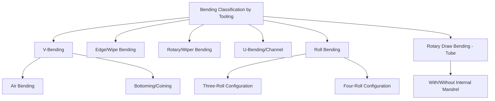

## Bending Operation Classification

### Definition and Scope

Bending operation classification organizes sheet metal forming processes that produce a shape change through plastic deformation around a straight or curved axis, without significant change in sheet thickness or surface area, distinguishing bending from shearing (which separates material) and from drawing (which redistributes material to change thickness/area). Bending is classified here by tooling configuration, bend geometry, and the strain state produced across the sheet thickness, since these factors govern springback behavior, achievable bend angle/radius combinations, and tooling requirements.

### The Bending Mechanism

**Key Points**

- During bending, material on the outer (convex) surface of the bend experiences **tensile strain**, material on the inner (concave) surface experiences **compressive strain**, and a **neutral axis** — where strain is theoretically zero — exists somewhere through the thickness, typically shifting slightly toward the inner surface as bend severity (smaller bend radius relative to thickness) increases.
- **Springback** — the elastic recovery that causes the sheet to relax partially toward its original shape after tooling is removed — occurs because only the region beyond the elastic limit undergoes permanent (plastic) strain, while the full thickness undergoes some elastic strain that recovers upon unloading; springback magnitude increases with higher material yield strength, larger bend radius-to-thickness ratio, and lower elastic modulus. [Inference: standard bending mechanics; exact springback magnitude requires material-specific characterization or empirical correction factors in practice]
- **Minimum bend radius** (the smallest radius achievable without surface cracking on the outer, tensile-strained fiber) is governed by the material's ductility, commonly expressed as a multiple of sheet thickness (e.g., "1T," "2T") and varying substantially by alloy and temper.

### Classification by Tooling Configuration

**V-Bending**

A V-shaped punch presses the sheet into a V-shaped die cavity, producing a bend angle determined by punch travel depth (or, in "bottoming"/coining V-bending, precisely by matching punch and die angles at full closure). Simple tooling, flexible for varying bend angles with the same die set (in air/partial bending), but subject to greater springback variability than bottoming.

**Edge (Wipe) Bending**

The sheet is clamped against a die shoulder, and a wiping punch or blade moves past the die edge, progressively bending the unsupported overhanging portion of the sheet around the die radius. Common in press brake operations and for forming flanges along a sheet edge, offering good control since the sheet is clamped throughout the bend.

**Rotary (Wiper) Bending**

Similar in effect to edge bending, but the bending tool rotates around the die edge (rather than translating linearly), commonly used in dedicated tube and sheet bending machines where consistent, repeatable bend geometry across a production run is prioritized.

**U-Bending (Channel Bending)**

A punch presses the sheet into a U-shaped die cavity in a single stroke, simultaneously forming two bends to produce a channel or U-shaped cross-section; requires attention to differential springback between the two legs and potential for the sheet to be pulled inward at the bend rather than sliding freely over the die radius, depending on blank-holder/pad design.

**Roll Bending (Plate Rolling)**

A sheet or plate is passed between a series of rolls (typically three or four rolls in a pyramid or offset configuration) that progressively curve the material to a large radius, used for producing cylindrical or large-radius curved sections (tanks, pipe sections, structural curved members) rather than sharp, localized bends.

**Rotary Draw Bending**

Primarily applied to tube and profile bending (though conceptually part of the same bend-mechanics family): the workpiece is clamped to a rotating bend die and drawn around it while a pressure die and (often) an internal mandrel support the tube wall, minimizing wall thinning and cross-sectional distortion (ovality) at the bend — a distinct sub-classification typically treated separately from flat-sheet bending due to tube-specific wall-collapse and wrinkling failure modes.

### Classification by Bend Severity/Precision Control

- **Air bending** — The punch does not force the sheet fully against the die cavity walls; bend angle is controlled by punch depth alone, and springback compensation must be applied by over-bending slightly beyond the target angle. Offers tooling flexibility (one die set can produce multiple bend angles) at the cost of greater springback sensitivity to material property variation.
- **Bottoming** — The punch presses the sheet fully against the die cavity at the bottom of the stroke, more closely fixing the bend angle to the tooling geometry and reducing (but not eliminating) springback sensitivity, at the cost of requiring dedicated tooling per bend angle and higher forming force.
- **Coining** — The punch applies sufficient force at the bottom of the stroke to plastically deform the material locally at the bend region beyond simple bottoming, essentially "coining" the bend radius into the material and achieving the most consistent, minimal-springback bend angle of the three approaches, at the highest force and tooling wear cost.

### Comparative Summary

| Type | Tooling motion | Springback control | Typical application |
| --- | --- | --- | --- |
| V-bending (air) | Punch partial travel into V-die | Requires overbend compensation | General-purpose, flexible bend angles |
| V-bending (bottoming/coining) | Punch full travel, angle-matched die | Reduced (bottoming) to minimal (coining) | Precision, repeatable bend angle |
| Edge/wipe bending | Clamp + wiping punch past die edge | Moderate, clamped sheet aids control | Flange forming, press brake work |
| Rotary bending | Rotating tool around die edge | Good, repeatable | Dedicated production bending machines |
| U-bending | Punch into U-die, single stroke | Differential springback between legs | Channel/U cross-sections |
| Roll bending | Progressive multi-roll curvature | Large-radius, cumulative control | Large cylindrical/curved sections |
| Rotary draw (tube) | Clamped rotation around bend die | Wall-thinning/ovality primary concern | Tube and profile bending |

### Failure Modes and Design Considerations

**Key Points**

- **Cracking at the outer (tensile) fiber** occurs when bend severity (small radius relative to thickness) exceeds the material's ductility limit, governed by the minimum bend radius guideline for the specific alloy and temper.
- **Springback compensation strategies** include overbending (bending beyond target angle to compensate for predicted elastic recovery), bottoming/coining (mechanically constraining final angle), and stretch bending (applying tension during bending to shift more of the through-thickness strain into the plastic regime, reducing the elastic fraction available to spring back).
- **Bend allowance/bend deduction calculations**, which determine the flat-pattern (unbent) length required to achieve a target bent dimension, are standard design calculations accounting for neutral-axis shift and material thickness, essential for accurate multi-bend part flat-pattern development. [Inference: standard sheet-metal design practice; specific K-factor values for neutral axis position vary by material and bend radius-to-thickness ratio]
- **Anisotropic bendability** (bend direction relative to sheet rolling direction) can affect minimum bend radius and cracking susceptibility in materials with pronounced rolling texture, generally favoring bends made perpendicular (across) rather than parallel to the rolling direction. [Inference: general sheet-forming anisotropy principle; magnitude is alloy- and processing-history-dependent]

### Illustrative Example

Producing a sheet metal electrical enclosure illustrates several bending classifications within one part: the flat blank (already produced via prior blanking/piercing operations) undergoes a sequence of **press brake edge/wipe bends** to form the box's four vertical walls and any mounting flanges, with **air bending** used for the initial forming passes (allowing the same die set to accommodate the different bend angles at various flanges) and **bottoming** applied at critical bends where dimensional consistency across the production run is essential, such as flanges that must align precisely with a mating cover panel — illustrating the practical trade-off between tooling flexibility and springback-driven dimensional consistency within a single part's process plan.

### Related Topics

- Springback prediction and compensation methods (overbending, bottoming, coining)
- Minimum bend radius guidelines by alloy and temper
- Bend allowance and K-factor calculation for flat-pattern development
- Roll bending pass scheduling for large-radius plate curving
- Rotary draw tube bending mandrel design and wall-thinning control
- Anisotropic bendability and rolling-direction effects on cracking