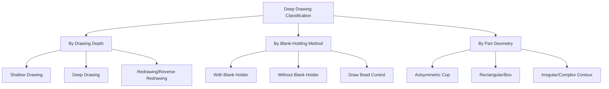

## Deep Drawing and Cup-Forming Classification

### Definition and Scope

Deep drawing and cup-forming classification organizes sheet metal processes in which a flat blank is transformed into a hollow, three-dimensional shape (cup, box, or more complex vessel geometry) by a punch pressing the blank through a die cavity, with material drawn radially inward from the flange region to feed the depth of the resulting shape. This process family is distinguished from bending (which produces shape change without significant in-plane material flow) and from bulk-deformation drawing (wire/tube, tensile-dominant throughout) by its combined stress state: the flange region undergoes compressive (radial-tensile, circumferential-compressive) deformation while the wall and base region undergo predominantly tensile stress, with the punch-radius transition zone being the most failure-critical region.

### Classification by Drawing Depth/Severity

**Shallow Drawing**

The drawn depth is less than the part diameter/width, requiring comparatively modest material flow from the flange and rarely approaching the tearing limit; typical of shallow trays, pans, and covers.

**Deep Drawing**

The drawn depth approaches or exceeds the part diameter, requiring substantial flange material flow inward and placing the part near or at the practical limiting draw ratio for the material — the classification's namesake regime, exemplified by cylindrical cups, cans, and similar deep, straight-walled vessels.

**Redrawing (Multi-Stage Deep Drawing)**

Where a single draw operation cannot achieve the required depth-to-diameter ratio without exceeding the material's limiting draw ratio, the part is drawn in a first-stage operation to an intermediate cup, then **redrawn** (direct redrawing, punch and die moving in the same relative direction as the first draw) or **reverse redrawn** (die cavity oriented opposite to the first draw, turning the cup inside-out relative to the prior stage) through one or more subsequent dies to progressively increase depth while reducing diameter, each stage constrained by its own limiting draw ratio.

### Classification by Blank-Holding Method

**Draw with Blank Holder (Binder)**

A blank holder (binder ring) applies controlled pressure to the flange region during drawing, suppressing wrinkling by preventing the flange from buckling under the circumferential compressive stress it experiences as material flows inward; essential for larger blank-diameter-to-thickness ratios where wrinkling risk is significant.

**Drawing Without Blank Holder**

For sufficiently thick sheet relative to blank diameter (low blank-diameter-to-thickness ratio), the material's own resistance to buckling may be sufficient without a binder, simplifying tooling — though the practical window for this approach is comparatively narrow. [Inference: general deep-drawing practice; the specific thickness ratio threshold below which a blank holder can be omitted is geometry- and material-dependent]

**Draw Bead Control**

Raised ribs (draw beads) on the blank holder or die surface locally increase restraining force on specific portions of the flange perimeter, allowing non-uniform material flow control around asymmetric or irregular part perimeters where uniform blank-holder pressure alone would produce uneven metal flow and localized wrinkling or tearing.

### Classification by Part Geometry Complexity

**Axisymmetric (Cylindrical) Cup Drawing**

The simplest and most extensively analyzed geometry; uniform radial material flow from a circular blank into a circular die cavity, forming the basis for the standard **limiting draw ratio (LDR)** — the maximum blank-diameter-to-punch-diameter ratio achievable in a single draw without wall tearing — used as the reference case for deep-drawability assessment.

**Rectangular/Box Drawing**

Non-axisymmetric geometry introduces corner regions where material flow is more constrained (tighter effective bend radius, more restricted inward flow) than along straight flange sides, making corners the typical failure-critical (tearing) or wrinkle-prone locations, and generally requiring draw bead control and more sophisticated blank-shape (developed blank) design than axisymmetric cups.

**Irregular/Complex Contour Drawing**

Automotive body panels and similarly complex-contour parts represent the most demanding classification tier, combining varying draw depth, compound curvature, and non-uniform flange flow around the full perimeter, typically requiring finite-element forming simulation during die design to predict and correct tearing, wrinkling, and springback across the full, non-axisymmetric geometry. [Inference: standard modern automotive stamping practice; simulation-driven die design is now common but not universal across all deep-drawn part classes]

### Comparative Summary

| Classification | Key variant | Primary control challenge | Typical application |
| --- | --- | --- | --- |
| Drawing depth | Shallow | Low tearing/wrinkling risk | Trays, pans, shallow covers |
| Drawing depth | Deep | Near limiting draw ratio | Cylindrical cups, beverage cans |
| Drawing depth | Redraw/reverse redraw | Cumulative multi-stage draw ratio | Deep cans, cartridge cases |
| Blank holding | With binder | Wrinkling suppression | Large-diameter, thin-gauge blanks |
| Blank holding | Draw bead | Localized, non-uniform flow control | Irregular perimeter parts |
| Geometry | Axisymmetric | Uniform radial flow, LDR-governed | Cups, cans |
| Geometry | Rectangular/box | Corner tearing/wrinkling | Boxes, housings |
| Geometry | Complex contour | Compound curvature, simulation-driven | Automotive body panels |

### Failure Modes and Governing Parameters

**Key Points**

- **Wall tearing (fracture)** occurs at or near the punch radius/wall junction when the tensile stress required to draw flange material inward exceeds the wall material's load-bearing capacity — directly analogous to the tensile-limit constraint governing wire/tube drawing, but occurring locally at the punch-radius transition rather than uniformly along a drawn length.
- **Wrinkling** occurs in the flange (or, less commonly, the wall) when circumferential compressive stress causes localized buckling rather than smooth inward flow, most likely with thin gauge, large blank diameter, and insufficient blank-holder restraint.
- **Limiting Draw Ratio (LDR)** is the primary design/process metric for axisymmetric cup drawing, representing the maximum single-draw blank-to-punch diameter ratio before wall tearing; typical values for many sheet steels and aluminum alloys fall in an approximate 1.8–2.2 range, though specific values are strongly material- and lubrication-dependent. [Inference: representative range from general deep-drawing literature; exact LDR requires material-specific characterization]
- **Earing** — non-uniform flange height around the cup rim after drawing — arises from planar anisotropy (directional variation in the sheet's plastic properties from prior rolling texture), producing peaks and valleys typically at 0°/90° or 45° to the rolling direction depending on the material's specific anisotropy character, and often requiring a subsequent trimming operation to achieve uniform rim height.

### Illustrative Example

Producing a deep-drawn aluminum beverage can body illustrates the full classification range within a single product's process chain: an initial **shallow draw with blank holder** forms a preliminary cup from the flat blank, after which the part undergoes one or more **redraw** operations (and often a **wall-ironing** step, conceptually adjacent to this family) to progressively increase depth and reduce wall thickness beyond what any single draw stage's limiting draw ratio would permit — since the can's final height-to-diameter ratio substantially exceeds what a single-stage axisymmetric cup draw could achieve without tearing, the multi-stage redraw/reverse-redraw and ironing sequence is specifically selected to distribute the total required deformation across several stages, each remaining within its own stage's LDR limit.

### Related Topics

- Limiting draw ratio (LDR) determination and material formability testing (cupping tests)
- Redrawing vs. reverse redrawing tooling and stress-state differences
- Draw bead design and force control for irregular-perimeter parts
- Earing prediction from planar anisotropy (R-value characterization)
- Blank-holder force optimization (constant vs. programmed/variable force)
- Finite-element forming simulation for complex automotive panel deep drawing