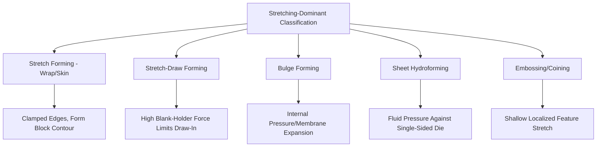

## Stretch Forming and Stretching-Dominant Classification

### Definition and Scope

This classification organizes sheet metal forming processes in which the dominant deformation mechanism is biaxial or uniaxial in-plane stretching — thinning the sheet through tensile strain in two (or one) directions — as distinct from deep drawing (dominated by flange draw-in with minimal net thinning) and bending (dominated by through-thickness strain gradient with minimal net area change). Stretching-dominant processes are unified by the absence (or minimization) of material flow into the deformation zone from a surrounding flange; instead, a fixed quantity of sheet is stretched over or into a tool, with all shape change accommodated by thinning and area increase of that fixed material.

### The Stretching Mechanism and Forming Limit Framework

**Key Points**

- Unlike deep drawing, where the flange region is free to be drawn inward, stretch-forming processes typically **clamp or lock the sheet perimeter** against inward movement, forcing all deformation to occur through localized thinning of the sheet itself rather than draw-in — this clamped-edge condition is the defining kinematic feature separating this family from drawing.
- The **Forming Limit Diagram (FLD)**, plotting major versus minor principal surface strain, is the standard analytical framework for stretching-dominant processes, since failure (localized necking, then fracture) is governed by the combination of strain state (plane-strain, biaxial-stretch, or uniaxial-tension-like) rather than a single limiting ratio as in axisymmetric deep drawing's LDR.
- **Strain state classification** along the FLD spans from **uniaxial tension** (one principal strain positive, the other negative — material narrows as it stretches, similar to a simple tensile test) through **plane-strain** (one principal strain near zero — the most failure-prone condition, generally exhibiting the lowest forming limit) to **equibiaxial stretch** (both principal strains positive and roughly equal — material thins uniformly in all in-plane directions, generally the most forgiving condition for a given material).

### Classification by Process Type

**Stretch Forming (Wrap/Skin Forming)**

A sheet is clamped at its edges (typically via gripping jaws on a stretch-forming press) and stretched over a single-sided form block/die by moving the jaws (or the form block) to conform the sheet to the tool's contour, used predominantly for large, shallow-curvature panels such as aircraft skin sections and architectural cladding, where uniform, wrinkle-free surface quality across a large area is prioritized over deep, complex geometry.

**Stretch-Draw Forming (Combination Drawing)**

A hybrid process combining deep drawing's punch-and-die cavity mechanics with deliberately high blank-holder restraining force (or draw beads) that substantially limits flange draw-in, forcing a greater proportion of the total deformation into stretching (thinning) of the material already within the die cavity rather than drawing additional material inward — used for automotive panels and similar parts where a purely draw-dominated process would produce insufficient stretch to achieve the required stiffness-imparting curvature or surface definition.

**Bulging (Hydraulic/Rubber-Pad Bulge Forming)**

A sheet (often a pre-formed tube or shell rather than flat stock) is clamped at its edges/ends and deformed outward by internal fluid or flexible-membrane pressure rather than direct punch contact, producing expanded or contoured shapes (e.g., corrugated bellows, expanded tube fittings) through predominantly biaxial stretching of the clamped material.

**Hydroforming (Sheet Hydroforming)**

A specific bulge-forming variant in which pressurized fluid (rather than a rigid punch) forms the sheet against a single-sided die, allowing complex contour and reduced tooling cost (only one hard die surface required) relative to matched-die stamping, while still operating within the stretching-dominant strain regime for most of the formed surface. (Tube hydroforming, a related but distinct process applied to closed tubular sections, is generally classified separately within tube-forming rather than sheet stretching.)

**Embossing and Coining (Localized Stretch)**

Shallow, localized surface features (ribs, lettering, textured patterns) are formed via highly localized, small-strain stretching between matched dies, distinguished from deep-drawing-scale stretch forming primarily by the very limited depth and strain magnitude involved, though the underlying strain-state analysis (plane-strain or near-biaxial at feature edges) follows the same FLD-based framework.

### Comparative Summary

| Process | Edge condition | Deformation driver | Typical strain state | Representative application |
| --- | --- | --- | --- | --- |
| Stretch forming (wrap) | Clamped, no draw-in | Jaw/form-block travel | Near-uniaxial to plane-strain | Aircraft skin panels, cladding |
| Stretch-draw forming | Restrained (high binder force) | Punch travel + limited draw-in | Mixed plane-strain/biaxial | Automotive body panels |
| Bulge forming | Clamped ends/edges | Internal fluid/membrane pressure | Biaxial stretch | Bellows, expanded fittings |
| Sheet hydroforming | Clamped perimeter | Fluid pressure against single die | Biaxial to plane-strain, contour-dependent | Complex-contour, low-volume panels |
| Embossing/coining | Fully constrained (matched dies) | Localized die feature pressure | Localized plane-strain/biaxial | Ribs, lettering, surface texture |

### Forming Limit Diagram Framework (svg_diagram)

<svg xmlns="http://www.w3.org/2000/svg" viewBox="0 0 640 420">
\<style\>
.ax { stroke: #333; stroke-width: 1.5; }
.fld { stroke: #cc4422; stroke-width: 2; fill: none; }
.safe { fill: #d8ecd8; opacity: 0.6; }
.fail { fill: #f5d5d5; opacity: 0.6; }
.txt { font-family: sans-serif; font-size: 12px; fill: #222; }
\</style\>
<text x="120" y="20" class="txt" font-weight="bold">Forming Limit Diagram Concept (svg_diagram)</text>
<line x1="320" y1="380" x2="320" y2="40" class="ax" />
<line x1="80" y1="330" x2="600" y2="330" class="ax" />
<text x="580" y="350" class="txt">Minor Strain</text>
<text x="330" y="55" class="txt">Major Strain</text>
<path d="M120,330 L320,330 L320,150 L480,180 L560,260" class="fail" />
<path d="M120,330 L320,330 L320,150 L480,180 L560,260 L560,330 Z" class="fail" />
<path d="M120,320 Q220,260 320,150 Q400,165 480,190 Q520,210 560,270" class="fld" />
<text x="330" y="130" class="txt">Forming Limit Curve</text>

<text x="140" y="345" class="txt">Uniaxial Tension</text>

<text x="300" y="145" class="txt">Plane Strain</text>

<text x="470" y="175" class="txt">Equibiaxial</text>

<text x="100" y="260" class="txt">Safe region below curve</text>

<text x="400" y="300" class="txt">Failure region above curve</text>

</svg>

### Key Process and Failure Considerations

**Key Points**

- **Localized necking**, predicted by the forming limit curve, precedes full fracture and represents the practical process limit in most stretching-dominant operations — unlike drawing's tearing failure, which occurs abruptly at a specific location (typically the punch radius), necking in stretch forming can occur across a broader region depending on strain-state uniformity.
- **Plane-strain conditions typically represent the lowest point on the forming limit curve**, making features or regions that impose a plane-strain condition (long, straight character lines or ribs) the most failure-prone locations in a stretch-formed part, a key consideration in panel and die design. [Inference: standard FLD theory; the precise minimum-strain-state location can shift somewhat with material and strain-path history]
- **Strain-path history effects** (a material element experiencing a non-proportional sequence of strain states during forming, rather than a single proportional path to final strain) can shift the effective forming limit relative to the standard proportional-loading FLD, a recognized complication in complex-contour stretch/stretch-draw forming simulation.
- **Thickness reduction (thinning) measurement**, directly related to major/minor strain via constant-volume assumptions, serves as a practical, easily measured production quality-control proxy for approaching the forming limit even without full strain-state mapping.

### Illustrative Example

Producing a large aircraft wing-skin panel illustrates the classification's primary application: a flat aluminum sheet is clamped in a stretch-forming press's gripping jaws and **stretch-formed (wrap forming)** over a contoured form block by combined jaw translation/rotation and form-block movement, imposing a predominantly plane-strain to near-uniaxial strain state across the panel's gentle, single-curvature contour — deliberately avoiding deep-drawing-style flange draw-in, which would be impractical for a panel of this large, thin, shallow-curvature geometry, and instead relying on the sheet's own stretchability (governed by its position on the forming limit diagram) to achieve the required contour without wrinkling or tearing.

### Related Topics

- Forming Limit Diagram (FLD) construction and experimental determination (Nakazima/Marciniak tests)
- Strain-path history effects on forming limits (non-proportional loading)
- Stretch-forming press jaw/form-block kinematics for large panel forming
- Blank-holder force programming in stretch-draw automotive panel forming
- Sheet hydroforming pressure-cycle control and die design
- Thinning measurement and its relationship to forming-limit proximity in production QC