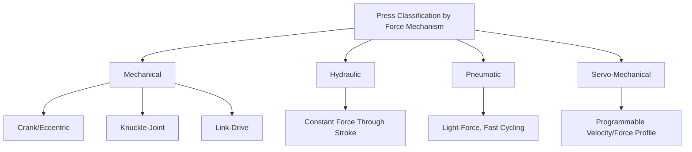
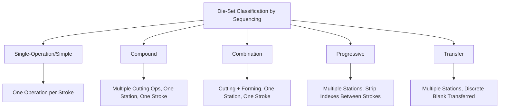

## Press-Working and Die-Set Classification

### Definition and Scope

Press-working and die-set classification organizes sheet metal forming from the equipment and tooling-architecture perspective, rather than by the deformation mechanism (shearing, bending, drawing, stretching) covered in preceding classifications. This framework categorizes presses by force-generation mechanism and die sets by operational sequencing, since press type and die architecture jointly determine achievable production rate, part complexity, tooling cost, and the number of distinct forming operations combinable within a single production cycle — considerations that cut across all the mechanism-based process families already classified.

### Classification of Presses by Force-Generation Mechanism

**Mechanical Presses**

Force is generated by a flywheel-driven crankshaft (or eccentric/knuckle-joint mechanism) converting continuous rotational motion into reciprocating ram travel. Characterized by high production speed and a force curve that varies sharply with ram position (near-infinite theoretical force at bottom-dead-center, dropping off rapidly with distance from it), making mechanical presses well suited to shearing and shallow-forming operations where peak force is needed only near the bottom of the stroke.

- *Crank/eccentric presses* — Simplest and most common mechanical press mechanism.
- *Knuckle-joint presses* — Provide a very high mechanical advantage near bottom-dead-center specifically, favored for coining and precision-forming operations requiring high force over a very short, well-controlled stroke distance.
- *Link-drive presses* — Modified linkage geometry adjusts the velocity profile through the stroke (e.g., slower approach and return for improved die life and part quality) while retaining mechanical drive's speed advantages.

**Hydraulic Presses**

Force is generated by hydraulic fluid pressure acting on a ram piston, providing constant force capability throughout the full stroke length (unlike a mechanical press's position-dependent force curve) and generally slower cycle speed. Well suited to deep drawing (where substantial force may be needed throughout a longer stroke), operations requiring a controllable, adjustable stroke length or dwell, and heavier-gauge or more force-intensive forming where a mechanical press's bottom-dead-center-concentrated force profile is disadvantageous.

**Pneumatic Presses**

Force is generated by compressed air acting on a ram piston; generally limited to lower-force applications (light blanking, piercing, marking) due to compressed air's lower achievable pressure relative to hydraulic fluid, but offering fast cycling and simpler infrastructure than hydraulic systems for suitable force ranges.

**Servo-Mechanical Presses**

A servo motor (rather than a continuously running flywheel/clutch/brake system) directly drives the ram, permitting programmable velocity and force profiles throughout the stroke — combining aspects of mechanical press speed with hydraulic press-like force-profile flexibility, increasingly used in modern stamping lines for its ability to optimize stroke velocity for each specific operation (e.g., slow, controlled velocity through the actual forming/piercing event, faster approach and return) and its energy efficiency relative to continuously-running flywheel systems. [Inference: adoption trends and specific advantages summarized from general modern stamping-press literature]

### Comparative Summary of Press Types

| Press type | Force-stroke characteristic | Typical speed | Best-fit operations |
| --- | --- | --- | --- |
| Mechanical (crank) | Peaks sharply near BDC | High | Blanking, piercing, shallow forming |
| Knuckle-joint | Very high mechanical advantage near BDC | Moderate-high | Coining, precision short-stroke forming |
| Hydraulic | Constant, full-stroke force | Low-moderate | Deep drawing, heavy-gauge forming |
| Pneumatic | Limited peak force | High | Light blanking/piercing/marking |
| Servo-mechanical | Fully programmable | Programmable | Mixed operations requiring profile optimization |

### Classification of Die Sets by Operational Sequencing

**Single-Operation (Simple) Dies**

Perform one operation (e.g., a single blank, a single bend) per press stroke; simplest and lowest-cost tooling, but requiring separate die setups and press cycles for each distinct operation a part requires, making this approach economical primarily for low-volume production or parts needing very few operations.

**Compound Dies**

Perform two or more cutting operations (e.g., simultaneous blanking and piercing) in a single station and single press stroke, with all operations occurring at the same location on the strip/part simultaneously; offers higher accuracy between the simultaneously-produced features than sequential operations would, since no strip repositioning occurs between them, but is generally limited to cutting (shearing-family) operations rather than combining cutting with forming.

**Combination Dies**

Perform both cutting and forming operations (e.g., blanking and bending) simultaneously at a single station in one stroke, extending the compound die's single-station, single-stroke principle to mixed operation types.

**Progressive Dies**

Perform a sequence of different operations at multiple distinct stations within a single die set, with the strip stock advancing (indexing) between stations after each stroke, such that a given part progresses through successive stations (piercing, notching, forming, and final blanking/cutoff) across multiple strokes before emerging as a completed part — enabling high-volume production of complex parts from continuous coil stock in a single press pass, at higher die design/build cost and complexity than simple, compound, or combination dies.

**Transfer Dies**

Similar in principle to progressive dies (multiple stations, multiple operations), but the workpiece is a discrete blank (rather than a continuous strip) that is mechanically transferred between separate die stations, often across multiple presses or a single large transfer press, permitting larger part sizes and more complex three-dimensional forming sequences (e.g., automotive body panels) than progressive strip dies typically accommodate.

### Comparative Summary of Die-Set Types

| Die-set type | Operations per stroke | Stock form | Complexity/cost | Typical application |
| --- | --- | --- | --- | --- |
| Single/simple | 1 | Strip or blank | Low | Low-volume, simple parts |
| Compound | 2+ (cutting only) | Strip | Moderate | High-accuracy multi-feature cutting |
| Combination | 2+ (cutting + forming) | Strip | Moderate-high | Combined cut/form at one station |
| Progressive | Multiple, across stations | Continuous strip/coil | High | High-volume complex flat/near-flat parts |
| Transfer | Multiple, across stations | Discrete blank | High | Large, complex 3D parts (body panels) |

### Selection Considerations

**Key Points**

- **Production volume** is the dominant driver of die-set selection: simple dies are economical at low volume where tooling amortization matters more than per-stroke productivity, while progressive and transfer dies require high volume to justify their substantially greater upfront tooling investment.
- **Part complexity and required operation count** favor progressive dies (for smaller, flat/near-flat parts producible from coil) or transfer dies (for larger, more three-dimensionally complex parts), since combining many operations into one die set eliminates the handling, storage, and setup time of sequential separate-die processing.
- **Strip layout design** (the arrangement and spacing of stations in a progressive die, including any idle/carrier stations) is a critical progressive-die engineering task, directly affecting material utilization and part quality throughout the multi-station sequence. [Inference: standard progressive-die design practice]
- **Press selection must match die-set requirements**: progressive dies for high-speed, high-volume flat parts commonly pair with high-speed mechanical presses, while transfer dies for large, deep-drawn automotive panels commonly pair with large hydraulic or servo-mechanical transfer presses offering the stroke length and force-profile control deep drawing demands.

### Illustrative Example

Producing a small electrical terminal illustrates the integration of press and die-set classification: given the part's small size, high required volume, and multiple features (piercing a mounting hole, forming a retention tab, and final blanking of the outer profile), a **progressive die** running in a **high-speed mechanical press** is the standard selection — the progressive die sequences piercing, forming, and blanking stations across the coil strip's travel through the die, while the mechanical press's fast cycle time and bottom-dead-center force concentration suit the primarily shearing- and shallow-forming-dominated operation mix. In contrast, a large automotive door outer panel — requiring deep, complex-contour stretch-draw forming across a large blank — would instead use a **transfer die** system across a **large hydraulic or servo-mechanical transfer press line**, since the panel's size exceeds practical progressive-strip handling and its deep-draw force/stroke requirements favor hydraulic or servo force-profile control over a mechanical press's BDC-concentrated force curve.

### Related Topics

- Mechanical press force-stroke curve analysis and tonnage selection
- Servo-press programmable motion profile optimization for stamping quality
- Progressive die strip layout design and material utilization
- Transfer press automation and part-handling between stations
- Die design for combined cutting-and-forming (combination die) stations
- Press tonnage and shut height selection relative to die-set requirements