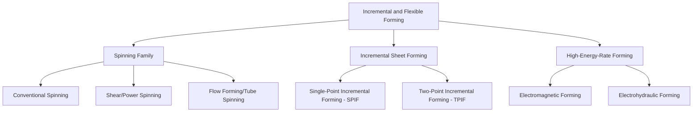

## Incremental and Flexible Sheet-Forming Classification

### Definition and Scope

Incremental and flexible sheet-forming classification organizes processes that shape sheet metal through localized, progressively-applied deformation using general-purpose or minimal tooling, rather than dedicated matched dies. This family is distinguished from the die-based processes covered elsewhere (deep drawing, stretch forming, press-working) by its central economic and technical premise: shape is generated primarily through tool-path programming or general-purpose forming elements rather than through part-specific hard tooling, making these processes especially suited to low-volume, prototype, and highly customized production where matched-die tooling cost cannot be justified.

### Classification by Forming Mechanism

**Spinning (Conventional Spinning)**

A flat circular blank is clamped against a rotating mandrel (chuck) and progressively formed over the mandrel's contour by a roller or forming tool that traces the desired profile while the blank rotates, producing axisymmetric hollow shapes (cones, hemispheres, cylindrical shells) with minimal wall-thickness change relative to the starting blank — the classical, longest-established member of this process family.

**Shear Spinning (Power Spinning)**

Similar rotational setup to conventional spinning, but the forming tool deliberately reduces wall thickness according to the sine law (final thickness approximately equal to initial thickness multiplied by the sine of the mandrel half-angle), producing a conical or curvilinear shape with a larger surface area than the starting blank at correspondingly reduced thickness, rather than conventional spinning's near-constant-thickness shape change alone.

**Flow Forming (Tube Spinning)**

Applied to tubular (rather than flat blank) starting stock: rollers progressively reduce wall thickness and elongate a cylindrical preform over a rotating mandrel, used to produce precision, thin-walled tubular components (pressure vessels, rocket motor cases, some automotive wheel rims) with a distinctive combination of dimensional precision and favorable, elongated grain structure from the incremental deformation.

**Incremental Sheet Forming (ISF) / Single-Point Incremental Forming (SPIF)**

A general-purpose, typically hemispherical-tipped tool (mounted on a CNC machine, robot arm, or dedicated ISF machine) traces a programmed tool path across a clamped sheet, progressively deforming the sheet locally at the tool-sheet contact point, layer by layer (following a contour-following path analogous to additive manufacturing's layer logic, though material is not added), to build up complex three-dimensional geometry without any part-specific die. **Two-Point Incremental Forming (TPIF)** adds a simple, generic partial die or support structure on the sheet's opposite side to improve dimensional accuracy and geometric control relative to single-point forming's die-less approach.

**Electromagnetic Forming (EMF)**

A rapidly discharged, high-current pulse through a forming coil generates a transient magnetic field that induces eddy currents in an adjacent conductive sheet or tube workpiece, producing a repulsive force that deforms the workpiece at very high strain rate against a die or into a target shape without direct mechanical tool contact — classified here due to its localized, tool-path-independent (coil-geometry-dependent) forming zone, though its high-strain-rate mechanism differs substantially from the quasi-static mechanisms of spinning and ISF.

**Electrohydraulic Forming (EHF)**

A high-voltage electrical discharge through a fluid medium (typically water) generates a rapid shockwave that deforms an adjacent sheet or tube workpiece against a die, mechanically analogous to electromagnetic forming in its high-strain-rate, non-contact energy delivery, but using a fluid pressure pulse rather than an induced electromagnetic repulsive force as the deformation driver.

### Comparative Summary

| Process | Tooling requirement | Wall thickness behavior | Geometry capability | Typical volume fit |
| --- | --- | --- | --- | --- |
| Conventional spinning | Mandrel + generic roller | Near-constant | Axisymmetric only | Low-moderate |
| Shear spinning | Mandrel + generic roller | Reduced per sine law | Axisymmetric, conical/curvilinear | Low-moderate |
| Flow forming | Rotating mandrel + rollers | Significantly reduced, elongated | Axisymmetric tubular | Low-moderate, precision-focused |
| SPIF | Generic tool + CNC/robot path | Thinning per contact geometry | Fully three-dimensional, asymmetric | Very low (prototypes, custom) |
| TPIF | Generic tool + partial die | Thinning, improved accuracy vs. SPIF | Three-dimensional, improved precision | Low, small-batch |
| Electromagnetic forming | Coil (part-family-specific) + optional die | Minimal, localized | Tube/sheet, moderate complexity | Low-moderate, specialty applications |
| Electrohydraulic forming | Electrode/fluid chamber + die | Minimal, localized | Sheet/tube against die | Low, specialty applications |

### Key Process Considerations

**Key Points**

- **Absence of part-specific hard tooling** (or use of only generic/simple tooling) is the unifying economic advantage across this family, making these processes disproportionately attractive for prototyping, aerospace/defense low-volume production, and rapid design-iteration applications where matched-die cost cannot be amortized over sufficient part volume.
- **Geometric accuracy and springback control** are generally more challenging in single-point incremental forming than in die-based processes, since there is no rigid opposing surface constraining the sheet's final shape at every point — a limitation directly addressed (at some cost to process flexibility) by two-point incremental forming's partial die support.
- **Formability advantages** have been observed in incremental sheet forming relative to conventional stamping for the same material, attributed to the highly localized, progressive nature of the deformation zone, which appears to permit strains exceeding the conventional forming limit diagram in some cases. [Inference/Unverified: this enhanced-formability phenomenon is documented in ISF research literature but mechanisms and generalizability across materials remain an active research area]
- **High-strain-rate forming processes** (electromagnetic, electrohydraulic) can access strain-rate-dependent formability improvements in certain alloys and are particularly suited to localized forming tasks (tube-end forming, flanging, embossing) rather than large, complex full-part geometries, due to practical coil/electrode size and energy-delivery constraints.
- **Process time** is a significant trade-off for tool-path-based methods (spinning, ISF): while eliminating hard-tooling lead time, per-part cycle time is substantially longer than matched-die stamping, reinforcing this family's fit for low-volume rather than high-throughput production.

### Illustrative Example

Producing a small batch of custom aerospace ducting cone sections illustrates the classification's practical fit: given the low quantity required (perhaps single digits to low tens of units) and the axisymmetric geometry, **conventional or shear spinning** over a reusable, relatively low-cost mandrel would typically be selected over matched-die stamping, since the tooling cost of a dedicated stamping die set for such low volume would be economically unjustifiable. For a one-off, asymmetric prototype sheet metal enclosure being iterated through several design revisions, **single-point incremental forming** directly from a CAD model via CNC tool-path generation would instead be favored, since it requires no dedicated tooling at all beyond the generic forming tool, allowing each design iteration to be produced without new die fabrication — at the cost of longer per-part forming time and reduced dimensional accuracy relative to either spinning or conventional die stamping.

### Related Topics

- Spinning mandrel design and roller path programming for axisymmetric shapes
- Shear spinning sine-law thickness prediction and multi-pass strategies
- Flow forming (tube spinning) for precision thin-walled pressure vessels
- Single-point vs. two-point incremental forming accuracy trade-offs
- Enhanced formability mechanisms in incremental sheet forming (research literature)
- Electromagnetic and electrohydraulic forming coil/electrode design for localized features