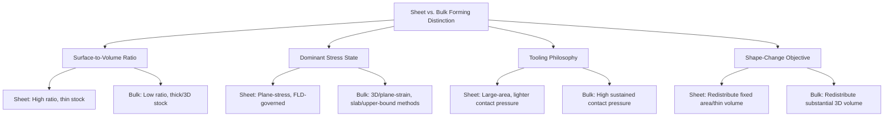

## Sheet Versus Bulk Forming Distinctions

### Definition and Scope

This classification establishes the fundamental analytical and practical boundary separating sheet metal forming from bulk deformation processing, the two principal branches of metal forming. While earlier chapters classified processes within each branch individually, this item addresses the distinguishing criteria themselves — geometric, mechanical, and tooling-based — that determine which branch a given process or part belongs to, providing the conceptual foundation that underlies why the two families require different analytical treatment, different failure criteria, and largely different tooling philosophies.

### Primary Distinguishing Criterion: Surface-Area-to-Volume Ratio

**Key Points**

- The most fundamental distinguishing characteristic is the workpiece's **surface-area-to-volume (or surface-area-to-thickness) ratio**: sheet metal forming operates on material with a high ratio (thin relative to its planar extent, commonly a practical threshold cited around 6 mm thickness or below, though this is a convention rather than a hard physical boundary), while bulk deformation operates on material with a comparatively low ratio (thick relative to any single dimension, or fully three-dimensional stock like billets and bars).
- This ratio difference has direct mechanical consequences: sheet forming processes generally maintain sheet thickness approximately constant (with the notable exception of stretching-dominant processes, which deliberately thin the material) and the initial thickness is rarely treated as a free process variable, whereas bulk forming processes are explicitly defined by substantial, deliberate change in cross-sectional dimensions (area reduction in drawing/extrusion, height reduction in forging/rolling).
- The high surface-to-volume ratio in sheet forming also means that **surface effects (friction, lubrication, tool-sheet contact conditions) dominate the mechanics** relative to bulk forming, where volumetric flow behavior and internal material response (e.g., dead-metal-zone formation, redundant work distribution through a thick section) play a comparatively larger analytical role.

### Distinguishing Criterion: Dominant Stress State and Failure Mode

**Key Points**

- Sheet forming is generally dominated by **plane-stress conditions** (through-thickness stress is negligible relative to in-plane stresses, since the material is thin), enabling simplified two-dimensional stress-state analysis (as embodied in the Forming Limit Diagram framework) that would be inapplicable to bulk processes.
- Bulk forming is generally dominated by **three-dimensional (or at least plane-strain) stress states** with significant through-thickness stress components, requiring more complex analytical treatments (slab method extended through a full three-dimensional or plane-strain geometry, upper-bound analysis, slip-line fields) that account for stress variation through the workpiece's substantial thickness.
- **Failure modes differ correspondingly**: sheet forming failure is typically **localized necking followed by tensile fracture** at the sheet surface (governed by the FLD), or wrinkling from in-plane compressive instability of the thin section; bulk forming failure modes include **internal defects** (central burst/chevron cracking, piping) arising from three-dimensional stress heterogeneity through a thick section, along with surface cracking and, in compressive processes, cold-shut/lap defects from folded material flow — failure modes essentially unique to processes with substantial material thickness in the deformation direction.

### Distinguishing Criterion: Tooling Philosophy and Contact Condition

**Key Points**

- Sheet forming tooling is generally characterized by **large-area, relatively light-contact-pressure tool surfaces** (dies, blank holders, punches with generous radii) that guide and constrain a thin sheet's shape without necessarily generating the intense, sustained normal pressure characteristic of bulk forming dies.
- Bulk forming tooling, particularly for forging and extrusion, generally involves **very high contact pressures** sustained over the full cross-section being deformed, with die/tool wear, thermal loading (in hot working), and force-transmission capacity representing central tooling design constraints not typically dominant in sheet forming die design (though sheet forming dies do face their own wear/durability considerations, particularly in high-volume shearing).
- **Lubrication regimes** differ in character: sheet forming lubrication primarily manages friction at large, relatively low-pressure sliding interfaces (blank-holder/die contact, punch-nose contact) to control material flow and prevent galling, while bulk forming lubrication (particularly hot working) must additionally withstand extreme pressure and temperature while sometimes serving a thermal-barrier function between hot workpiece and cooler die.

### Distinguishing Criterion: Volume/Mass Conservation and Shape-Change Objective

- **Sheet forming's shape-change objective** is typically to redistribute a fixed sheet area into a three-dimensional or contoured shape (bending, drawing) or to deliberately increase surface area at the cost of thickness (stretching) — the "raw material" is inherently two-dimensional in character even after forming into a 3D shape.
- **Bulk forming's shape-change objective** is to redistribute a three-dimensional volume of material into a different three-dimensional shape, typically with substantial dimensional change in more than one direction simultaneously (e.g., forging redistributing mass into a complex 3D silhouette, extrusion converting a short, thick billet into a long, thin, constant-cross-section profile).
- Both families obey volume conservation (constant volume, since plastic deformation involves no significant density change), but the practical design consequence differs: sheet forming's blank-development calculations (bend allowance, blank-diameter-for-drawing) are comparatively simpler two-dimensional area/length problems, while bulk forming's preform design (for closed-die forging, for example) requires three-dimensional volume-distribution planning across the part's full geometry.

### Comparative Summary

| Distinguishing factor | Sheet metal forming | Bulk deformation forming |
| --- | --- | --- |
| Surface-area-to-volume ratio | High (thin stock) | Low (thick/3D stock) |
| Thickness change | Generally minimal (except stretching) | Substantial, deliberate |
| Dominant stress state | Plane-stress | 3D / plane-strain |
| Primary analytical tool | Forming Limit Diagram | Slab method, upper-bound, slip-line field |
| Characteristic failure modes | Localized necking, wrinkling | Central burst, piping, cold shut/laps |
| Tooling contact pressure | Generally lower, larger area | Generally very high, sustained |
| Representative processes | Shearing, bending, drawing, stretching | Rolling, forging, extrusion, wire drawing |

### Boundary and Overlap Cases

**Key Points**

- **Deep drawing and tube/wire drawing share the "drawing" name** and the tensile-dominant governing constraint (pulling force transmitted through the reduced/formed section), but deep drawing is classified as sheet forming (thin, plane-stress-dominated, FLD-governed) while wire/tube drawing is classified as bulk forming (though tube drawing's thin wall introduces some sheet-forming-like plane-stress character, illustrating that the boundary is a convention useful for analytical grouping rather than a rigid physical partition).
- **Thick-plate forming** (heavy plate bending, thick-plate deep drawing) sits near the classification boundary, where plane-stress assumptions become progressively less accurate as thickness increases relative to bend radius or part dimensions, requiring judgment about which analytical framework remains appropriate. [Inference: general metal-forming classification practice; the specific thickness threshold where plane-stress assumptions break down is geometry- and application-dependent]
- **Flow forming and shear spinning** (classified within incremental sheet-forming) operate on sheet or tube stock but impose substantial, deliberate thickness reduction more characteristic of bulk forming's shape-change objective, illustrating that the "sheet vs. bulk" distinction is most reliably applied via the combination of criteria above rather than any single factor alone.

### Illustrative Example

Contrasting the production of an automotive fender (sheet forming) against a connecting rod (bulk forming) from otherwise comparable starting stock illustrates the full distinction: the fender is produced from **flat sheet stock** via stretch-draw forming, where the governing failure concern is localized necking predicted via the forming limit diagram under predominantly plane-stress conditions, and tooling consists of large-area, single-sided-contact-dominant die surfaces. The connecting rod is produced from a **cylindrical billet** via closed-die forging, where the governing concern includes internal defect formation (potential cold shuts from improperly directed material flow) under a fully three-dimensional stress state analyzed via slab or upper-bound methods, with tooling (impression dies) generating very high, sustained contact pressure across the billet's full cross-section throughout the forging stroke — the same general "metal forming" category, but requiring entirely distinct analytical frameworks, failure-mode vocabularies, and tooling design philosophies as a direct consequence of the two parts' differing surface-area-to-volume ratios and shape-change objectives.

### Related Topics

- Forming Limit Diagram theory and its plane-stress assumption basis
- Slab method and upper-bound analysis for bulk forming force prediction
- Central burst, piping, and cold-shut defect formation in bulk processes
- Tooling contact pressure and wear considerations across sheet vs. bulk dies
- Thick-plate forming as a boundary case between sheet and bulk classification
- Flow forming and shear spinning as hybrid sheet/bulk deformation processes