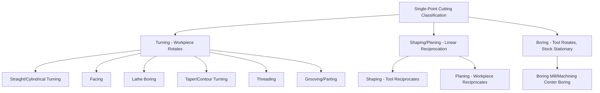

## Single-Point Cutting-Tool Process Classification

### Definition and Scope

Single-point cutting-tool process classification organizes conventional machining operations by the shared characteristic of employing a single, geometrically-defined cutting edge (as opposed to multi-tooth tools like milling cutters or drills, or the geometrically-undefined abrasive grains of grinding) engaged with the workpiece at any instant. This family forms a foundational branch of conventional machining classification because the single-point cutting mechanics — chip formation via a single, continuous or interrupted engagement — underlie the force, tool-wear, and surface-finish models that extend, with modification, to multi-point processes as well.

### The Single-Point Cutting Mechanism

**Key Points**

- A single-point tool removes material via **shear deformation** concentrated in a primary shear zone ahead of the cutting edge, where the workpiece material is plastically sheared and separated from the parent stock to form a chip, with a secondary shear zone at the tool-chip interface (rake face) contributing additional deformation and heat generation from chip-tool friction.
- **Tool geometry** — rake angle, clearance (relief) angle, cutting-edge angle, and nose radius — directly governs chip formation mode, cutting force magnitude and direction, surface finish, and tool life, making single-point tool geometry a central design/selection variable common across all processes in this family.
- **Chip types** produced (continuous, continuous-with-built-up-edge, discontinuous/segmented, or serrated/shear-localized) depend on workpiece material ductility, cutting speed, feed, and tool geometry, and are a standard diagnostic indicator of cutting condition appropriateness across all single-point operations. [Inference: chip-type classification is standard machining theory; specific transition conditions between chip types are material- and parameter-dependent]

### Classification by Relative Tool-Workpiece Motion

**Turning (Lathe Operations)**

The workpiece rotates while a single-point tool moves linearly (typically parallel to the rotation axis for straight turning, or perpendicular for facing), removing material to produce axisymmetric external or internal (boring) surfaces.

- **Straight/cylindrical turning** — Tool moves parallel to the workpiece axis, producing a constant-diameter cylindrical surface (or, with programmed diameter variation, a contoured/tapered surface).
- **Facing** — Tool moves radially (perpendicular to the axis), producing a flat surface at the end of the rotating workpiece.
- **Boring** — A single-point tool mounted on a boring bar removes material from an existing internal bore, enlarging and/or improving the accuracy/finish of a pre-drilled or pre-cast hole; mechanically equivalent to internal turning.
- **Taper turning and contour turning** — The tool path is angled (taper) or follows a programmed non-linear path (contour, typically via CNC) relative to the axis, producing non-cylindrical axisymmetric profiles.
- **Threading (single-point)** — The tool, ground to the thread's profile angle, is fed at a rate matched to the workpiece rotation to cut a helical thread groove, distinguished from thread rolling (a bulk-deformation, chipless process) by material removal via cutting.
- **Grooving and parting (cutoff)** — A narrow single-point tool is fed radially to cut a groove of specific width, or fed fully through the workpiece to separate a finished part from remaining stock.
- **Knurling** — Technically a forming (not cutting) operation performed on a lathe using a hardened, patterned roller rather than a cutting edge, but classified here due to its shared lathe/rotational-motion setup; produces a textured surface pattern via plastic deformation rather than chip removal.

**Shaping and Planing**

The tool reciprocates linearly relative to a stationary (or slowly, perpendicularly indexed) workpiece, removing material in a straight-line cutting stroke followed by a non-cutting return stroke.

- **Shaping** — The tool reciprocates while the workpiece remains stationary (indexing laterally between strokes); typically used for smaller workpieces and lower production volumes given the process's comparatively low material removal rate and largely superseded by milling in most modern production contexts.
- **Planing** — The workpiece reciprocates while the tool remains stationary (or indexes laterally); historically used for large, flat surfaces (machine tool beds, large structural components) exceeding practical shaper table size, similarly largely superseded by large-bed milling in contemporary practice.

**Boring (Stationary Workpiece Variant)**

Distinguished from lathe boring by which component rotates: in boring-mill or machining-center boring, the single-point tool rotates (mounted in a boring head or spindle) while the workpiece remains stationary, used for large or non-axisymmetric workpieces where rotating the entire part (as lathe turning requires) is impractical.

### Comparative Summary

| Operation | Which element rotates/moves | Typical geometry produced | Modern usage context |
| --- | --- | --- | --- |
| Straight turning | Workpiece rotates, tool traverses | External cylindrical surface | Widespread, CNC lathes |
| Facing | Workpiece rotates, tool traverses radially | Flat end surface | Widespread, CNC lathes |
| Lathe boring | Workpiece rotates, tool traverses internally | Internal cylindrical surface | Widespread, CNC lathes |
| Threading (single-point) | Workpiece rotates, tool synchronized feed | Helical thread groove | Precision/custom threads, CNC lathes |
| Shaping | Tool reciprocates, workpiece indexes | Flat/stepped surfaces | Largely superseded, niche/toolroom use |
| Planing | Workpiece reciprocates, tool indexes | Large flat surfaces | Largely superseded, niche/heavy industry |
| Boring mill boring | Tool rotates, workpiece stationary | Large/non-axisymmetric internal bores | Large or complex workpieces |

### Force and Tool-Life Considerations

**Key Points**

- **Cutting force components** (tangential/cutting force, feed force, radial force) vary in relative magnitude with tool geometry (particularly rake angle and cutting-edge angle) and cutting parameters, with the tangential component generally dominating power/energy consumption calculations across all single-point operations.
- **Tool wear mechanisms** — flank wear, crater wear, notch wear, and (at high temperature/speed) plastic deformation of the cutting edge — are common analytical concerns across turning, boring, shaping, and planing, since all involve sustained or repeated single-edge engagement, though wear rate and dominant mechanism vary with cutting speed, tool material, and workpiece material.
- **Taylor's tool life equation** ($VT^n = C$, relating cutting speed $V$ and tool life $T$ via material/tool-specific constants $n$ and $C$) is the classical analytical relationship for single-point tool life prediction, historically developed from turning data but applied with appropriate constants across this process family. [Inference: Taylor's equation is a well-established, standard machining relationship; specific $n$ and $C$ values are tool-material and workpiece-material combination-specific]
- **Surface finish in turning** is strongly influenced by tool nose radius and feed rate, with a well-established theoretical relationship (peak-to-valley roughness decreasing with larger nose radius and/or reduced feed) providing a first-order finish-prediction tool distinct from the empirical finish considerations more typical of multi-point processes.

### Illustrative Example

Producing a precision steel shaft with a shoulder, a threaded end, and a bored internal bore illustrates the classification's practical integration within a single part: the shaft blank is first **straight turned** to establish the primary outer diameter and **faced** at each end to set overall length, then a **taper or contour turning** pass (if the shaft has a stepped or profiled section) establishes the shoulder geometry, followed by **single-point threading** at the designated end to cut the required thread profile, and finally **boring** to enlarge and finish an internal bore to its final diameter and surface finish — all performed on a single CNC lathe setup using different single-point tool geometries and programmed tool paths for each named operation, illustrating how this classification's sub-categories commonly combine within one machine and one workholding setup rather than requiring separate machines.

### Related Topics

- Single-point tool geometry (rake, relief, cutting-edge angles) and its effect on chip formation
- Taylor's tool life equation and cutting-speed optimization
- Surface finish prediction from nose radius and feed rate in turning
- CNC lathe programming for contour and threading operations
- Boring bar design and chatter/vibration considerations in deep boring
- Tool wear mechanisms (flank, crater, notch) across single-point operations