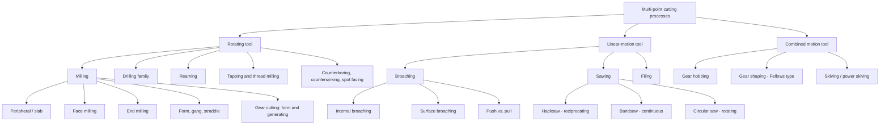
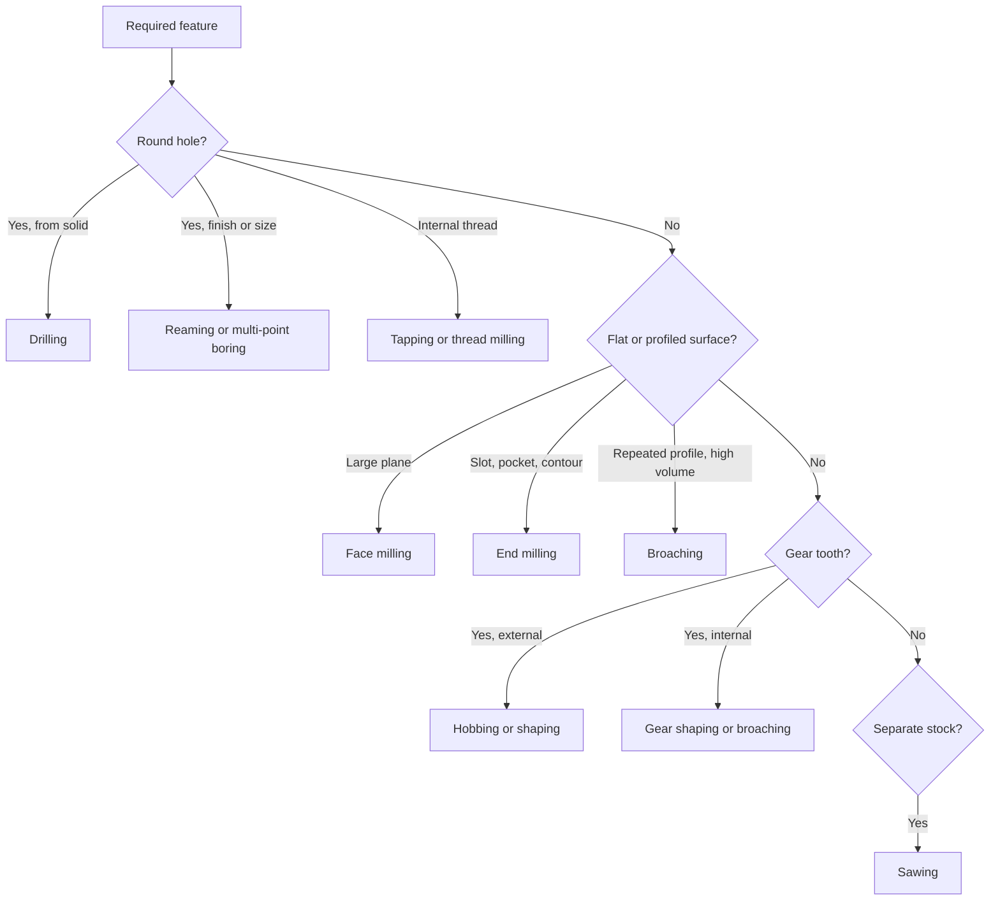

## Multi-Point Cutting-Tool Process Classification

### Overview

A **multi-point cutting tool** has two or more principal cutting edges engaged with the workpiece, either simultaneously or in rapid sequence. Processes that use such tools are grouped under conventional (subtractive) machining and are distinguished from **single-point** processes (turning, boring, shaping, planing, threading with a single-point tool), where one principal cutting edge does the work.

Classification of multi-point processes rests on five independent criteria, and most real operations fall into several categories at once (for example, face milling is multi-point, rotating-tool, intermittent-cut, and generates a plane).

**Key Points**

- Multi-point tools distribute chip load across several teeth, so each tooth removes a small chip and has time to cool between engagements.
- The primary motion is usually assigned to the tool (milling, drilling, reaming) or to a combination of tool and work (broaching, gear hobbing).
- Cutting is either **interrupted** (each tooth enters and exits the cut, producing cyclic impact and thermal loading) or **continuous** (teeth remain engaged, as in drilling).
- Abrasive processes (grinding, honing) use geometrically undefined cutting points and are commonly classified separately from geometrically defined multi-point cutting; they appear here only for boundary clarity.

### Classification Criteria

| Criterion | Categories |
| --- | --- |
| Tool geometry | Geometrically defined edges (milling cutter, drill, reamer, broach, saw blade, file) vs. undefined edges (abrasive grains) |
| Primary cutting motion | Tool rotation, tool linear motion, work rotation with tool feed, combined |
| Feed motion | Work feed, tool feed, no feed (broaching; feed built into the tool) |
| Surface generated | Plane, cylindrical (internal/external), profile, slot, gear tooth, thread, hole |
| Engagement mode | Interrupted (milling, sawing, hobbing) vs. continuous (drilling, reaming, tapping) |

### Master Classification Tree

### Milling

Milling uses a rotating multi-tooth cutter while the workpiece (or, on some machines, the cutter) feeds. It is the largest family of multi-point processes.

#### Classification by Cutter Axis and Cutting Edge Location

| Type | Cutter axis relative to surface | Cutting edges | Typical output |
| --- | --- | --- | --- |
| Peripheral (slab) milling | Parallel | On the periphery | Flat surfaces, wide shallow cuts |
| Face milling | Perpendicular | Periphery and face | Large flat surfaces, high finish |
| End milling | Perpendicular (or any) | Periphery and end face | Slots, pockets, profiles, 3D contours |

#### Classification by Cutter Rotation vs. Feed Direction (Peripheral Milling)

- **Up milling (conventional):** cutter rotation opposes feed at the point of contact. Chip thickness starts at zero and grows to a maximum at exit. Tooth rubs before biting; the force tends to lift the workpiece.
- **Down milling (climb):** cutter rotation matches feed direction. Chip thickness is maximum at entry and tapers to zero at exit. Force presses the workpiece down, but the process requires backlash elimination on the machine table.

**Example**

For a peripheral cutter with $z$ teeth, feed per tooth $f_z$, and depth of cut $a_e$ (radial engagement) on a cutter of diameter $D$, the maximum uncut chip thickness is approximately

$$h_{max} = f_z \sin\phi_{max}, \qquad \phi_{max} = \arccos\!\left(1 - \frac{2a_e}{D}\right)$$

and the table feed rate is

$$v_f = f_z \cdot z \cdot n$$

where $n$ is spindle speed in rev/min. With $z = 4$, $f_z = 0.1\ \text{mm}$, and $n = 800\ \text{rev/min}$:

$$v_f = 0.1 \times 4 \times 800 = 320\ \text{mm/min}$$

#### Classification by Cutter Form

- **Plain (slab) mills:** straight or helical teeth on the periphery.
- **Side-and-face cutters:** teeth on periphery and one or both sides; used for slots and steps.
- **Slitting saws:** thin, for parting and deep narrow slots.
- **Form-relieved cutters:** teeth ground to a profile (gear tooth, radius, T-slot).
- **Face mills:** replaceable-insert bodies for high metal removal.
- **End mills:** solid or insert, flat, ball-nose, bull-nose, tapered, roughing (serrated).
- **Straddle and gang setups:** two or more cutters on one arbor to machine several surfaces in one pass.

#### Classification by Machine Configuration

- Horizontal, vertical, and universal knee-and-column mills
- Bed-type (fixed-bed) mills
- Planer-type (plano-milling) machines
- CNC machining centers (3-axis, 4-axis, 5-axis)

### Drilling Family

Drilling and its related operations produce or finish holes using a rotating multi-flute tool (usually two flutes for twist drills). The cutting is continuous, and chip evacuation through the flutes is the dominant design constraint.

| Operation | Purpose | Tool |
| --- | --- | --- |
| Drilling | Produce a round hole from solid | Twist drill, spade drill, gun drill, indexable-insert drill |
| Reaming | Size and finish an existing hole | Reamer (multi-flute, straight or spiral) |
| Boring (multi-point head) | Enlarge and correct hole position | Boring bar with multiple inserts |
| Counterboring | Enlarge the end of a hole for a fastener head | Counterbore with pilot |
| Countersinking | Conical enlargement for flat-head fasteners | Countersink |
| Spot facing | Square a seat around a hole | Spot-facing cutter |
| Tapping | Cut internal threads | Tap |
| Trepanning | Cut an annular groove to remove a core | Trepanning cutter |

**Key Points**

- The chisel edge of a twist drill does not cut; it extrudes material, producing high thrust force. Web thinning or pilot holes reduce this.
- Deep-hole drilling (depth to diameter ratio commonly above 10 [Inference: threshold varies by source]) needs special tools such as gun drills or BTA systems with coolant delivered through the tool.
- Drilling torque and thrust are functions of feed per revolution and diameter, not just speed.

### Reaming and Tapping

**Reaming** removes small stock (typically a few tenths of a millimeter, depending on hole size and material) to achieve tight diameter tolerance and surface finish. A reamer follows the existing hole axis and cannot correct position errors.

**Tapping** forms threads by advancing a tap at a feed equal to the thread pitch per revolution. Classified as:

- **Cutting taps** (remove chips): straight flute, spiral flute, spiral point
- **Forming (roll) taps** (displace material): no chips, but they do form thread profile by cold flow and are not cutting in the strict sense

### Broaching

Broaching uses a long tool with progressively larger teeth (rise per tooth) so that one linear stroke completes roughing, semi-finishing, and finishing. Feed is built into the tool geometry, so no separate feed motion is required.

#### Classification

- **Internal broaching:** the tool passes through an existing hole (keyways, splines, polygon holes, round-hole finishing).
- **Surface (external) broaching:** the tool cuts an outer surface (slots, flats, contours, dovetails).
- **Pull vs. push:** pull broaches are in tension and are less prone to buckling; push broaches are shorter and used in arbor presses.
- **Continuous broaching:** workpieces move past a fixed broach on a conveyor (high-volume automotive parts).

**Example**

The tooth rise (feed per tooth) $a_z$ determines the total stock removed. For a broach with $N_r$ roughing teeth, $N_s$ semi-finishing teeth, and $N_f$ finishing teeth (finishing teeth have zero rise), the total stock removal is approximately

$$S = a_{z,r} N_r + a_{z,s} N_s$$

Tooth pitch $p$ is often estimated by the empirical relation

$$p = C \sqrt{L}$$

where $L$ is the length of cut in mm and $C$ is a constant, commonly quoted in the range of about 1.25 to 2.0 for typical steels [Inference: exact constant depends on handbook and material]. Choose pitch so at least two or three teeth are in the cut for stability, and so chip space is adequate for the chip volume.

**Conclusion (Broaching)**

Broaching offers exceptional productivity and accuracy for repeated profiles but has high tool cost and is only economical at volume.

### Sawing

Sawing uses a thin strip or disc with many teeth to sever or cut narrow kerfs. Classification:

| Type | Tool motion | Cutting action |
| --- | --- | --- |
| Hacksawing | Reciprocating, cuts on one stroke | Intermittent; blade lifted on return |
| Bandsawing | Continuous loop | Continuous, straight or contour |
| Circular sawing | Rotating disc | Continuous, high accuracy cutoff |
| Abrasive cutoff | Rotating bonded disc | Not geometrically defined; grouped with abrasive processes |

**Key Points**

- Tooth pitch (teeth per inch) must ensure at least two to three teeth in contact with the material at all times to prevent stripping.
- Tooth set (alternate, wavy, raker) provides kerf clearance for the blade body.

### Filing

Filing removes small amounts of material with a multi-tooth file, typically by manual or machine reciprocation. It is used for deburring, fitting, and local finishing. Files are classified by cut (single, double, rasp, curved), coarseness (bastard, second cut, smooth), and profile (flat, half-round, round, square, triangular).

### Gear Cutting with Multi-Point Tools

Gear machining is a specialized classification where the tool and workpiece motions are coordinated.

| Method | Principle | Tool |
| --- | --- | --- |
| Form milling | Tool profile equals tooth space; indexed between teeth | Involute form cutter |
| Hobbing | Generating; hob and blank rotate in timed relation | Hob (worm-like with gashes) |
| Shaping (gear shaper) | Generating; reciprocating pinion-type or rack-type cutter | Pinion cutter, rack cutter |
| Broaching (gear) | Form; tool cuts all teeth in one stroke (internal gears) | Gear broach |
| Skiving / power skiving | Generating; tool axis crossed with work axis | Skiving wheel |

**Example (Hobbing Kinematics)**

For a single-start hob rotating at $n_h$ and a gear blank with $N$ teeth rotating at $n_w$, the timing condition is

$$n_w = \frac{n_h \cdot k}{N}$$

where $k$ is the number of starts on the hob. For a 40-tooth gear cut by a single-start hob at 200 rev/min:

$$n_w = \frac{200 \times 1}{40} = 5\ \text{rev/min}$$

### Chip Formation and Load Characteristics by Category

| Category | Chip thickness | Loading | Thermal cycle |
| --- | --- | --- | --- |
| Milling | Varies within tooth engagement | Cyclic impact | Heating during cut, cooling in air gap |
| Drilling | Approximately constant | Continuous, with axial thrust | Sustained heat, confined chip removal |
| Broaching | Constant per tooth (set by rise) | Steady, high total force | Moderate; heat carried by chips |
| Sawing | Small per tooth | Cyclic (band) or impact (hacksaw) | Low per tooth |

### Tool Materials and Coatings

Common materials for multi-point tools include high-speed steel (HSS, including cobalt and powder-metallurgy grades), cemented carbide (uncoated and coated), cermet, ceramic, and for special work polycrystalline diamond (PCD) and cubic boron nitride (CBN). Indexable inserts are typical on large face mills and drills; solid tools dominate small diameters. Coatings such as TiN, TiCN, TiAlN, and AlCrN are widely applied to extend life, though performance depends on workpiece material and cutting conditions and should be verified against supplier data.

### Selection Guide

### Comparison of Multi-Point vs. Single-Point Processes

| Aspect | Multi-point | Single-point |
| --- | --- | --- |
| Edges engaged | Two or more | One |
| Chip load per edge | Lower | Higher |
| Productivity | Generally higher per pass | Lower per pass |
| Tool complexity and cost | Higher | Lower |
| Setup flexibility | Often lower (dedicated tools) | Higher |
| Cut type | Often interrupted | Often continuous (turning) |

### Process Variables Common to Multi-Point Cutting

- **Cutting speed** $v_c = \pi D n / 1000$ (m/min with $D$ in mm, $n$ in rev/min)
- **Feed per tooth** $f_z$ and **feed per revolution** $f = f_z z$
- **Depth of cut** (axial $a_p$, radial $a_e$)
- **Material removal rate** in milling: $MRR = a_p \cdot a_e \cdot v_f$

**Example**

For a face mill with $D = 100\ \text{mm}$ running at $n = 600\ \text{rev/min}$:

$$v_c = \frac{\pi \times 100 \times 600}{1000} \approx 188.5\ \text{m/min}$$

With $a_p = 3\ \text{mm}$, $a_e = 80\ \text{mm}$, and $v_f = 500\ \text{mm/min}$:

$$MRR = 3 \times 80 \times 500 = 120{,}000\ \text{mm}^3/\text{min} = 120\ \text{cm}^3/\text{min}$$

### Common Failure Modes

- **Chipping and edge fracture** from impact in interrupted cuts, mitigated by tougher grades and appropriate entry angles.
- **Thermal cracking** (comb cracks) in milling from thermal cycling; often reduced by dry cutting or stable coolant delivery [Inference: effect depends on grade and application].
- **Chip packing** in drilling and tapping, addressed with peck cycles, through-tool coolant, and flute geometry.
- **Chatter** from low system stiffness or unfavorable tooth spacing; variable-pitch and variable-helix cutters can disrupt regenerative vibration.
- **Built-up edge** at low speeds on ductile materials.

Actual behavior varies with machine, tooling, workpiece material, and process parameters.

### Practical Summary

**Conclusion**

Multi-point cutting-tool processes are classified by cutter motion (rotating, linear, combined), cutting-edge arrangement, engagement mode (interrupted or continuous), and generated geometry. Milling dominates for flexible surface generation, the drilling family for holes and threads, broaching for high-volume fixed profiles, sawing for stock separation, and gear-cutting processes for generated tooth forms. Selecting among them balances geometry, tolerance, volume, and tool economics.

**Related Topics**

- Single-point cutting-tool process classification (turning, boring, shaping, planing)
- Abrasive machining processes (grinding, honing, lapping, superfinishing)
- Milling cutter geometry and tooth nomenclature
- Chip formation mechanics and orthogonal vs. oblique cutting
- Cutting force models and specific cutting energy
- Tool wear mechanisms and tool life equations (Taylor)
- Cutting fluids and minimum quantity lubrication
- CNC machining centers and multi-axis milling strategies
- High-speed and high-feed machining
- Gear manufacturing and inspection methods