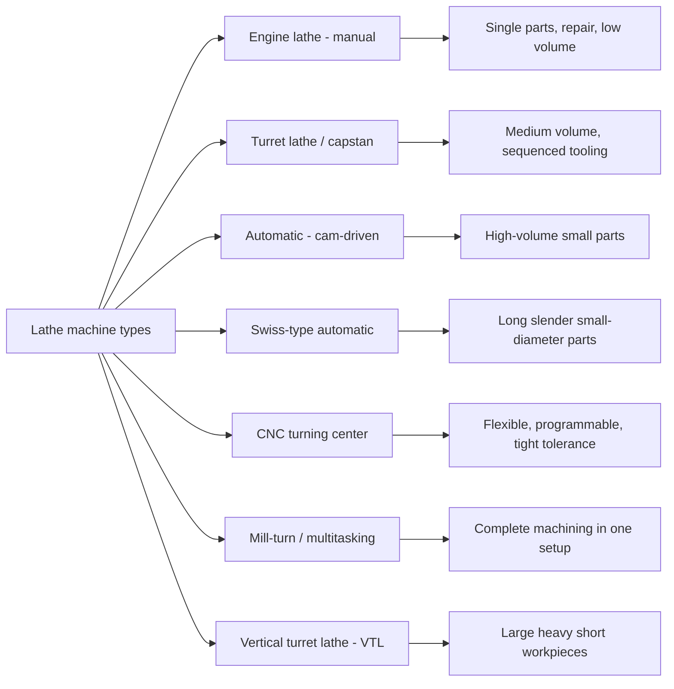
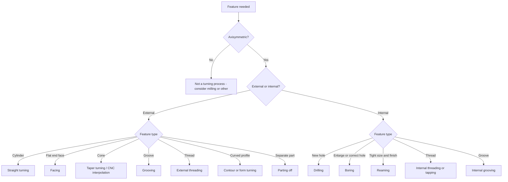

## Turning-Based Process Classification

### Overview

**Turning** is a machining process in which a workpiece rotates about its axis while a (usually single-point) cutting tool moves along a controlled path to remove material and generate surfaces of revolution. It is the defining operation of the lathe and, on modern equipment, of CNC turning centers and mill-turn machines.

Turning-based processes are classified along several independent axes. Any real operation sits at a point in each axis simultaneously: for example, "finish external longitudinal turning with a 0.1 mm/rev feed" is external (surface location), longitudinal (feed direction), finishing (purpose), and continuous-cut (engagement).

**Key Points**

- The primary cutting motion is **workpiece rotation**; the feed motion is a **linear tool motion** (axial, radial, or a combination).
- Most turning operations use a **single-point tool**, which is why turning is the reference case in the single-point branch of conventional machining classification. Exceptions include form tools, multi-insert grooving tools, and threading with multi-point chasers or taps/dies on lathes.
- Cutting is normally **continuous** (edge stays engaged), unlike milling, though interrupted turning occurs on splined, keyed, or cross-drilled workpieces.
- The generated surface geometry is determined by the tool path relative to the rotation axis, so the classification is largely kinematic.

### Classification Criteria

| Criterion | Categories |
| --- | --- |
| Surface location | External vs. internal |
| Feed direction relative to axis | Longitudinal (axial), transverse (radial), oblique/taper, contour |
| Generated geometry | Cylindrical, conical, flat (face), grooved, threaded, profiled, spherical |
| Purpose / stage | Roughing, semi-finishing, finishing |
| Tool geometry | Single-point, form tool, multi-insert |
| Tool-workpiece motion control | Manual, copying (template), automatic (cam), CNC |
| Workpiece support | Between centers, chuck, collet, chuck plus tailstock, steady/follow rest |
| Machine type | Engine lathe, turret lathe, automatic, CNC turning center, mill-turn |

### Master Classification Tree

```mermaid
flowchart TD
    A[Turning-based processes] --> B[External surface operations]
    A --> C[Internal surface operations]
    A --> D[Threading operations]
    A --> E[Parting and grooving]
    A --> F[Form and contour operations]
    A --> G[Auxiliary lathe operations]

    B --> B1[Straight turning]
    B --> B2[Taper turning]
    B --> B3[Facing]
    B --> B4[Shoulder / step turning]
    B --> B5[Chamfering]
    B --> B6[Knurling]

    C --> C1[Boring]
    C --> C2[Drilling on lathe]
    C --> C3[Reaming on lathe]
    C --> C4[Internal grooving and threading]
    C --> C5[Counterboring and countersinking]

    D --> D1[External threading]
    D --> D2[Internal threading]
    D --> D3[Tapping and die threading]

    E --> E1[Parting off]
    E --> E2[Face grooving]
    E --> E3[Groove turning]

    F --> F1[Form turning]
    F --> F2[Profile / contour turning]
    F --> F3[Copy turning]
    F --> F4[Spherical turning]

    G --> G1[Eccentric turning]
    G --> G2[Hard turning]
    G --> G3[Mill-turn: live tooling]
```

### Classification by Feed Direction

The relationship between the tool feed vector and the workpiece axis is the most fundamental kinematic classification.

| Feed direction | Operation | Resulting surface |
| --- | --- | --- |
| Parallel to axis | Straight (cylindrical) turning | Cylinder, diameter reduced |
| Perpendicular to axis | Facing, parting, grooving | Flat face, groove, cutoff |
| At an angle to axis | Taper turning | Cone |
| Combined axial + radial (programmed or copied) | Contour / profile turning | Arbitrary axisymmetric profile |

#### Straight Turning

The tool feeds parallel to the axis. Diameter is reduced from $D_0$ to $D_f$, with radial depth of cut

$$a_p = \frac{D_0 - D_f}{2}$$

**Example**

Turn a bar from $D_0 = 50\ \text{mm}$ to $D_f = 46\ \text{mm}$ in one pass, at $n = 800\ \text{rev/min}$ and $f = 0.2\ \text{mm/rev}$, over a length $L = 120\ \text{mm}$.

$$a_p = \frac{50 - 46}{2} = 2\ \text{mm}$$

$$v_c = \frac{\pi D_0 n}{1000} = \frac{\pi \times 50 \times 800}{1000} \approx 125.7\ \text{m/min}$$

$$t_m = \frac{L}{f\,n} = \frac{120}{0.2 \times 800} = 0.75\ \text{min}$$

Material removal rate (using the initial diameter as a first approximation):

$$MRR = v_c \cdot f \cdot a_p \cdot 1000 \approx 125.7 \times 0.2 \times 2 \times 1000 \approx 50{,}280\ \text{mm}^3/\text{min}$$

Note that cutting speed varies across the depth of cut because diameter changes; the value above uses the starting diameter.

#### Facing

The tool feeds radially toward or away from the center. Because diameter shrinks toward the center, constant spindle speed causes cutting speed to fall to zero at the axis. CNC lathes commonly use **constant surface speed (CSS)** control, which varies spindle speed as

$$n = \frac{1000\, v_c}{\pi D}$$

up to a programmed spindle speed limit (G96/G50 in Fanuc-style controls; exact codes vary by controller).

#### Taper Turning

A conical surface can be produced by several methods:

- **Compound rest swiveled:** short tapers, manual feed.
- **Tailstock offset:** long, shallow tapers between centers; offset $S$ for a taper over length $L$ on a workpiece of total length $L_w$:

$$S = \frac{(D - d)}{2L}\, L_w$$

where $D$ and $d$ are the large and small diameters of the taper.

- **Taper attachment (guide bar):** accurate long tapers.
- **Form tool:** short, steep chamfers or cones.
- **CNC interpolation:** simultaneous X and Z motion; no special attachment.

**Example (Tailstock Offset)**

Taper from $D = 40\ \text{mm}$ to $d = 30\ \text{mm}$ over $L = 200\ \text{mm}$, with total workpiece length $L_w = 300\ \text{mm}$:

$$S = \frac{40 - 30}{2 \times 200} \times 300 = 7.5\ \text{mm}$$

The half-angle of the taper is

$$\alpha = \arctan\!\left(\frac{D - d}{2L}\right) = \arctan(0.025) \approx 1.43^\circ$$

### Classification by Surface Location

#### External Operations

- **Straight turning:** cylindrical surfaces.
- **Shoulder (step) turning:** stepped shafts with axial locating faces.
- **Chamfering:** breaks sharp edges; a 45° chamfer is standard.
- **Knurling:** plastic deformation (not cutting) to raise a diamond or straight pattern; classified as a lathe operation but a forming process in the strict sense.
- **Grooving (external):** radial groove for retaining rings, O-rings, or relief.

#### Internal Operations

Internal operations are constrained by **tool overhang** (bar length to diameter ratio), which limits stiffness and increases chatter risk.

| Operation | Purpose |
| --- | --- |
| Drilling | Produce a hole along the axis (tool stationary, workpiece rotating) |
| Boring | Enlarge and true an existing hole; corrects concentricity and straightness |
| Reaming | Size and finish a hole using a multi-point reamer held in the tailstock |
| Counterboring | Enlarge a hole to a specific depth with a flat bottom |
| Countersinking | Conical entrance for screw heads |
| Internal grooving | Retaining-ring grooves, oil grooves |
| Internal threading | Cut internal threads with a single-point threading tool or tap |

**Key Points**

- Boring bars are rated by the ratio $L/D$; as this ratio grows, stiffness falls approximately with the cube of overhang for a simple cantilever model. Damped or carbide-shank boring bars are used at high ratios [Inference: the specific ratio threshold at which damping is required depends on material, tool design, and cutting conditions].
- Chip evacuation is harder inside a bore, so through-tool coolant and chip-breaking geometry matter more than in external turning.

### Classification by Purpose (Stage)

| Stage | Objective | Typical parameters (qualitative) |
| --- | --- | --- |
| Roughing | Remove bulk stock quickly | Large $a_p$, high $f$, moderate $v_c$; finish quality secondary |
| Semi-finishing | Even out allowance and correct geometry | Moderate $a_p$ and $f$ |
| Finishing | Achieve final size, tolerance, and surface finish | Small $a_p$, small $f$, higher $v_c$, sharp or wiper-geometry insert |

The theoretical peak-to-valley surface roughness for a tool with nose radius $r_\varepsilon$ and feed $f$ is

$$R_{t} \approx \frac{f^{2}}{8\, r_\varepsilon}$$

and the arithmetic average roughness is approximately

$$R_a \approx \frac{f^{2}}{32\, r_\varepsilon}$$

**Example**

For $f = 0.1\ \text{mm/rev}$ and $r_\varepsilon = 0.8\ \text{mm}$:

$$R_a \approx \frac{0.1^2}{32 \times 0.8}\ \text{mm} = 3.9 \times 10^{-4}\ \text{mm} = 0.39\ \mu\text{m}$$

Real roughness is usually higher than this geometric value because of tool wear, built-up edge, vibration, and material side flow [Inference: magnitude of deviation depends on workpiece material and conditions].

### Threading Operations

Thread cutting on a lathe requires synchronizing tool axial travel with spindle rotation so that the tool advances exactly one lead per revolution.

#### Classification

- **Single-point threading:** most flexible; produces any profile with a ground or insert tool. Requires multiple passes with a decreasing depth of cut.
- **Multi-point (chaser) threading:** several teeth cut in a single pass.
- **Die threading (external) and tapping (internal):** low-cost for standard sizes.
- **Thread whirling or thread milling on mill-turn machines:** classified under milling-based methods when driven tools are used.

For a single-start thread, the feed per revolution equals the pitch $P$, so

$$v_{f} = P \cdot n$$

For a multi-start thread with $k$ starts, lead $L_d = k P$.

**Example**

An M20 × 2.5 coarse thread at $n = 300\ \text{rev/min}$ has axial feed

$$v_f = 2.5 \times 300 = 750\ \text{mm/min}$$

Total thread depth for an ISO metric external thread is approximately $h \approx 0.6134\,P$, so

$$h \approx 0.6134 \times 2.5 \approx 1.53\ \text{mm}$$

which is typically removed in several passes (commonly 5 to 10, depending on material and insert; [Inference: pass count is a practical guideline, not a fixed rule]).

Infeed strategies:

- **Radial infeed:** simple, but forms a wide chip and loads both flanks.
- **Flank (modified) infeed:** feeds along one flank, improving chip control.
- **Alternating flank infeed:** wears both edges evenly.

### Parting and Grooving

| Operation | Tool motion | Result |
| --- | --- | --- |
| Parting (cut-off) | Radial infeed to (or near) the axis | Separates the part from bar stock |
| Grooving | Radial infeed to a set depth | Groove with defined width and profile |
| Face grooving | Axial infeed on the face | Annular groove in the end face |
| Plunge (groove) turning | Plunge, then traverse | Combines grooving with turning |

**Key Points**

- Parting tools are thin, with high overhang-to-width ratio, so stability and chip control are critical. Coolant directed at the cutting edge improves chip evacuation.
- The center "pip" left on parting can be reduced by feeding at a reduced rate near the axis.
- Radial forces on a thin blade cause deflection; tool height must be set at the workpiece centerline to avoid rubbing or blade breakage.

### Form, Profile, and Contour Turning

- **Form turning:** a tool ground or insert-shaped to the desired profile plunges radially; the tool shape is copied to the workpiece. Efficient for short profiles but limited by force at wide contact.
- **Contour (profile) turning:** the tool follows a path defined by CNC interpolation, a template (copying/tracer lathe), or a cam (automatic). Produces arcs, curves, and complex axisymmetric shapes.
- **Spherical turning:** a special case with rotating tool path about a pivot.
- **Eccentric (cam) turning:** workpiece is offset from the spindle axis using a four-jaw chuck, eccentric fixtures, or between offset centers.

### Classification by Control and Machine Type

| Machine | Distinguishing feature |
| --- | --- |
| Engine lathe | Manual control; versatile; suits one-offs |
| Turret / capstan lathe | Indexing turret holds multiple tools for repeated sequences |
| Automatic (single- and multi-spindle) | Cam or CNC-controlled bar feeding; very high volume |
| Swiss-type (sliding headstock) | Bar passes through a guide bushing near the tool, reducing deflection on slender parts |
| CNC turning center | X and Z axes (plus optional C axis, sub-spindle, live tools) under program control |
| Vertical turret lathe (VTL) | Vertical spindle; gravity assists clamping of large, heavy workpieces |

### Classification by Workpiece Holding

| Method | Best for | Notes |
| --- | --- | --- |
| Chuck (three-jaw, four-jaw) | Short to medium workpieces | Three-jaw self-centering; four-jaw allows eccentric setups |
| Collet | Small bar stock, high accuracy | Limited size range per collet |
| Between centers | Long shafts, high concentricity between features | Requires center holes; driven with a dog or faceplate |
| Chuck plus tailstock center | Longer or slender parts | Supports free end against deflection |
| Steady rest / follow rest | Long slender work | Reduces deflection; follow rest travels with the carriage |
| Faceplate / fixture | Irregular shapes | Custom clamping |
| Mandrel | Machining outside of a bored part | Ensures concentricity to the bore |

### Advanced and Specialized Turning Categories

- **Hard turning:** turning hardened steels (commonly above about 45 HRC [Inference: threshold varies by source]) using CBN or ceramic inserts, sometimes as an alternative to grinding.
- **High-speed turning:** elevated $v_c$ with suitable tool materials and stable machines.
- **Dry and near-dry turning:** reduced or no cutting fluid; relies on coatings and chip management.
- **Interrupted turning:** on splined or keyed shafts; tough grades and controlled entry angles reduce edge chipping.
- **Ultra-precision (diamond) turning:** single-crystal diamond tools on non-ferrous metals, polymers, and crystals; optical-quality surfaces.
- **Mill-turn (multitasking):** live tooling, C-axis, and Y-axis allow milling, drilling off-center, and tapping in the same setup as turning.
- **Rotary-tool and ultrasonic-assisted turning:** emerging variants where tool motion is supplemented; benefits depend on material and parameters and should be verified experimentally.

### Cutting Geometry and Tool Nomenclature Relevant to Classification

The tool geometry chosen affects the process category that is practical.

- **Approach (lead) angle $\kappa_r$:** influences chip thickness and axial vs. radial force distribution. A larger lead angle (closer to 90°) increases radial-thrust component on the workpiece diameter and is used for shoulders; smaller lead angles spread the cut and reduce chip thickness for the same feed.
- **Nose radius $r_\varepsilon$:** larger radius gives stronger edge and better finish but increases radial force and chatter tendency.
- **Rake and clearance angles:** positive rake reduces cutting force for soft materials; negative rake strengthens the edge for hard materials and interrupted cuts.

Uncut chip thickness and width for a tool with lead angle $\kappa_r$:

$$h = f \sin\kappa_r, \qquad b = \frac{a_p}{\sin\kappa_r}$$

so the uncut chip cross-sectional area (independent of $\kappa_r$ for a sharp corner) is

$$A_c = h\,b = f\,a_p$$

### Force and Power Basics

The cutting force components in turning are:

- **Main (tangential) force $F_c$:** along the cutting speed direction; primary source of power.
- **Feed force $F_f$:** along the feed direction.
- **Passive (radial) force $F_p$:** perpendicular to the machined surface; causes deflection and dimensional error.

A first-order estimate uses specific cutting force $k_c$:

$$F_c = k_c\, A_c = k_c\, f\, a_p, \qquad P_c = \frac{F_c\, v_c}{60{,}000}\ \text{kW}$$

with $F_c$ in N and $v_c$ in m/min.

**Example**

For a medium-carbon steel with $k_c \approx 2000\ \text{N/mm}^2$ [Inference: representative handbook-order value; actual $k_c$ varies with material, chip thickness, and geometry], $f = 0.25\ \text{mm/rev}$, $a_p = 3\ \text{mm}$, $v_c = 150\ \text{m/min}$:

$$F_c = 2000 \times 0.25 \times 3 = 1500\ \text{N}$$

$$P_c = \frac{1500 \times 150}{60{,}000} = 3.75\ \text{kW}$$

The spindle motor must supply this divided by machine efficiency.

### Process Selection Guide

### Common Defects and Their Classification-Linked Causes

| Defect | Typical cause | Mitigation |
| --- | --- | --- |
| Taper on long slender shaft | Deflection away from the tool | Steady/follow rest, reduce $a_p$, use tailstock support |
| Chatter marks | Low stiffness, overhang, resonant speed | Shorter overhang, damped bars, change speed or feed, reduce nose radius |
| Poor surface finish | Feed too high, worn or damaged edge, built-up edge | Reduce $f$, use larger nose radius or wiper insert, adjust $v_c$ |
| Bell-mouthed or tapered bore | Boring bar deflection | Increase bar diameter, reduce overhang, take spring passes |
| Long stringy chips | Insufficient chip breaking | Chip-breaker geometry, higher feed, peck-turning cycles |
| Burrs on cutoff | Tool geometry or dull edge | Sharper edge, reduce feed near center, deburr chamfer pass |
| Thread pitch error | Loss of spindle-carriage synchronization | Verify encoder or gear train, reduce speed |

Behavior varies with machine rigidity, tooling, workpiece material, and process parameters.

### Comparison with Related Process Families

| Aspect | Turning | Milling | Drilling |
| --- | --- | --- | --- |
| Primary motion | Workpiece rotation | Tool rotation | Tool rotation (or workpiece on lathe) |
| Tool | Usually single-point | Multi-point | Multi-point |
| Cut engagement | Continuous | Usually interrupted | Continuous |
| Typical geometry | Surfaces of revolution | Prismatic and free-form | Round holes |

**Conclusion**

Turning-based processes are classified primarily by feed direction and surface location (external or internal), then refined by generated geometry (cylinder, cone, face, groove, thread, contour), purpose (roughing, finishing), and by machine and workholding configuration. This layered classification lets an engineer map any lathe operation to its kinematics, tooling, and quality considerations, and provides the basis for selecting between conventional lathes, turret machines, automatics, and CNC or mill-turn centers.

**Related Topics**

- Multi-point cutting-tool process classification
- Chip formation and chip-breaking mechanics in turning
- Cutting tool materials, inserts, and ISO designation (turning inserts and holders)
- Tool wear, tool life (Taylor equation), and tool-life criteria
- Cutting force modeling and specific cutting energy
- Chatter and stability lobe diagrams
- CNC lathe programming (G-code, canned cycles, CSS control)
- Threading standards (ISO metric, UN, Acme, buttress) and inspection
- Hard turning vs. grinding process trade-offs
- Swiss-type and multi-spindle automatic lathe setups
- Workholding design and fixture principles for turning