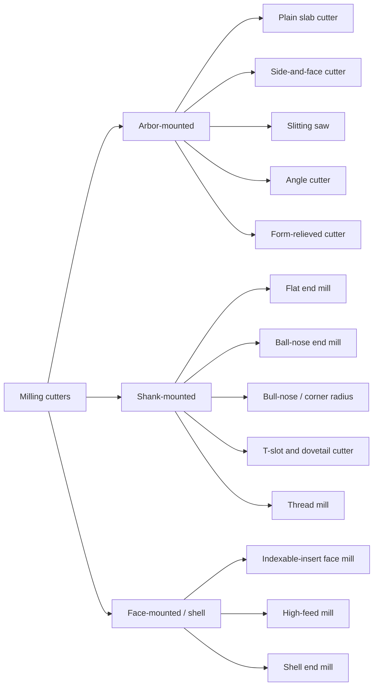
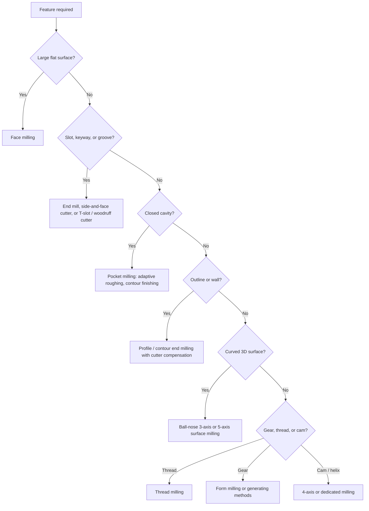

## Milling-Based Process Classification

### Overview

**Milling** is a machining process in which a rotating multi-tooth cutter removes material from a workpiece that is fed relative to the cutter along one or more axes. The primary cutting motion is **tool rotation**; the feed motion is usually supplied by the workpiece table, though on gantry, bridge, and many 5-axis machines the tool head carries part or all of the feed.

Milling is the most geometrically versatile conventional machining family. It generates planes, slots, pockets, steps, profiles, gears, threads, and free-form (sculpted) surfaces. Because each tooth enters and leaves the cut once per revolution, milling is an **interrupted cutting** process, which shapes its chip formation, force pattern, and tool wear behavior.

Milling-based processes are classified along several independent axes. A given operation occupies a position on every axis at once: for example, "climb face milling of a plane with an indexable-insert cutter on a vertical machining center" is face milling (cutter type), climb (feed relationship), planar (surface), and 3-axis (machine kinematics).

**Key Points**

- Milling is multi-point and interrupted, so chip thickness varies within each tooth engagement.
- The relationship between cutter axis and machined surface (parallel or perpendicular) separates peripheral milling from face milling.
- Feed direction relative to cutter rotation separates up (conventional) milling from down (climb) milling.
- The number of simultaneously controlled axes (2.5D, 3, 4, 5) determines which surfaces are reachable in one setup.
- Gear cutting, thread milling, and cam milling are specialized classes that use coordinated tool and workpiece motion.

### Classification Criteria

| Criterion | Categories |
| --- | --- |
| Cutter axis vs. machined surface | Peripheral (parallel), face (perpendicular), end (either, using periphery and end) |
| Rotation vs. feed direction | Up milling, down (climb) milling |
| Generated surface or feature | Plane, step, slot, pocket, profile, groove, gear, thread, free-form |
| Cutter form | Plain, side-and-face, slitting, angle, form-relieved, face mill, end mill, ball-nose, T-slot, dovetail |
| Cutter mounting | Arbor-mounted, shank-mounted, shell-mill (face-mounted) |
| Purpose | Roughing, semi-finishing, finishing |
| Machine configuration | Knee-and-column, bed-type, planer-type, gantry/bridge, machining center, mill-turn |
| Controlled axes | 2.5-axis, 3-axis, 3+2 (positional 5), simultaneous 4-axis, simultaneous 5-axis |
| Tool path strategy | Zig-zag, one-way, contour-parallel, adaptive/trochoidal, high-speed, plunge, ramp, helical |

### Master Classification Tree

```mermaid
flowchart TD
    A[Milling-based processes] --> B[By cutter axis orientation]
    A --> C[By feed vs. rotation]
    A --> D[By feature produced]
    A --> E[By machine kinematics]
    A --> F[Specialized generating processes]

    B --> B1[Peripheral / slab milling]
    B --> B2[Face milling]
    B --> B3[End milling]

    C --> C1[Up milling - conventional]
    C --> C2[Down milling - climb]

    D --> D1[Plane and step milling]
    D --> D2[Slot and keyway milling]
    D --> D3[Pocket milling]
    D --> D4[Profile and contour milling]
    D --> D5[Form milling]
    D --> D6[Free-form 3D surface milling]
    D --> D7[Groove and T-slot milling]

    E --> E1[2.5-axis]
    E --> E2[3-axis]
    E --> E3[3+2 positional 5-axis]
    E --> E4[Simultaneous 4- and 5-axis]

    F --> F1[Gear milling: form]
    F --> F2[Thread milling]
    F --> F3[Cam and helical milling]
    F --> F4[Straddle and gang milling]
```

### Classification by Cutter Axis Orientation

#### Peripheral (Slab) Milling

The cutter axis is **parallel** to the machined surface, and the cutting edges lie on the cutter's periphery. The surface is generated by the periphery of the cutter, so its flatness is controlled by the straightness of the cutter and machine table motion.

- Cutter: plain milling cutter with straight or helical teeth, typically arbor-mounted on a horizontal spindle.
- Helical teeth provide gradual entry and exit, which smooths cutting and reduces impact.
- Suited to wide, shallow cuts on planar surfaces.

The maximum uncut chip thickness for a peripheral cutter with $z$ teeth, feed per tooth $f_z$, diameter $D$, and radial depth of cut $a_e$ is

$$h_{max} = f_z \sin\phi_{max}, \qquad \phi_{max} = \arccos\!\left(1 - \frac{2a_e}{D}\right)$$

For small $a_e/D$ this simplifies to the approximation

$$h_{max} \approx 2 f_z \sqrt{\frac{a_e}{D}\left(1 - \frac{a_e}{D}\right)}$$

so chip thickness falls when the radial engagement is small (the basis of chip thinning compensation in high-speed milling).

The mean chip thickness, obtained from equating chip volume per tooth engagement, is

$$h_m = \frac{f_z\, a_e}{D\, \phi_{max}/2} \quad \text{(with } \phi_{max} \text{ in radians)}$$

**Example**

A slab mill of $D = 80\ \text{mm}$, $z = 6$ teeth, runs at $n = 500\ \text{rev/min}$ with $f_z = 0.12\ \text{mm}$, $a_e = 4\ \text{mm}$, and axial depth $a_p = 60\ \text{mm}$.

$$v_f = f_z\, z\, n = 0.12 \times 6 \times 500 = 360\ \text{mm/min}$$

$$\phi_{max} = \arccos\!\left(1 - \frac{2 \times 4}{80}\right) = \arccos(0.9) \approx 25.84^\circ$$

$$h_{max} = 0.12 \times \sin(25.84^\circ) \approx 0.052\ \text{mm}$$

$$MRR = a_p\, a_e\, v_f = 60 \times 4 \times 360 = 86{,}400\ \text{mm}^3/\text{min}$$

Note that $h_{max}$ (0.052 mm) is well below the programmed feed per tooth (0.12 mm), which is why very light radial engagements can be run at increased $f_z$ without overloading the edge.

#### Face Milling

The cutter axis is **perpendicular** to the machined surface. Cutting edges lie on both the periphery (primary cutting) and the end face (wiping and finishing the surface).

- Cutter: face mill or shell mill, usually with indexable inserts.
- Main cutting edge on the periphery at a lead (entry) angle $\kappa_r$; a small wiper flat on the face finishes the surface.
- The machined surface is generated by the face edges, so flatness depends on spindle perpendicularity and cutter runout.

Common lead angles and their trade-offs:

| Lead angle $\kappa_r$ | Characteristics |
| --- | --- |
| 90° | Square shoulder capability; higher radial force; thicker chips relative to smaller angles |
| 45° | Chip thinning effect; smoother entry; gentler on edges; widely used general-purpose face mills |
| 10° to 30° (high-feed) | Very thin chip at large feed; force directed axially into the spindle; used for high-feed roughing |
| Round-insert | Variable lead angle along the edge; strong edge; used for hard materials and heat-resistant alloys |

Uncut chip thickness is scaled by the lead angle:

$$h = f_z \sin\kappa_r \sin\phi$$

**Example**

A face mill with $D = 100\ \text{mm}$, $z = 8$ inserts, and a 45° lead angle runs at $n = 900\ \text{rev/min}$ with $f_z = 0.15\ \text{mm}$, $a_p = 2\ \text{mm}$, and $a_e = 80\ \text{mm}$.

$$v_c = \frac{\pi D n}{1000} = \frac{\pi \times 100 \times 900}{1000} \approx 282.7\ \text{m/min}$$

$$v_f = 0.15 \times 8 \times 900 = 1080\ \text{mm/min}$$

$$MRR = 2 \times 80 \times 1080 = 172{,}800\ \text{mm}^3/\text{min} = 172.8\ \text{cm}^3/\text{min}$$

Face-mill cutter positioning affects both finish and tool life. Placing the cutter with its center offset from the workpiece center, so that the insert enters the cut at a controlled angle rather than at the center of the cut, is generally preferred to a fully centered cutter [Inference: benefit depends on cutter geometry and workpiece; verify against tool supplier guidance].

#### End Milling

The cutter has teeth on both its periphery and its end face, and is usually shank-mounted. It is the most flexible milling cutter class and can operate as a peripheral cutter (side milling) and as a face cutter (end cutting) in the same tool path.

- **Solid end mills:** HSS, cobalt HSS, or solid carbide; 2, 3, 4, or more flutes.
- **Indexable end mills:** insert-based for larger diameters.
- **Shapes:** flat, ball-nose, bull-nose (corner radius), tapered, roughing (serrated or corncob), chamfer, and thread-mill forms.
- **Operations:** slotting, pocketing, profiling, shoulder milling, plunging, ramping, helical interpolation for holes.

Flute count involves trade-offs: fewer flutes give more chip space (favoring slotting and soft materials such as aluminum), while more flutes give a stronger core and better finish (favoring hardened steels and finishing).

**Key Points**

- Slotting (full radial engagement) has half of the cutter periphery in the cut, alternating up and down milling in a single revolution.
- Long-reach end mills deflect; deflection roughly scales with the cube of stick-out length for a cantilever model, so minimizing tool overhang is a primary accuracy control [Inference: idealized beam model; real behavior depends on holder, tool geometry, and cutting forces].

### Classification by Feed Direction Relative to Cutter Rotation

| Aspect | Up (conventional) milling | Down (climb) milling |
| --- | --- | --- |
| Rotation vs. feed at contact | Opposed | Same direction |
| Chip thickness | Zero at entry, maximum at exit | Maximum at entry, zero at exit |
| Tooth entry | Rubbing before cutting; work-hardening risk | Immediate cutting, favorable for work-hardening materials |
| Vertical force on workpiece | Tends to lift the workpiece | Tends to press workpiece down onto the table |
| Machine requirement | Tolerates backlash | Needs backlash elimination (ball-screw or preload) |
| Surface finish | Often poorer because of rubbing and chip re-cutting | Generally better; chips are ejected behind the cutter |
| Best use | Rough surfaces, scale or hard skin, manual machines with backlash | Most CNC finishing and general milling |

**Key Points**

- Modern CNC machining centers with ball screws and backlash compensation default to climb milling for most operations.
- When machining castings or forgings with a hard surface scale, up milling may be preferred at the first pass so the tooth enters below the scale [Inference: practice varies; consult application data].
- Full-width slotting cannot be purely climb or purely conventional; both occur on opposite sides of the cutter.

### Classification by Feature Produced

#### Plane, Step, and Shoulder Milling

- **Plane (surface) milling:** flat surface by face or peripheral milling.
- **Step (shoulder) milling:** two surfaces at a right angle produced simultaneously by an end or shoulder mill using both periphery and end face.
- **Straddle milling:** two cutters spaced on an arbor cut two parallel vertical faces in one pass, ensuring parallelism and width.

#### Slot, Keyway, and Groove Milling

- **Slot milling:** end mill, side-and-face cutter, or slitting saw; slot width is set by the cutter or by a spiral/trochoidal path.
- **Keyway milling:** woodruff cutter for semicircular keyseats; end mill for straight keyways.
- **T-slot milling:** first a straight slot, then a T-slot cutter enlarges the bottom.
- **Dovetail milling:** angled dovetail cutter after a preliminary slot.
- **Slitting or parting:** thin saw cutters for deep narrow cuts.

#### Pocket Milling

Material is removed from within a closed boundary, leaving an island or floor. Strategies:

| Strategy | Description | Comment |
| --- | --- | --- |
| Zig-zag (raster) | Parallel passes alternating direction | Simple; alternates climb and conventional |
| One-way | Parallel passes always in the same direction | Maintains climb milling; adds rapid retract time |
| Contour-parallel (offset) | Concentric offsets of the boundary | Consistent engagement; good finish on walls |
| Adaptive / trochoidal | Constant-engagement paths with looping motion | Allows deep axial engagement with light radial engagement; reduces load spikes |
| Spiral in / out | Continuous spiral path | Fewer retracts; corner engagement changes |

The engagement angle in the corners of a pocket can exceed the angle on straight segments, spiking cutting force and vibration; adaptive strategies compensate by reducing feed or reshaping the path.

#### Profile and Contour Milling

The tool follows an open or closed curve to generate the outline of a part (2D profile) or a contoured wall. Cutter radius compensation (G41/G42 in Fanuc-style controls; codes vary by controller) offsets the programmed path by the tool radius so that the same program can run with different cutters or wear offsets.

#### Form Milling

A cutter with a profile ground to the desired shape plunges or traverses, copying its shape onto the workpiece. Examples: gear tooth spaces (form cutters), radii, concave and convex circular forms, T-slots, and special contours. Form-relieved cutters keep their profile through repeated sharpening because they are relieved on the tooth flank.

#### Free-Form (Sculptured) Surface Milling

Complex curved surfaces such as dies, molds, turbine blades, and impellers are produced with ball-nose or barrel-shaped cutters following surface-based tool paths.

The theoretical **scallop (cusp) height** left between adjacent passes with a ball-nose cutter of radius $R$ and step-over $s$ on a flat surface is

$$h_{sc} = R - \sqrt{R^2 - \left(\frac{s}{2}\right)^2}$$

For small step-over this is approximately

$$h_{sc} \approx \frac{s^2}{8R}$$

**Example**

A ball-nose cutter with $R = 5\ \text{mm}$ (10 mm diameter) at step-over $s = 0.5\ \text{mm}$:

$$h_{sc} \approx \frac{0.5^2}{8 \times 5} = 0.00625\ \text{mm} = 6.25\ \mu\text{m}$$

Halving the step-over reduces scallop height by a factor of about four, at the cost of doubling machining time for the finishing pass. On sloped surfaces the effective step-over normal to the surface varies, so real cusp height depends on the local surface inclination.

### Classification by Machine Kinematics (Axis Count)

| Class | Description | Typical capability |
| --- | --- | --- |
| 2.5-axis | X, Y move together; Z moves only between layers | Pockets, profiles, drilled hole patterns, facing |
| 3-axis | X, Y, Z simultaneous | 3D surfaces, molds, contoured floors |
| 3+2 (positional 5-axis) | Two rotary axes index to a fixed orientation, then 3-axis cutting | Multi-face machining in one setup, undercuts with tilt |
| 4-axis simultaneous | Three linear axes plus one rotary (A or B) | Helical features, cams, wrapped features on cylindrical parts |
| 5-axis simultaneous | Three linear plus two rotary axes moving together | Impellers, blisks, turbine blades, complex aerospace geometry |

Benefits of tilting the tool in 5-axis milling include maintaining a favorable contact point on a ball-nose cutter (avoiding the near-zero cutting speed at the tool tip), shorter tool stick-out, and access to undercuts. Trade-offs include more complex programming, collision checking, and kinematic calibration requirements.

### Classification by Cutter Mounting and Form

### Classification by Purpose

| Stage | Objective | Typical approach |
| --- | --- | --- |
| Roughing | Remove bulk stock efficiently | Large $a_p$ and/or $a_e$, robust tool, adaptive or high-feed strategies; finish secondary |
| Semi-finishing | Even out stock for the finishing pass | Leave a uniform allowance (commonly a fraction of a millimeter, depending on part) |
| Finishing | Achieve final size, position, and surface finish | Small radial or axial step-over, higher $v_c$, low $f_z$, sharp cutter, climb milling |
| Rest machining | Remove material left by a larger cutter in corners | Smaller tool follows only the residual regions |

### Specialized Milling-Based Generating Processes

#### Gear Milling (Form Method)

A form-relieved cutter whose profile equals the tooth space is fed across the blank; the blank is indexed one tooth at a time. Each cutter theoretically suits only one tooth number and module (in practice, a cutter set covers ranges with approximations). The process is flexible but slow and less accurate than generating methods such as hobbing and shaping.

#### Thread Milling

A thread mill (single-profile or multi-profile) follows a helical path with interpolated X, Y, and Z motion. Advantages over tapping include a single tool for several thread diameters with the same pitch, control of thread fit through cutter compensation, and lower breakage risk in hard materials.

The helical interpolation path for one turn advances by the pitch $P$ per revolution of the cutter center around the hole axis:

$$Z(\theta) = \frac{P\,\theta}{2\pi}$$

The cutter-center path radius for an internal thread is approximately the difference between the thread's nominal radius and the cutter's effective radius, adjusted for thread depth.

#### Cam and Helical Milling

A rotary axis synchronized with linear motion generates cams, helical flutes, and spiral grooves. On a 4-axis machine, the rotary axis takes the role of the dividing head.

#### Gang and Straddle Milling

Multiple cutters on a single arbor machine multiple surfaces in one pass. Widely used in production milling of repetitive parts on horizontal machines, though modern CNC machining centers often replace it with multi-tool programs.

### Cutting Parameters and Formulae Common to Milling

| Quantity | Symbol | Formula |
| --- | --- | --- |
| Cutting speed | $v_c$ | $\dfrac{\pi D n}{1000}$ (m/min; $D$ in mm, $n$ in rev/min) |
| Spindle speed | $n$ | $\dfrac{1000\, v_c}{\pi D}$ |
| Feed per tooth | $f_z$ | Chosen from tool data |
| Table feed rate | $v_f$ | $f_z\, z\, n$ |
| Material removal rate | $MRR$ | $a_p\, a_e\, v_f$ |
| Machining time (one pass) | $t_m$ | $\dfrac{L + L_{approach}}{v_f}$ |

For ball-nose cutters, the **effective diameter** at the point of contact governs actual cutting speed:

$$D_{eff} = 2\sqrt{a_p\,(D - a_p)}$$

where $a_p$ is the axial depth of cut and $D$ the cutter diameter (valid for $a_p < D/2$). When the tool is tilted, $D_{eff}$ increases, which is one reason 5-axis tilting improves cutting conditions.

**Example (Machining Time)**

A face mill of $D = 100\ \text{mm}$ cuts a plate of length $L = 400\ \text{mm}$ at $v_f = 800\ \text{mm/min}$. For a fully engaged face mill, the approach plus overtravel is about $D$ (assuming the cutter enters and exits fully), so

$$t_m = \frac{400 + 100}{800} = 0.625\ \text{min} \approx 37.5\ \text{s}$$

### Forces, Power, and Vibration

The tangential force on a single tooth can be modeled as

$$F_t = k_c\, a_p\, h(\phi)$$

where $k_c$ is the specific cutting force and $h(\phi)$ is the instantaneous chip thickness at rotation angle $\phi$. Because $h(\phi)$ varies with angle and several teeth may be engaged at once, the total force fluctuates at the **tooth-passing frequency**

$$f_{tp} = \frac{z\, n}{60}\ \text{Hz}$$

with $n$ in rev/min.

Average power estimate:

$$P_c \approx \frac{MRR \cdot k_c}{60 \times 10^{6}}\ \text{kW}$$

with $MRR$ in mm³/min and $k_c$ in N/mm².

**Example**

For $MRR = 120{,}000\ \text{mm}^3/\text{min}$ and $k_c \approx 2000\ \text{N/mm}^2$ [Inference: representative handbook-order value for medium steel; actual $k_c$ varies with material, chip thickness, and geometry]:

$$P_c \approx \frac{120{,}000 \times 2000}{60 \times 10^{6}} = 4\ \text{kW}$$

The spindle motor must supply more than this to overcome machine efficiency losses.

**Key Points**

- Milling is prone to **regenerative chatter** when the tooth-passing frequency or its harmonics excite a structural mode; stability lobe diagrams predict spindle speeds of higher stable depth.
- Variable-pitch and variable-helix cutters disrupt regeneration by varying delay between tooth passages.
- Down milling tends to reduce chatter tendency compared with up milling in many setups [Inference: not universal].

### Tool Materials and Coatings

- **HSS and cobalt HSS:** tough; suited to low-rigidity setups and manual machines.
- **Cemented carbide (uncoated and coated):** dominant for production milling; grades range from tough (interrupted cuts) to wear-resistant (finishing).
- **Cermet and ceramic:** high-speed finishing of steels (cermet) and heat-resistant alloys or cast iron (ceramic), requiring rigid conditions.
- **PCD:** non-ferrous metals and composites.
- **CBN:** hardened steels and cast irons.
- **Coatings:** TiN, TiCN, TiAlN, AlCrN, and multilayer or nano-structured variants; effectiveness depends on workpiece material and cutting temperature, so verify against supplier data.

### Cutting Fluid and Thermal Considerations

Because milling teeth heat during cutting and cool in air between engagements, cyclic thermal loading can initiate thermal comb cracks in carbide. Flood coolant may worsen this cyclic shock for some carbide grades and cuts, so dry or minimum-quantity lubrication (MQL) machining, with compressed air chip clearing, is often used in face milling of steels [Inference: outcome depends on grade, material, and cutting conditions]. Through-tool coolant helps chip evacuation in deep pockets and slots.

### Process Selection Guide

### Common Defects and Causes

| Defect | Likely cause | Mitigation |
| --- | --- | --- |
| Chatter marks | Insufficient stiffness, resonant speed, long stick-out | Shorten overhang, change speed, use variable-pitch cutter, reduce engagement |
| Poor flatness on face-milled surface | Spindle tilt, cutter runout, clamping distortion | Check tram, reduce runout, relieve clamping |
| Chipped inserts | Impact in interrupted cut, excessive $f_z$, unstable entry | Tougher grade, appropriate entry path, lower feed at entry |
| Burrs on exit edge | Tooth exit pushing material out | Climb milling, chamfer pass, adjust exit path, sharp tools |
| Comb cracks | Thermal cycling with flood coolant | Dry or MQL cutting; grade selection |
| Wall taper or tool deflection marks | Tool bending under radial force | Larger diameter, shorter stick-out, spring pass, lower radial depth |
| Scallop marks on surface | Step-over too large for ball-nose | Reduce step-over, use larger ball radius, use constant-scallop paths |
| Chip re-cutting in pockets | Poor chip evacuation | Through-tool coolant, air blast, fewer flutes, peck or adaptive paths |

Behavior varies with machine rigidity, tooling, workpiece material, and process parameters.

### Comparison with Turning and Drilling

| Aspect | Milling | Turning | Drilling |
| --- | --- | --- | --- |
| Primary motion | Tool rotation | Workpiece rotation | Tool rotation |
| Feed motion | Workpiece or tool linear/multi-axis | Tool linear | Tool axial |
| Tool type | Multi-point | Usually single-point | Multi-point |
| Cut engagement | Interrupted | Continuous | Continuous |
| Typical geometry | Prismatic and free-form | Axisymmetric | Round holes |
| Chip thickness | Varies within engagement | Approximately constant | Approximately constant |

**Conclusion**

Milling-based processes are classified by cutter axis orientation (peripheral, face, end), feed direction relative to rotation (up or climb), the feature generated (plane, slot, pocket, profile, form, free-form), tool form and mounting, purpose (roughing to finishing), and machine kinematics from 2.5-axis to simultaneous 5-axis. Specialized generating variants cover gears, threads, and cams. Applying this layered classification lets an engineer choose cutter, strategy, and machine configuration together, and anticipate the force, thermal, and vibration behavior characteristic of interrupted multi-point cutting.

**Related Topics**

- Multi-point cutting-tool process classification
- Milling cutter geometry, tooth nomenclature, and ISO insert designation
- Chip formation and chip thinning in interrupted cutting
- Cutting force modeling and stability lobe diagrams for milling
- High-speed machining (HSM) and trochoidal/adaptive toolpath strategies
- CAM toolpath generation for pockets and free-form surfaces
- 5-axis kinematics, post-processing, and collision avoidance
- Thread milling versus tapping trade-offs
- Gear manufacturing: hobbing, shaping, and skiving
- Workholding and fixture design for milling
- Tool wear mechanisms and tool life in interrupted cutting