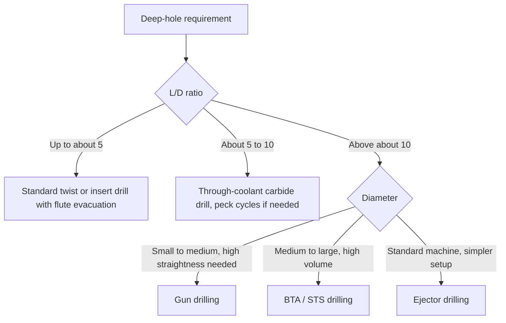
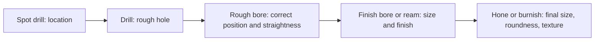
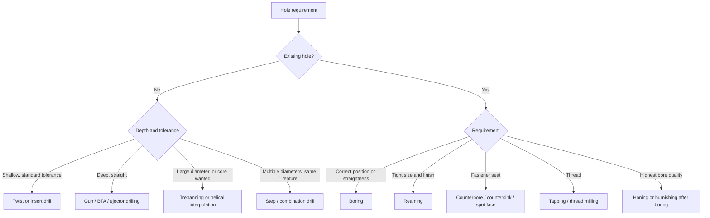

## Hole-Making Process Classification

### Overview

**Hole making** covers all conventional machining operations that produce, enlarge, finish, or add features to a hole. Holes are the most common feature in manufactured parts (fastener clearances, bearing seats, fluid passages, locating pins, threaded connections), so hole-making operations account for a large share of machining time in most production environments.

Hole-making processes are classified along several independent axes. A given operation occupies a position on every axis at once: for example, "reaming a 10 mm H7 bore on a machining center" is a finishing operation (purpose), on an existing hole (starting condition), with a multi-point rotating tool (tool type), where the tool rotates and the workpiece is stationary (kinematics).

**Key Points**

- Hole making splits into **hole generation** (creating a hole from solid, or by coring) and **hole modification** (enlarging, sizing, finishing, threading, or adding features to an existing hole).
- The accuracy hierarchy runs approximately: drilling (coarsest) → boring → reaming → honing/grinding (finest); each step corrects errors the previous one cannot [Inference: ranking is a general rule of thumb; achieved accuracy depends on machine, tooling, and material].
- A **drill follows its own axis** and tends to wander; a **reamer follows the existing hole** and cannot correct position; a **boring tool corrects position and straightness** because a single cutting edge is positioned by the machine, not by the hole.
- Length-to-diameter ratio ($L/D$) is the dominant driver of process choice, because it controls chip evacuation, coolant delivery, tool deflection, and hole straightness.

### Classification Criteria

| Criterion | Categories |
| --- | --- |
| Starting condition | From solid (generation) vs. existing hole (modification) |
| Purpose | Roughing (hole generation), enlarging, sizing, finishing, thread forming, feature adding |
| Tool type | Multi-point (twist drill, reamer, tap, counterbore), single-point (boring bar), form or combination tool |
| Kinematics | Tool rotates (machining center, drill press), workpiece rotates (lathe), both rotate (counter-rotation deep-hole systems) |
| Depth class | Shallow ($L/D$ up to about 3 to 5), medium, deep ($L/D$ above about 10), ultra-deep [Inference: thresholds vary by source] |
| Hole geometry | Through, blind, stepped, tapered, intersecting, threaded |
| Chip/coolant delivery | Flute evacuation, through-tool coolant, external, ejector, single-tube |
| Material removal mode | Full-hole (removes all material in the hole volume) vs. trepanning (removes only an annular ring, leaving a core) |

### Master Classification Tree

```mermaid
flowchart TD
    A[Hole-making processes] --> B[Hole generation]
    A --> C[Hole modification and finishing]
    A --> D[Threading]
    A --> E[Special and deep-hole]

    B --> B1[Twist drilling]
    B --> B2[Spade and insert drilling]
    B --> B3[Center drilling and spot drilling]
    B --> B4[Step and combination drilling]
    B --> B5[Helical interpolation milling]
    B --> B6[Trepanning]

    C --> C1[Boring]
    C --> C2[Reaming]
    C --> C3[Counterboring]
    C --> C4[Countersinking and chamfering]
    C --> C5[Spot facing]
    C --> C6[Back boring]
    C --> C7[Honing and burnishing]

    D --> D1[Cutting tapping]
    D --> D2[Forming tapping]
    D --> D3[Thread milling]
    D --> D4[Single-point internal threading]

    E --> E1[Gun drilling]
    E --> E2[BTA / STS drilling]
    E --> E3[Ejector drilling]
    E --> E4[Peck and deep-hole twist drilling]
```

### Hole Generation

#### Twist Drilling

The twist drill is the default tool for producing a round hole from solid. It has two helical flutes that form two main cutting lips, a **chisel edge** at the center, and margins that guide the tool in the hole.

Key geometry:

- **Point angle:** commonly around 118° for general-purpose HSS drills and 130° to 140° for harder materials and carbide drills [Inference: typical values; consult tool supplier data].
- **Helix angle:** typically 20° to 35°; higher helix angles favor chip removal in soft, ductile materials.
- **Web thickness:** the chisel edge does not cut but extrudes material, generating a large share of the thrust force; **web thinning** reduces it.
- **Chisel edge:** rotation at the axis has near-zero cutting speed, so material is displaced rather than cut.

Kinematic and process relationships:

$$v_c = \frac{\pi D n}{1000}\ \text{(m/min)}, \qquad v_f = f\, n\ \text{(mm/min)}$$

where $f$ is feed per revolution. Machining time for a hole of depth $L$ (through, with approach and breakout allowance $A$):

$$t_m = \frac{L + A}{f\, n}$$

The drill-point allowance for a standard point angle $\sigma$ is

$$A_{tip} = \frac{D}{2}\tan\!\left(90^\circ - \frac{\sigma}{2}\right) = \frac{D}{2\tan(\sigma/2)}$$

**Example**

Drill a through hole of diameter $D = 12\ \text{mm}$ in a 30 mm thick steel plate with a 118° drill at $v_c = 30\ \text{m/min}$ and $f = 0.15\ \text{mm/rev}$.

$$n = \frac{1000 \times 30}{\pi \times 12} \approx 796\ \text{rev/min}$$

$$A_{tip} = \frac{12}{2\tan(59^\circ)} = \frac{12}{2 \times 1.664} \approx 3.6\ \text{mm}$$

$$t_m = \frac{30 + 3.6}{0.15 \times 796} \approx 0.281\ \text{min} \approx 16.9\ \text{s}$$

Approximate thrust and torque are often estimated from empirical (handbook) relations of the form

$$F_{th} = K_F\, D^{a} f^{b}, \qquad M_t = K_M\, D^{c} f^{d}$$

where the constants depend on the workpiece material and tool geometry [Inference: exponents and constants must be taken from handbook or supplier data for the specific material].

The drilling power then follows from torque:

$$P = \frac{M_t\, n}{9549}\ \text{kW}\ \ (M_t\text{ in N·m},\ n\text{ in rev/min})$$

#### Spade and Insert (Indexable) Drilling

- **Spade drills:** a replaceable flat blade in a holder; suited to large diameters and low-cost tooling; typically limited in surface finish and straightness.
- **Indexable-insert drills:** peripheral and central inserts on a steel body, allowing high feed and cutting speeds, typically to about $2D$ to $5D$ depth in standard forms [Inference: range depends on supplier and design]. The central insert cuts near the axis with reduced speed, so the two inserts have different wear behavior.
- **Solid carbide drills:** high accuracy and productivity in small to medium diameters; through-tool coolant is common.

#### Center Drilling and Spot Drilling

- **Center drills** produce a conical start plus a small pilot, used for lathe centers.
- **Spot drills** have a short, rigid body and a specified point angle, giving a start for a following twist drill. The spot drill angle should be equal to or larger than the following drill's point angle so that the drill engages on its corners in a controlled way, improving position accuracy [Inference: general best practice; verify per tooling supplier guidance].

#### Step and Combination Drilling

A single tool with two or more diameters (a **step drill**) or a drill with a built-in countersink or chamfer (a **combination drill**) produces stepped holes or holes with chamfers in one stroke. This reduces cycle time and tool changes but requires a higher machine power for the larger cutting circle.

#### Helical Interpolation Milling

A milling cutter moves along a helical path to create a hole, with X, Y, and Z motion coordinated on a CNC machine. Advantages over drilling include:

- One cutter can make holes of several diameters (by changing the path radius).
- Better chip evacuation because the cutter is smaller than the hole.
- Lower thrust force, useful in thin-walled parts and hard materials.

Trade-offs include longer cycle time for small holes and the need for CNC capability. The helical path for one revolution with pitch $p_z$ (axial advance per revolution) is

$$Z(\theta) = \frac{p_z\, \theta}{2\pi}, \qquad R_{path} = \frac{D_{hole} - D_{tool}}{2}$$

**Example**

A 20 mm hole is to be created with a 12 mm end mill.

$$R_{path} = \frac{20 - 12}{2} = 4\ \text{mm}$$

The cutter center follows a helix of radius 4 mm, descending by the programmed pitch per turn, then finishing with a full-depth circular pass at the bottom.

#### Trepanning

Trepanning cuts an annular groove and leaves a solid core (slug), removing much less material than full-hole drilling. It suits large-diameter, deep holes and cases where the core has value.

- Tool: a hollow cutter or a trepanning tool with one or more cutting edges on an annulus.
- Advantage: lower power and thrust for a given diameter because only the annulus is removed.
- Limit: not applicable to blind holes with flat bottoms unless the core is broken out and removed.

### Hole Modification and Finishing

#### Boring

Boring enlarges and corrects an existing hole with a **single-point** (or multi-insert) cutting tool positioned by the machine. It is the only conventional process that can correct hole position, straightness, and roundness at the same time, and is the standard method for precision bores in large or heavy parts.

Types:

- **Rough and finish boring bars:** rough removes stock; finish uses a small adjustable insert.
- **Adjustable (micro-adjust) boring heads:** allow diameter setting to microns.
- **Twin-cutter boring heads:** balance radial forces.
- **Back boring:** the tool passes through a hole and cuts on the far side, for features on the back of a part.
- **Line boring:** a long boring bar supported at both ends generates co-axial bores in a series of bulkheads.

Boring bar deflection for a simple cantilever of overhang $L$, diameter $d$, elastic modulus $E$, and radial cutting force $F_r$:

$$\delta = \frac{F_r\, L^{3}}{3\, E\, I}, \qquad I = \frac{\pi d^{4}}{64}$$

so deflection rises with the cube of overhang and falls with the fourth power of bar diameter. Carbide and heavy-metal shanks (higher $E$) and damped bars extend the usable $L/D$ ratio.

**Example**

A steel boring bar ($E = 210\ \text{GPa}$) of $d = 20\ \text{mm}$ with $L = 100\ \text{mm}$ overhang carries $F_r = 200\ \text{N}$.

$$I = \frac{\pi \times 20^{4}}{64} = 7854\ \text{mm}^4$$

$$\delta = \frac{200 \times 100^{3}}{3 \times 210{,}000 \times 7854} \approx 0.040\ \text{mm}$$

A 40 μm deflection can produce a taper or oversize error; doubling the overhang to 200 mm would increase deflection eightfold under the same force in this idealized model [Inference: real bar and holder compliance add to this value].

#### Reaming

A reamer removes a small stock allowance from an existing hole to achieve tight diameter tolerance, good roundness, and improved surface finish. It cannot correct position or straightness because it follows the pilot hole.

Classification:

- **Hand vs. machine reamers**
- **Straight-flute vs. spiral-flute:** spiral flutes give smoother cutting and better chip control, particularly in interrupted holes (with keyways or cross holes).
- **Fixed vs. adjustable vs. expansion reamers**
- **Chucking (shell) reamers**, **taper-pin reamers**, **carbide-tipped reamers**
- **Floating holders:** allow the reamer to follow the hole and compensate for small misalignment

Typical guidance (verify against tooling supplier data): reaming stock is often in the range of a few tenths of a millimeter for small diameters, and reaming feeds are commonly higher per revolution than drilling feeds, while speeds are lower.

#### Counterboring, Countersinking, Chamfering, and Spot Facing

| Operation | Function | Tool feature |
| --- | --- | --- |
| Counterboring | Flat-bottomed recess for socket-head fastener heads | Pilot to follow the existing hole |
| Countersinking | Conical recess for flat-head fasteners (typical angles 82°, 90°, 100°, 120°) | Conical cutter, multiple flutes |
| Chamfering | Break sharp hole edges, ease assembly, remove burr | Chamfer mill or combination tool |
| Spot facing | Machine a flat seat on a rough or uneven surface | Shallow counterbore-style cutter |
| Back spot facing | Same, but on the far side | Special back-facing tool with retractable blade |

#### Honing and Burnishing (Boundary Processes)

Honing (abrasive) and roller burnishing (plastic deformation) are typically classified under abrasive and finishing processes, but they follow boring or reaming in precision-bore process chains, such as engine cylinders and hydraulic cylinders. They refine size, roundness, cylindricity, and surface texture beyond what cutting tools alone deliver.

### Threading in Holes

| Method | Mechanism | Notes |
| --- | --- | --- |
| Cutting tap | Removes chips with cutting flutes | Flute style (straight, spiral, spiral-point) chosen by hole type |
| Forming (roll) tap | Cold-forms threads by material displacement; no chips | Requires ductile material; needs larger pre-drilled hole |
| Thread milling | Interpolated helical path with a thread mill | One tool for multiple diameters of the same pitch; lower breakage risk |
| Single-point threading | Lathe or boring bar with a threading insert | Flexible profiles; large diameters |

The tap drill (pre-drilled hole) diameter for a cut ISO metric thread is approximately

$$D_{tap} \approx D_{nom} - P$$

where $D_{nom}$ is the nominal thread diameter and $P$ the pitch (giving roughly 75% thread engagement). For forming taps the pre-drilled hole is larger, approximately

$$D_{form} \approx D_{nom} - 0.5\,P \quad [\text{Inference: typical rule; use manufacturer tables}]$$

The axial feed for tapping must equal the pitch per revolution:

$$v_f = P\, n$$

**Example**

An M10 × 1.5 cut thread: $D_{tap} \approx 10 - 1.5 = 8.5\ \text{mm}$. At $n = 400\ \text{rev/min}$, tapping feed is

$$v_f = 1.5 \times 400 = 600\ \text{mm/min}$$

CNC machines use **rigid tapping** (spindle-feed synchronization) or **floating (tension-compression) tap holders**.

### Deep-Hole and Special Drilling

Deep-hole drilling is typically considered when $L/D$ exceeds about 10 [Inference: threshold varies by source]. At these depths, chip evacuation and straightness become the governing concerns, so specialized tools deliver coolant to the cutting edge under pressure and flush chips out.

| System | Coolant path | Typical capability |
| --- | --- | --- |
| Gun drilling | Coolant through the tool's internal channel; chips leave through an external V-groove | Small to medium diameters, high straightness and finish; very high $L/D$ possible |
| BTA (Boring and Trepanning Association) / STS | Coolant flows in the annular gap outside the tube; chips exit through the tube interior | Larger diameters and higher rates than gun drilling |
| Ejector (double-tube) drilling | Coolant passes between two concentric tubes; ejector effect draws chips out through the inner tube | Convenient on standard machines with a simpler setup |
| Peck drilling with twist drill | Tool retracts periodically to clear chips | Applicable at moderate depths |
| Through-tool coolant carbide drill | Internal coolant channels in a twist drill | Depths to about $30D$ or more in some designs [Inference: varies by supplier] |

**Key Points**

- Gun drills are usually run with **counter-rotation** or with the workpiece rotating, improving straightness by having the cutting forces balanced by the guide pads.
- Coolant pressure and flow are process-critical in deep-hole drilling; insufficient flow leads to chip packing and tool breakage.
- Peck drilling sequences trade cycle time for chip control, and CNC canned cycles (for example, G83 in Fanuc-style controls; codes vary by controller) automate this.

### Classification by Kinematics

| Configuration | Tool | Workpiece | Typical machine |
| --- | --- | --- | --- |
| Rotating tool, stationary work | Rotates and feeds axially | Fixed | Drill press, machining center, radial drill |
| Stationary tool, rotating work | Feeds axially | Rotates | Lathe, turning center |
| Counter-rotating | Rotates one direction | Rotates opposite | Deep-hole machines (gun drilling) |
| Orbital / interpolated | Rotates and moves helically | Fixed | CNC milling centers |

Drilling on a lathe places the tool on the axis, so the tool tends to follow the machine axis, giving better concentricity and straightness than drilling on a mill with a rotating drill.

### Process Chain and Accuracy Hierarchy

A typical precision-hole chain moves from coarse to fine, each step correcting the errors left by the previous:

Approximate capabilities (indicative; consult process capability data for specific machines):

| Process | Typical tolerance grade | Typical surface finish $R_a$ (μm) |
| --- | --- | --- |
| Twist drilling | IT11 to IT13 | 3.2 to 12.5 |
| Boring | IT7 to IT9 (fine boring better) | 0.8 to 3.2 |
| Reaming | IT6 to IT8 | 0.4 to 1.6 |
| Honing | IT5 to IT7 | 0.1 to 0.8 |

[Inference: values are typical handbook ranges; actual capability depends on machine, tool condition, material, and setup.]

### Selection Guide

### Common Defects and Causes

| Defect | Likely cause | Mitigation |
| --- | --- | --- |
| Oversize hole | Unequal lip lengths or angles, high runout, loose fit | Regrind drill accurately, reduce runout, use a spot drill |
| Hole wander (poor position) | Drill starts off-center, no pilot, chisel edge walking | Spot drill first, rigid setup, guide bushing where applicable |
| Bell-mouthed or tapered bore | Boring bar deflection | Larger bar diameter, reduced overhang, spring pass |
| Chip packing and drill breakage | Poor evacuation in deep or blind holes | Through-tool coolant, peck cycles, appropriate flute and helix |
| Burr at breakout | Material pushed out as the drill exits | Reduce feed at exit, support the exit face, use a back chamfer |
| Rough, chatter-marked bore | Low stiffness, wrong speed, long overhang | Damped bar, shorter tool, adjust speed and feed |
| Reamer chatter or oversize | Excess stock, worn margin, misalignment | Correct stock allowance, use floating holder, replace reamer |
| Broken tap | Chip packing, misaligned feed, wrong drill size, worn tap | Correct tap drill, rigid tapping synchronization, forming tap in soft materials, coolant |
| Work hardening in stainless or nickel alloys | Dwell or rubbing at low feed | Positive feed, sharp tools, avoid dwell in the cut |

Behavior varies with machine rigidity, tooling, workpiece material, and process parameters.

### Tool Materials and Coatings

- **HSS and cobalt HSS:** flexible, tolerant of low rigidity; common for general drilling and taps.
- **Solid carbide:** high speed and accuracy; needs rigid setups and often through-tool coolant.
- **Carbide-tipped and indexable inserts:** large diameters and high productivity.
- **PCD:** non-ferrous alloys and composites (for example, aluminum and CFRP).
- **Coatings:** TiN, TiAlN, AlCrN, and diamond-like carbon, chosen by workpiece material; verify against supplier data.

Composites and stacked materials (for example, CFRP/titanium stacks in aerospace) need special drill geometries and process control to manage delamination and heat, and are an active area of tooling development.

### Cutting Fluid and Chip Management

Chip evacuation is the practical limit on hole depth and speed. Strategies include:

- Through-tool coolant at appropriate pressure
- Air blast or minimum quantity lubrication (MQL) for dry-friendly materials such as cast iron and aluminum [Inference: suitability depends on material and setup]
- Peck cycles and chip-breaking cycles to fragment long stringers
- Flute geometry matched to the material (open flutes for aluminum, tighter flutes for steels)

**Conclusion**

Hole-making processes are classified first by starting condition (generation from solid vs. modification of an existing hole), then by purpose (roughing, enlarging, sizing, finishing, threading, feature adding), tool type (multi-point, single-point, form), kinematics (tool-rotating, work-rotating, counter-rotating, interpolated), and depth class (shallow to deep-hole). The accuracy hierarchy of drilling, boring, reaming, and honing, together with the length-to-diameter ratio, governs the practical process chain for any hole specification, and the choice of chip and coolant management strategy often decides whether a given process is viable.

**Related Topics**

- Multi-point cutting-tool process classification
- Twist drill geometry, point grinding, and web thinning
- Drilling force, torque, and power modeling
- Boring bar dynamics, chatter, and damped tooling
- Reamer design, stock allowance, and floating holders
- Tapping and thread-forming mechanics; thread milling programming
- Deep-hole drilling systems (gun drilling, BTA, ejector) and coolant systems
- Drilling of composites and stacks (CFRP, titanium, aluminum)
- Honing, roller burnishing, and finishing processes for bores
- Hole tolerancing (ISO fits, H7 and IT grades) and inspection of holes
- CNC canned cycles for drilling, peck drilling, tapping, and boring